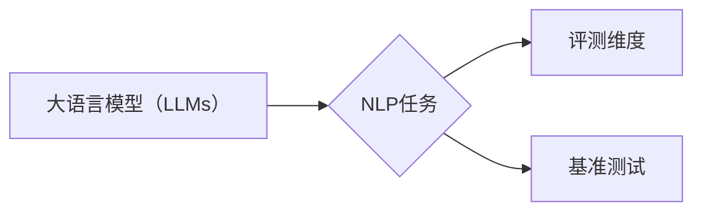

# 大语言模型原理与工程实践：主要的评测维度和基准概述

> 关键词：大语言模型，评测维度，基准测试，NLP，自然语言理解，性能评估

## 1. 背景介绍
### 1.1 问题的由来

随着深度学习技术的飞速发展，大语言模型（Large Language Models，LLMs）在自然语言处理（Natural Language Processing，NLP）领域取得了突破性的进展。这些模型能够理解和生成复杂的自然语言文本，并在问答、机器翻译、文本摘要、文本生成等领域展现出惊人的能力。然而，如何全面、客观地评估大语言模型的表现，成为了一个亟待解决的问题。

### 1.2 研究现状

为了解决这一问题，研究者们提出了多种评测维度和基准测试方法，旨在从多个角度评估大语言模型在不同任务上的性能。这些评测维度和基准测试方法为模型评估提供了重要的参考依据，有助于推动大语言模型的持续发展。

### 1.3 研究意义

研究大语言模型的评测维度和基准概述，对于以下方面具有重要意义：

1. **模型选择**：通过对比不同模型的评测结果，可以帮助研究人员和工程师选择合适的模型进行实际应用。
2. **模型改进**：评测结果可以揭示模型的不足之处，为模型改进提供方向和依据。
3. **技术发展**：评测结果可以反映大语言模型技术的发展趋势，为后续研究提供参考。

### 1.4 本文结构

本文将围绕大语言模型的评测维度和基准进行概述，主要包括以下内容：

- 核心概念与联系
- 主要评测维度
- 常见基准测试
- 实际应用场景
- 工具和资源推荐
- 总结与展望

## 2. 核心概念与联系

在深入探讨评测维度和基准测试之前，我们首先需要明确以下核心概念：

- **大语言模型（LLMs）**：指通过大规模数据预训练得到的，具备较强语言理解、生成和推理能力的模型，如BERT、GPT系列等。
- **自然语言处理（NLP）**：指研究如何让计算机理解和处理人类语言的技术。
- **评测维度**：用于衡量模型性能的各个方面，如准确性、速度、鲁棒性等。
- **基准测试**：指一组标准化的测试数据集和评估指标，用于比较不同模型在同一任务上的表现。

这些概念之间的关系可以用以下图示表示：

## 3. 主要评测维度

大语言模型的评测维度可以从多个角度进行划分，以下列举了几个常见的评测维度：

### 3.1 准确性

准确性是衡量模型性能最直观的指标，通常用精确率（Precision）、召回率（Recall）和F1分数（F1 Score）来表示。

- **精确率**：正确识别为正例的样本数占总正例样本数的比例。
- **召回率**：正确识别为正例的样本数占总负例样本数的比例。
- **F1分数**：精确率和召回率的调和平均数，用于综合衡量模型的性能。

### 3.2 速度

速度是指模型在完成特定任务所需的时间，通常用毫秒（ms）或秒（s）来衡量。对于实时应用场景，速度是一个重要的指标。

### 3.3 鲁棒性

鲁棒性是指模型在处理错误或异常输入时的表现能力。一个鲁棒的模型能够在各种情况下保持稳定的性能。

### 3.4 可解释性

可解释性是指模型决策过程的透明度，即模型如何做出决策。一个可解释的模型有助于人们理解模型的推理过程，提高模型的信任度。

### 3.5 泛化能力

泛化能力是指模型在未知数据上的表现能力。一个具有良好泛化能力的模型能够在新的、未见过的数据上取得与训练集相似的性能。

### 3.6 可扩展性

可扩展性是指模型在处理大量数据时的性能。一个可扩展的模型能够快速处理海量数据，满足实际应用需求。

### 3.7 能效比

能效比是指模型在完成特定任务时的功耗与性能之比。对于移动设备和边缘计算等场景，能效比是一个重要的指标。

## 4. 常见基准测试

为了方便比较不同模型的性能，研究者们构建了多种基准测试。以下列举了一些常见的基准测试：

### 4.1 GLUE基准

GLUE（General Language Understanding Evaluation）基准测试包含了一系列针对自然语言理解任务的测试，旨在评估模型在通用语言理解方面的能力。GLUE基准测试涵盖了文本分类、句子匹配、问答、文本摘要、自然语言推理等多个方面。

### 4.2 SQuAD基准

SQuAD（Stanford Question Answering Dataset）基准测试旨在评估模型在问答任务上的能力。SQuAD基准测试包含了一系列自然语言问答数据集，模型需要根据问题从给定文本中找到答案。

### 4.3 GLM4基准

GLM4（General Language Modeling）基准测试旨在评估模型在生成任务上的能力。GLM4基准测试包含了一系列文本生成任务，如文本摘要、机器翻译、对话生成等。

### 4.4 CLUE基准

CLUE（Chinese Language Understanding Evaluation）基准测试旨在评估模型在中文自然语言处理任务上的能力。CLUE基准测试涵盖了文本分类、命名实体识别、情感分析等多个方面。

## 5. 实际应用场景

大语言模型的评测维度和基准测试在多个实际应用场景中发挥着重要作用，以下列举了几个例子：

### 5.1 问答系统

在问答系统中，准确性、速度和鲁棒性是重要的评测维度。通过基准测试，可以评估模型在回答各种类型问题时的表现。

### 5.2 机器翻译

在机器翻译领域，准确性、速度和可解释性是重要的评测维度。通过基准测试，可以评估模型在不同语言之间的翻译效果。

### 5.3 文本摘要

在文本摘要领域，准确性、速度和可解释性是重要的评测维度。通过基准测试，可以评估模型在生成摘要时的效果。

### 5.4 对话系统

在对话系统中，准确性、速度、鲁棒性和可解释性是重要的评测维度。通过基准测试，可以评估模型在理解和生成对话方面的能力。

## 6. 工具和资源推荐

为了方便进行大语言模型的评测，以下推荐一些相关的工具和资源：

### 6.1 评测工具

- **TensorFlow Benchmark Suite**：TensorFlow官方提供的基准测试工具，支持多种深度学习框架。
- **PyTorch Benchmark Suite**：PyTorch官方提供的基准测试工具，支持多种深度学习框架。
- **Hugging Face Benchmarks**：Hugging Face提供的基准测试工具，支持多种NLP任务。

### 6.2 数据集

- **GLUE数据集**：包含多种自然语言理解任务的数据集。
- **SQuAD数据集**：问答任务的数据集。
- **CLUE数据集**：中文自然语言处理任务的数据集。

### 6.3 论文

- **"GLUE: A Multi-Task Benchmark and Analysis of Language Understanding Systems"**：介绍了GLUE基准测试的构建和评估方法。
- **"SQuAD: A Large-Scale Dataset for Reading Comprehension"**：介绍了SQuAD数据集的构建和评估方法。
- **"CLUE: A Benchmark Suite for Chinese Language Understanding"**：介绍了CLUE基准测试的构建和评估方法。

### 6.4 其他资源

- **Hugging Face模型库**：提供大量预训练语言模型和基准测试代码。
- **NLP官方基准测试网站**：提供各种NLP任务的基准测试资源。

## 7. 总结：未来发展趋势与挑战

### 7.1 研究成果总结

本文对大语言模型的评测维度和基准进行了概述，介绍了准确性、速度、鲁棒性、可解释性、泛化能力、可扩展性、能效比等主要评测维度，以及GLUE、SQuAD、GLM4、CLUE等常见基准测试。这些评测维度和基准测试对于评估大语言模型在NLP任务上的性能具有重要意义。

### 7.2 未来发展趋势

未来，大语言模型的评测维度和基准测试将呈现以下发展趋势：

- **评测维度更加全面**：随着大语言模型的应用场景不断扩展，评测维度将更加全面，涵盖更多方面。
- **评测方法更加多样**：除了传统的评测方法，还将出现更多新颖的评测方法，如基于人类评估的评测方法。
- **评测标准更加统一**：为了提高评测结果的可靠性和可比性，评测标准将更加统一。

### 7.3 面临的挑战

大语言模型的评测维度和基准测试在发展过程中也面临着以下挑战：

- **评测指标与实际应用需求之间的差异**：某些评测指标可能与实际应用需求存在差异，需要寻找更符合实际需求的评测指标。
- **评测数据集的代表性**：评测数据集需要具有较高的代表性，以保证评测结果的可靠性。
- **评测方法的客观性**：评测方法需要具有较高的客观性，避免主观因素的影响。

### 7.4 研究展望

为了应对以上挑战，未来需要在以下方面进行研究：

- **探索更全面的评测维度**：根据实际应用需求，设计更全面的评测维度。
- **构建更具代表性的评测数据集**：收集更多具有代表性的评测数据集，提高评测结果的可靠性。
- **开发更客观的评测方法**：开发更客观的评测方法，避免主观因素的影响。

总之，大语言模型的评测维度和基准测试是一个持续发展的领域，需要不断探索和创新。通过不断优化评测维度和基准测试方法，可以更好地评估大语言模型在NLP任务上的性能，推动大语言模型技术的持续发展。

## 8. 附录：常见问题与解答

**Q1：如何选择合适的评测维度？**

A：选择合适的评测维度需要考虑以下因素：

- **实际应用需求**：根据实际应用场景，选择与需求密切相关的评测维度。
- **模型特点**：根据模型的特点，选择能够体现模型优势的评测维度。
- **评测数据集**：根据评测数据集的特点，选择与数据集相匹配的评测维度。

**Q2：如何构建评测数据集？**

A：构建评测数据集需要考虑以下因素：

- **数据质量**：确保数据集的质量，避免噪声和错误。
- **数据分布**：确保数据集的分布具有代表性，能够反映实际应用场景。
- **数据标注**：确保数据标注的准确性，避免主观因素的影响。

**Q3：如何进行基准测试？**

A：进行基准测试需要按照以下步骤进行：

1. 准备评测数据集和模型。
2. 设置评测指标和参数。
3. 运行基准测试代码。
4. 分析评测结果。

**Q4：如何提高评测结果的可靠性？**

A：为了提高评测结果的可靠性，可以采取以下措施：

- 使用多个评测数据集和模型进行评测。
- 采用多种评测指标进行评测。
- 邀请多位专家对评测结果进行评估。

## 作者：禅与计算机程序设计艺术 / Zen and the Art of Computer Programming