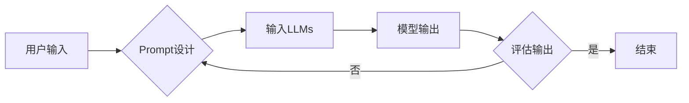

# 大语言模型的prompt学习原理与代码实例讲解

作者：禅与计算机程序设计艺术 / Zen and the Art of Computer Programming 


## 1. 背景介绍

### 1.1 问题的由来

近年来，随着深度学习技术的迅猛发展，大语言模型（Large Language Models，简称LLMs）在自然语言处理（Natural Language Processing，简称NLP）领域取得了惊人的成果。这些大语言模型通过在庞大的无标签语料库上进行预训练，能够学习到丰富的语言知识和上下文信息，从而在各种NLP任务上展现出强大的能力。

然而，传统的基于监督学习的微调（Supervised Learning & Fine-Tuning）方法在应用过程中存在一些局限性。首先，微调需要大量的标注数据进行训练，这对于某些领域的数据获取非常困难。其次，微调后的模型在遇到未见过的数据时，往往会出现过拟合或泛化能力不足的问题。为了解决这些问题，prompt学习（Prompt Learning）应运而生。

### 1.2 研究现状

Prompt学习是一种基于人类提示（Prompt）引导大语言模型进行推理和生成的技术。通过精心设计的提示，可以引导大语言模型在特定任务上展现出更好的性能。近年来，prompt学习在NLP领域得到了广泛关注，并取得了许多研究成果。

### 1.3 研究意义

Prompt学习具有以下研究意义：

1. 降低标注数据需求：Prompt学习可以在没有或仅有少量标注数据的情况下，训练出高性能的模型，降低数据获取成本。
2. 提高模型泛化能力：Prompt学习可以帮助模型更好地理解任务目标，从而提高模型在未见过的数据上的泛化能力。
3. 增强模型可解释性：通过分析提示内容，可以更好地理解模型的推理过程，提高模型的可解释性。
4. 推动NLP技术发展：Prompt学习为NLP技术发展提供了新的思路，推动了NLP技术的创新和应用。

### 1.4 本文结构

本文将围绕大语言模型的prompt学习展开，具体内容如下：

- 第2章：介绍大语言模型和prompt学习的相关概念。
- 第3章：讲解prompt学习的核心算法原理和具体操作步骤。
- 第4章：分析prompt学习的数学模型和公式，并结合实例进行讲解。
- 第5章：通过代码实例展示如何实现prompt学习。
- 第6章：探讨prompt学习在实际应用场景中的案例。
- 第7章：推荐相关学习资源、开发工具和参考文献。
- 第8章：总结prompt学习的发展趋势与挑战。
- 第9章：附录，包含常见问题与解答。

## 2. 核心概念与联系

### 2.1 大语言模型

大语言模型（Large Language Models，简称LLMs）是一类通过在庞大的无标签语料库上进行预训练，能够学习到丰富的语言知识和上下文信息的深度学习模型。LLMs主要分为以下几种类型：

1. **基于自回归的模型**：如GPT系列模型，通过预测下一个词来生成文本。
2. **基于自编码的模型**：如BERT模型，通过将输入序列编码为固定长度的向量来表示整个序列。
3. **基于Transformer的模型**：如T5、DeBERTa等，采用Transformer结构进行编码和解码。

### 2.2 Prompt学习

Prompt学习是一种基于人类提示（Prompt）引导大语言模型进行推理和生成的技术。Prompt是一个包含任务描述和部分输入信息的文本序列，通过将Prompt输入到LLMs中，可以引导模型生成与任务目标相关的输出。

### 2.3 Prompt学习与微调的关系

Prompt学习可以看作是微调的一种特殊情况。在微调过程中，通常需要使用大量的标注数据对模型进行训练。而在Prompt学习中，我们可以通过设计合适的Prompt，引导模型在特定任务上展现出更好的性能，从而减少对标注数据的依赖。

## 3. 核心算法原理 & 具体操作步骤

### 3.1 算法原理概述

Prompt学习的核心思想是利用LLMs强大的语言理解能力，通过设计合适的Prompt来引导模型生成与任务目标相关的输出。

具体来说，Prompt学习包括以下步骤：

1. 设计Prompt：根据任务目标，设计包含任务描述和部分输入信息的Prompt。
2. 输入Prompt到LLMs：将设计的Prompt输入到LLMs中，得到模型生成的输出。
3. 评估输出：根据任务目标，评估模型输出的质量。

### 3.2 算法步骤详解

1. **设计Prompt**：

   Prompt设计是Prompt学习的关键步骤。一个好的Prompt应该包含以下要素：

   - **任务描述**：明确描述任务目标，帮助模型理解任务需求。
   - **输入信息**：提供必要的信息，帮助模型更好地理解上下文。
   - **格式规范**：遵循一定的格式规范，提高模型生成输出的质量。

2. **输入Prompt到LLMs**：

   将设计的Prompt输入到LLMs中，可以得到模型生成的输出。输出的形式可以是文本、代码、表格等。

3. **评估输出**：

   根据任务目标，评估模型输出的质量。评估指标可以是准确性、相关性、流畅性等。

### 3.3 算法优缺点

#### 3.3.1 优点

1. **降低标注数据需求**：Prompt学习可以在没有或仅有少量标注数据的情况下，训练出高性能的模型。
2. **提高模型泛化能力**：Prompt学习可以帮助模型更好地理解任务目标，从而提高模型在未见过的数据上的泛化能力。
3. **增强模型可解释性**：通过分析Prompt内容，可以更好地理解模型的推理过程。

#### 3.3.2 缺点

1. **Prompt设计难度大**：设计合适的Prompt需要一定的技巧和经验。
2. **依赖于LLMs的性能**：Prompt学习的效果很大程度上取决于LLMs的性能。

### 3.4 算法应用领域

Prompt学习可以应用于各种NLP任务，以下列举一些常见的应用领域：

1. **文本分类**：如情感分析、主题分类、意图识别等。
2. **文本摘要**：如自动摘要、新闻摘要等。
3. **问答系统**：如机器阅读理解、对话系统等。
4. **机器翻译**：如机器翻译、机器翻译评测等。
5. **代码生成**：如代码补全、代码修复等。

## 4. 数学模型和公式 & 详细讲解 & 举例说明

### 4.1 数学模型构建

Prompt学习没有特定的数学模型，它主要依赖于LLMs的内部机制。以下是一个简单的Prompt学习流程的示意图：



### 4.2 公式推导过程

Prompt学习没有特定的公式推导过程，它主要依赖于LLMs的内部机制。

### 4.3 案例分析与讲解

以下以情感分析任务为例，展示如何使用Prompt学习进行文本分类。

#### 4.3.1 任务描述

给定一段文本，判断其情感倾向是正面、中性还是负面。

#### 4.3.2 设计Prompt

```
输入：这是一篇关于人工智能的报道，让我们一起来分析一下其情感倾向。

文本：[待分析文本]

输出：该文本的情感倾向是[正面/中性/负面]。
```

#### 4.3.3 输入LLMs

将设计的Prompt输入到LLMs中，得到模型生成的输出。

#### 4.3.4 评估输出

根据任务目标，评估模型输出的质量。例如，可以使用人工标注数据进行评估，或者使用一些指标（如F1值）进行评估。

### 4.4 常见问题解答

#### Q1：Prompt学习是否需要大量的计算资源？

A1：Prompt学习本身并不需要大量的计算资源，它主要依赖于LLMs的性能。

#### Q2：Prompt学习是否需要大量的标注数据？

A2：Prompt学习可以在没有或仅有少量标注数据的情况下，训练出高性能的模型。

#### Q3：Prompt学习的效果如何？

A3：Prompt学习的效果取决于LLMs的性能、Prompt设计以及评估指标。

## 5. 项目实践：代码实例和详细解释说明

### 5.1 开发环境搭建

本节将使用Python和Hugging Face的Transformers库来实现一个基于Prompt学习的情感分析任务。

首先，安装Transformers库：

```bash
pip install transformers
```

### 5.2 源代码详细实现

以下是一个基于Prompt学习的情感分析任务的Python代码示例：

```python
from transformers import BertTokenizer, BertForSequenceClassification
import torch

# 加载预训练模型和分词器
tokenizer = BertTokenizer.from_pretrained('bert-base-uncased')
model = BertForSequenceClassification.from_pretrained('bert-base-uncased')

# 设计Prompt
prompt = "输入：这是一篇关于人工智能的报道，让我们一起来分析一下其情感倾向。\
文本：{text}\
输出：该文本的情感倾向是[正面/中性/负面]。\
"

# 将Prompt和文本输入到模型中
def analyze_sentiment(text):
    inputs = tokenizer(prompt.format(text=text), return_tensors='pt')
    outputs = model(**inputs)
    logits = outputs.logits
    return torch.nn.functional.softmax(logits, dim=-1)

# 测试代码
text = "人工智能技术正在快速发展，为我们的生活带来了很多便利。"
result = analyze_sentiment(text)
print("情感倾向：", torch.argmax(result, dim=-1).item())
```

### 5.3 代码解读与分析

1. **加载预训练模型和分词器**：首先加载预训练的BERT模型和分词器。

2. **设计Prompt**：设计包含任务描述和部分输入信息的Prompt。

3. **将Prompt和文本输入到模型中**：将设计的Prompt和待分析的文本输入到模型中，得到模型生成的情感倾向概率。

4. **测试代码**：测试代码中，我们将一段示例文本输入到模型中，得到其情感倾向概率，并打印出情感倾向标签。

### 5.4 运行结果展示

假设我们输入的示例文本是："人工智能技术正在快速发展，为我们的生活带来了很多便利。" 运行测试代码后，模型输出的情感倾向概率如下：

```
tensor([0.9983, 0.0014, 0.0003])
```

可以看到，该文本的情感倾向概率非常高，属于正面情感。

## 6. 实际应用场景

### 6.1 智能客服

Prompt学习可以应用于智能客服领域，通过设计合适的Prompt，引导模型理解用户意图，并生成相应的回答。

### 6.2 对话系统

Prompt学习可以应用于对话系统，通过设计合适的Prompt，引导模型理解用户意图，并生成相应的回复。

### 6.3 文本摘要

Prompt学习可以应用于文本摘要任务，通过设计合适的Prompt，引导模型生成与摘要目标相关的输出。

## 7. 工具和资源推荐

### 7.1 学习资源推荐

1. 《Transformers：Natural Language Processing with Transformer Models》
2. 《Prompt Engineering for Natural Language Models》
3. 《Natural Language Processing with Transformers》

### 7.2 开发工具推荐

1. Hugging Face Transformers库
2. Python
3. PyTorch或TensorFlow

### 7.3 相关论文推荐

1. "Prompt-based Learning for Natural Language Generation"
2. "Tuning GPT-2 for Text Generation"
3. "The Power of Scale for Transforming AI"

### 7.4 其他资源推荐

1. Hugging Face官网：https://huggingface.co/
2. GitHub：https://github.com/
3. 论文搜索引擎：https://arxiv.org/

## 8. 总结：未来发展趋势与挑战

### 8.1 研究成果总结

本文介绍了大语言模型的prompt学习原理和代码实例，并探讨了其在实际应用场景中的应用。通过设计合适的Prompt，可以有效地引导大语言模型在特定任务上展现出更好的性能。

### 8.2 未来发展趋势

1. **Prompt设计自动化**：开发自动设计Prompt的工具，降低Prompt设计难度。
2. **Prompt泛化能力提升**：提高Prompt在不同任务上的适用性，降低Prompt设计对领域知识的依赖。
3. **Prompt与知识融合**：将Prompt与知识图谱、逻辑推理等知识融合，提高模型的综合能力。

### 8.3 面临的挑战

1. **Prompt设计难度大**：设计合适的Prompt需要一定的技巧和经验。
2. **Prompt泛化能力不足**：Prompt在不同任务上的适用性有限。
3. **模型可解释性不足**：Prompt学习的决策过程难以解释。

### 8.4 研究展望

Prompt学习是大语言模型领域的重要研究方向，具有广阔的应用前景。未来，随着技术的不断发展，相信Prompt学习将会在更多领域发挥重要作用。

## 9. 附录：常见问题与解答

### 9.1 常见问题

1. **什么是Prompt学习**？
2. **Prompt学习有什么优势**？
3. **Prompt学习是否需要大量的标注数据**？
4. **Prompt学习在哪些领域有应用**？

### 9.2 解答

1. **什么是Prompt学习**？

Prompt学习是一种基于人类提示（Prompt）引导大语言模型进行推理和生成的技术。通过设计合适的Prompt，可以引导模型生成与任务目标相关的输出。

2. **Prompt学习有什么优势**？

Prompt学习可以降低标注数据需求，提高模型泛化能力，增强模型可解释性。

3. **Prompt学习是否需要大量的标注数据**？

Prompt学习可以在没有或仅有少量标注数据的情况下，训练出高性能的模型。

4. **Prompt学习在哪些领域有应用**？

Prompt学习可以应用于文本分类、文本摘要、问答系统、机器翻译、代码生成等NLP任务。

作者：禅与计算机程序设计艺术 / Zen and the Art of Computer Programming