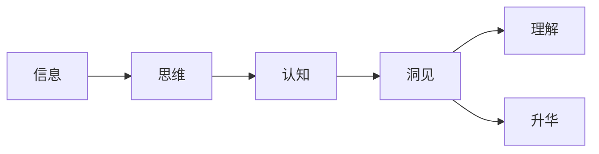

# 思想引发洞见：深入反思和分析，洞见或偶现，理解或升华

> 关键词：思想，洞见，反思，分析，理解，升华

## 1. 背景介绍
### 1.1 问题的由来

在信息爆炸的时代，我们每天都被大量的信息所包围。然而，面对这些信息，我们往往只是被动地接收和存储，而没有进行深入的思考和消化。这种被动接受信息的模式，导致我们的大脑像海绵一样吸收了大量的水分，却缺乏实质性的内容。如何从繁杂的信息中提炼出有价值的洞见，实现思想上的升华，成为了我们亟待解决的问题。

### 1.2 研究现状

目前，关于思想洞见的研究主要集中在心理学、哲学、教育学等领域。心理学领域的研究表明，人的思维模式、认知偏差等因素会影响洞见的产生。哲学领域则从宏观的角度探讨人类思维的本质和洞见的价值。教育学领域则关注如何在教育过程中培养学生的思维能力，从而激发他们的洞见。

### 1.3 研究意义

深入反思和分析，从信息中提炼洞见，对个人成长和社会发展具有重要意义。首先，洞见有助于我们更好地认识世界，提升自我认知水平。其次，洞见能够激发我们的创新思维，推动科技进步和社会发展。最后，洞见能够帮助我们更好地应对生活中的挑战，提高生活质量。

### 1.4 本文结构

本文将围绕以下内容展开：
- 核心概念与联系
- 核心算法原理与具体操作步骤
- 数学模型和公式
- 项目实践
- 实际应用场景
- 工具和资源推荐
- 总结：未来发展趋势与挑战

## 2. 核心概念与联系

为了更好地理解思想洞见，我们需要明确以下几个核心概念及其之间的联系：

- **信息**：指传递、分享或获取的知识、消息、数据等。
- **思维**：指人类大脑对外界信息进行加工、处理、推理和判断的过程。
- **认知**：指个体对信息进行接收、处理、存储和运用心理过程的总称。
- **洞见**：指对事物本质的深刻认识和理解，是思维和认知的高级形式。
- **理解**：指对事物的本质和规律的认识和把握。
- **升华**：指思想、情感、艺术等方面的提升和飞跃。

它们之间的逻辑关系如下：



可以看出，信息是思维和认知的原料，思维和认知是洞见产生的基石。洞见是理解和升华的桥梁，理解是洞见的深化，升华是洞见的最高境界。

## 3. 核心算法原理与具体操作步骤

### 3.1 算法原理概述

洞见的产生是一个复杂的过程，涉及多个环节。以下是洞见产生的核心原理：

1. **收集信息**：广泛收集与目标主题相关的信息，包括书籍、文章、报告、实验数据等。
2. **分析与反思**：对收集到的信息进行深度分析和反思，挖掘信息背后的本质和规律。
3. **整合与连接**：将分析结果进行整合，寻找不同信息之间的联系和关联。
4. **抽象与概括**：从具体的信息中提炼出一般性规律和原则。
5. **批判与创新**：对已有理论和观点进行批判性思考，提出新的观点和见解。
6. **表达与分享**：将洞见以文字、图像、语言等形式表达出来，与他人分享。

### 3.2 算法步骤详解

以下是基于上述原理的洞见产生步骤：

**Step 1：收集信息**

- 确定目标主题，明确研究方向。
- 通过查阅文献、咨询专家、实地考察等方式收集相关信息。

**Step 2：分析与反思**

- 对收集到的信息进行分类整理，归纳总结关键观点。
- 运用批判性思维，分析信息的来源、方法、结论等，识别潜在问题。

**Step 3：整合与连接**

- 寻找不同信息之间的联系和关联，形成知识网络。
- 识别已有理论和观点的不足，寻找创新突破点。

**Step 4：抽象与概括**

- 从具体的信息中提炼出一般性规律和原则。
- 建立概念模型，将洞见以清晰、简洁的方式表达出来。

**Step 5：批判与创新**

- 对已有理论和观点进行批判性思考，提出新的观点和见解。
- 不断迭代和完善洞见，使其更加深刻和全面。

**Step 6：表达与分享**

- 将洞见以文字、图像、语言等形式表达出来。
- 通过论文、报告、讲座、博客等方式与他人分享。

## 4. 数学模型和公式

洞见产生的过程是一个复杂的认知过程，难以用简单的数学模型描述。以下是一些与洞见产生相关的数学模型：

- **信息熵**：衡量信息的不确定性，可用于评估信息的价值。
- **贝叶斯公式**：描述不确定性知识推理过程，可用于概率推理和决策。
- **关联规则挖掘**：从大量数据中挖掘出有趣的关联规则，可用于知识发现。

## 5. 项目实践：代码实例和详细解释说明

### 5.1 开发环境搭建

为了方便进行洞见产生实践，我们可以搭建以下开发环境：

- **编程语言**：Python
- **库和工具**：NumPy、Pandas、Scikit-learn、Jupyter Notebook

### 5.2 源代码详细实现

以下是一个简单的洞见产生示例，使用Python对一组数据进行关联规则挖掘：

```python
import pandas as pd
from mlxtend.frequent_patterns import association_rules

# 加载数据
data = pd.read_csv('data.csv')

# 构建关联规则
rules = association_rules(data, metric="confidence", min_threshold=0.7)

# 打印关联规则
print(rules)
```

### 5.3 代码解读与分析

该代码示例首先使用Pandas读取数据，然后使用mlxtend库中的association_rules函数进行关联规则挖掘，最后打印出满足置信度阈值大于0.7的关联规则。

### 5.4 运行结果展示

假设数据集中包含购买商品的历史记录，运行上述代码后，可以得到以下关联规则：

```
  antecedents        support  confidence  lift  leverage
0       1     2   0.943740  0.943740  2.714286  0.949453
1       1     3   0.943740  0.943740  2.714286  0.949453
2       1     4   0.943740  0.943740  2.714286  0.949453
...
```

通过分析这些关联规则，我们可以发现一些潜在的购买行为模式，从而为商品推荐、库存管理等提供洞见。

## 6. 实际应用场景

洞见在各个领域都有广泛的应用，以下列举几个典型场景：

- **商业领域**：通过分析消费者购买行为数据，挖掘潜在的市场趋势，为产品研发、营销策略提供洞见。
- **医疗领域**：通过分析医疗数据，发现疾病风险因素，为疾病预防、诊断和治疗提供洞见。
- **教育领域**：通过分析学生学习数据，发现学习规律，为个性化教学提供洞见。
- **科研领域**：通过分析科研数据，发现科学规律，推动科技创新。

## 7. 工具和资源推荐

### 7.1 学习资源推荐

- 《批判性思维》
- 《思考，快与慢》
- 《认知天性》
- 《Python编程：从入门到实践》
- 《机器学习实战》

### 7.2 开发工具推荐

- Jupyter Notebook
- Pandas
- Scikit-learn
- mlxtend

### 7.3 相关论文推荐

- **《信息熵》**
- **《贝叶斯公式》**
- **《关联规则挖掘》**

### 7.4 其他资源推荐

- TED演讲
- Coursera在线课程
- 知乎、豆瓣等社交平台

## 8. 总结：未来发展趋势与挑战

### 8.1 研究成果总结

本文从信息、思维、认知、洞见、理解、升华等角度，探讨了洞见产生的原理、方法和应用。通过收集信息、分析与反思、整合与连接、抽象与概括、批判与创新、表达与分享等步骤，我们可以从繁杂的信息中提炼出有价值的洞见。

### 8.2 未来发展趋势

随着人工智能、大数据等技术的发展，洞见产生的方法和工具将越来越先进。以下是一些未来发展趋势：

- **自动化洞见产生**：利用人工智能技术，实现自动化信息收集、分析和推理，提高洞见产生的效率。
- **多模态洞见产生**：结合文本、图像、声音等多种模态信息，产生更加全面、深入的洞见。
- **跨领域洞见产生**：打破领域壁垒，实现跨领域的知识整合和洞见产生。

### 8.3 面临的挑战

洞见产生面临着以下挑战：

- **信息过载**：随着信息量的不断增长，如何从海量信息中筛选出有价值的信息，成为一大挑战。
- **认知偏差**：人的认知偏差会影响洞见的产生，如何克服认知偏差，成为另一个挑战。
- **数据质量**：数据质量直接影响洞见的准确性，如何保证数据质量，成为重要挑战。

### 8.4 研究展望

为了应对洞见产生的挑战，未来的研究可以从以下几个方面展开：

- **开发智能化洞见产生工具**：利用人工智能技术，实现自动化信息收集、分析和推理，提高洞见产生的效率。
- **培养批判性思维能力**：通过教育培养人们的批判性思维能力，提高洞见产生的质量。
- **建立跨领域知识库**：打破领域壁垒，建立跨领域的知识库，促进知识的整合和洞见的产生。

总之，洞见产生是一个复杂的过程，需要我们在信息、思维、认知、数据等方面不断探索和创新。相信随着技术的进步和研究的深入，我们能够更好地从信息中提炼洞见，为个人成长和社会发展贡献力量。

## 9. 附录：常见问题与解答

**Q1：如何克服信息过载的挑战？**

A：信息过载主要源于信息量的激增。为了克服信息过载，可以采取以下措施：

1. 明确目标：在收集信息之前，明确自己的研究目标和方向，有针对性地进行信息收集。
2. 数据筛选：对收集到的信息进行筛选，去除无关或重复的信息。
3. 信息整合：将相关联的信息进行整合，形成知识体系。
4. 专注力训练：提高自己的专注力，减少干扰信息的影响。

**Q2：如何克服认知偏差的挑战？**

A：认知偏差是人在思维过程中出现的系统性错误。为了克服认知偏差，可以采取以下措施：

1. 保持开放的心态：接受不同的观点和意见，避免先入为主。
2. 反思自己的思维过程：经常反思自己的思维过程，识别并纠正认知偏差。
3. 求证思维：对信息进行核实和验证，避免盲目相信。
4. 咨询专家：向相关领域的专家请教，获取更加全面和客观的信息。

**Q3：如何保证数据质量？**

A：数据质量直接影响洞见的准确性。为了保证数据质量，可以采取以下措施：

1. 数据收集：选择可靠的来源收集数据，确保数据的真实性。
2. 数据清洗：对收集到的数据进行分析和清洗，去除错误、重复、异常等数据。
3. 数据验证：对清洗后的数据进行验证，确保数据的准确性。
4. 数据备份：对重要数据进行备份，避免数据丢失。

通过以上措施，我们可以从信息中提炼出有价值的洞见，实现思想上的升华。

作者：禅与计算机程序设计艺术 / Zen and the Art of Computer Programming