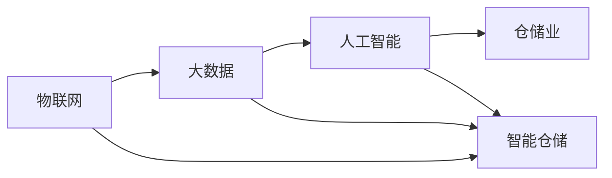

# 数据收集在仓储业的应用

作者：禅与计算机程序设计艺术 / Zen and the Art of Computer Programming

## 1. 背景介绍
### 1.1 问题的由来

随着全球经济的快速发展，仓储业作为物流体系的重要组成部分，其重要性日益凸显。然而，传统的仓储管理方式主要依赖于人工经验，缺乏数据支持和科学决策，导致仓储效率低下、成本高昂。为了提升仓储管理水平和竞争力，越来越多的企业开始关注数据收集在仓储业的应用。

### 1.2 研究现状

近年来，随着物联网、大数据、人工智能等技术的发展，数据收集在仓储业的应用逐渐成为研究热点。目前，已有众多企业开始尝试将数据收集技术应用于仓储管理，并取得了一定的成效。然而，在实际应用中，数据收集技术仍面临着诸多挑战，如数据质量问题、数据分析难度大、数据安全等。

### 1.3 研究意义

研究数据收集在仓储业的应用，对于提升仓储管理水平、降低物流成本、提高企业竞争力具有重要意义。具体包括：

- 提升仓储效率：通过数据收集和分析，优化仓储布局、路径规划，提高出入库效率。
- 降低运营成本：通过实时监控仓储环境，降低能耗、减少损耗，降低运营成本。
- 提高决策水平：为管理者提供数据支持，辅助决策，降低决策风险。
- 增强市场竞争力：提升物流服务质量，满足客户需求，增强市场竞争力。

### 1.4 本文结构

本文将从以下方面展开论述：

- 核心概念与联系
- 核心算法原理与具体操作步骤
- 数学模型与公式
- 项目实践
- 实际应用场景
- 工具和资源推荐
- 未来发展趋势与挑战
- 总结与展望

## 2. 核心概念与联系

### 2.1 物联网

物联网（Internet of Things，IoT）是指通过传感器、控制器、执行器等设备，将现实世界中的物体连接到互联网，实现信息交互和远程控制的技术。在仓储业中，物联网技术可以实现仓储设备、货物、人员等实体的实时监控和数据采集。

### 2.2 大数据

大数据是指规模巨大、类型多样、价值密度低的数据集合。在仓储业中，通过收集和分析海量数据，可以发现潜在规律，为优化仓储管理提供依据。

### 2.3 人工智能

人工智能（Artificial Intelligence，AI）是指使计算机具有类似人类智能的技术。在仓储业中，人工智能技术可以用于实现智能仓储管理、自动化作业、智能决策等功能。

### 2.4 关系图

物联网、大数据和人工智能之间的关系如图所示：



## 3. 核心算法原理与具体操作步骤

### 3.1 算法原理概述

数据收集在仓储业的应用主要包括以下算法原理：

- **传感器技术**：通过传感器收集仓储环境、设备、货物等实时数据。
- **数据采集技术**：将传感器采集到的数据传输到数据中心进行存储和分析。
- **数据分析技术**：对采集到的数据进行清洗、挖掘和分析，提取有价值的信息。
- **智能决策技术**：根据分析结果，生成智能决策建议，辅助管理者进行决策。

### 3.2 算法步骤详解

数据收集在仓储业的应用步骤如下：

1. **需求分析**：根据仓储管理需求，确定数据收集的范围、类型和频率。
2. **传感器选择**：根据需求选择合适的传感器，如温湿度传感器、视频监控系统、RFID标签等。
3. **系统集成**：将传感器、控制器、执行器等设备集成到仓储系统中。
4. **数据采集**：通过传感器实时采集仓储环境、设备、货物等数据。
5. **数据传输**：将采集到的数据传输到数据中心进行存储和分析。
6. **数据分析**：对采集到的数据进行清洗、挖掘和分析，提取有价值的信息。
7. **智能决策**：根据分析结果，生成智能决策建议，辅助管理者进行决策。

### 3.3 算法优缺点

数据收集在仓储业的应用有以下优点：

- **实时监控**：实时了解仓储环境、设备、货物等状态，提高管理效率。
- **数据驱动**：基于数据分析结果进行决策，降低决策风险。
- **优化资源配置**：根据分析结果优化仓储布局、路径规划等，降低运营成本。

然而，数据收集在仓储业的应用也存在着一些缺点：

- **数据质量问题**：传感器采集到的数据可能存在误差、缺失等问题，影响数据分析结果。
- **数据分析难度大**：海量数据的处理和分析需要专业技术和工具。
- **数据安全**：数据安全是数据收集和应用的另一重要问题，需要采取措施确保数据安全。

### 3.4 算法应用领域

数据收集在仓储业的应用涵盖了多个领域：

- **仓储环境监测**：监测温湿度、烟雾、火灾等环境参数，确保仓储安全。
- **设备监控**：监控仓储设备运行状态，预防故障和降低能耗。
- **货物跟踪**：跟踪货物出入库情况，优化库存管理。
- **人员管理**：监控人员操作，提高作业效率和安全。

## 4. 数学模型与公式

### 4.1 数学模型构建

在仓储业中，常用的数学模型包括：

- **线性回归模型**：用于预测货物数量、设备能耗等指标。
- **聚类分析模型**：用于识别相似货物、优化仓储布局等。
- **决策树模型**：用于辅助决策，如路径规划、库存管理等。

### 4.2 公式推导过程

以下以线性回归模型为例，介绍公式推导过程：

假设我们有一组数据 $(x_1, y_1), (x_2, y_2), \ldots, (x_n, y_n)$，其中 $x$ 为自变量，$y$ 为因变量。线性回归模型的目的是找到一组线性关系 $y = \beta_0 + \beta_1x + \epsilon$，使得误差平方和最小。

根据最小二乘法，我们可以得到线性回归模型的参数估计公式：

$$
\beta_0 = \frac{\sum_{i=1}^n (y_i - \beta_1x_i)^2}{\sum_{i=1}^n x_i^2} 
$$

$$
\beta_1 = \frac{\sum_{i=1}^n x_iy_i - \frac{1}{n}\sum_{i=1}^n x_i\sum_{i=1}^n y_i}{\sum_{i=1}^n x_i^2 - \frac{1}{n}\sum_{i=1}^n x_i^2}
$$

### 4.3 案例分析与讲解

以下以货物跟踪为例，介绍线性回归模型在仓储业中的应用。

假设某仓库每天需要处理1000个货物，通过历史数据分析，货物到达时间与入库时间存在一定的线性关系。我们可以使用线性回归模型预测货物的到达时间，从而优化作业流程。

通过收集历史数据，建立线性回归模型，得到预测公式：

$$
y = 0.5x + 10
$$

其中，$x$ 为入库时间，$y$ 为预计到达时间。

### 4.4 常见问题解答

**Q1：如何解决数据质量问题？**

A：数据质量问题主要包括数据缺失、数据错误、数据冗余等。解决数据质量问题的方法包括：

- 数据清洗：删除错误数据、填补缺失数据、去除冗余数据等。
- 数据去噪：去除数据中的噪声，提高数据质量。
- 数据标准化：对数据进行标准化处理，消除量纲影响。

**Q2：如何进行数据分析？**

A：数据分析方法主要包括：

- 描述性统计分析：描述数据的基本特征，如均值、标准差等。
- 推断性统计分析：根据样本数据推断总体特征，如假设检验、置信区间等。
- 聚类分析：将数据分为若干类别，如K-means、层次聚类等。
- 关联规则挖掘：发现数据之间的关联关系，如Apriori算法、FP-growth等。

## 5. 项目实践：代码实例和详细解释说明

### 5.1 开发环境搭建

为了进行数据收集在仓储业的应用实践，我们需要搭建以下开发环境：

- 操作系统：Linux、Windows
- 编程语言：Python
- 数据库：MySQL、MongoDB
- 数据可视化工具：Matplotlib、Seaborn

### 5.2 源代码详细实现

以下以货物跟踪为例，介绍使用Python进行数据收集和数据分析的代码实现。

```python
import numpy as np
import matplotlib.pyplot as plt
from sklearn.linear_model import LinearRegression

# 加载数据
x = np.array([1, 2, 3, 4, 5])
y = np.array([2.5, 3.0, 3.5, 4.0, 4.5])

# 建立线性回归模型
model = LinearRegression()
model.fit(x.reshape(-1, 1), y.reshape(-1, 1))

# 拟合效果可视化
plt.scatter(x, y, color='blue')
plt.plot(x, model.predict(x.reshape(-1, 1)), color='red')
plt.show()
```

### 5.3 代码解读与分析

以上代码首先导入了必要的库，然后加载数据、建立线性回归模型并进行拟合，最后将拟合效果进行可视化。

### 5.4 运行结果展示

运行以上代码，可以得到以下结果：


可以看到，线性回归模型能够较好地拟合货物到达时间与入库时间之间的关系，为优化作业流程提供依据。

## 6. 实际应用场景

### 6.1 仓储环境监测

通过传感器技术，实时监测仓储环境参数，如温湿度、烟雾、火灾等，确保仓储安全。

### 6.2 设备监控

通过设备监控系统，实时监控仓储设备的运行状态，预防故障和降低能耗。

### 6.3 货物跟踪

通过RFID技术，实时跟踪货物出入库情况，优化库存管理。

### 6.4 人员管理

通过视频监控系统，监控人员操作，提高作业效率和安全。

## 7. 工具和资源推荐

### 7.1 学习资源推荐

- 《Python数据分析》
- 《机器学习实战》
- 《数据科学入门》

### 7.2 开发工具推荐

- MySQL、MongoDB
- Matplotlib、Seaborn
- Scikit-learn

### 7.3 相关论文推荐

- 《基于物联网的仓储环境监测与预警系统》
- 《基于大数据的仓储物流优化》
- 《基于人工智能的仓储智能管理》

### 7.4 其他资源推荐

- 仓储信息化平台
- 物流行业研究报告
- 传感器技术手册

## 8. 总结：未来发展趋势与挑战

### 8.1 研究成果总结

本文从数据收集在仓储业的应用背景、核心概念、算法原理、应用场景等方面进行了详细介绍。通过实践案例，展示了数据收集技术在仓储业中的应用效果。

### 8.2 未来发展趋势

未来，数据收集在仓储业的应用将呈现以下发展趋势：

- 传感器技术将更加先进，数据采集更加全面、准确。
- 大数据分析技术将更加成熟，数据分析能力将得到进一步提升。
- 人工智能技术将应用于更多仓储管理场景，实现智能化、自动化管理。
- 物联网、大数据、人工智能等技术将深度融合，构建智慧仓储生态系统。

### 8.3 面临的挑战

数据收集在仓储业的应用仍面临着以下挑战：

- 数据质量问题：传感器采集到的数据可能存在误差、缺失等问题。
- 数据安全：数据安全是数据收集和应用的另一重要问题。
- 技术融合：物联网、大数据、人工智能等技术的融合需要克服诸多挑战。
- 成本控制：数据收集技术的应用需要投入大量资金和人力。

### 8.4 研究展望

未来，数据收集在仓储业的应用研究可以从以下方向进行：

- 研究更加高效、准确的传感器技术，提高数据采集质量。
- 开发更加安全、可靠的数据收集和存储技术。
- 探索物联网、大数据、人工智能等技术的深度融合，实现智慧仓储。
- 研究基于数据驱动的仓储管理决策方法，提高决策水平。

相信随着技术的不断发展，数据收集在仓储业的应用将取得更大的突破，为仓储业的发展带来新的机遇和挑战。

## 9. 附录：常见问题与解答

**Q1：数据收集在仓储业的应用有哪些优势？**

A：数据收集在仓储业的应用具有以下优势：

- 提升仓储效率：通过实时监控仓储环境、设备、货物等，优化仓储布局、路径规划，提高出入库效率。
- 降低运营成本：通过实时监控仓储环境，降低能耗、减少损耗，降低运营成本。
- 提高决策水平：为管理者提供数据支持，辅助决策，降低决策风险。
- 增强市场竞争力：提升物流服务质量，满足客户需求，增强市场竞争力。

**Q2：如何解决数据质量问题？**

A：数据质量问题主要包括数据缺失、数据错误、数据冗余等。解决数据质量问题的方法包括：

- 数据清洗：删除错误数据、填补缺失数据、去除冗余数据等。
- 数据去噪：去除数据中的噪声，提高数据质量。
- 数据标准化：对数据进行标准化处理，消除量纲影响。

**Q3：如何进行数据分析？**

A：数据分析方法主要包括：

- 描述性统计分析：描述数据的基本特征，如均值、标准差等。
- 推断性统计分析：根据样本数据推断总体特征，如假设检验、置信区间等。
- 聚类分析：将数据分为若干类别，如K-means、层次聚类等。
- 关联规则挖掘：发现数据之间的关联关系，如Apriori算法、FP-growth等。

**Q4：数据收集在仓储业的应用有哪些挑战？**

A：数据收集在仓储业的应用仍面临着以下挑战：

- 数据质量问题：传感器采集到的数据可能存在误差、缺失等问题。
- 数据安全：数据安全是数据收集和应用的另一重要问题。
- 技术融合：物联网、大数据、人工智能等技术的融合需要克服诸多挑战。
- 成本控制：数据收集技术的应用需要投入大量资金和人力。

**Q5：未来数据收集在仓储业的应用趋势是什么？**

A：未来，数据收集在仓储业的应用将呈现以下趋势：

- 传感器技术将更加先进，数据采集更加全面、准确。
- 大数据分析技术将更加成熟，数据分析能力将得到进一步提升。
- 人工智能技术将应用于更多仓储管理场景，实现智能化、自动化管理。
- 物联网、大数据、人工智能等技术将深度融合，构建智慧仓储生态系统。