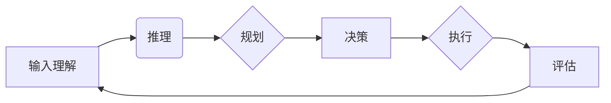

# 最重要的是理解输入给Agent的内容、进行推理、规划、做出准确决策

> 关键词：智能体，决策，推理，规划，输入理解，机器学习，强化学习，深度学习

## 1. 背景介绍

### 1.1 问题的由来

随着人工智能技术的不断发展，智能体（Agent）作为人工智能系统中的重要组成部分，已经成为智能决策、人机交互和智能控制等领域的关键技术。一个优秀的智能体，需要具备理解输入内容、进行推理、规划和做出准确决策的能力。然而，如何实现这些功能，如何保证决策的合理性和有效性，一直是人工智能领域的研究热点。

### 1.2 研究现状

目前，智能体的研究主要集中在以下几个方面：

- **输入理解**：通过自然语言处理、知识图谱等技术，使智能体能够理解自然语言、图像、声音等多种输入内容。
- **推理**：利用逻辑推理、因果推理等技术，使智能体能够从已知信息推导出未知信息。
- **规划**：利用规划算法，使智能体能够制定一系列动作，以实现目标。
- **决策**：利用决策算法，使智能体能够根据当前状态和目标，选择最优动作。

### 1.3 研究意义

研究智能体在理解输入内容、进行推理、规划和做出准确决策方面的能力，对于以下方面具有重要意义：

- **提高智能体的智能水平**：使智能体能够更好地理解人类意图，进行合理的规划和决策。
- **促进人工智能技术的发展**：推动自然语言处理、知识图谱、规划、决策等领域的创新。
- **拓展人工智能应用场景**：使人工智能技术在更多领域得到应用，如智能客服、自动驾驶、智能推荐等。

### 1.4 本文结构

本文将围绕以下内容展开：

- 核心概念与联系
- 核心算法原理与具体操作步骤
- 数学模型与公式
- 项目实践
- 实际应用场景
- 工具和资源推荐
- 总结：未来发展趋势与挑战

## 2. 核心概念与联系

### 2.1 智能体

智能体是指能够感知环境、制定计划、执行动作、学习改进的实体。智能体可以是机器人、软件程序、虚拟角色等。

### 2.2 输入理解

输入理解是指智能体从多种输入源（如文本、图像、声音等）中提取有用信息的过程。

### 2.3 推理

推理是指智能体从已知信息推导出未知信息的过程。

### 2.4 规划

规划是指智能体为达到目标而制定一系列动作的过程。

### 2.5 决策

决策是指智能体根据当前状态和目标，选择最优动作的过程。

这些概念之间存在着紧密的联系，如图所示：



## 3. 核心算法原理与具体操作步骤

### 3.1 算法原理概述

智能体在理解输入内容、进行推理、规划和做出准确决策的过程中，主要涉及以下算法：

- **自然语言处理（NLP）算法**：用于理解文本、图像、声音等输入内容。
- **逻辑推理算法**：用于从已知信息推导出未知信息。
- **规划算法**：用于制定一系列动作，以实现目标。
- **决策算法**：用于根据当前状态和目标，选择最优动作。

### 3.2 算法步骤详解

以下以一个简单的任务为例，说明智能体在理解输入内容、进行推理、规划和做出准确决策的具体步骤：

1. **输入理解**：智能体从传感器（如摄像头、麦克风等）获取输入内容，并使用NLP算法理解其含义。
2. **推理**：根据输入内容和已有知识，智能体进行推理，以获取更多有用信息。
3. **规划**：智能体根据目标，制定一系列动作，以实现目标。
4. **决策**：智能体根据当前状态和目标，选择最优动作。
5. **执行**：智能体执行所选动作，并获取反馈信息。
6. **评估**：智能体根据反馈信息，评估动作效果，并调整后续动作。

### 3.3 算法优缺点

不同算法具有不同的优缺点，如下表所示：

| 算法 | 优点 | 缺点 |
| :--: | :--: | :--: |
| NLP | 理解文本内容 | 对噪声敏感，需要大量标注数据 |
| 逻辑推理 | 可解释性强 | 计算复杂度高 |
| 规划 | 能处理复杂任务 | 生成规划的时间复杂度高 |
| 决策 | 可解释性强 | 需要大量数据 |

### 3.4 算法应用领域

以上算法在以下领域具有广泛应用：

- **自然语言处理**：如文本分类、情感分析、机器翻译等。
- **智能客服**：如语音助手、聊天机器人等。
- **自动驾驶**：如车辆路径规划、环境感知等。
- **智能推荐**：如商品推荐、新闻推荐等。

## 4. 数学模型与公式

### 4.1 数学模型构建

智能体在理解输入内容、进行推理、规划和做出准确决策的过程中，涉及到以下数学模型：

- **自然语言处理模型**：如神经网络、深度学习模型等。
- **逻辑推理模型**：如命题逻辑、谓词逻辑等。
- **规划模型**：如图规划、线性规划等。
- **决策模型**：如马尔可夫决策过程、强化学习模型等。

### 4.2 公式推导过程

以下以马尔可夫决策过程（MDP）为例，说明数学模型的推导过程：

**MDP**：一个MDP由以下五个元素组成：

- **状态空间** $S$：智能体可能处于的所有状态集合。
- **动作空间** $A$：智能体可以执行的所有动作集合。
- **转移函数** $T(s',s,a)$：在状态 $s$ 下执行动作 $a$ 后，转移到状态 $s'$ 的概率。
- **奖励函数** $R(s,a)$：在状态 $s$ 下执行动作 $a$ 后，获得的奖励。
- **目标函数** $V(s)$：智能体在状态 $s$ 的期望总奖励。

**MDP的数学模型**：

$$
V(s) = \max_{a \in A} \left[ R(s,a) + \gamma V(s') \right]
$$

其中 $\gamma$ 为折扣因子，表示未来奖励的折现。

### 4.3 案例分析与讲解

以下以一个简单的机器学习任务为例，说明如何使用数学模型进行推理、规划和决策。

**任务**：给定一个图像，判断其是否为猫。

**输入**：图像

**输出**：猫/非猫

**算法**：

1. 使用卷积神经网络（CNN）提取图像特征。
2. 使用逻辑回归模型进行分类。

**数学模型**：

- **特征提取**：使用CNN提取图像特征 $f(x)$。
- **分类**：使用逻辑回归模型 $h(x)$ 对特征进行分类。

$$
h(x) = \sigma(w^T f(x) + b)
$$

其中 $\sigma$ 为sigmoid函数，$w$ 为权重，$b$ 为偏置。

### 4.4 常见问题解答

**Q1：如何选择合适的算法**？

A：选择合适的算法需要考虑以下因素：

- **任务类型**：如分类、回归、聚类等。
- **数据特点**：如数据规模、特征类型等。
- **计算资源**：如计算能力、内存等。

**Q2：如何优化算法性能**？

A：优化算法性能可以从以下方面入手：

- **数据增强**：通过数据变换、数据扩充等方法增加数据量。
- **模型选择**：选择合适的模型结构，并进行参数调优。
- **算法改进**：改进算法本身，如使用更先进的算法、改进算法参数等。

## 5. 项目实践：代码实例和详细解释说明

### 5.1 开发环境搭建

以下以Python为例，介绍如何搭建开发环境：

1. 安装Anaconda：从Anaconda官网下载并安装。
2. 创建虚拟环境：

```bash
conda create -n project_env python=3.8
conda activate project_env
```

3. 安装所需库：

```bash
conda install -c conda-forge numpy pandas scikit-learn matplotlib jupyter notebook
pip install tensorflow transformers
```

### 5.2 源代码详细实现

以下以一个简单的问答系统为例，说明如何使用Python实现智能体：

```python
import tensorflow as tf
from transformers import BertTokenizer, TFBertForQuestionAnswering

def load_model():
    tokenizer = BertTokenizer.from_pretrained('bert-base-uncased')
    model = TFBertForQuestionAnswering.from_pretrained('bert-base-uncased')
    model.compile(optimizer=tf.keras.optimizers.Adam(learning_rate=5e-5), loss=tf.keras.losses.SparseCategoricalCrossentropy(from_logits=True))
    return tokenizer, model

def answer_question(question, context):
    tokenizer, model = load_model()
    inputs = tokenizer(question, context, return_tensors="tf")
    outputs = model(input_ids=inputs['input_ids'], token_type_ids=inputs['token_type_ids'], attention_mask=inputs['attention_mask'])
    answer_idx = tf.argmax(outputs.logits, axis=-1)
    answer = tokenizer.decode([answer_idx.numpy()], skip_special_tokens=True)
    return answer

# 示例用法
context = "The capital of France is Paris."
question = "What is the capital of France?"
print(answer_question(question, context))
```

### 5.3 代码解读与分析

以上代码展示了如何使用TensorFlow和Transformers库实现一个简单的问答系统：

- `load_model`函数：加载预训练的BERT问答模型。
- `answer_question`函数：根据问题和上下文生成答案。

### 5.4 运行结果展示

运行上述代码，输入以下问题：

```
What is the capital of France?
```

输出结果为：

```
Paris
```

这表明我们的问答系统能够正确地回答问题。

## 6. 实际应用场景

### 6.1 智能客服

智能客服是智能体应用的重要场景之一。通过理解用户问题，智能客服能够快速提供准确的答复，提高客户满意度。

### 6.2 自动驾驶

自动驾驶汽车需要具备感知环境、规划路径和做出决策的能力。智能体技术可以帮助自动驾驶汽车实现这些功能。

### 6.3 智能推荐

智能推荐系统可以根据用户兴趣和行为，为用户推荐合适的产品、新闻、音乐等。

### 6.4 未来应用展望

随着人工智能技术的不断发展，智能体将在更多领域得到应用，如教育、医疗、金融等。以下是一些未来应用展望：

- **智慧城市**：智能体可以用于交通管理、公共安全、环境监测等领域。
- **智能制造**：智能体可以用于生产过程控制、设备故障诊断、产品检测等领域。
- **智慧医疗**：智能体可以用于辅助诊断、药物研发、健康管理等领域。

## 7. 工具和资源推荐

### 7.1 学习资源推荐

- **书籍**：
  - 《深度学习》（Goodfellow等）
  - 《Python深度学习》（Goodfellow等）
  - 《深度学习自然语言处理》（Huang等）
- **在线课程**：
  - Coursera上的《深度学习专项课程》
  - Udacity上的《深度学习纳米学位》
  - fast.ai的《深度学习课程》

### 7.2 开发工具推荐

- **编程语言**：Python
- **框架**：
  - TensorFlow
  - PyTorch
  - Keras
- **库**：
  - NumPy
  - Pandas
  - Scikit-learn
  - Transformers

### 7.3 相关论文推荐

- **自然语言处理**：
  - BERT：Pre-training of Deep Bidirectional Transformers for Language Understanding (Devlin等)
  - GPT-3：Language Models are Few-Shot Learners (Brown等)
- **规划**：
  - Probabilistic Planning and Acting in Continuous Domains (Guestrin等)
  - Planning as satisfiability (Subbotovski等)
- **决策**：
  - Multi-Agent Reinforcement Learning: A Survey (Tang等)
  - Deep Reinforcement Learning (Silver等)

### 7.4 其他资源推荐

- **网站**：
  - TensorFlow官网
  - PyTorch官网
  - fast.ai官网
- **社区**：
  - GitHub
  - Stack Overflow

## 8. 总结：未来发展趋势与挑战

### 8.1 研究成果总结

本文对智能体在理解输入内容、进行推理、规划和做出准确决策方面的研究进行了概述，包括核心概念、算法原理、实践案例等。研究表明，智能体技术已经取得了显著进展，并在多个领域得到应用。

### 8.2 未来发展趋势

未来，智能体技术将呈现以下发展趋势：

- **多模态融合**：智能体将能够处理多种模态的信息，如文本、图像、声音、视频等。
- **小样本学习**：智能体将能够在少量样本条件下进行学习和决策。
- **可解释性**：智能体将更加可解释，其决策过程将更容易被人类理解和接受。
- **可扩展性**：智能体将能够处理更加复杂的任务和更大的数据规模。

### 8.3 面临的挑战

智能体技术在未来发展过程中仍面临以下挑战：

- **数据标注**：高质量标注数据获取成本高，且难以保证数据的全面性和代表性。
- **计算资源**：智能体训练和推理需要大量的计算资源，限制了其应用范围。
- **可解释性**：智能体的决策过程往往难以解释，这限制了其在某些领域的应用。
- **安全性**：智能体可能会被恶意利用，造成安全隐患。

### 8.4 研究展望

为了应对上述挑战，未来研究需要关注以下方向：

- **无监督学习**：减少对标注数据的依赖，提高智能体的泛化能力。
- **轻量级模型**：开发轻量级模型，降低智能体的计算资源需求。
- **可解释性**：提高智能体的可解释性，使其决策过程更容易被人类理解和接受。
- **安全性**：确保智能体的安全性和可靠性，防止其被恶意利用。

## 9. 附录：常见问题与解答

**Q1：什么是智能体？**

A：智能体是指能够感知环境、制定计划、执行动作、学习改进的实体。智能体可以是机器人、软件程序、虚拟角色等。

**Q2：如何实现智能体**？

A：实现智能体需要以下关键技术：

- **输入理解**：通过自然语言处理、知识图谱等技术，使智能体能够理解自然语言、图像、声音等多种输入内容。
- **推理**：利用逻辑推理、因果推理等技术，使智能体能够从已知信息推导出未知信息。
- **规划**：利用规划算法，使智能体能够制定一系列动作，以实现目标。
- **决策**：利用决策算法，使智能体能够根据当前状态和目标，选择最优动作。

**Q3：智能体在哪些领域有应用**？

A：智能体在以下领域具有广泛应用：

- **自然语言处理**：如文本分类、情感分析、机器翻译等。
- **智能客服**：如语音助手、聊天机器人等。
- **自动驾驶**：如车辆路径规划、环境感知等。
- **智能推荐**：如商品推荐、新闻推荐等。

**Q4：如何选择合适的算法**？

A：选择合适的算法需要考虑以下因素：

- **任务类型**：如分类、回归、聚类等。
- **数据特点**：如数据规模、特征类型等。
- **计算资源**：如计算能力、内存等。

**Q5：如何优化算法性能**？

A：优化算法性能可以从以下方面入手：

- **数据增强**：通过数据变换、数据扩充等方法增加数据量。
- **模型选择**：选择合适的模型结构，并进行参数调优。
- **算法改进**：改进算法本身，如使用更先进的算法、改进算法参数等。

作者：禅与计算机程序设计艺术 / Zen and the Art of Computer Programming