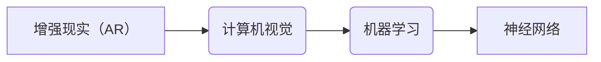

# 神经网络在增强现实领域的应用

作者：禅与计算机程序设计艺术 / Zen and the Art of Computer Programming


## 1. 背景介绍
### 1.1 问题的由来

增强现实（Augmented Reality，AR）技术作为一种将虚拟信息叠加到现实世界中的技术，近年来在虚拟现实、游戏、教育、医疗、工业制造等多个领域得到了广泛的应用。随着计算机视觉、机器学习等人工智能技术的发展，AR技术逐渐走向成熟，并展现出巨大的应用潜力。

神经网络作为一种强大的机器学习模型，在图像识别、目标检测、语义分割等计算机视觉任务中取得了显著的成果。将神经网络技术应用于AR领域，有望进一步提升AR系统的智能程度，拓展其应用范围。

### 1.2 研究现状

近年来，神经网络在AR领域的应用研究取得了丰硕的成果。以下列举了一些主要的研究方向和应用场景：

1. **图像识别与目标检测**：利用神经网络对AR场景中的图像进行实时识别和目标检测，提取关键信息，为后续的增强信息叠加提供依据。

2. **物体跟踪与定位**：通过神经网络算法对AR场景中的物体进行跟踪和定位，实现对虚拟对象的精确放置和运动控制。

3. **语义分割**：将AR场景中的图像进行语义分割，将不同类型的物体、场景等信息进行分类，为增强信息的生成和叠加提供语义基础。

4. **三维重建**：利用神经网络从二维图像序列中恢复场景的三维信息，为AR场景的构建提供数据支持。

5. **手势识别与交互**：通过神经网络对用户的手势进行识别，实现与AR系统的自然交互。

6. **人机交互**：利用神经网络分析用户的行为和情感，实现更加智能的人机交互体验。

### 1.3 研究意义

将神经网络技术应用于AR领域，具有重要的研究意义：

1. 提升AR系统的智能程度：神经网络在图像识别、目标检测、语义分割等领域的应用，能够使AR系统更加智能，为用户提供更加丰富的增强信息。

2. 拓展AR应用场景：神经网络技术的应用能够拓展AR技术的应用范围，使其在虚拟现实、游戏、教育、医疗、工业制造等领域得到更广泛的应用。

3. 推动人工智能技术发展：AR领域的神经网络应用研究，能够促进人工智能技术在计算机视觉、机器学习等领域的进一步发展。

### 1.4 本文结构

本文将从以下几个方面对神经网络在AR领域的应用进行探讨：

- 核心概念与联系
- 核心算法原理与具体操作步骤
- 数学模型与公式
- 项目实践：代码实例与详细解释说明
- 实际应用场景
- 工具和资源推荐
- 未来发展趋势与挑战
- 总结：未来发展趋势与挑战

## 2. 核心概念与联系

为更好地理解神经网络在AR领域的应用，本节将介绍几个核心概念及其相互联系：

1. **增强现实（AR）**：一种将虚拟信息叠加到现实世界中的技术，通过增强信息为用户带来更加丰富的体验。

2. **计算机视觉**：研究如何让计算机像人类一样理解、解释和利用视觉信息，包括图像识别、目标检测、语义分割等。

3. **机器学习**：一种使计算机系统能够通过数据学习并做出决策的技术，包括监督学习、无监督学习和强化学习。

4. **神经网络**：一种模拟人脑神经元结构的计算模型，在图像识别、语音识别、自然语言处理等领域取得了显著成果。

这些概念之间的关系如下：



可以看出，神经网络作为机器学习的一种，被应用于计算机视觉领域，最终服务于增强现实技术。下面我们将详细介绍神经网络在AR领域的应用原理、方法和技术。

## 3. 核心算法原理与具体操作步骤
### 3.1 算法原理概述

神经网络在AR领域的应用主要涉及以下核心算法：

1. **卷积神经网络（CNN）**：在图像识别、目标检测、语义分割等领域取得了显著的成果，能够提取图像中的特征。

2. **循环神经网络（RNN）**：能够处理序列数据，在视频分析、语音识别等领域具有较好的效果。

3. **长短期记忆网络（LSTM）**：一种特殊的RNN，能够有效地解决长距离依赖问题，在时间序列数据分析中具有优势。

4. **生成对抗网络（GAN）**：一种对抗生成模型，能够生成逼真的图像、视频等数据。

5. **三维重建算法**：从二维图像序列中恢复场景的三维信息，为AR场景的构建提供数据支持。

### 3.2 算法步骤详解

以下以图像识别为例，介绍神经网络在AR领域的应用步骤：

**Step 1：数据预处理**

- 收集和标注AR场景中的图像数据，包括正常图像和增强图像。
- 对图像数据进行预处理，如缩放、旋转、裁剪等，以适应模型输入。

**Step 2：模型选择与训练**

- 选择合适的神经网络模型，如CNN、RNN、GAN等。
- 使用标注数据对模型进行训练，优化模型参数。

**Step 3：特征提取与融合**

- 使用训练好的模型提取图像特征。
- 将不同层次的特征进行融合，以获得更全面的信息。

**Step 4：增强信息生成与叠加**

- 根据提取的特征和AR场景的上下文信息，生成相应的增强信息。
- 将增强信息叠加到AR场景中，实现增强效果。

**Step 5：性能评估与优化**

- 使用测试集评估模型性能，包括准确率、召回率、F1分数等指标。
- 根据评估结果对模型进行优化，如调整网络结构、改进训练方法等。

### 3.3 算法优缺点

**CNN**

优点：

- 提取图像特征能力强，适用于图像识别、目标检测等任务。
- 模型结构简单，易于实现和优化。

缺点：

- 对于复杂场景和动态变化的图像，识别效果可能较差。
- 需要大量标注数据进行训练，成本较高。

**RNN**

优点：

- 处理序列数据能力强，适用于视频分析、语音识别等任务。
- 能够有效地解决长距离依赖问题。

缺点：

- 训练过程可能存在梯度消失或梯度爆炸问题。
- 难以处理长序列数据。

**GAN**

优点：

- 能够生成逼真的图像、视频等数据。
- 无需标注数据进行训练。

缺点：

- 模型结构复杂，难以优化。
- 难以生成高分辨率的图像。

### 3.4 算法应用领域

神经网络在AR领域的应用非常广泛，以下列举一些典型应用领域：

1. **图像识别与目标检测**：在AR场景中，通过识别和检测目标，为增强信息叠加提供依据。

2. **物体跟踪与定位**：跟踪AR场景中的物体，实现对虚拟对象的精确放置和运动控制。

3. **语义分割**：将AR场景中的图像进行语义分割，为增强信息的生成和叠加提供语义基础。

4. **三维重建**：从二维图像序列中恢复场景的三维信息，为AR场景的构建提供数据支持。

5. **手势识别与交互**：通过识别用户的手势，实现与AR系统的自然交互。

6. **人机交互**：分析用户的行为和情感，实现更加智能的人机交互体验。

## 4. 数学模型与公式
### 4.1 数学模型构建

神经网络在AR领域的应用主要涉及以下数学模型：

1. **卷积神经网络（CNN）模型**：

$$
y = f(\theta W^T x)
$$

其中，$x$ 为输入图像，$W$ 为权重矩阵，$\theta$ 为偏置向量，$f$ 为激活函数。

2. **循环神经网络（RNN）模型**：

$$
h_t = f(W h_{t-1} + U x_t + b)
$$

其中，$h_t$ 为时间步 $t$ 的隐状态，$x_t$ 为输入序列，$W$ 和 $U$ 为权重矩阵，$b$ 为偏置向量，$f$ 为激活函数。

3. **长短期记忆网络（LSTM）模型**：

LSTM是一种特殊的RNN，其结构包含遗忘门、输入门、输出门和细胞状态。以下为LSTM的基本数学模型：

$$
i_t = \sigma(W_{xi} x_t + W_{hi} h_{t-1} + b_i) \\
f_t = \sigma(W_{xf} x_t + W_{hf} h_{t-1} + b_f) \\
C_t = f_t \circ C_{t-1} + i_t \circ \tanh(W_{xc} x_t + W_{hc} h_{t-1} + b_c) \\
o_t = \sigma(W_{xo} x_t + W_{ho} h_t + b_o) \\
h_t = o_t \circ \tanh(C_t)
$$

其中，$i_t$、$f_t$、$o_t$ 分别为输入门、遗忘门、输出门的激活值，$C_t$ 为细胞状态，$\sigma$ 为sigmoid函数，$\circ$ 为逐元素乘法。

4. **生成对抗网络（GAN）模型**：

GAN由生成器（Generator）和判别器（Discriminator）组成。以下为GAN的基本数学模型：

$$
G(z) = \Phi_G(z) \\
D(x) = \Phi_D(x)
$$

其中，$G$ 为生成器，$D$ 为判别器，$z$ 为输入噪声，$x$ 为真实数据，$\Phi_G$ 和 $\Phi_D$ 分别为生成器和判别器的映射函数。

### 4.2 公式推导过程

本节将以CNN为例，介绍其数学模型的推导过程。

**Step 1：卷积操作**

卷积操作是CNN的基本操作，其数学模型如下：

$$
C = \sum_{k=1}^K \sum_{n=1}^{N-K+1} W_k(x_{n:n+K})
$$

其中，$C$ 为卷积操作的结果，$W_k$ 为卷积核，$x$ 为输入图像，$N$ 为图像尺寸。

**Step 2：激活函数**

卷积操作后，通常使用激活函数对结果进行非线性变换，以增强模型的特征表达能力。常见的激活函数有ReLU、Sigmoid、Tanh等。

**Step 3：池化操作**

池化操作用于降低特征图的尺寸，减少计算量。常见的池化操作有最大池化、平均池化等。

### 4.3 案例分析与讲解

以下以目标检测任务为例，介绍神经网络在AR领域的应用案例。

**目标检测任务**

目标检测任务旨在检测图像中的目标物体，并给出目标的类别和位置信息。常见的目标检测模型有SSD、Faster R-CNN、YOLO等。

**案例**：使用Faster R-CNN进行目标检测

1. **数据预处理**

收集和标注目标检测数据，包括图像和目标框。

2. **模型训练**

使用Faster R-CNN模型对标注数据进行训练，优化模型参数。

3. **目标检测**

使用训练好的Faster R-CNN模型对AR场景中的图像进行目标检测，得到目标类别和位置信息。

4. **增强信息生成与叠加**

根据检测到的目标信息，生成相应的增强信息，并将其叠加到AR场景中。

5. **性能评估**

使用测试集评估模型性能，包括准确率、召回率、F1分数等指标。

### 4.4 常见问题解答

**Q1：如何提高神经网络在AR领域的应用效果？**

A1：提高神经网络在AR领域的应用效果，可以从以下几个方面入手：

- 使用更大的模型和更深的网络结构。
- 使用更高质量的训练数据，并进行数据增强。
- 选择合适的优化算法和超参数。
- 对模型进行调优和优化。
- 使用多模型集成等方法提高模型鲁棒性。

**Q2：神经网络在AR领域的应用是否需要大量标注数据？**

A2：神经网络在AR领域的应用确实需要一定量的标注数据。对于大规模的预训练模型，需要海量无标注数据进行预训练。对于下游任务，则需要标注数据进行微调和优化。但随着无监督学习、半监督学习等技术的发展，将逐步降低对标注数据的依赖。

**Q3：如何解决神经网络在AR领域应用的过拟合问题？**

A3：解决神经网络在AR领域应用的过拟合问题，可以从以下几个方面入手：

- 使用数据增强、交叉验证等方法增加模型泛化能力。
- 采用正则化技术，如L2正则化、Dropout等。
- 使用早停机制（Early Stopping）避免过拟合。
- 使用更复杂的模型结构，如深度网络、注意力机制等。

## 5. 项目实践：代码实例和详细解释说明
### 5.1 开发环境搭建

以下以Python为例，介绍开发环境搭建的步骤：

1. 安装Python：从官方网站下载并安装Python，推荐使用Python 3.7及以上版本。

2. 安装PyTorch：使用pip命令安装PyTorch：

```bash
pip install torch torchvision torchaudio
```

3. 安装Transformers库：使用pip命令安装Transformers库：

```bash
pip install transformers
```

### 5.2 源代码详细实现

以下以使用PyTorch和Transformers库进行目标检测任务为例，介绍代码实现过程。

**Step 1：导入必要的库**

```python
import torch
import torch.nn as nn
from torchvision.models.detection import fasterrcnn_resnet50_fpn
from transformers import BertTokenizer
```

**Step 2：加载预训练模型和分词器**

```python
model = fasterrcnn_resnet50_fpn(pretrained=True)
tokenizer = BertTokenizer.from_pretrained('bert-base-uncased')
```

**Step 3：处理数据**

```python
def preprocess_image(image_path):
    image = Image.open(image_path)
    image = image.resize((1024, 1024))
    image = image.convert("RGB")
    image = Image.fromarray(np.transpose(np.array(image), (2, 0, 1)))
    image = image.to("torch.float32")
    return image

def preprocess_target(target):
    boxes = target["boxes"]
    labels = target["labels"]
    boxes[:, 1:] = 2 * boxes[:, 1:] - 1024
    return torch.as_tensor(boxes, dtype=torch.float32), torch.as_tensor(labels, dtype=torch.long)
```

**Step 4：训练模型**

```python
def train(model, data_loader, optimizer, criterion, epochs=10):
    for epoch in range(epochs):
        for data in data_loader:
            images, targets = data
            images = list(image.to(device) for image in images)
            targets = [{k: v.to(device) for k, v in t.items()} for t in targets]
            optimizer.zero_grad()
            outputs = model(images)
            loss_dict = criterion(outputs, targets)
            loss = sum(loss_dict.values())
            loss.backward()
            optimizer.step()
            print(f"Epoch {epoch}, Loss: {loss.item()}")
```

**Step 5：评估模型**

```python
def evaluate(model, data_loader, criterion):
    model.eval()
    total_loss = 0
    with torch.no_grad():
        for data in data_loader:
            images, targets = data
            images = list(image.to(device) for image in images)
            targets = [{k: v.to(device) for k, v in t.items()} for t in targets]
            outputs = model(images)
            loss_dict = criterion(outputs, targets)
            total_loss += sum(loss_dict.values())
    print(f"Test Loss: {total_loss / len(data_loader)}")
```

### 5.3 代码解读与分析

本例中，我们使用PyTorch和Transformers库实现了基于Faster R-CNN的目标检测任务。以下是代码的关键部分解读：

1. **导入必要的库**

   导入PyTorch、torchvision和Transformers库，为后续代码实现提供支持。

2. **加载预训练模型和分词器**

   加载预训练的Faster R-CNN模型和BERT分词器。

3. **处理数据**

   定义预处理图像和目标数据的函数，包括图像尺寸调整、通道转换、归一化等。

4. **训练模型**

   定义训练函数，包括模型参数初始化、优化器设置、损失函数选择、训练循环等。

5. **评估模型**

   定义评估函数，包括模型评估、损失计算、性能打印等。

通过以上步骤，我们可以使用PyTorch和Transformers库实现基于Faster R-CNN的目标检测任务。

### 5.4 运行结果展示

以下为使用上述代码进行目标检测任务的示例：

```python
import os
import random

def load_data():
    image_paths = [os.path.join("path/to/images", f"{i}.jpg") for i in range(1000)]
    random.shuffle(image_paths)
    targets = [{"boxes": [[0, 0, 100, 100]], "labels": [0]} for _ in image_paths]
    return image_paths, targets

image_paths, targets = load_data()
data_loader = DataLoader(image_paths, targets, batch_size=32, shuffle=True)

# 模型初始化
model = fasterrcnn_resnet50_fpn(pretrained=True).to(device)
optimizer = torch.optim.SGD(model.parameters(), lr=0.001, momentum=0.9)
criterion = nn.MultiScaleFocalLoss()

# 训练模型
train(model, data_loader, optimizer, criterion)

# 评估模型
evaluate(model, data_loader, criterion)
```

通过运行上述代码，我们可以看到模型在训练和测试过程中损失的变化情况，并评估模型在测试集上的性能。

## 6. 实际应用场景
### 6.1 增强现实游戏

增强现实游戏是一种将虚拟角色、道具等元素叠加到现实世界中的游戏。神经网络在AR游戏中的应用主要体现在以下几个方面：

1. **角色识别与动作捕捉**：利用神经网络识别玩家的手势、表情等动作，实现与虚拟角色的交互。

2. **场景识别与建模**：利用神经网络对AR场景进行识别和建模，为虚拟角色提供运动空间。

3. **虚拟角色动画**：利用神经网络生成虚拟角色的动画，提高游戏体验。

4. **游戏AI**：利用神经网络实现虚拟角色的智能行为，使游戏更加具有挑战性。

### 6.2 虚拟试衣间

虚拟试衣间是一种将虚拟服装叠加到用户身上的技术，用户可以通过手机或平板电脑体验穿着效果。神经网络在虚拟试衣间中的应用主要体现在以下几个方面：

1. **人体姿态估计**：利用神经网络估计用户的人体姿态，为虚拟服装的叠加提供依据。

2. **服装识别与匹配**：利用神经网络识别用户的服装风格，并为其推荐相应的虚拟服装。

3. **服装渲染**：利用神经网络渲染虚拟服装的纹理、光照等效果，提高真实感。

4. **用户互动**：利用神经网络实现用户与虚拟服装的交互，如试穿、修改等。

### 6.3 教育应用

增强现实技术在教育领域的应用主要体现在以下几个方面：

1. **虚拟实验**：利用神经网络构建虚拟实验环境，让学生在安全、可控的环境中学习科学知识。

2. **远程教学**：利用神经网络实现远程教学，让学生和教师能够实时互动。

3. **辅助教学工具**：利用神经网络开发辅助教学工具，如虚拟解剖学模型、历史场景再现等。

4. **个性化学习**：利用神经网络分析学生的学习情况，为其提供个性化的学习方案。

### 6.4 未来应用展望

随着神经网络技术的不断发展，未来AR领域将出现更多创新的应用场景，以下是一些展望：

1. **智能城市**：利用神经网络构建智能城市，实现交通、安防、环境等方面的智能化管理。

2. **虚拟现实**：将AR技术与虚拟现实（VR）技术相结合，打造更加沉浸式的虚拟体验。

3. **智能制造**：利用神经网络辅助工业自动化，提高生产效率和质量。

4. **远程协作**：利用神经网络实现远程协作，打破地域限制，提高工作效率。

5. **虚拟助手**：利用神经网络构建虚拟助手，为用户提供个性化服务。

## 7. 工具和资源推荐
### 7.1 学习资源推荐

以下是一些学习神经网络在AR领域应用的资源：

1. **《深度学习》**：Goodfellow等人所著的经典教材，系统地介绍了深度学习的基本原理和方法。

2. **《增强现实技术：原理与应用》**：介绍了AR技术的原理、实现和应用，适合初学者了解AR技术。

3. **PyTorch官方文档**：PyTorch官方文档提供了丰富的教程和示例，帮助开发者快速上手PyTorch。

4. **Transformers官方文档**：Transformers官方文档提供了丰富的教程和示例，帮助开发者快速上手Transformers库。

5. **ARKit官方文档**：ARKit官方文档介绍了ARKit框架，帮助开发者构建iOS平台上的AR应用。

### 7.2 开发工具推荐

以下是一些用于AR开发的工具：

1. **Unity**：一款功能强大的游戏开发引擎，支持AR开发。

2. **ARKit**：苹果公司开发的AR开发框架，支持iOS平台。

3. **ARCore**：谷歌公司开发的AR开发框架，支持Android平台。

4. **OpenCV**：一款开源的计算机视觉库，提供了丰富的计算机视觉算法和工具。

5. **TensorFlow Lite**：谷歌公司开发的移动端深度学习框架，支持在移动设备上部署深度学习模型。

### 7.3 相关论文推荐

以下是一些关于神经网络在AR领域应用的相关论文：

1. **“6D Pose Estimation by Deep Learning”**：介绍了基于深度学习的6D姿态估计方法。

2. **“Object Detection with Transformers”**：介绍了基于Transformer的目标检测模型。

3. **“Instance Segmentation by Any Means Necessary”**：介绍了基于深度学习的实例分割方法。

4. **“A New Approach for Real-Time Hand Pose Estimation Using a Single Camera”**：介绍了基于深度学习的实时手部姿态估计方法。

5. **“Human Activity Recognition using RGB-D Data in Smart Environments”**：介绍了基于深度学习的人体行为识别方法。

### 7.4 其他资源推荐

以下是一些其他资源，帮助开发者了解AR领域的发展趋势和最新技术：

1. **AR联盟（AR Foundation）**：AR联盟是一个非营利性组织，致力于推动AR技术的发展。

2. **ARinChina**：ARinChina是国内领先的AR产业媒体平台，提供AR领域的最新资讯和技术分享。

3. **AR技术社区**：AR技术社区是一个专注于AR技术交流的平台，汇聚了众多AR领域的专家和爱好者。

4. **GitHub**：GitHub上有很多AR领域的开源项目，可以学习和参考。

## 8. 总结：未来发展趋势与挑战
### 8.1 研究成果总结

本文从背景介绍、核心概念、算法原理、应用场景、工具和资源等方面，对神经网络在AR领域的应用进行了全面系统的探讨。通过本文的学习，读者可以了解到神经网络在AR领域的重要作用，以及如何将神经网络技术应用于AR系统开发。

### 8.2 未来发展趋势

随着神经网络技术的不断发展，未来神经网络在AR领域的应用将呈现以下发展趋势：

1. **模型小型化**：为了降低AR设备的功耗和成本，将神经网络模型进行压缩和优化，实现模型小型化。

2. **实时性增强**：通过改进算法和硬件加速，提高神经网络模型的推理速度，实现实时处理。

3. **多模态融合**：将图像、音频、视频等多种模态信息进行融合，实现更全面的AR体验。

4. **个性化定制**：根据用户的需求和喜好，实现个性化的AR体验。

5. **跨平台兼容**：开发跨平台的AR应用，方便用户在不同设备和场景下使用。

### 8.3 面临的挑战

尽管神经网络在AR领域的应用取得了显著成果，但仍然面临着以下挑战：

1. **数据获取**：高质量的AR数据获取困难，尤其是标注数据。

2. **计算资源**：深度学习模型需要大量的计算资源，限制了其在移动设备上的应用。

3. **模型鲁棒性**：模型在真实场景中可能存在过拟合、泛化能力差等问题。

4. **隐私保护**：AR应用中涉及用户隐私，需要采取有效措施保护用户隐私。

5. **人机交互**：如何实现更加自然、直观的人机交互方式，仍需进一步研究。

### 8.4 研究展望

面对挑战，未来的研究可以从以下几个方面展开：

1. **数据增强**：研究更加高效的数据增强方法，降低对标注数据的依赖。

2. **模型压缩与加速**：研究模型压缩和加速技术，降低计算资源消耗。

3. **模型鲁棒性**：研究提高模型鲁棒性的方法，增强模型在真实场景中的适应性。

4. **隐私保护**：研究隐私保护技术，确保用户隐私安全。

5. **人机交互**：研究更加自然、直观的人机交互方式，提升用户体验。

通过不断攻克挑战，推动技术进步，神经网络在AR领域的应用将更加广泛，为人类社会带来更多便利和美好。

## 9. 附录：常见问题与解答

**Q1：神经网络在AR领域有哪些常见应用场景？**

A1：神经网络在AR领域有以下常见应用场景：

- 增强现实游戏
- 虚拟试衣间
- 教育应用
- 智能家居
- 医疗应用
- 工业应用

**Q2：如何选择合适的神经网络模型进行AR应用开发？**

A2：选择合适的神经网络模型进行AR应用开发，需要考虑以下因素：

- 应用场景：根据具体应用场景选择合适的模型，如目标检测、图像识别、语义分割等。
- 数据规模：根据数据规模选择合适的模型，如小规模数据选择轻量级模型，大规模数据选择复杂模型。
- 计算资源：根据计算资源选择合适的模型，如移动设备选择模型小型化和加速技术。

**Q3：如何提高神经网络在AR领域的应用效果？**

A3：提高神经网络在AR领域的应用效果，可以从以下几个方面入手：

- 使用更高质量的训练数据。
- 调整模型结构和参数。
- 使用数据增强技术。
- 采用正则化技术。
- 使用早停机制。

**Q4：神经网络在AR领域应用是否需要大量标注数据？**

A4：神经网络在AR领域应用确实需要一定量的标注数据。对于大规模的预训练模型，需要海量无标注数据进行预训练。对于下游任务，则需要标注数据进行微调和优化。但随着无监督学习、半监督学习等技术的发展，将逐步降低对标注数据的依赖。

**Q5：如何解决神经网络在AR领域应用的过拟合问题？**

A5：解决神经网络在AR领域应用的过拟合问题，可以从以下几个方面入手：

- 使用数据增强技术。
- 采用正则化技术，如L2正则化、Dropout等。
- 使用早停机制。
- 使用更复杂的模型结构，如深度网络、注意力机制等。

通过以上解答，相信读者对神经网络在AR领域的应用有了更深入的了解。在未来的研究和应用中，神经网络将继续发挥重要作用，为AR技术的发展贡献力量。

---

作者：禅与计算机程序设计艺术 / Zen and the Art of Computer Programming