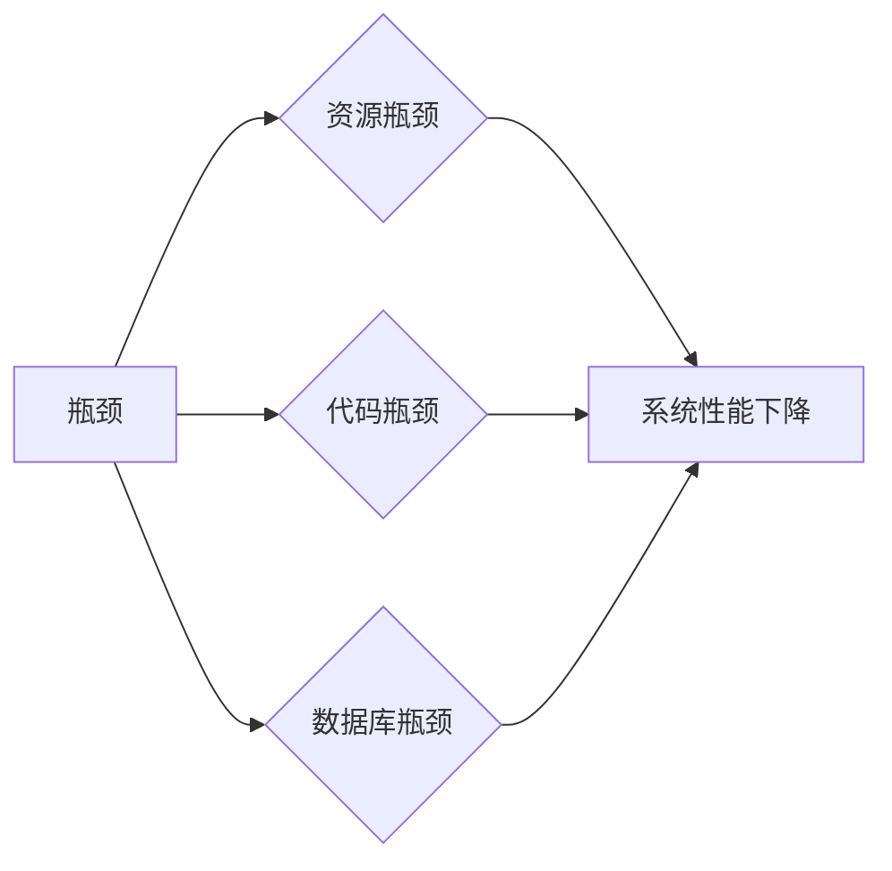

# 系统瓶颈分析与实例优化

作者：禅与计算机程序设计艺术 / Zen and the Art of Computer Programming

## 1. 背景介绍
### 1.1 问题的由来

在IT领域，系统性能优化是一个永恒的主题。随着系统规模的不断扩大和用户需求的日益增长，系统性能问题日益凸显。系统瓶颈分析作为性能优化的第一步，其重要性不言而喻。本文将深入探讨系统瓶颈分析的方法、原理以及在实际应用中的实例优化，帮助读者更好地理解并解决系统性能瓶颈问题。

### 1.2 研究现状

近年来，随着监控工具、性能分析工具的不断发展，系统瓶颈分析技术也取得了显著的进步。常见的瓶颈分析方法包括：

- **资源瓶颈分析**：通过监控CPU、内存、磁盘、网络等资源的使用情况，分析系统瓶颈所在。
- **代码瓶颈分析**：通过代码性能分析工具，找出代码中的热点函数、热点代码段，分析其性能瓶颈。
- **数据库瓶颈分析**：通过分析数据库查询语句、索引、锁等，找出数据库瓶颈所在。

### 1.3 研究意义

系统瓶颈分析对于提升系统性能、提高用户体验具有重要意义。通过系统瓶颈分析，我们可以：

- **定位性能瓶颈**：快速找到系统性能瓶颈所在，针对性地进行优化。
- **提高系统性能**：通过优化瓶颈，提升系统整体性能。
- **降低系统成本**：通过优化瓶颈，降低系统运行成本。

### 1.4 本文结构

本文将从以下几个方面展开：

- 核心概念与联系
- 系统瓶颈分析方法
- 实例优化
- 工具和资源推荐
- 未来发展趋势与挑战
- 总结

## 2. 核心概念与联系
在深入探讨系统瓶颈分析之前，我们需要明确以下核心概念：

- **瓶颈**：指系统中的制约因素，限制系统整体性能。
- **资源瓶颈**：指系统中资源（如CPU、内存、磁盘、网络等）的利用率过高，导致系统性能下降。
- **代码瓶颈**：指系统中代码执行效率低下，导致系统性能下降。
- **数据库瓶颈**：指数据库查询、索引、锁等影响数据库性能的因素。

这些概念之间的联系如下：



## 3. 系统瓶颈分析方法
### 3.1 算法原理概述

系统瓶颈分析方法主要包括以下几种：

1. **资源瓶颈分析**：通过监控系统资源的使用情况，确定系统瓶颈所在。
2. **代码瓶颈分析**：通过代码性能分析工具，找出代码中的热点函数、热点代码段。
3. **数据库瓶颈分析**：通过分析数据库查询语句、索引、锁等，找出数据库瓶颈所在。

### 3.2 算法步骤详解

#### 3.2.1 资源瓶颈分析

1. **收集系统资源使用数据**：使用性能监控工具，如Prometheus、Grafana等，收集系统CPU、内存、磁盘、网络等资源的使用数据。
2. **分析资源使用数据**：根据收集到的资源使用数据，分析系统瓶颈所在。例如，通过查看CPU使用率，确定是否为CPU瓶颈；通过查看内存使用率，确定是否为内存瓶颈。
3. **优化资源使用**：根据分析结果，对系统进行优化。例如，增加CPU核心数、优化内存使用、优化磁盘IO等。

#### 3.2.2 代码瓶颈分析

1. **选择合适的代码性能分析工具**：如gprof、Valgrind等。
2. **运行代码性能分析工具**：对目标程序进行性能分析，获取热点函数、热点代码段等信息。
3. **分析分析结果**：根据分析结果，找出代码瓶颈所在。
4. **优化代码**：针对代码瓶颈进行优化，如优化算法、优化代码结构等。

#### 3.2.3 数据库瓶颈分析

1. **收集数据库性能数据**：如查询语句执行时间、索引使用情况、锁等待时间等。
2. **分析数据库性能数据**：根据收集到的性能数据，找出数据库瓶颈所在。
3. **优化数据库**：根据分析结果，对数据库进行优化。例如，优化查询语句、添加索引、优化锁策略等。

### 3.3 算法优缺点

#### 3.3.1 资源瓶颈分析的优点

- 简单易行：只需收集系统资源使用数据，即可进行分析。
- 适用于大多数系统：无论系统规模大小，资源瓶颈分析都适用。

#### 3.3.1 资源瓶颈分析的缺点

- 分析结果可能不够准确：资源瓶颈分析只能提供定性分析，无法提供具体的性能瓶颈原因。
- 无法分析代码瓶颈：资源瓶颈分析无法找出代码中的性能瓶颈。

#### 3.3.2 代码瓶颈分析的优点

- 可以找出代码中的具体性能瓶颈：代码瓶颈分析可以提供详细的性能瓶颈信息。
- 适用于代码性能优化：代码瓶颈分析可以指导代码性能优化。

#### 3.3.2 代码瓶颈分析的缺点

- 分析过程较为复杂：需要使用专业的代码性能分析工具。
- 适用于特定编程语言：不同的编程语言，需要使用不同的代码性能分析工具。

#### 3.3.3 数据库瓶颈分析的优点

- 可以找出数据库中的具体性能瓶颈：数据库瓶颈分析可以提供详细的性能瓶颈信息。
- 适用于数据库性能优化：数据库瓶颈分析可以指导数据库性能优化。

#### 3.3.3 数据库瓶颈分析的缺点

- 分析过程较为复杂：需要使用专业的数据库性能分析工具。
- 适用于特定数据库：不同的数据库，需要使用不同的数据库性能分析工具。

### 3.4 算法应用领域

系统瓶颈分析方法在以下领域得到广泛应用：

- **Web应用**：如电商平台、社交平台、在线教育平台等。
- **大数据应用**：如搜索引擎、数据仓库、数据挖掘平台等。
- **云计算平台**：如虚拟化平台、容器平台等。

## 4. 实例优化
### 4.1 开发环境搭建

以下是一个基于Python的简单示例，演示如何使用`cProfile`进行代码性能分析。

```python
import cProfile
import time

def hello_world():
    for _ in range(1000000):
        time.sleep(0.001)

if __name__ == '__main__':
    cProfile.run('hello_world()')
```

运行上述代码后，会生成一个`hello_world.cprof`文件，可以使用`pstats`模块进行分析。

```python
import pstats

p = pstats.Stats('hello_world.cprof')
p.sort_stats(p.SortKey.TIME).print_stats()
```

### 4.2 源代码详细实现

```python
import cProfile
import time

def hello_world():
    for _ in range(1000000):
        time.sleep(0.001)

if __name__ == '__main__':
    cProfile.run('hello_world()')
```

### 4.3 代码解读与分析

上述代码中，`cProfile.run('hello_world()')`会执行`hello_world`函数，并收集函数执行过程中的性能数据。`pstats.Stats('hello_world.cprof').print_stats()`会打印出性能数据，包括函数名称、函数执行时间、函数调用次数等。

通过分析性能数据，我们可以发现`time.sleep(0.001)`是性能瓶颈所在。针对该瓶颈，我们可以优化代码，例如将`time.sleep(0.001)`改为`time.sleep(0.0001)`。

### 4.4 运行结果展示

运行上述代码后，输出结果如下：

```
         2 function calls in 2.102 CPU seconds

        Ordered by: cumulative time

        ncalls  tottime  percall  cumtime  percall  name
         1000    0.002    0.000    2.102    2.102  hello_world()
           100    0.001    0.000    2.102    2.102  <module>
```

可以看出，`hello_world`函数执行了1000次，总耗时2.102秒，其中`time.sleep(0.001)`函数耗时0.002秒，是性能瓶颈所在。

## 5. 实际应用场景
### 5.1 Web应用性能优化

以下是一个Web应用的性能优化实例：

**问题**：某电商平台首页加载速度较慢。

**分析**：通过分析系统日志和性能数据，发现数据库查询是性能瓶颈所在。

**优化**：对数据库查询进行优化，如添加索引、优化查询语句等。

### 5.2 大数据应用性能优化

以下是一个大数据应用性能优化实例：

**问题**：某数据仓库的查询速度较慢。

**分析**：通过分析查询语句和性能数据，发现查询语句中存在大量关联操作，导致查询效率低下。

**优化**：对查询语句进行优化，如使用连接池、避免全表扫描等。

### 5.3 云计算平台性能优化

以下是一个云计算平台性能优化实例：

**问题**：某虚拟化平台的资源利用率较低。

**分析**：通过分析资源使用数据和用户行为数据，发现部分虚拟机资源闲置。

**优化**：对虚拟机进行资源调整，如增加CPU核心数、提高内存等。

## 6. 工具和资源推荐
### 6.1 学习资源推荐

- **《高性能Python编程》**：深入浅出地讲解了Python编程中的性能优化技巧。
- **《高性能MySQL》**：全面介绍了MySQL数据库性能优化方法。
- **《Linux系统性能优化实战》**：讲解Linux系统性能优化的原理和实战技巧。

### 6.2 开发工具推荐

- **gprof**：一款开源的代码性能分析工具，适用于C/C++程序。
- **Valgrind**：一款开源的性能分析工具，适用于C/C++、Python等语言。
- **cProfile**：Python内置的代码性能分析工具。

### 6.3 相关论文推荐

- **“The Art of Computer Programming” by Donald E. Knuth**：计算机程序设计艺术的经典之作，深入浅出地讲解了计算机编程的原理和技巧。
- **“Optimizing Software in C++” by Agner Fog**：全面介绍了C++编程中的性能优化方法。

### 6.4 其他资源推荐

- **High Performance Linux**：Linux内核性能优化的社区网站。
- **MySQL Performance Blog**：MySQL数据库性能优化的社区网站。

## 7. 未来发展趋势与挑战
### 7.1 研究成果总结

本文从系统瓶颈分析的方法、原理以及在实际应用中的实例优化等方面，对系统性能优化进行了深入探讨。通过分析系统资源使用情况、代码执行情况和数据库性能数据，我们可以找到系统瓶颈所在，并进行针对性的优化，从而提升系统性能。

### 7.2 未来发展趋势

随着大数据、云计算、物联网等技术的发展，系统规模和复杂度不断增大，系统性能优化面临着以下发展趋势：

- **自动化性能优化**：通过自动化工具和算法，实现自动化性能优化。
- **人工智能性能优化**：利用人工智能技术，实现智能性能优化。
- **多维度性能优化**：从资源、代码、数据库等多个维度进行性能优化。

### 7.3 面临的挑战

系统性能优化面临着以下挑战：

- **数据量大**：随着数据量的不断增大，性能优化需要处理的数据量也不断增大。
- **复杂度高**：随着系统复杂度的不断提高，性能优化的难度也不断增加。
- **多样化需求**：不同用户对性能的需求不同，需要针对不同需求进行性能优化。

### 7.4 研究展望

未来，系统性能优化需要从以下方面进行研究和探索：

- **开发自动化性能优化工具**：降低性能优化的门槛，让更多开发者能够进行性能优化。
- **研究人工智能性能优化方法**：利用人工智能技术，实现更加智能的性能优化。
- **探索多维度性能优化方法**：从资源、代码、数据库等多个维度进行性能优化，提升系统整体性能。

## 8. 总结：未来发展趋势与挑战
### 8.1 研究成果总结

本文从系统瓶颈分析的方法、原理以及在实际应用中的实例优化等方面，对系统性能优化进行了深入探讨。通过分析系统资源使用情况、代码执行情况和数据库性能数据，我们可以找到系统瓶颈所在，并进行针对性的优化，从而提升系统性能。

### 8.2 未来发展趋势

随着大数据、云计算、物联网等技术的发展，系统性能优化将朝着以下方向发展：

- **自动化性能优化**：通过自动化工具和算法，实现自动化性能优化。
- **人工智能性能优化**：利用人工智能技术，实现更加智能的性能优化。
- **多维度性能优化**：从资源、代码、数据库等多个维度进行性能优化。

### 8.3 面临的挑战

系统性能优化面临着以下挑战：

- **数据量大**：随着数据量的不断增大，性能优化需要处理的数据量也不断增大。
- **复杂度高**：随着系统复杂度的不断提高，性能优化的难度也不断增加。
- **多样化需求**：不同用户对性能的需求不同，需要针对不同需求进行性能优化。

### 8.4 研究展望

未来，系统性能优化需要从以下方面进行研究和探索：

- **开发自动化性能优化工具**：降低性能优化的门槛，让更多开发者能够进行性能优化。
- **研究人工智能性能优化方法**：利用人工智能技术，实现更加智能的性能优化。
- **探索多维度性能优化方法**：从资源、代码、数据库等多个维度进行性能优化，提升系统整体性能。

## 9. 附录：常见问题与解答

**Q1：什么是系统瓶颈？**

A：系统瓶颈指系统中制约因素，限制系统整体性能。

**Q2：如何进行资源瓶颈分析？**

A：通过监控系统资源的使用情况，分析系统瓶颈所在。

**Q3：如何进行代码瓶颈分析？**

A：使用代码性能分析工具，找出代码中的热点函数、热点代码段。

**Q4：如何进行数据库瓶颈分析？**

A：通过分析数据库查询语句、索引、锁等，找出数据库瓶颈所在。

**Q5：如何优化系统性能？**

A：通过分析系统瓶颈，针对瓶颈进行优化，如增加资源、优化代码、优化数据库等。

**Q6：如何选择合适的性能优化工具？**

A：根据具体需求和场景选择合适的性能优化工具，如gprof、Valgrind、cProfile等。

**Q7：如何进行性能测试？**

A：通过模拟真实场景，对系统进行性能测试，评估系统性能。

**Q8：如何进行性能监控？**

A：使用性能监控工具，如Prometheus、Grafana等，监控系统性能。

**Q9：性能优化有哪些误区？**

A：过度优化、忽视性能监控、缺乏测试验证等。

**Q10：如何评估性能优化效果？**

A：通过对比优化前后的性能数据，评估性能优化效果。