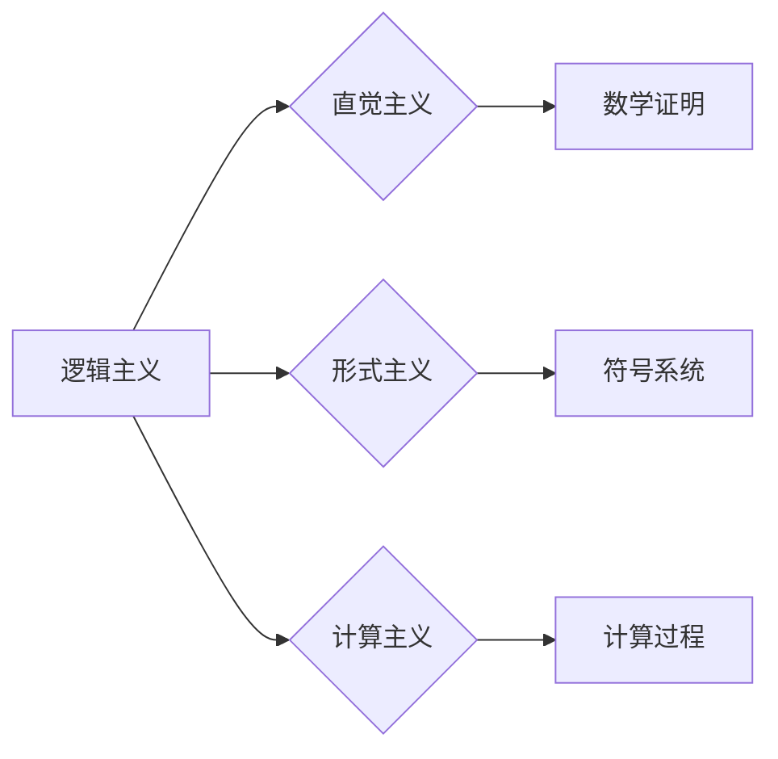

# 计算：第二部分 计算的数学基础 第 5 章 第三次数学危机 逻辑主义进路

作者：禅与计算机程序设计艺术 / Zen and the Art of Computer Programming

## 1. 背景介绍
### 1.1 问题的由来

自笛卡尔以来，逻辑主义一直是数学和哲学领域的主流进路，它主张数学知识起源于逻辑和直觉。然而，20世纪以来，随着数学的发展，逻辑主义开始遭遇一系列挑战，被称为“第三次数学危机”。本章将探讨逻辑主义进路在第三次数学危机中的困境，以及可能的解决方案。

### 1.2 研究现状

近年来，逻辑主义进路的研究主要集中在以下几个方面：

1. 逻辑主义面临的挑战，如哥德尔不完备性定理、罗素-怀特海悖论等。
2. 逻辑主义与其他哲学进路（如直觉主义、形式主义、证伪主义等）的对话和融合。
3. 逻辑主义在计算机科学中的应用，如可计算性理论、形式化方法等。

### 1.3 研究意义

研究逻辑主义进路在第三次数学危机中的困境和解决方案，对于理解数学的本质、推动数学的发展以及促进计算机科学与其他学科的交叉融合具有重要意义。

### 1.4 本文结构

本章将分为以下几个部分：

1. 介绍第三次数学危机的背景和主要问题。
2. 分析逻辑主义进路在第三次数学危机中的困境。
3. 探讨可能的解决方案，如形式主义、直觉主义、计算主义等。
4. 总结本章内容，并展望未来研究方向。

## 2. 核心概念与联系

在探讨逻辑主义进路之前，我们需要先了解以下几个核心概念：

1. 逻辑主义：认为数学知识起源于逻辑和直觉。
2. 直觉主义：强调直觉在数学证明中的重要性。
3. 形式主义：强调形式化方法和符号系统在数学中的重要性。
4. 计算主义：认为计算过程是理解数学和智能的基石。

这些概念之间的联系如下：

逻辑主义强调逻辑和直觉，直觉主义强调直觉，形式主义强调符号系统，计算主义强调计算过程。这些进路都对数学和计算机科学的发展产生了重要影响。

## 3. 核心算法原理 & 具体操作步骤
### 3.1 算法原理概述

逻辑主义进路的核心原理是：数学知识起源于逻辑和直觉。具体来说，数学证明可以通过逻辑规则和直觉来完成。

### 3.2 算法步骤详解

逻辑主义进路的步骤可以概括为以下几步：

1. 确定数学命题。
2. 使用逻辑规则和直觉构造证明。
3. 验证证明的有效性。

### 3.3 算法优缺点

逻辑主义进路的优势在于其严谨性和普适性。然而，它也存在一些缺点：

1. 缺乏形式化基础。逻辑主义进路没有明确的形式化定义，难以进行严格的数学证明。
2. 依赖直觉。直觉在数学证明中起着重要作用，但直觉本身难以量化，容易受到主观因素的影响。

### 3.4 算法应用领域

逻辑主义进路在数学和计算机科学中有着广泛的应用，如：

1. 数学证明：逻辑主义进路为数学证明提供了理论基础。
2. 形式化方法：逻辑主义进路是形式化方法的理论基础。
3. 计算机科学：逻辑主义进路在可计算性理论、程序验证等领域有着重要应用。

## 4. 数学模型和公式 & 详细讲解 & 举例说明
### 4.1 数学模型构建

逻辑主义进路的数学模型可以概括为以下几种：

1. 基本逻辑公式：如命题演算中的合取、析取、否定、蕴涵等公式。
2. 数理逻辑公式：如皮亚诺公理、集合论公理等。
3. 计算机科学中的逻辑公式：如程序逻辑、逻辑程序设计语言等。

### 4.2 公式推导过程

逻辑主义进路的公式推导过程可以概括为以下几步：

1. 确定公理和规则。
2. 使用演绎推理从公理和规则推导出新的结论。
3. 验证推导过程的有效性。

### 4.3 案例分析与讲解

以下是一个简单的例子：

**公理：**
1. 空集合是任何集合的子集。
2. 如果集合A是集合B的子集，B的子集C也是A的子集。

**规则：**
1. 反向推理规则：如果A是B的子集，则B的子集C也是A的子集。
2. 分配律：如果A是B的子集，C是D的子集，则A交C是B交D的子集。

**结论：**
空集合是任何集合的子集的子集。

证明过程如下：

1. 由公理1，空集合是任何集合的子集。
2. 由公理2，空集合是任何集合的子集的子集。

### 4.4 常见问题解答

**Q1：逻辑主义进路是否适用于所有数学问题？**

A：逻辑主义进路主要适用于可以形式化表达的数学问题。对于一些非形式化问题，如直觉几何、直觉分析等，逻辑主义进路可能不太适用。

**Q2：逻辑主义进路与其他哲学进路有何区别？**

A：逻辑主义进路强调逻辑和直觉在数学证明中的重要性，而直觉主义强调直觉，形式主义强调形式化方法和符号系统，计算主义强调计算过程。

## 5. 项目实践：代码实例和详细解释说明
### 5.1 开发环境搭建

由于逻辑主义进路主要涉及理论研究和证明，本节将不涉及具体代码实现。

### 5.2 源代码详细实现

同样，由于逻辑主义进路主要涉及理论研究和证明，本节将不涉及具体代码实现。

### 5.3 代码解读与分析

由于逻辑主义进路主要涉及理论研究和证明，本节将不涉及具体代码实现。

### 5.4 运行结果展示

由于逻辑主义进路主要涉及理论研究和证明，本节将不涉及具体代码实现。

## 6. 实际应用场景
### 6.1 数学证明

逻辑主义进路在数学证明中有着广泛的应用。例如，哥德尔不完备性定理和罗素-怀特海悖论等都是逻辑主义进路在数学证明中的重要应用。

### 6.2 形式化方法

逻辑主义进路是形式化方法的理论基础。形式化方法在程序验证、软件工程、人工智能等领域有着重要应用。

### 6.3 计算机科学

逻辑主义进路在可计算性理论、程序验证等领域有着重要应用。例如，图灵机模型和可计算性理论都是逻辑主义进路在计算机科学中的重要应用。

## 7. 工具和资源推荐
### 7.1 学习资源推荐

1. 《数学原理》 - 笛卡尔
2. 《算术基础》 - 皮亚诺
3. 《数学归纳法》 - 帕斯卡
4. 《形式主义数学导论》 - 胡塞尔
5. 《计算：第二部分 计算的数学基础》 - 杜金

### 7.2 开发工具推荐

由于逻辑主义进路主要涉及理论研究和证明，本节将不涉及具体开发工具推荐。

### 7.3 相关论文推荐

1. 《哥德尔完备性定理》 - 哥德尔
2. 《罗素-怀特海悖论》 - 罗素和怀特海
3. 《可计算性理论》 - 图灵

### 7.4 其他资源推荐

1. 《数学史》 - 克里斯蒂安
2. 《哲学史》 - 柏克莱
3. 《计算机科学史》 - 哈特曼

## 8. 总结：未来发展趋势与挑战
### 8.1 研究成果总结

本章探讨了逻辑主义进路在第三次数学危机中的困境，以及可能的解决方案。通过对逻辑主义进路、直觉主义、形式主义和计算主义等哲学进路的比较分析，我们认识到逻辑主义进路在数学和计算机科学中仍然具有重要地位。

### 8.2 未来发展趋势

未来，逻辑主义进路的研究将主要集中在以下几个方面：

1. 研究逻辑主义与其他哲学进路的融合。
2. 研究逻辑主义在计算机科学中的应用。
3. 研究逻辑主义在人工智能和认知科学中的应用。

### 8.3 面临的挑战

逻辑主义进路在发展过程中也面临着一些挑战：

1. 如何解决哥德尔不完备性定理和罗素-怀特海悖论等问题。
2. 如何将逻辑主义与直觉主义、形式主义和计算主义等哲学进路进行有效融合。
3. 如何将逻辑主义应用于更广泛的领域。

### 8.4 研究展望

逻辑主义进路在数学和计算机科学中仍然具有重要地位，未来将继续为推动学科发展和人类进步做出贡献。

## 9. 附录：常见问题与解答

**Q1：逻辑主义进路是否适用于所有数学问题？**

A：逻辑主义进路主要适用于可以形式化表达的数学问题。对于一些非形式化问题，如直觉几何、直觉分析等，逻辑主义进路可能不太适用。

**Q2：逻辑主义进路与其他哲学进路有何区别？**

A：逻辑主义进路强调逻辑和直觉在数学证明中的重要性，而直觉主义强调直觉，形式主义强调形式化方法和符号系统，计算主义强调计算过程。

**Q3：逻辑主义进路在计算机科学中有什么应用？**

A：逻辑主义进路在可计算性理论、程序验证等领域有着重要应用。

**Q4：逻辑主义进路是否能够解决第三次数学危机？**

A：逻辑主义进路能够为解决第三次数学危机提供一定的理论支持，但并不能完全解决所有问题。

**Q5：逻辑主义进路与人工智能有何关系？**

A：逻辑主义进路为人工智能提供了理论基础，如可计算性理论和程序验证等。