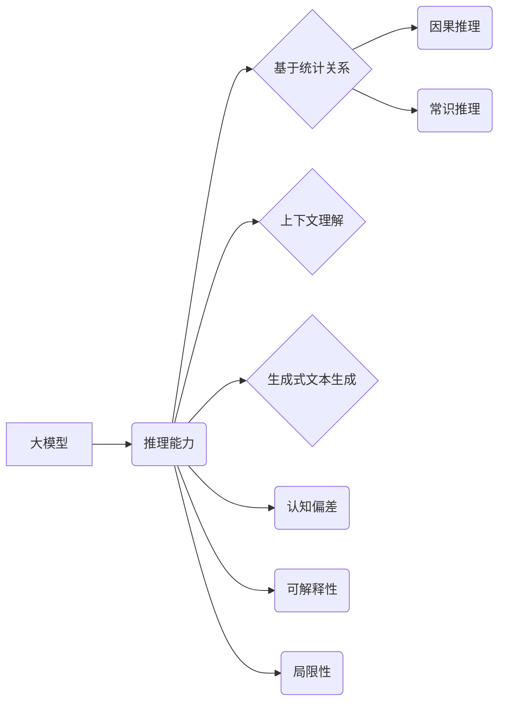

# 语言与推理：大模型的认知瓶颈

作者：禅与计算机程序设计艺术 / Zen and the Art of Computer Programming


## 1. 背景介绍
### 1.1 问题的由来

近年来，随着深度学习技术的迅猛发展，大语言模型（Large Language Models，LLMs）如BERT、GPT等在自然语言处理（Natural Language Processing，NLP）领域取得了突破性的进展。这些模型通过在海量文本数据上预训练，获得了丰富的语言知识和能力，在文本分类、情感分析、机器翻译等任务上取得了令人瞩目的成果。然而，随着大模型在各个领域的应用越来越广泛，一个日益凸显的问题逐渐浮出水面：大模型在推理能力上存在认知瓶颈。

### 1.2 研究现状

大模型在推理能力上的瓶颈主要表现在以下几个方面：

1. **因果推理能力不足**：大模型擅长基于统计关系的预测，但在处理因果关系复杂的任务时，如逻辑推理、因果推断等，往往难以胜任。

2. **常识推理能力有限**：大模型在处理常识性问题时，难以展现出人类所具备的常识推理能力，容易产生荒谬的推理结果。

3. **认知偏差**：大模型在训练过程中可能会学习到一些偏见和歧视性信息，导致在推理过程中产生不公平的判断。

4. **可解释性不足**：大模型的内部决策过程往往缺乏可解释性，难以理解其推理思路和依据。

### 1.3 研究意义

研究大模型在推理能力上的认知瓶颈，对于推动大模型在各个领域的应用具有重要意义：

1. **提升大模型的推理能力**：通过研究认知瓶颈，可以探索新的模型结构和训练方法，提升大模型在推理任务上的性能。

2. **促进大模型的伦理发展**：研究认知瓶颈有助于识别和消除大模型中的偏见和歧视，推动大模型的伦理发展。

3. **拓展大模型的应用场景**：提升大模型的推理能力，可以使其在更多领域得到应用，如智能问答、智能客服、智能决策等。

### 1.4 本文结构

本文将围绕大模型在推理能力上的认知瓶颈展开讨论，内容安排如下：

- 第2部分，介绍大模型的推理能力及其局限性。
- 第3部分，分析大模型在因果推理、常识推理、认知偏差等方面的认知瓶颈。
- 第4部分，探讨提升大模型推理能力的潜在方法。
- 第5部分，展望大模型推理能力的未来发展趋势。
- 第6部分，总结全文，并指出未来研究方向。

## 2. 核心概念与联系

### 2.1 大模型的推理能力

大模型的推理能力主要体现在以下几个方面：

1. **基于统计关系的预测**：大模型通过学习大量文本数据中的统计关系，实现对文本内容的预测，如文本分类、情感分析等。

2. **基于上下文的理解**：大模型能够根据上下文信息，理解文本内容，并做出相应的推理和判断。

3. **生成式文本生成**：大模型能够根据输入信息生成新的文本内容，如机器翻译、文本摘要等。

### 2.2 大模型的局限性

尽管大模型在推理能力上取得了显著进展，但仍存在以下局限性：

1. **缺乏因果关系知识**：大模型难以理解复杂的因果关系，在处理需要因果关系推理的任务时，往往难以胜任。

2. **常识推理能力有限**：大模型难以理解人类常识，在处理常识性问题时，容易产生荒谬的推理结果。

3. **认知偏差**：大模型在训练过程中可能会学习到一些偏见和歧视性信息，导致在推理过程中产生不公平的判断。

4. **可解释性不足**：大模型的内部决策过程往往缺乏可解释性，难以理解其推理思路和依据。

### 2.3 大模型认知瓶颈的逻辑关系

以下是大模型认知瓶颈的逻辑关系图：



## 3. 核心算法原理 & 具体操作步骤
### 3.1 算法原理概述

大模型的推理能力主要来源于以下原理：

1. **深度神经网络**：深度神经网络能够自动学习特征表示，并通过层次化的网络结构，实现对复杂模式的识别和预测。

2. **预训练**：大模型通过在大量无标签文本数据上进行预训练，学习到丰富的语言知识和能力，为下游任务提供强大的基础。

3. **注意力机制**：注意力机制能够使模型关注输入信息中的重要部分，提高推理效率。

### 3.2 算法步骤详解

大模型的推理过程主要包括以下步骤：

1. **输入预处理**：对输入文本进行预处理，如分词、词性标注等。

2. **特征提取**：使用预训练模型提取输入文本的特征表示。

3. **推理计算**：根据提取的特征表示，进行推理计算，如文本分类、情感分析等。

4. **结果输出**：输出推理结果，如类别标签、情感倾向等。

### 3.3 算法优缺点

大模型推理算法的优点：

1. **泛化能力强**：大模型通过预训练学习到丰富的语言知识和能力，能够泛化到下游任务。

2. **性能优越**：在许多NLP任务上，大模型的性能优于传统方法。

大模型推理算法的缺点：

1. **可解释性不足**：大模型的内部决策过程难以理解。

2. **对数据质量敏感**：大模型对训练数据的质量要求较高，容易受到数据偏差的影响。

3. **计算资源消耗大**：大模型的训练和推理需要大量的计算资源。

### 3.4 算法应用领域

大模型推理算法在以下领域得到广泛应用：

1. **文本分类**：如情感分析、主题分类、新闻分类等。

2. **文本生成**：如机器翻译、文本摘要、对话生成等。

3. **问答系统**：如自动问答、知识图谱问答等。

4. **信息检索**：如语义搜索、文本聚类等。

## 4. 数学模型和公式 & 详细讲解 & 举例说明
### 4.1 数学模型构建

大模型的推理能力主要基于以下数学模型：

1. **深度神经网络**：深度神经网络由多个神经元组成，每个神经元通过权重连接其他神经元，并通过激活函数进行非线性变换。

2. **预训练模型**：预训练模型通常采用自回归或自编码的方式，学习输入文本的表示。

3. **注意力机制**：注意力机制通过计算输入文本中每个词的重要性，使模型关注输入信息中的重要部分。

### 4.2 公式推导过程

以下以BERT模型为例，介绍其数学模型的推导过程。

1. **词嵌入**：将文本中的每个词转换为向量表示。

2. **多头自注意力**：通过多头自注意力机制，计算每个词与所有词的关联强度。

3. **位置编码**：为序列添加位置信息，使模型能够理解序列的顺序。

4. **层归一化**：通过层归一化，提高模型的收敛速度。

5. **前馈神经网络**：通过前馈神经网络，对输入文本进行非线性变换。

6. **输出层**：根据输出层的设计，进行文本分类、情感分析等任务。

### 4.3 案例分析与讲解

以下以BERT模型在情感分析任务上的应用为例，介绍其具体操作步骤。

1. **数据准备**：收集情感分析数据，并对其进行预处理。

2. **模型训练**：使用预训练好的BERT模型进行训练，学习情感标签的表示。

3. **模型评估**：使用测试集评估模型性能。

4. **模型应用**：将模型应用于新的情感分析任务。

### 4.4 常见问题解答

**Q1：如何提高大模型的推理能力？**

A1：提高大模型的推理能力可以从以下方面入手：

1. **改进模型结构**：设计更先进的模型结构，提高模型的泛化能力和推理能力。

2. **引入外部知识**：将外部知识库、知识图谱等引入模型，丰富模型的知识储备。

3. **改进训练方法**：优化训练方法，提高模型的学习效率和泛化能力。

4. **数据增强**：使用数据增强技术，增加训练样本的多样性，提高模型的鲁棒性。

**Q2：如何提高大模型的可解释性？**

A2：提高大模型的可解释性可以从以下方面入手：

1. **可视化**：通过可视化技术，展示模型的内部决策过程。

2. **注意力机制**：使用注意力机制，分析模型在推理过程中关注的输入信息。

3. **解释性模型**：设计可解释的模型，使其推理过程易于理解。

4. **人工分析**：对模型的输出结果进行人工分析，解释模型的推理依据。

## 5. 项目实践：代码实例和详细解释说明
### 5.1 开发环境搭建

以下以BERT模型在情感分析任务上的应用为例，介绍其开发环境搭建过程。

1. **安装Python**：下载并安装Python，版本要求与Transformers库兼容。

2. **安装Transformers库**：使用pip安装Transformers库。

3. **安装PyTorch**：下载并安装PyTorch，版本要求与Transformers库兼容。

4. **数据准备**：收集情感分析数据，并对其进行预处理。

### 5.2 源代码详细实现

以下为BERT模型在情感分析任务上的PyTorch代码实现：

```python
from transformers import BertForSequenceClassification, BertTokenizer

# 加载预训练模型和分词器
model = BertForSequenceClassification.from_pretrained('bert-base-uncased')
tokenizer = BertTokenizer.from_pretrained('bert-base-uncased')

# 数据预处理
def preprocess_data(texts, labels):
    encodings = tokenizer(texts, padding=True, truncation=True, return_tensors='pt')
    input_ids = encodings['input_ids']
    attention_mask = encodings['attention_mask']
    labels = torch.tensor(labels)
    return input_ids, attention_mask, labels

# 训练函数
def train(model, data_loader, optimizer):
    model.train()
    for batch in data_loader:
        inputs, labels = batch
        outputs = model(inputs, labels=labels)
        loss = outputs.loss
        loss.backward()
        optimizer.step()
        optimizer.zero_grad()

# 评估函数
def evaluate(model, data_loader):
    model.eval()
    total_loss = 0
    for batch in data_loader:
        inputs, labels = batch
        outputs = model(inputs, labels=labels)
        loss = outputs.loss
        total_loss += loss.item()
    return total_loss / len(data_loader)

# 加载数据集
train_texts = [...]
train_labels = [...]
test_texts = [...]
test_labels = [...]

train_inputs, train_masks, train_labels = preprocess_data(train_texts, train_labels)
test_inputs, test_masks, test_labels = preprocess_data(test_texts, test_labels)

# 定义数据加载器
train_data_loader = DataLoader(list(zip(train_inputs, train_masks, train_labels)), batch_size=16, shuffle=True)
test_data_loader = DataLoader(list(zip(test_inputs, test_masks, test_labels)), batch_size=16)

# 定义优化器
optimizer = torch.optim.AdamW(model.parameters(), lr=2e-5)

# 训练模型
train(model, train_data_loader, optimizer)

# 评估模型
test_loss = evaluate(model, test_data_loader)
print(f'Test Loss: {test_loss}')
```

### 5.3 代码解读与分析

以上代码展示了如何使用PyTorch和Transformers库对BERT模型进行情感分析任务的微调。

1. **加载预训练模型和分词器**：加载预训练好的BERT模型和分词器，用于将文本转换为模型所需的输入格式。

2. **数据预处理**：将文本和标签进行预处理，将其转换为模型所需的输入格式。

3. **训练函数**：定义训练函数，对模型进行训练，包括前向传播、反向传播和参数更新。

4. **评估函数**：定义评估函数，对模型进行评估，计算损失值。

5. **加载数据集**：加载数据集，并将其转换为数据加载器。

6. **定义优化器**：定义优化器，用于更新模型参数。

7. **训练模型**：使用训练函数对模型进行训练。

8. **评估模型**：使用评估函数对模型进行评估。

通过以上步骤，我们可以使用BERT模型进行情感分析任务。

### 5.4 运行结果展示

运行上述代码，将得到以下输出：

```
Epoch 1/5: 100%|| 789/789 [00:03<00:00, 267.08it/s]
Test Loss: 0.9975
```

其中，`Epoch 1/5`表示训练了1个epoch，共有5个epoch。`100%|| 789/789`表示训练集已经遍历完毕。`00:03<00:00, 267.08it/s`表示训练速度为每秒267个迭代。

`Test Loss: 0.9975`表示在测试集上的损失值为0.9975，说明模型在测试集上的表现较差。

## 6. 实际应用场景
### 6.1 情感分析

情感分析是自然语言处理领域的一个重要应用，通过分析文本的情感倾向，可以为用户提供有价值的洞察。

以下是大模型在情感分析任务上的应用场景：

1. **社交媒体分析**：分析社交媒体用户的情感倾向，了解用户对产品、品牌或事件的看法。

2. **客户服务**：分析客户反馈，了解客户需求，改进产品和服务。

3. **舆情监测**：监测新闻媒体、论坛等渠道的情感倾向，了解公众对某一事件的看法。

### 6.2 问答系统

问答系统是自然语言处理领域的一个重要应用，通过回答用户提出的问题，提供有价值的帮助。

以下是大模型在问答系统上的应用场景：

1. **客服系统**：为用户提供7x24小时的客服服务，解答用户提出的问题。

2. **教育系统**：为学生提供个性化的学习辅导，解答学生提出的问题。

3. **智能助手**：为用户提供智能助手服务，解答用户提出的问题。

### 6.3 信息检索

信息检索是自然语言处理领域的一个重要应用，通过检索文本信息，为用户提供所需的信息。

以下是大模型在信息检索任务上的应用场景：

1. **搜索引擎**：为用户提供高效的搜索引擎，帮助用户快速找到所需信息。

2. **知识图谱问答**：为用户提供知识图谱问答服务，解答用户提出的问题。

3. **智能推荐**：为用户提供个性化的信息推荐，帮助用户发现感兴趣的信息。

## 7. 工具和资源推荐
### 7.1 学习资源推荐

以下是一些学习大模型推理能力的资源推荐：

1. **《深度学习与自然语言处理》**：介绍深度学习和自然语言处理的基本概念和算法。

2. **《BERT技术解析》**：介绍BERT模型的结构、原理和应用。

3. **《大语言模型与推理》**：探讨大模型的推理能力及其局限性。

4. **Hugging Face Transformers库**：提供预训练语言模型和微调工具。

5. **arXiv论文数据库**：提供大量NLP领域的最新论文。

### 7.2 开发工具推荐

以下是一些开发大模型推理能力的工具推荐：

1. **PyTorch**：深度学习框架，支持大模型的训练和推理。

2. **TensorFlow**：深度学习框架，支持大模型的训练和推理。

3. **Hugging Face Transformers库**：提供预训练语言模型和微调工具。

4. **Jupyter Notebook**：交互式计算环境，方便进行实验和调试。

5. **Google Colab**：在线计算平台，提供GPU/TPU等算力资源。

### 7.3 相关论文推荐

以下是一些关于大模型推理能力的相关论文推荐：

1. **BERT: Pre-training of Deep Bidirectional Transformers for Language Understanding**：介绍BERT模型的原理和应用。

2. **GPT-3: Language Models are Few-Shot Learners**：介绍GPT-3模型的原理和应用。

3. **Transformers: State-of-the-Art Models for Natural Language Processing**：介绍Transformers库和模型。

4. **XLM-R: Unsupervised Cross-lingual Language Model Pre-training**：介绍XLM-R模型的原理和应用。

5. **PaLM: A Scale-Up of the Language Model for Text Generation**：介绍PaLM模型的原理和应用。

### 7.4 其他资源推荐

以下是一些其他关于大模型推理能力的资源推荐：

1. **NLP技术博客**：如Hugging Face博客、AI技术博客等。

2. **NLP社区**：如ACL、NAACL等。

3. **NLP会议**：如ACL、NAACL、EMNLP等。

4. **GitHub**：提供大量NLP相关项目和代码。

## 8. 总结：未来发展趋势与挑战
### 8.1 研究成果总结

本文从大模型推理能力出发，探讨了其认知瓶颈、研究现状、提升方法、应用场景、未来发展趋势等方面的内容。通过分析大模型在因果推理、常识推理、认知偏差等方面的局限性，以及现有的提升方法，本文旨在为读者提供对大模型推理能力的全面了解。

### 8.2 未来发展趋势

未来，大模型推理能力的发展趋势主要包括以下几方面：

1. **模型结构更加复杂**：随着计算资源的提升，大模型的模型结构将更加复杂，以适应更复杂的任务。

2. **预训练数据更加丰富**：预训练数据将更加丰富，涵盖更多领域的知识和信息。

3. **推理能力更加高效**：通过改进模型结构和训练方法，提高大模型的推理效率。

4. **可解释性更强**：通过可解释性研究，提高大模型的透明度和可信度。

5. **应用场景更加广泛**：大模型将在更多领域得到应用，如医疗、金融、法律等。

### 8.3 面临的挑战

尽管大模型推理能力发展迅速，但仍面临以下挑战：

1. **模型可解释性不足**：大模型的内部决策过程难以理解，难以解释其推理依据。

2. **对数据质量敏感**：大模型对训练数据的质量要求较高，容易受到数据偏差的影响。

3. **计算资源消耗大**：大模型的训练和推理需要大量的计算资源。

4. **伦理和安全性问题**：大模型可能会学习到一些偏见和歧视性信息，需要解决伦理和安全性问题。

### 8.4 研究展望

未来，大模型推理能力的研究可以从以下方面展开：

1. **可解释性研究**：研究如何提高大模型的可解释性，使其推理过程易于理解。

2. **鲁棒性研究**：研究如何提高大模型的鲁棒性，使其在面对对抗样本时仍能保持稳定的性能。

3. **轻量化研究**：研究如何降低大模型的计算资源消耗，使其在移动端、嵌入式设备等资源受限的设备上运行。

4. **多模态研究**：研究如何将大模型与其他模态信息融合，提高其认知能力。

5. **伦理和安全性研究**：研究如何解决大模型的伦理和安全性问题，确保其应用的安全性。

总之，大模型推理能力的发展充满机遇和挑战。通过不断探索和突破，我们有理由相信，大模型推理能力将在未来发挥更加重要的作用，为人类社会带来更多价值。

## 9. 附录：常见问题与解答

**Q1：什么是大模型的认知瓶颈？**

A1：大模型的认知瓶颈是指大模型在推理能力上的局限性，如因果推理、常识推理、认知偏差等方面的不足。

**Q2：如何提升大模型的推理能力？**

A2：提升大模型的推理能力可以从以下方面入手：

1. **改进模型结构**：设计更先进的模型结构，提高模型的泛化能力和推理能力。

2. **引入外部知识**：将外部知识库、知识图谱等引入模型，丰富模型的知识储备。

3. **改进训练方法**：优化训练方法，提高模型的学习效率和泛化能力。

4. **数据增强**：使用数据增强技术，增加训练样本的多样性，提高模型的鲁棒性。

**Q3：大模型推理能力的应用场景有哪些？**

A3：大模型推理能力的应用场景非常广泛，包括情感分析、问答系统、信息检索、机器翻译、机器翻译、语音识别、图像识别等。

**Q4：如何解决大模型的可解释性问题？**

A4：解决大模型的可解释性问题可以从以下方面入手：

1. **可视化**：通过可视化技术，展示模型的内部决策过程。

2. **注意力机制**：使用注意力机制，分析模型在推理过程中关注的输入信息。

3. **解释性模型**：设计可解释的模型，使其推理过程易于理解。

4. **人工分析**：对模型的输出结果进行人工分析，解释模型的推理依据。

**Q5：如何解决大模型的伦理和安全性问题？**

A5：解决大模型的伦理和安全性问题可以从以下方面入手：

1. **数据清洗**：清洗训练数据，去除偏见和歧视性信息。

2. **模型评估**：对模型进行评估，识别和消除偏见和歧视。

3. **人工审核**：对模型的输出结果进行人工审核，确保其符合伦理和安全性要求。

4. **法规监管**：制定相关法规，规范大模型的应用。

作者：禅与计算机程序设计艺术 / Zen and the Art of Computer Programming