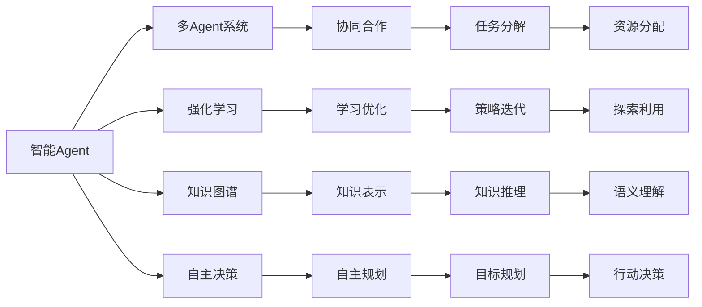

# AI人工智能 Agent：制造业中智能体的应用

关键词：人工智能、智能Agent、制造业、自主决策、多Agent系统、强化学习、知识图谱、工业4.0

## 1. 背景介绍
### 1.1 问题的由来
随着人工智能技术的快速发展,智能Agent在制造业中的应用日益广泛。传统的制造业面临着生产效率低下、资源浪费严重、产品质量不稳定等问题。引入智能Agent技术,可以显著提升制造业的智能化水平,实现生产过程的自动化和优化,提高生产效率和产品质量。
### 1.2 研究现状
目前,国内外学者对制造业中智能Agent的应用开展了广泛研究。美国麻省理工学院开发了一套用于制造业的多Agent系统,实现了生产调度的自主优化。德国弗劳恩霍夫研究所提出了一种基于Agent的智能工厂架构,实现了制造资源的灵活配置和协同优化。国内清华大学提出了一种基于强化学习的智能Agent生产调度方法,有效提升了生产效率。
### 1.3 研究意义 
将智能Agent技术应用于制造业,具有重要的理论意义和实践价值。一方面,智能Agent可以为制造业的智能化发展提供新的理论基础和技术手段,推动制造业向智能制造、智慧工厂方向发展。另一方面,智能Agent可以解决制造业面临的实际问题,如生产效率低、资源利用率低、产品质量不稳定等,具有广阔的应用前景。
### 1.4 本文结构
本文将围绕制造业中智能Agent的应用展开深入探讨。第2部分介绍智能Agent的核心概念和关键技术。第3部分重点阐述智能Agent的核心算法原理和具体操作步骤。第4部分建立智能Agent的数学模型,并给出详细的公式推导和案例分析。第5部分给出智能Agent的代码实现和详细解释。第6部分探讨智能Agent在制造业中的实际应用场景。第7部分推荐智能Agent相关的学习资源和开发工具。第8部分总结全文,展望智能Agent在制造业中的未来发展趋势和面临的挑战。

## 2. 核心概念与联系
智能Agent是一种能够感知环境、自主决策并采取行动的计算机程序。它通过与环境的交互,根据自身的知识、目标和策略,自主地完成特定任务。在制造业中,智能Agent可以扮演各种角色,如生产设备、物料、产品、订单等,通过相互协作完成生产任务。

智能Agent的关键技术包括:
1. 多Agent系统:由多个智能Agent组成,通过协同合作完成复杂任务。
2. 强化学习:通过与环境的交互,不断试错,学习最优决策策略。
3. 知识图谱:以图的形式表示领域知识,支持智能Agent的推理决策。
4. 自主决策:根据环境状态和自身知识,自主制定和执行决策。

这些技术相互关联,构成了智能Agent的核心能力。多Agent系统为智能体间协同合作提供了框架,强化学习赋予智能体学习和优化能力,知识图谱为智能体提供了丰富的领域知识,自主决策则是智能体的关键特征。

下图展示了智能Agent的核心概念与关键技术之间的关系:

## 3. 核心算法原理 & 具体操作步骤
### 3.1 算法原理概述
智能Agent的核心算法主要包括强化学习和多Agent协同算法。

强化学习是一种通过试错学习的方法。智能Agent作为学习者和决策者,通过与环境的交互,根据环境反馈的奖励或惩罚,不断调整自身的策略,最终学习到最优策略。常见的强化学习算法包括Q学习、Sarsa、DQN等。

多Agent协同算法解决多个智能Agent如何协调配合以完成共同任务的问题。通过引入通信协议、任务分解、资源分配等机制,实现智能Agent间的协同。常见的多Agent协同算法包括Contract Net、Auction、Negotiation等。
### 3.2 算法步骤详解
以Q学习算法为例,详细说明其工作步骤:
1. 初始化Q表,即状态-动作值函数。可以随机初始化,也可以根据先验知识设置初值。
2. 智能Agent根据当前环境状态,通过ε-贪心策略选取一个动作执行。以ε的概率随机选择动作,以1-ε的概率选择Q值最大的动作。
3. 环境根据智能Agent的动作,反馈下一个状态和即时奖励。
4. 根据贝尔曼方程更新Q表:
$Q(s,a) \leftarrow Q(s,a)+\alpha [r+\gamma \max_{a'}Q(s',a')-Q(s,a)]$
其中,s为当前状态,a为当前动作,r为即时奖励,s'为下一状态,α为学习率,γ为折扣因子。
5. 智能Agent进入下一状态s',重复步骤2-4,直至达到终止状态或满足收敛条件。

多Agent协同算法的一般步骤如下:
1. 问题分解:将全局任务分解为多个子任务,并明确任务之间的依赖关系。
2. 任务分配:根据Agent的能力、负载等,将子任务分配给适合的Agent。可以采用集中式或分布式的任务分配方法。
3. 制定计划:每个Agent根据分配的任务,制定完成任务的局部计划,并与其他Agent同步。
4. 执行计划:Agent执行计划,完成分配的任务。在执行过程中,Agent间通过通信协作,交换信息。
5. 结果整合:将各Agent完成的子任务结果进行整合,得到全局任务的完成结果。

### 3.3 算法优缺点
强化学习算法的优点是:
1. 通过试错学习,可以在未知环境中自主学习,不依赖人工设计的规则。
2. 通过不断优化策略,可以在动态环境中持续提升性能。
3. 可以处理连续状态和连续动作空间,适用范围广。

强化学习算法的缺点是:
1. 学习效率较低,需要大量的探索和试错,收敛速度慢。
2. 难以处理高维状态空间和长期回报,容易陷入局部最优。
3. 对奖励函数的设计依赖领域知识,奖励稀疏时难以学习。

多Agent协同算法的优点是:
1. 可以发挥多Agent的协同效应,解决单Agent难以完成的复杂任务。
2. 提高系统的鲁棒性和灵活性,单个Agent失效不影响整体任务。
3. 可以实现并行计算,提高任务执行效率。

多Agent协同算法的缺点是:
1. Agent间通信和协商开销大,可能影响实时性。
2. 需要解决Agent间的冲突和竞争,协调难度大。
3. 全局最优难以保证,容易得到次优解。

### 3.4 算法应用领域
智能Agent算法在制造业有广泛应用,主要场景包括:
1. 生产调度:用强化学习方法优化生产调度,提高设备利用率和订单交付率。
2. 故障诊断:通过多Agent协同,实现设备故障的分布式诊断和预测性维护。
3. 质量管理:用强化学习方法优化质量参数,实现产品质量的在线监测和控制。
4. 物流优化:通过多Agent协同,优化物料配送和产品出入库,降低库存和物流成本。
5. 能源管理:用强化学习方法优化设备能耗,实现车间能源的实时优化控制。

## 4. 数学模型和公式 & 详细讲解 & 举例说明
### 4.1 数学模型构建
以强化学习中的MDP(Markov Decision Process)为例,说明智能Agent的数学模型。MDP由以下元素构成:
1. 状态空间S:表示智能Agent所处的环境状态集合。
2. 动作空间A:表示智能Agent可执行的动作集合。
3. 状态转移概率P:表示在状态s下执行动作a后,环境进入下一状态s'的概率。
4. 奖励函数R:表示智能Agent执行动作后,环境反馈的即时奖励。
5. 折扣因子γ:表示未来奖励的折算比例,取值范围[0,1]。

MDP的目标是寻找一个最优策略π:S→A,使得智能Agent在所有状态下采取该策略,能获得最大的期望累积奖励。

定义状态-动作值函数Qπ(s,a)为:在状态s下执行动作a,并在之后都遵循策略π,能获得的期望累积奖励。
$$Q^\pi(s,a)=E^\pi[\sum_{t=0}^{\infty}\gamma^tr_{t+1}|s_0=s,a_0=a]$$

最优状态-动作值函数Q*(s,a)满足贝尔曼最优方程:
$$Q^*(s,a)=R(s,a)+\gamma\sum_{s'\in S}P(s'|s,a)\max_{a'\in A}Q^*(s',a')$$

### 4.2 公式推导过程
推导Q学习算法的更新公式:
1. 定义t时刻的TD误差:
$$\delta_t=r_{t+1}+\gamma Q(s_{t+1},a_{t+1})-Q(s_t,a_t)$$

2. 根据TD误差,更新t时刻的Q值:
$$Q(s_t,a_t) \leftarrow Q(s_t,a_t)+\alpha \delta_t$$

3. 将Q值的更新公式展开:
$$Q(s_t,a_t) \leftarrow Q(s_t,a_t)+\alpha [r_{t+1}+\gamma Q(s_{t+1},a_{t+1})-Q(s_t,a_t)]$$

4. 其中,Q(s_{t+1},a_{t+1})可以用下一状态的最大Q值估计:
$$Q(s_{t+1},a_{t+1}) \approx \max_{a'}Q(s_{t+1},a')$$

5. 代入估计值,得到Q学习算法的更新公式:
$$Q(s_t,a_t) \leftarrow Q(s_t,a_t)+\alpha [r_{t+1}+\gamma \max_{a'}Q(s_{t+1},a')-Q(s_t,a_t)]$$

### 4.3 案例分析与讲解
以智能制造车间的AGV调度为例,说明如何应用Q学习算法优化AGV的运输策略。

假设车间有N个工作站和M辆AGV,每个工作站周期性地产生物料搬运任务。AGV的任务是将物料从起点工作站运输到目标工作站。

1. 状态空间S:
- AGV所在位置(1~N)
- AGV当前载货状态(空载/满载) 
- 各工作站的任务队列状态(等待任务数)

2. 动作空间A:
- 移动到相邻工作站
- 在工作站装货或卸货
- 保持不动

3. 奖励函数R:
- 完成一个搬运任务获得正奖励R1
- AGV空载移动一次获得负奖励R2
- AGV满载移动一次获得负奖励R3
- 搬运任务等待时间超过阈值,获得负奖励R4

4. 状态转移:
- AGV移动改变自身位置状态
- AGV装卸货改变自身载货状态和工作站任务队列状态

根据上述MDP定义,可以应用Q学习算法,通过不断试错,学习AGV的最优调度策略,最小化搬运任务的等待时间和AGV的空载移动次数。

### 4.4 常见问题解答
1. 如何设置Q学习算法的超参数?
- 学习率α:一般取值0.01~0.1,过大可能震荡,过小收敛慢。可以随训练进行衰减。
- 折扣因子γ: