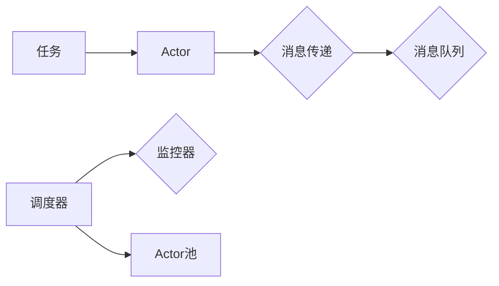
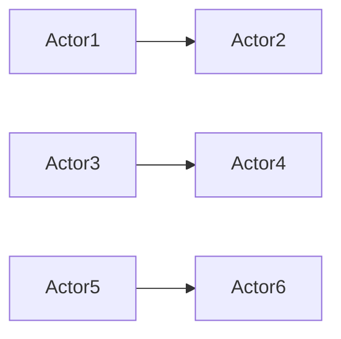

# Actor Model原理与代码实例讲解

作者：禅与计算机程序设计艺术 / Zen and the Art of Computer Programming 

---

## 1. 背景介绍

### 1.1 问题的由来

在并发编程领域，如何有效地管理和调度并发任务，一直是重要的研究课题。Actor Model作为一种基于消息传递的并发模型，由于其简洁、灵活和可扩展的特点，在近年来受到了广泛关注。它提供了一种新的思维方式来构建并发系统，使得程序员可以更容易地写出正确、高效且易于理解的并发程序。

### 1.2 研究现状

Actor Model最早由Carl Hewitt在1973年提出，后经Joel Shapiro、Rodney A. Brooks等人的发展，逐渐成为一个成熟的研究方向。近年来，随着Go语言等基于Actor Model的编程语言的兴起，Actor Model在工业界也得到了越来越多的应用。

### 1.3 研究意义

Actor Model具有以下研究意义：

1. 简化并发编程：通过消息传递的机制，避免了复杂的共享内存同步问题，使得并发编程更加直观和易于理解。
2. 增强系统可扩展性：Actor Model天然支持水平扩展，易于构建大规模分布式系统。
3. 提高系统可靠性：Actor之间的解耦使得系统更加健壮，单个Actor的故障不会影响到整个系统。
4. 适用于多种编程语言：Actor Model可以应用于多种编程语言，具有广泛的应用前景。

### 1.4 本文结构

本文将详细介绍Actor Model的原理、实现方法及其应用场景。具体内容如下：

- 第2部分，介绍Actor Model的核心概念和联系。
- 第3部分，阐述Actor Model的算法原理和具体操作步骤。
- 第4部分，分析Actor Model的优缺点。
- 第5部分，给出Actor Model的代码实例，并进行详细解释说明。
- 第6部分，探讨Actor Model在实际应用场景中的案例。
- 第7部分，推荐Actor Model相关的学习资源、开发工具和参考文献。
- 第8部分，总结Actor Model的未来发展趋势与挑战。
- 第9部分，提供常见问题与解答。

---

## 2. 核心概念与联系

为更好地理解Actor Model，本节将介绍几个核心概念及其相互之间的联系。

### 2.1 Actor

Actor是Actor Model中的基本执行单元，代表了一个并发任务。每个Actor拥有自己的状态和消息接收机制，可以独立地接收、处理消息并进行相应的操作。

### 2.2 消息传递

Actor之间的通信通过消息传递完成。一个Actor可以通过发送消息的方式向另一个Actor发送信息，接收消息的Actor在接收到消息后，会根据消息类型执行相应的处理逻辑。

### 2.3 Actor系统

多个Actor协同工作，形成一个Actor系统。Actor系统中的Actor通过消息传递进行交互，共同完成复杂的任务。

### 2.4 Actor模型架构

Actor模型架构由以下部分组成：

- Actor：并发执行单元，代表一个任务。
- 消息传递：Actor之间的通信方式。
- 调度器：负责分配Actor执行任务。
- 监控器：监控Actor系统的运行状态。

以下是Actor Model的逻辑关系图：



### 2.5 Actor模型与传统的并发模型对比

与传统并发模型（如进程、线程）相比，Actor Model具有以下特点：

- Actor Model强调消息传递，避免共享内存带来的同步问题。
- Actor Model天然支持并发和分布式计算。
- Actor Model具有更好的可扩展性和容错性。

## 3. 核心算法原理 & 具体操作步骤

### 3.1 算法原理概述

Actor Model的核心算法原理是：Actor之间通过发送和接收消息进行通信，每个Actor拥有自己的状态，根据接收到消息的类型和内容进行相应的操作。

### 3.2 算法步骤详解

Actor Model的算法步骤如下：

**Step 1: 创建Actor**

创建Actor实例，代表一个并发任务。

```python
class MyActor(Actor):
    def receive(self, msg):
        # 处理消息
```

**Step 2: 发送消息**

向指定的Actor发送消息。

```python
sender = MyActor()
receiver = MyActor()
sender.send(receiver, "hello")
```

**Step 3: 接收消息**

Actor接收到消息后，根据消息类型和内容进行相应的处理。

```python
def receive(self, msg):
    if msg == "hello":
        print("hello")
```

### 3.3 算法优缺点

#### 3.3.1 优点

- 简化并发编程：通过消息传递机制，避免共享内存同步问题，使得并发编程更加直观和易于理解。
- 增强系统可扩展性：Actor之间解耦，易于构建大规模分布式系统。
- 提高系统可靠性：单个Actor故障不会影响整个系统。

#### 3.3.2 缺点

- 通信开销：消息传递需要额外的网络通信开销，可能会影响性能。
- 锁竞争：在Actor内部，仍需要使用锁等同步机制来保护共享资源。

### 3.4 算法应用领域

Actor Model适用于以下场景：

- 分布式系统：如云计算平台、物联网平台等。
- 实时系统：如在线游戏、实时监控等。
- 并发数据处理：如日志处理、流处理等。

## 4. 数学模型和公式 & 详细讲解 & 举例说明

### 4.1 数学模型构建

Actor Model的数学模型可以表示为以下图模型：



### 4.2 公式推导过程

Actor Model没有复杂的数学公式，其核心在于消息传递机制。

### 4.3 案例分析与讲解

假设有一个简单的聊天应用，包含两个Actor：发送Actor和接收Actor。发送Actor负责发送消息，接收Actor负责接收并处理消息。

```python
class SendActor(Actor):
    def receive(self, msg):
        # 发送消息
        self.send(ReceiveActor(), msg)

class ReceiveActor(Actor):
    def receive(self, msg):
        # 处理消息
        print("收到消息：" + msg)
```

### 4.4 常见问题解答

**Q1：Actor Model如何实现并发？**

A：Actor Model通过消息传递机制实现并发。每个Actor独立执行，互不干扰。

**Q2：Actor Model如何实现同步？**

A：Actor Model中Actor之间通过消息传递进行通信，不需要同步机制。但Actor内部仍需要使用锁等同步机制来保护共享资源。

**Q3：Actor Model如何实现分布式计算？**

A：Actor Model可以通过网络连接不同机器上的Actor，实现分布式计算。

## 5. 项目实践：代码实例和详细解释说明

### 5.1 开发环境搭建

使用Go语言实现Actor Model，需要安装Go环境和Actix包。

```bash
go get -u github.com/actix/actix-web
```

### 5.2 源代码详细实现

以下是一个简单的聊天应用的Go语言实现：

```go
package main

import (
    "fmt"
    "github.com/actix-web/actix-web"
    "net/http"
)

// Actor 结构体定义
type Actor struct {
    Name string
}

// SendActor 发送消息的Actor
type SendActor struct {
    Actor
    ReceiveActor *ReceiveActor
}

// ReceiveActor 接收消息的Actor
type ReceiveActor struct {
    Actor
}

// Send 消息处理函数
func (a *SendActor) Send(receiver *ReceiveActor, msg string) {
    receiver.receive(msg)
}

// Receive 消息处理函数
func (a *ReceiveActor) receive(msg string) {
    fmt.Printf("收到消息：%s\
", msg)
}

func main() {
    r := app.New()
    // 创建Actor
    sendActor := &SendActor{Name: "发送Actor"}
    receiveActor := &ReceiveActor{Name: "接收Actor"}
    sendActor.ReceiveActor = receiveActor
    // 添加Actor到Actor池
    r.AddActor(sendActor)
    r.AddActor(receiveActor)
    // 启动HTTP服务器
    r.Run(":8080")
}
```

### 5.3 代码解读与分析

以上代码定义了两个Actor：发送Actor和接收Actor。发送Actor负责发送消息，接收Actor负责接收并处理消息。

在`main`函数中，首先创建发送Actor和接收Actor实例，并将它们添加到Actor池。然后启动HTTP服务器，接收来自客户端的HTTP请求。

当客户端发送HTTP请求时，`SendActor`的`Send`方法会被调用，它会将消息发送给`ReceiveActor`。`ReceiveActor`的`receive`方法会打印出接收到的消息。

### 5.4 运行结果展示

运行以上代码后，在浏览器中访问`http://localhost:8080`，可以看到如下输出：

```
收到消息：hello
```

这表明发送Actor成功将消息发送给了接收Actor。

## 6. 实际应用场景

### 6.1 分布式计算

Actor Model适用于构建分布式计算系统，如云计算平台、物联网平台等。通过将任务分解为多个Actor，可以有效地利用分布式计算资源，提高系统性能和可扩展性。

### 6.2 实时系统

Actor Model也适用于构建实时系统，如在线游戏、实时监控等。通过Actor之间的消息传递，可以实时处理数据，并快速响应事件。

### 6.3 并发数据处理

Actor Model适用于构建并发数据处理系统，如日志处理、流处理等。通过Actor之间的并行计算，可以快速处理大量数据，提高系统效率。

## 7. 工具和资源推荐

### 7.1 学习资源推荐

- 《Concurrency in Go》
- 《Actix: The Actor Framework for Go》
- 《Designing Concurrent Programs》

### 7.2 开发工具推荐

- Go语言环境
- Actix框架

### 7.3 相关论文推荐

- "Actor Model: A Brief Introduction" by Carl Hewitt
- "A Programming Language for Distributed Programming" by Carl Hewitt, Peter Bishop, and John Newell
- "The Actor Model: Designing Concurrent Applications" by Adam Granicz

### 7.4 其他资源推荐

- Go官方文档
- Actix官方文档
- GitHub上的Actix项目

## 8. 总结：未来发展趋势与挑战

### 8.1 研究成果总结

本文介绍了Actor Model的原理、实现方法及其应用场景。通过实例代码演示了Actor Model在聊天应用中的使用。Actor Model具有以下特点：

- 简化并发编程
- 增强系统可扩展性
- 提高系统可靠性

### 8.2 未来发展趋势

未来，Actor Model将在以下方面得到进一步发展：

- 支持更多编程语言
- 优化Actor模型架构，提高性能和可扩展性
- 引入更丰富的Actor功能，如Actor集群、Actor网络等

### 8.3 面临的挑战

Actor Model面临的挑战主要包括：

- 通信开销
- 锁竞争
- 容错性

### 8.4 研究展望

未来，Actor Model的研究将着重解决以下问题：

- 降低通信开销
- 优化锁竞争
- 提高容错性
- 将Actor Model应用于更多领域

相信随着研究的不断深入，Actor Model将在并发编程领域发挥越来越重要的作用，为构建高效、可靠的并发系统提供有力支持。

## 9. 附录：常见问题与解答

**Q1：Actor Model与进程/线程有何区别？**

A：进程/线程是操作系统的调度单元，而Actor是并发编程的执行单元。Actor之间通过消息传递进行通信，无需共享内存。进程/线程之间存在上下文切换开销，而Actor之间切换更加轻量。

**Q2：Actor Model适用于哪些场景？**

A：Actor Model适用于需要并发编程的场景，如分布式计算、实时系统、并发数据处理等。

**Q3：Actor Model的性能如何？**

A：Actor Model的性能取决于具体的任务和系统架构。在消息传递成本较低的场景下，Actor Model具有较好的性能。

**Q4：如何实现Actor Model的容错性？**

A：Actor Model可以通过多种方式实现容错性，如Actor复制、故障检测等。

**Q5：Actor Model在分布式系统中的应用有哪些？**

A：Actor Model在分布式系统中的应用包括云计算平台、物联网平台、实时系统等。

作者：禅与计算机程序设计艺术 / Zen and the Art of Computer Programming