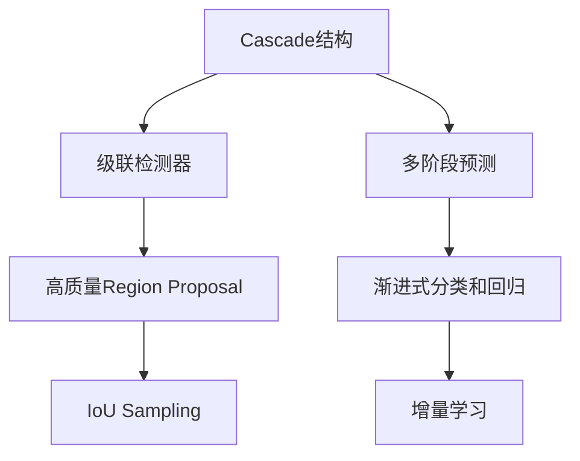
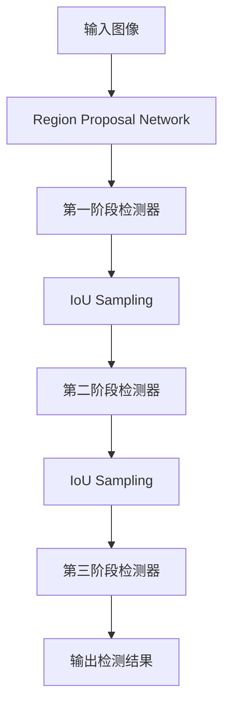

# Cascade R-CNN原理与代码实例讲解

## 1. 背景介绍

### 1.1 问题的由来

目标检测是计算机视觉领域的一个核心任务,旨在从图像或视频中定位目标对象并识别它们的类别。传统的目标检测算法如R-CNN系列,尽管取得了不错的性能,但仍然存在一些缺陷,例如速度较慢、对小目标检测效果不佳等。为了解决这些问题,微软研究院的研究人员提出了Cascade R-CNN算法。

### 1.2 研究现状

目标检测算法的发展大致可以分为两个阶段:基于传统图像处理方法的阶段和基于深度学习的阶段。在深度学习时代,R-CNN及其改进版本如Fast R-CNN、Faster R-CNN等算法取得了令人瞩目的进展,但也存在一些缺陷,如速度较慢、对小目标检测效果不佳等。为了解决这些问题,研究人员不断探索新的算法。

### 1.3 研究意义

Cascade R-CNN算法的提出旨在解决传统目标检测算法存在的缺陷,提高目标检测的精度和速度,尤其是对小目标的检测效果。该算法不仅在理论上有重要意义,而且在实践中也有广泛的应用前景,如安防监控、自动驾驶、机器人视觉等领域。

### 1.4 本文结构

本文将从以下几个方面全面介绍Cascade R-CNN算法:
1) 核心概念与联系
2) 算法原理及具体操作步骤
3) 数学模型与公式推导
4) 代码实现与案例分析  
5) 实际应用场景
6) 相关工具与资源推荐
7) 未来发展趋势与挑战

## 2. 核心概念与联系

Cascade R-CNN算法的核心思想是采用级联(Cascade)的结构,将目标检测任务分解为多个连续的阶段。每个阶段都是一个检测器,专注于不同质量的候选区域(Region Proposal)。

1. **级联检测器(Cascaded Detector)**:算法由多个检测器级联而成,每个检测器都会对上一级输出的Region Proposal进行进一步的分类和回归,逐步提高检测质量。

2. **多阶段预测(Multi-Stage Prediction)**:算法将目标检测任务分为多个阶段,每个阶段都会输出分类和回归的预测结果,后续阶段可以基于前面阶段的预测结果进行增量学习。

3. **高质量Region Proposal**:算法通过IoU Sampling策略,每个阶段都会选择高质量的Region Proposal输入到下一阶段,从而提高后续预测的精度。

4. **渐进式分类和回归(Progressive Classification and Regression)**:算法在每个阶段都会进行分类和回归预测,并将预测结果传递到下一阶段,实现了端到端的增量学习。

5. **IoU Sampling**:根据Region Proposal与Ground Truth的IoU值,对Region Proposal进行分类采样,保留高质量的Region Proposal输入到下一级检测器。

6. **增量学习(Incremental Learning)**:后面阶段的检测器可以利用前面阶段的预测结果进行增量学习,从而提高检测精度。

通过级联结构和多阶段预测,Cascade R-CNN能够充分利用前面阶段的预测结果,逐步提高检测质量,尤其是对于小目标的检测效果有显著提升。

## 3. 核心算法原理 & 具体操作步骤  

### 3.1 算法原理概述

Cascade R-CNN算法的核心思想是采用级联结构,将目标检测任务分解为多个连续的阶段。每个阶段都是一个独立的检测器,专注于不同质量的Region Proposal。具体来说,算法分为以下几个主要步骤:

1. **Region Proposal Network(RPN)**: 使用RPN网络从输入图像中生成一系列Region Proposal,作为第一阶段检测器的输入。

2. **级联检测器**: 算法包含多个级联的检测器,每个检测器都会对上一级输出的Region Proposal进行进一步的分类和回归。

3. **IoU Sampling**: 根据Region Proposal与Ground Truth的IoU值,对Region Proposal进行分类采样,保留高质量的Region Proposal输入到下一级检测器。

4. **增量学习**: 后面阶段的检测器可以利用前面阶段的预测结果进行增量学习,从而提高检测精度。

5. **输出检测结果**: 最后一个检测器的输出就是算法的最终检测结果。

通过级联结构和多阶段预测,Cascade R-CNN能够充分利用前面阶段的预测结果,逐步提高检测质量,尤其是对于小目标的检测效果有显著提升。

### 3.2 算法步骤详解

1. **Region Proposal Network**

   Cascade R-CNN算法首先使用Region Proposal Network(RPN)从输入图像中生成一系列Region Proposal。RPN网络由一个共享卷积特征提取网络和两个并行的全连接网络组成。一个全连接网络用于生成Region Proposal,另一个用于对Region Proposal进行二分类(前景或背景)。

2. **第一阶段检测器**

   第一阶段检测器接收RPN生成的Region Proposal作为输入,对每个Region Proposal进行分类和回归。分类是指预测Region Proposal所属的类别,回归是指预测Region Proposal的精确边界框位置。

3. **IoU Sampling**

   根据Region Proposal与Ground Truth的IoU(Intersection over Union)值,对Region Proposal进行分类采样。具体来说,将Region Proposal分为三类:

   - 正样本(IoU > 0.5)
   - 部分样本(0.1 < IoU < 0.5)
   - 负样本(IoU < 0.1)

   然后根据一定的采样策略,从这三类样本中选择一部分高质量的Region Proposal输入到下一级检测器。

4. **第二阶段检测器**

   第二阶段检测器接收经过IoU Sampling后的Region Proposal作为输入,对这些Region Proposal进行进一步的分类和回归。此时,第二阶段检测器不仅可以利用Region Proposal的特征,还可以利用第一阶段检测器的预测结果进行增量学习,从而提高检测精度。

5. **第三阶段检测器(可选)**

   根据需要,算法可以包含更多级联的检测器。每个后续检测器都会对前一级的预测结果进行进一步的优化和校正。

6. **输出检测结果**

   最后一个检测器的输出就是算法的最终检测结果,包括目标类别和精确的边界框位置。

通过多个级联的检测器,Cascade R-CNN算法能够逐步提高检测质量,尤其是对于小目标的检测效果有显著提升。同时,增量学习策略也有助于提高检测精度。

### 3.3 算法优缺点

**优点**:

1. **高精度**:通过级联结构和多阶段预测,Cascade R-CNN能够充分利用前面阶段的预测结果,逐步提高检测质量,尤其是对于小目标的检测效果有显著提升。

2. **高效率**:与两阶段检测器(如Faster R-CNN)相比,Cascade R-CNN通过IoU Sampling策略,每个阶段只需要处理高质量的Region Proposal,从而提高了计算效率。

3. **灵活性**:Cascade R-CNN的级联结构是可扩展的,可以根据需要增加或减少检测器的数量,以权衡精度和效率。

4. **端到端训练**:算法可以进行端到端的训练,无需分阶段训练,简化了训练过程。

**缺点**:

1. **模型复杂度高**:由于包含多个级联的检测器,Cascade R-CNN的模型结构相对复杂,参数量也相对较大。

2. **训练时间长**:由于需要训练多个检测器,Cascade R-CNN的训练时间通常比两阶段检测器长。

3. **内存消耗大**:在推理过程中,需要同时加载多个检测器的模型,因此内存消耗相对较大。

4. **对大目标的改进有限**:虽然Cascade R-CNN在小目标检测方面有显著提升,但对于大目标的检测精度改进相对有限。

### 3.4 算法应用领域

Cascade R-CNN算法作为一种高精度目标检测算法,可以应用于多个领域,包括但不限于:

1. **安防监控**:在安防监控系统中,能够准确检测和识别图像或视频中的人物、车辆等目标,提高监控效率和安全性。

2. **自动驾驶**:自动驾驶汽车需要实时检测和识别道路上的行人、车辆、交通标志等目标,以确保行车安全。Cascade R-CNN可以提供高精度的目标检测支持。

3. **机器人视觉**:机器人需要通过视觉系统识别周围环境中的目标,以便进行导航、抓取等操作。Cascade R-CNN可以为机器人视觉提供强有力的目标检测能力。

4. **无人机巡检**:无人机可以用于电力线路、管道等设施的巡检,Cascade R-CNN能够准确检测出相关目标,提高巡检效率。

5. **医疗影像分析**:在医疗影像分析中,Cascade R-CNN可以用于检测和定位CT、MRI等影像中的病灶或器官,为医生诊断提供辅助。

6. **遥感图像分析**:在遥感图像分析中,Cascade R-CNN可以用于检测和识别卫星图像中的建筑物、车辆、植被等目标,为城市规划、环境监测等提供数据支持。

总的来说,Cascade R-CNN算法的高精度目标检测能力使其在各个需要目标检测的领域都有广阔的应用前景。

## 4. 数学模型和公式 & 详细讲解 & 举例说明

### 4.1 数学模型构建

在介绍Cascade R-CNN算法的数学模型之前,我们先回顾一下目标检测任务的基本数学表示。

在目标检测任务中,我们需要预测每个目标的类别和边界框位置。边界框通常用一个四元组 $(x, y, w, h)$ 表示,其中 $(x, y)$ 是边界框的中心坐标,而 $w$ 和 $h$ 分别表示边界框的宽度和高度。

我们将图像中的所有Ground Truth边界框表示为 $\mathcal{G} = \{G_1, G_2, \dots, G_N\}$,其中 $N$ 是Ground Truth边界框的数量。同时,我们使用 $\mathcal{R} = \{R_1, R_2, \dots, R_M\}$ 表示算法生成的Region Proposal,其中 $M$ 是Region Proposal的数量。

在Cascade R-CNN算法中,我们需要构建一个级联的检测器序列 $\mathcal{D} = \{D_1, D_2, \dots, D_T\}$,其中 $T$ 是检测器的数量。每个检测器 $D_t$ 都会对输入的Region Proposal进行分类和回归,输出预测的类别和边界框位置。

我们定义检测器 $D_t$ 的分类损失函数为 $\mathcal{L}_{cls}^t$,回归损失函数为 $\mathcal{L}_{reg}^t$。则 $D_t$ 的总损失函数可以表示为:

$$\mathcal{L}(D_t) = \mathcal{L}_{cls}^t + \lambda \mathcal{L}_{reg}^t$$

其中 $\lambda$ 是一个平衡参数,用于权衡分类损失和回归损失的重要性。

对于第一个检测器 $D_1$,它的输入是RPN生成的所有Region Proposal $\mathcal{R}$。而对于后续的检测器 $D_t(t>1)$,它的输入是通过IoU Sampling从前一个检测器 $D_{t-1}$ 的输出中采样得到的高质