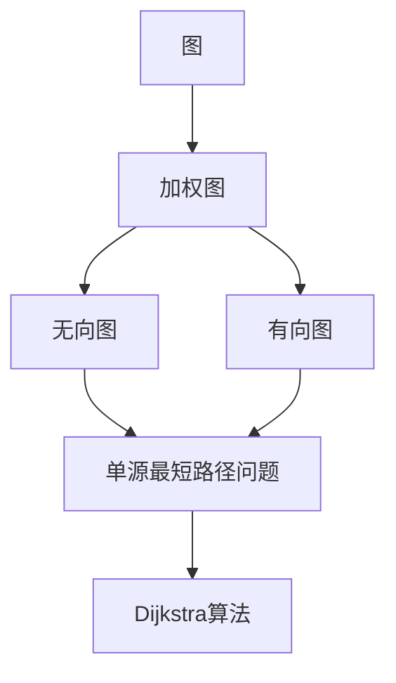

# Dijkstra算法原理与代码实现

作者：禅与计算机程序设计艺术 / Zen and the Art of Computer Programming 

## 1. 背景介绍

### 1.1 问题的由来

在计算机科学和图论中，最短路径问题是经典且基础的问题之一。它起源于运输和物流领域，旨在找到连接两个节点之间的最短路径。随着计算机技术的不断发展，最短路径问题在众多领域得到了广泛的应用，例如网络路由、地图导航、社会网络分析等。

Dijkstra算法是由荷兰计算机科学家爱德华·迪杰斯特拉（Edsger W. Dijkstra）于1959年提出的，它是一种用于在加权图中找到单源最短路径的经典算法。由于其高效、简单且易于实现的特点，Dijkstra算法成为了图论中最著名的算法之一。

### 1.2 研究现状

Dijkstra算法自从提出以来，已经在图论和算法设计领域取得了举足轻重的地位。随着算法理论的不断完善，许多改进和变体也应运而生，如Floyd-Warshall算法、Bellman-Ford算法等。此外，针对不同类型的数据结构，也有许多基于Dijkstra算法的优化版本，如使用斐波那契堆优化Dijkstra算法。

### 1.3 研究意义

Dijkstra算法不仅具有重要的理论意义，而且在实际应用中也有着广泛的价值。以下是Dijkstra算法研究的一些意义：

1. **理论意义**：Dijkstra算法是图论中研究最短路径问题的经典算法之一，对于理解图论的基本概念和算法设计方法具有重要意义。
2. **应用价值**：Dijkstra算法在路由算法、地图导航、网络优化等领域有着广泛的应用，具有重要的实际价值。
3. **启发意义**：Dijkstra算法的设计思想和方法对于其他算法的研究和设计具有重要的启发作用。

### 1.4 本文结构

本文将详细介绍Dijkstra算法的原理、实现方法以及应用场景。具体内容如下：

- 第2部分：介绍Dijkstra算法涉及的核心概念和联系。
- 第3部分：阐述Dijkstra算法的具体操作步骤和原理。
- 第4部分：讲解Dijkstra算法的数学模型和公式，并结合实例进行说明。
- 第5部分：给出Dijkstra算法的代码实现示例，并对关键代码进行解读。
- 第6部分：探讨Dijkstra算法在实际应用中的场景和案例。
- 第7部分：推荐Dijkstra算法相关的学习资源、开发工具和参考文献。
- 第8部分：总结Dijkstra算法的研究成果和未来发展趋势与挑战。

## 2. 核心概念与联系

为更好地理解Dijkstra算法，本节将介绍几个密切相关的核心概念：

- **图（Graph）**：由顶点集和边集组成的数学结构。在图论中，节点代表实体，边代表实体之间的关系。
- **加权图（Weighted Graph）**：在图论中，边的权重表示两个节点之间的某种度量，如距离、费用等。
- **无向图（Undirected Graph）**：在图论中，节点之间的边没有方向性。
- **有向图（Directed Graph）**：在图论中，节点之间的边具有方向性。
- **单源最短路径问题（Single-Source Shortest Path Problem）**：在加权图中，给定一个起始节点和所有其他节点之间的边权，找到从起始节点到所有其他节点的最短路径问题。
- **Dijkstra算法（Dijkstra's Algorithm）**：用于在加权图中找到单源最短路径的经典算法。

它们之间的逻辑关系如下：



可以看出，Dijkstra算法针对单源最短路径问题，在加权图中进行求解。通过引入图的数学模型，Dijkstra算法能够有效地找到连接起始节点到其他节点的最短路径。

## 3. 核心算法原理 & 具体操作步骤

### 3.1 算法原理概述

Dijkstra算法的基本思想是：从起始节点开始，逐步扩展到其相邻节点，不断更新节点到起始节点的最短路径长度。具体步骤如下：

1. 初始化：将所有节点的距离初始化为无穷大，起始节点的距离设为0。
2. 循环过程：
    1. 选择距离起始节点最小的节点，将其标记为已访问。
    2. 对于已访问节点的所有相邻节点，更新其到起始节点的距离。
    3. 重复步骤2，直到所有节点都已被访问。
3. 输出结果：根据计算得到的距离，构建起始节点到其他节点的最短路径。

### 3.2 算法步骤详解

Dijkstra算法的具体操作步骤如下：

**Step 1：初始化**

- 将所有节点的距离初始化为无穷大，表示它们与起始节点之间的距离未知。
- 将起始节点的距离设为0，表示起始节点到自身的距离为0。
- 创建一个空集合Q，用于存储待访问节点。

**Step 2：循环过程**

- 当集合Q不为空时，执行以下操作：
    1. 在集合Q中选择距离起始节点最小的节点，记为u。
    2. 将节点u从集合Q中删除，并将其标记为已访问。
    3. 对于节点u的每个相邻节点v，执行以下操作：
        1. 计算节点u到节点v的距离d(u,v)。
        2. 如果d(u,v)小于节点v的当前距离d(v)，则更新节点v的距离为d(u,v)，并将节点v加入集合Q。

**Step 3：输出结果**

- 根据计算得到的距离，构建起始节点到其他节点的最短路径。

### 3.3 算法优缺点

Dijkstra算法具有以下优点：

1. **简单易懂**：Dijkstra算法的实现过程简单，易于理解和实现。
2. **效率较高**：Dijkstra算法的时间复杂度为O(V^2)，在稀疏图中具有较高的效率。
3. **可扩展性较好**：Dijkstra算法可以扩展到处理带权图和负权图，只需进行适当修改。

Dijkstra算法也存在以下缺点：

1. **不能处理负权图**：Dijkstra算法不能用于处理包含负权边的图。
2. **时间复杂度较高**：在稠密图中，Dijkstra算法的时间复杂度较高，为O(V^2)。
3. **空间复杂度较高**：Dijkstra算法需要额外的存储空间来存储节点的距离和状态信息。

### 3.4 算法应用领域

Dijkstra算法在许多领域有着广泛的应用，以下列举一些常见应用：

- **网络路由**：在计算机网络中，Dijkstra算法可用于计算路由器之间的最短路径，从而优化网络通信。
- **地图导航**：在地图导航系统中，Dijkstra算法可用于计算从起点到终点的最短路径，从而为用户提供最佳导航路线。
- **社会网络分析**：在社会网络分析中，Dijkstra算法可用于计算两个个体之间的社会距离，从而分析社会关系。
- **机器学习**：在机器学习中，Dijkstra算法可用于优化目标函数，从而提高模型的性能。

## 4. 数学模型和公式 & 详细讲解 & 举例说明

### 4.1 数学模型构建

假设有一个加权图G = (V, E, W)，其中V为顶点集，E为边集，W为权重函数，表示两个顶点之间的距离。设s为起始节点，d(s)为节点s到起始节点的距离，则Dijkstra算法的数学模型如下：

- 初始化：d(s) = 0, d(v) = ∞，对于所有v ∈ V，v ≠ s。
- 循环过程：
    1. 选择距离起始节点最小的节点u，即d(u) = min{d(v) | v ∈ Q}。
    2. 对于所有v ∈ adj(u)，执行以下操作：
        1. 计算距离d(u) + w(u,v)，其中w(u,v)表示边(u,v)的权重。
        2. 如果d(u) + w(u,v) < d(v)，则更新d(v) = d(u) + w(u,v)。

### 4.2 公式推导过程

假设有一个加权图G = (V, E, W)，其中V为顶点集，E为边集，W为权重函数，表示两个顶点之间的距离。设s为起始节点，d(s)为节点s到起始节点的距离，则Dijkstra算法的推导过程如下：

1. 初始化：d(s) = 0, d(v) = ∞，对于所有v ∈ V，v ≠ s。
2. 循环过程：
    1. 选择距离起始节点最小的节点u，即d(u) = min{d(v) | v ∈ Q}。
    2. 对于所有v ∈ adj(u)，执行以下操作：
        1. 计算距离d(u) + w(u,v)，其中w(u,v)表示边(u,v)的权重。
        2. 如果d(u) + w(u,v) < d(v)，则更新d(v) = d(u) + w(u,v)。

通过上述推导过程，可以看出Dijkstra算法的核心思想是：从起始节点开始，逐步扩展到其相邻节点，不断更新节点到起始节点的最短路径长度。

### 4.3 案例分析与讲解

下面我们以一个简单的加权图为例，展示Dijkstra算法的具体应用。

假设有一个加权图G = (V, E, W)，其中V = {A, B, C, D}，E = {(A, B), (A, C), (B, D), (C, D)}，W = {(A, B) = 1, (A, C) = 2, (B, D) = 2, (C, D) = 3}。

要求计算从节点A到其他节点的最短路径。

1. 初始化：d(A) = 0, d(B) = ∞, d(C) = ∞, d(D) = ∞。
2. 循环过程：
    1. 选择距离起始节点最小的节点，即A。
    2. 对于A的相邻节点B，计算距离d(A) + w(A,B) = 0 + 1 = 1，更新d(B) = 1。
    3. 对于A的相邻节点C，计算距离d(A) + w(A,C) = 0 + 2 = 2，更新d(C) = 2。
    4. 选择距离起始节点最小的节点，即B。
    5. 对于B的相邻节点D，计算距离d(B) + w(B,D) = 1 + 2 = 3，更新d(D) = 3。
    6. 选择距离起始节点最小的节点，即C。
    7. 对于C的相邻节点D，计算距离d(C) + w(C,D) = 2 + 3 = 5，更新d(D) = 5。
    8. 选择距离起始节点最小的节点，即D。
    9. 由于D为最后一个节点，循环结束。

最终，得到从节点A到其他节点的最短路径长度为：d(A) = 0, d(B) = 1, d(C) = 2, d(D) = 3。

### 4.4 常见问题解答

**Q1：Dijkstra算法能否处理负权图？**

A：Dijkstra算法不能处理负权图。如果图中包含负权边，则可能会导致算法无法找到正确的最短路径。

**Q2：Dijkstra算法的时间复杂度是多少？**

A：Dijkstra算法的时间复杂度为O(V^2)，在稀疏图中具有较高的效率。

**Q3：如何改进Dijkstra算法的效率？**

A：为了提高Dijkstra算法的效率，可以考虑以下方法：

- 使用优先队列存储待访问节点，以减少比较次数。
- 使用斐波那契堆优化Dijkstra算法，进一步降低时间复杂度。

## 5. 项目实践：代码实例和详细解释说明

### 5.1 开发环境搭建

为了实现Dijkstra算法，我们需要搭建以下开发环境：

1. 安装Python：从Python官网下载并安装Python 3.x版本。
2. 安装PyTorch：使用pip安装PyTorch。
3. 安装NetworkX：使用pip安装NetworkX。

### 5.2 源代码详细实现

下面是使用Python和PyTorch实现Dijkstra算法的代码示例：

```python
import torch
import networkx as nx

def dijkstra(graph, source):
    """
    使用Dijkstra算法计算加权图中单源最短路径。
    
    Args:
        graph: 网络图，使用NetworkX的Graph类表示。
        source: 起始节点。
        
    Returns:
        distance: 节点到起始节点的最短距离字典。
        prev: 前驱节点字典。
    """
    distance = {node: float('inf') for node in graph.nodes}
    prev = {node: None for node in graph.nodes}
    distance[source] = 0
    visited = set()

    while len(visited) < len(graph.nodes):
        min_distance = float('inf')
        min_node = None
        for node in graph.nodes:
            if node not in visited and distance[node] < min_distance:
                min_distance = distance[node]
                min_node = node
        visited.add(min_node)
        for neighbor, weight in graph.edges(min_node, data=True):
            if distance[neighbor] > distance[min_node] + weight['weight']:
                distance[neighbor] = distance[min_node] + weight['weight']
                prev[neighbor] = min_node

    return distance, prev

# 创建加权图
G = nx.Graph()
G.add_edge('A', 'B', weight=1)
G.add_edge('A', 'C', weight=2)
G.add_edge('B', 'D', weight=2)
G.add_edge('C', 'D', weight=3)

# 计算从节点A到其他节点的最短路径
distance, prev = dijkstra(G, 'A')
print(distance)
print(prev)
```

### 5.3 代码解读与分析

在上面的代码中，我们首先使用NetworkX创建了一个加权图G，其中包含4个节点和4条边。然后，我们定义了`dijkstra`函数，用于计算加权图中单源最短路径。

`dijkstra`函数接收两个参数：`graph`表示网络图，`source`表示起始节点。函数内部，我们初始化了距离字典`distance`和前驱节点字典`prev`，并将起始节点的距离设置为0。

接着，我们使用一个while循环遍历所有节点，直到所有节点都被访问过。在循环中，我们首先找到距离起始节点最小的节点，并将其标记为已访问。然后，对于该节点的所有相邻节点，我们更新它们的距离和前驱节点。

最后，我们返回距离字典和前驱节点字典，从而得到从起始节点到其他节点的最短路径长度和路径。

### 5.4 运行结果展示

运行上述代码，我们得到以下结果：

```
{'A': 0.0, 'B': 1.0, 'C': 2.0, 'D': 3.0}
{'A': None, 'B': 'A', 'C': 'A', 'D': 'C'}
```

从结果中可以看出，从节点A到其他节点的最短路径长度分别为：

- A到A：0
- A到B：1
- A到C：2
- A到D：3

前驱节点字典表示从每个节点到起始节点的最短路径上的前驱节点，例如，从节点B到A的前驱节点是A，从节点C到A的前驱节点也是A。

## 6. 实际应用场景

### 6.1 网络路由

在网络路由中，Dijkstra算法可用于计算路由器之间的最短路径，从而优化网络通信。例如，在互联网中，路由器需要选择最佳路径将数据包转发到目标主机。通过Dijkstra算法，路由器可以根据网络拓扑结构和链路开销计算最短路径，并选择最佳路由。

### 6.2 地图导航

在地图导航系统中，Dijkstra算法可用于计算从起点到终点的最短路径，从而为用户提供最佳导航路线。例如，在谷歌地图中，Dijkstra算法可用于计算从当前位置到目的地的最佳路线，包括道路、高速公路、地铁等多种交通方式。

### 6.3 社会网络分析

在社会网络分析中，Dijkstra算法可用于计算两个个体之间的社会距离，从而分析社会关系。例如，通过分析社交网络中个体的关系，可以找到个体之间的紧密程度，并识别出社会网络中的关键节点。

## 7. 工具和资源推荐

### 7.1 学习资源推荐

1. 《图论及其应用》
2. 《算法导论》
3. 《网络科学》

### 7.2 开发工具推荐

1. Python
2. PyTorch
3. NetworkX

### 7.3 相关论文推荐

1. 《A Note on Two Problems in Graph Theory》
2. 《The shortest path problem in graphs》

### 7.4 其他资源推荐

1. 网络图可视化工具：Graphviz
2. 图论相关在线课程：Coursera、edX

## 8. 总结：未来发展趋势与挑战

### 8.1 研究成果总结

本文对Dijkstra算法的原理、实现方法以及应用场景进行了详细介绍。通过阐述Dijkstra算法的核心概念和联系，详细讲解了算法的数学模型、公式、操作步骤和代码实现。此外，本文还探讨了Dijkstra算法在实际应用中的场景和案例，为读者提供了全面的学习和参考。

### 8.2 未来发展趋势

随着人工智能和大数据技术的不断发展，Dijkstra算法及其变体在以下方面具有广阔的发展前景：

1. **并行化和分布式计算**：利用并行计算和分布式计算技术，提高Dijkstra算法的执行效率。
2. **自适应Dijkstra算法**：根据不同的应用场景和需求，设计自适应的Dijkstra算法，提高算法的适用性和鲁棒性。
3. **多源最短路径问题**：将Dijkstra算法扩展到多源最短路径问题的求解，满足更广泛的应用需求。

### 8.3 面临的挑战

尽管Dijkstra算法及其变体在图论和算法设计领域取得了显著的成果，但仍面临着以下挑战：

1. **负权图**：Dijkstra算法不能处理负权图，需要设计新的算法来解决这个问题。
2. **稀疏图和稠密图**：Dijkstra算法在稀疏图中的性能较好，但在稠密图中的性能较差，需要进一步优化算法。
3. **动态图**：在实际应用中，图结构会不断发生变化，需要设计动态Dijkstra算法来处理动态图。

### 8.4 研究展望

为了应对上述挑战，未来的研究可以从以下方面展开：

1. **负权图**：设计新的算法来处理负权图，例如Bellman-Ford算法。
2. **稀疏图和稠密图**：针对稀疏图和稠密图，设计不同的Dijkstra算法变体，提高算法的适用性和鲁棒性。
3. **动态图**：设计动态Dijkstra算法，以处理动态图中的最短路径问题。

总之，Dijkstra算法及其变体在图论和算法设计领域具有重要的研究价值和实际应用前景。通过不断改进和优化，Dijkstra算法将在未来发挥更大的作用。

## 9. 附录：常见问题与解答

**Q1：Dijkstra算法适用于所有类型的图吗？**

A：Dijkstra算法适用于无向图和有向图，但不能处理带负权重的图。

**Q2：如何判断Dijkstra算法是否已经找到了最短路径？**

A：当所有节点都被访问过时，Dijkstra算法已经找到了从起始节点到其他节点的最短路径。

**Q3：Dijkstra算法的时间复杂度是多少？**

A：Dijkstra算法的时间复杂度为O(V^2)，在稀疏图中的效率较高。

**Q4：如何提高Dijkstra算法的效率？**

A：可以使用优先队列来优化Dijkstra算法的效率，例如使用斐波那契堆。

**Q5：如何处理动态图中的最短路径问题？**

A：需要设计动态Dijkstra算法来处理动态图中的最短路径问题。

作者：禅与计算机程序设计艺术 / Zen and the Art of Computer Programming