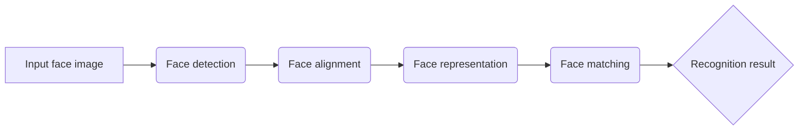

# Face Recognition原理与代码实例讲解

## 1. 背景介绍
### 1.1  问题的由来
人脸识别是计算机视觉和人工智能领域的一个重要研究课题。随着社会的发展和技术的进步,人脸识别技术在安防、金融、社交等诸多领域得到了广泛应用。传统的身份认证方式,如密码、指纹等存在易被破解、伪造的风险,而人脸识别以其独特性、非接触性、用户友好性的优势脱颖而出。
### 1.2  研究现状
近年来,深度学习的兴起极大地推动了人脸识别技术的发展。从早期的基于几何特征的方法,到基于表象的方法,再到如今基于深度学习的方法,人脸识别的准确率不断提升。尤其是卷积神经网络(CNN)在人脸检测、对齐、特征提取等方面表现出色,使得人脸识别系统的性能大幅提升。目前,人脸识别已经在手机解锁、人证合一、刷脸支付等场景得到广泛应用。
### 1.3  研究意义 
尽管人脸识别取得了长足进展,但在非约束环境下的识别、抗欺骗、跨年龄跨域识别等方面仍面临挑战。深入研究人脸识别的原理和算法,对于提升系统的鲁棒性和泛化能力具有重要意义。此外,探索人脸识别与其他生物识别技术的融合,有助于构建更加可靠、安全的身份认证体系。因此,人脸识别仍是计算机视觉领域的研究热点和前沿方向。
### 1.4  本文结构
本文将全面介绍人脸识别的原理、流程和代码实现。第2部分阐述人脸识别的核心概念;第3部分详细讲解人脸识别的核心算法原理和步骤;第4部分建立人脸识别的数学模型并给出公式推导;第5部分提供人脸识别的代码实例和解读;第6部分分析人脸识别的应用场景;第7部分推荐相关工具和资源;第8部分总结全文并展望未来;第9部分为常见问题解答。

## 2. 核心概念与联系
人脸识别涉及几个核心概念:人脸检测(face detection)、人脸对齐(face alignment)、人脸表征/特征提取(face representation/feature extraction)、人脸比对(face matching)。它们的关系如下:



- 人脸检测:给定一张图像,判断其中是否存在人脸,并确定人脸的位置和大小。常用方法有Haar特征+AdaBoost、HOG+SVM、MTCNN等。
- 人脸对齐:对检测到的人脸进行归一化,使其达到预定的大小和姿态。常用方法有AAM、SDM等。
- 人脸表征:提取人脸的判别特征,用一个紧致的特征向量来表示人脸。常用方法有PCA、LBP、CNN等。
- 人脸比对:计算两个人脸特征向量之间的相似度,判断是否属于同一个人。常用方法有欧氏距离、余弦相似度等。

## 3. 核心算法原理 & 具体操作步骤
### 3.1  算法原理概述
本文采用MTCNN进行人脸检测和对齐,使用FaceNet进行特征提取和比对。
- MTCNN(Multi-task Cascaded Convolutional Networks)由3个级联的CNN组成,分别完成候选区域提取(Proposal Network, P-Net)、候选区域精炼(Refine Network, R-Net)和输出(Output Network, O-Net)。通过多任务联合学习,同时完成人脸分类、边界框回归和关键点定位。
- FaceNet使用深层CNN将人脸图像映射到欧氏空间的紧致特征向量(face embedding),使得同一个人的人脸映射到相近的位置,不同人的人脸映射到相距较远的位置。通过triplet loss的度量学习,优化人脸特征在判别性和泛化性之间的平衡。
### 3.2  算法步骤详解
1. 人脸检测与对齐(MTCNN)
   - 图像金字塔:将原始图像缩放到不同尺度,构建图像金字塔。
   - P-Net:在各个尺度上使用全卷积网络提取候选区域,通过边界框回归和非极大值抑制(NMS)去除重叠候选框。
   - R-Net:对P-Net输出的候选框进一步提取特征,通过边界框回归和NMS去除false positive。
   - O-Net:在R-Net的基础上细化候选框,输出五个关键点坐标,完成对齐。
2. 人脸表征(FaceNet) 
   - 使用预训练的InceptionResNet-v1提取人脸的512维特征向量。
   - 通过L2归一化将特征向量投影到单位超球面上。
3. 人脸比对
   - 计算两个特征向量之间的欧氏距离。
   - 设定一个阈值,距离小于阈值则认为是同一个人,否则是不同的人。

### 3.3  算法优缺点
优点:
- MTCNN可以同时处理人脸检测和对齐,准确率高、实时性好。
- FaceNet学习到的人脸特征具有很好的判别性和泛化性,可以胜任大规模人脸识别任务。
- 端到端的学习方式,无需人工设计特征,特征学习与识别任务紧密结合。

缺点:  
- MTCNN对于侧脸、遮挡、模糊等情况的检测效果有待提升。
- FaceNet对姿态、年龄、光照等变化的鲁棒性有待加强。
- 深度学习方法需要大量标注数据进行训练,数据的获取和标注成本高。

### 3.4  算法应用领域
人脸识别算法可应用于:
- 安防监控:嫌疑人追踪、人员布控。
- 手机解锁:以人脸作为身份验证手段。  
- 考勤签到:通过人脸识别实现无感考勤。
- 人证合一:机场、火车站等人脸识别+身份证比对。
- 互联网应用:社交美颜、照片分类等。

## 4. 数学模型和公式 & 详细讲解 & 举例说明
### 4.1  数学模型构建
设训练集为 $D=\{(x_i,y_i)\}_{i=1}^N$,其中 $x_i$ 为人脸图像, $y_i$ 为人脸身份标签。定义三元组 $(x_i^a,x_i^p,x_i^n)$,其中 $x_i^a$ (anchor)、$x_i^p$ (positive)属于同一个人, $x_i^n$ (negative)属于不同的人。

FaceNet的目标是学习一个人脸特征提取器 $f(x)$,使得同一个人的特征之间的距离小于不同人的特征之间的距离。定义triplet loss如下:

$$L=\sum_{i=1}^N \left[||f(x_i^a)-f(x_i^p)||_2^2 - ||f(x_i^a)-f(x_i^n)||_2^2 + \alpha \right]_+$$

其中 $\alpha$ 为超参数,用于控制正负样本对之间的间隔。$[z]_+ = max(z,0)$ 为hinge loss。

### 4.2  公式推导过程
对于triplet $(x_i^a,x_i^p,x_i^n)$,令:

$$d(x_i^a,x_i^p)=||f(x_i^a)-f(x_i^p)||_2^2$$
$$d(x_i^a,x_i^n)=||f(x_i^a)-f(x_i^n)||_2^2$$

则triplet loss可写为:

$$L=\sum_{i=1}^N \left[d(x_i^a,x_i^p) - d(x_i^a,x_i^n) + \alpha \right]_+$$

展开可得:

$$\begin{aligned}
L &= \sum_{i=1}^N \left[||f(x_i^a)-f(x_i^p)||_2^2 - ||f(x_i^a)-f(x_i^n)||_2^2 + \alpha \right]_+ \\
&= \sum_{i=1}^N \left[||f(x_i^a)||_2^2-2f(x_i^a)^Tf(x_i^p)+||f(x_i^p)||_2^2 \\
&\quad - ||f(x_i^a)||_2^2+2f(x_i^a)^Tf(x_i^n)-||f(x_i^n)||_2^2 + \alpha \right]_+ \\
&= \sum_{i=1}^N \left[2f(x_i^a)^T(f(x_i^n)-f(x_i^p))+||f(x_i^p)||_2^2-||f(x_i^n)||_2^2 + \alpha \right]_+
\end{aligned}$$

可见,最小化triplet loss,即最大化 $f(x_i^a)$ 与 $f(x_i^p)$ 的内积,最小化 $f(x_i^a)$ 与 $f(x_i^n)$ 的内积,同时拉大正负样本对的特征模长差。

### 4.3  案例分析与讲解
以人脸验证(face verification)任务为例。给定一个人脸库 $\{x_i\}_{i=1}^M$ 和一个待验证人脸 $\hat{x}$,人脸验证就是判断 $\hat{x}$ 是否属于人脸库中的某个人。

使用FaceNet提取特征,得到 $\{f(x_i)\}_{i=1}^M$ 和 $f(\hat{x})$。计算 $f(\hat{x})$ 与 $\{f(x_i)\}_{i=1}^M$ 中每一个特征向量的欧氏距离 $d_i=||f(\hat{x})-f(x_i)||_2$,找出最小距离 $d_{min}=\min_i d_i$。设定一个阈值 $\theta$,若 $d_{min}<\theta$,则认为 $\hat{x}$ 属于人脸库中的某个人,否则认为是未知人脸。

例如,假设阈值 $\theta=0.8$,待验证人脸与人脸库中3个人的特征距离分别为0.5、1.2、0.9,则 $d_{min}=0.5<\theta$,可以判定待验证人脸属于第1个人。

### 4.4  常见问题解答
Q: FaceNet的优势是什么?
A: FaceNet通过端到端的深度学习,直接学习人脸图像到紧致特征向量的映射,避免了人工设计特征的繁琐。使用triplet loss加强了特征的判别性,同时具有较好的泛化能力。

Q: FaceNet的缺点是什么?
A: FaceNet需要大量的人脸数据和标注信息进行训练,对数据规模和质量要求较高。此外,模型较为复杂,训练时间长,调参难度大。

Q: 如何选择triplet loss中的 $\alpha$ 值?
A: $\alpha$ 用于控制正负样本对之间的间隔,较大的 $\alpha$ 有利于提升特征的判别性,但可能影响收敛速度和泛化性能。一般可选择0.2~0.5之间的值,需要根据具体任务和数据集进行调优。

Q: 除了triplet loss,还有哪些常用的度量学习方法?
A: 常见的度量学习方法还有:
- Contrastive loss: 学习特征,使得相似样本的特征距离小于不相似样本的特征距离。
- Center loss: 最小化类内特征距离,最大化类间特征距离。
- Angular loss: 直接优化特征之间的角度关系,避免了传统欧氏距离的缺陷。

## 5. 项目实践：代码实例和详细解释说明
### 5.1  开发环境搭建
- 操作系统: Ubuntu 16.04
- 深度学习框架: TensorFlow 1.14
- 主要依赖库: NumPy, SciPy, OpenCV, Matplotlib

### 5.2  源代码详细实现
```python
import tensorflow as tf
import numpy as np
import cv2
from scipy import misc
import os

# 加载MTCNN模型
def load_mtcnn(model_path):
    # 构建P-Net, R-Net, O-Net
    pnet = ...
    rnet = ...
    onet = ...
    return pnet, rnet, onet

# 使用MTCNN检测和对齐人脸
def align