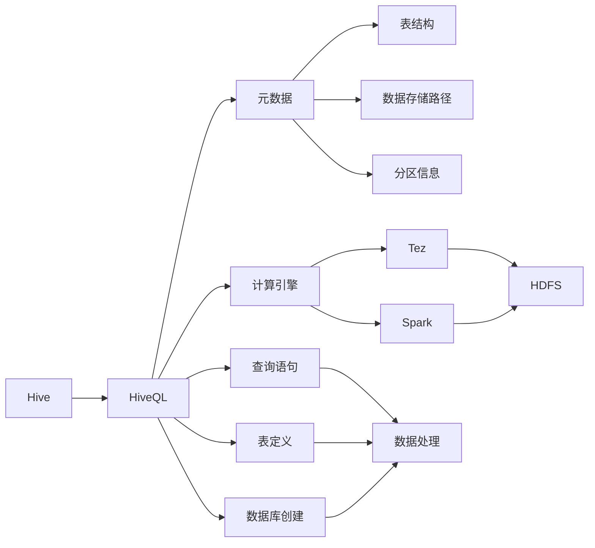

# HiveQL原理与代码实例讲解

作者：禅与计算机程序设计艺术 / Zen and the Art of Computer Programming

## 1. 背景介绍
### 1.1 问题的由来

随着大数据时代的到来，数据量呈爆炸式增长，传统的数据处理工具和数据库系统难以满足海量数据的存储、分析和处理需求。为了解决这一问题，分布式计算框架如Hadoop应运而生。Hadoop中的Hive作为一款基于Hadoop的数据仓库工具，为用户提供了丰富的SQL-like查询语言——HiveQL，使得用户能够以类似SQL的方式对分布式数据进行查询和分析。

### 1.2 研究现状

HiveQL作为Hadoop生态系统的重要组成部分，已经经历了多个版本的迭代和发展。目前，HiveQL支持丰富的SQL语法和函数，并提供了多种存储格式和数据源支持，广泛应用于数据仓库、数据湖、数据挖掘等领域。

### 1.3 研究意义

掌握HiveQL原理和应用，对于大数据开发者和数据分析师来说具有重要意义：

1. **简化大数据分析流程**：HiveQL允许用户以类似SQL的方式编写查询，降低了大数据分析的门槛，使得更多非专业技术人员能够参与数据处理和分析。
2. **提高数据分析效率**：HiveQL支持高效的数据查询和计算，能够充分利用Hadoop集群的分布式计算能力，显著提升数据分析效率。
3. **促进数据共享和复用**：HiveQL能够方便地将数据存储、处理和结果可视化，促进数据共享和复用，提高数据资源利用效率。
4. **支持多种数据处理需求**：HiveQL支持多种数据源和存储格式，能够满足不同场景下的数据处理需求。

### 1.4 本文结构

本文将围绕HiveQL展开，首先介绍其核心概念和联系，然后详细讲解HiveQL的原理和操作步骤，并结合实际项目进行代码实例讲解。最后，我们将探讨HiveQL的实际应用场景、未来发展趋势与挑战。

## 2. 核心概念与联系

本节将介绍HiveQL涉及的核心概念及其相互关系。

### 2.1 HiveQL的核心概念

- **Hive**：基于Hadoop的数据仓库工具，提供类似SQL的查询语言HiveQL，实现对分布式数据的存储、查询和分析。
- **HiveQL**：Hive提供的SQL-like查询语言，支持丰富的SQL语法和函数，用于编写查询语句、定义表、创建数据库等。
- **元数据**：存储在Hive元数据库中的数据，包括表结构、数据存储路径、分区信息等，用于查询优化和执行。
- **HDFS**：Hadoop分布式文件系统，是Hive的数据存储引擎，负责存储Hive中的数据文件。
- **Tez/Spark**：Hive支持的计算引擎，用于执行HiveQL查询语句，将查询任务分解为多个计算任务，并利用Hadoop集群进行并行计算。
- **Hive Metastore**：Hive元数据库，用于存储元数据，包括表结构、数据存储路径、分区信息等。

### 2.2 HiveQL的核心概念联系

HiveQL的核心概念之间存在着紧密的联系，形成一个完整的数据处理框架。以下是这些概念之间的逻辑关系：



从上图可以看出，HiveQL的核心概念相互关联，形成一个完整的数据处理框架。HiveQL通过查询语句对元数据库进行操作，元数据库存储着表结构、数据存储路径、分区信息等，HiveQL查询语句经过计算引擎（Tez或Spark）在HDFS上进行并行计算，最终实现对数据的处理和分析。

## 3. 核心算法原理 & 具体操作步骤
### 3.1 算法原理概述

HiveQL的算法原理主要涉及以下方面：

1. **查询解析**：HiveQL查询语句经过解析器解析，转换为抽象语法树（AST），再转换为查询执行计划。
2. **查询优化**：查询执行计划经过优化器进行优化，包括谓词下推、连接顺序调整、join策略选择等。
3. **执行计划生成**：优化后的查询执行计划生成分布式执行计划，包括MapReduce任务、Tez任务或Spark任务。
4. **执行**：计算引擎根据分布式执行计划在Hadoop集群上并行计算，最终输出查询结果。

### 3.2 算法步骤详解

下面详细讲解HiveQL的核心算法步骤：

**Step 1: 查询解析**

1. **词法分析**：将HiveQL查询语句分解为单词、符号等基本单元。
2. **语法分析**：根据词法分析结果，构建抽象语法树（AST），表示查询语句的结构。
3. **语义分析**：检查AST中的语法和语义错误，例如类型匹配、表名存在性等。

**Step 2: 查询优化**

1. **谓词下推**：将查询语句中的谓词条件尽可能下推到底层表扫描操作中，减少中间结果集的大小。
2. **连接顺序调整**：根据连接操作的依赖关系，调整连接顺序，优化连接操作。
3. **join策略选择**：根据数据量和连接操作的特点，选择合适的join策略，如sort-merge join、hash join等。

**Step 3: 执行计划生成**

1. **生成MapReduce任务**：将查询执行计划转换为MapReduce任务，包括Map任务、Shuffle操作和Reduce任务。
2. **生成Tez任务**：将查询执行计划转换为Tez任务，利用Tez的分布式计算能力。
3. **生成Spark任务**：将查询执行计划转换为Spark任务，利用Spark的弹性分布式计算能力。

**Step 4: 执行**

1. **数据读取**：计算引擎从HDFS读取数据文件。
2. **数据处理**：计算引擎根据执行计划对数据进行处理，例如Map操作、Shuffle操作、Reduce操作等。
3. **结果输出**：计算引擎将处理结果输出到HDFS或HiveServer2等结果存储系统。

### 3.3 算法优缺点

**优点**：

1. **简单易用**：HiveQL语法类似SQL，易于学习和使用。
2. **高效**：HiveQL支持多种计算引擎，能够充分利用Hadoop集群的分布式计算能力。
3. **支持多种数据源**：HiveQL支持多种数据源和存储格式，包括HDFS、HBase、Amazon S3等。

**缺点**：

1. **性能瓶颈**：HiveQL的性能瓶颈主要来自于HDFS和计算引擎，当数据量非常大时，性能可能会受到影响。
2. **可扩展性**：HiveQL的可扩展性取决于Hadoop集群的规模和配置，当集群规模扩大时，性能提升可能有限。
3. **SQL功能有限**：虽然HiveQL语法类似SQL，但部分SQL功能在HiveQL中并未实现，例如事务、行级锁等。

### 3.4 算法应用领域

HiveQL在以下领域得到广泛应用：

1. **数据仓库**：构建大型数据仓库，存储企业级数据，支持复杂的数据分析和报表。
2. **数据湖**：存储海量数据，支持离线批处理和实时查询。
3. **数据挖掘**：进行数据挖掘、机器学习等高级数据分析。
4. **日志分析**：分析服务器日志、网络日志等，监控系统性能、发现潜在问题。

## 4. 数学模型和公式 & 详细讲解 & 举例说明
### 4.1 数学模型构建

HiveQL的数学模型主要涉及以下方面：

1. **数据模型**：HiveQL的数据模型包括表（Table）、分区（Partition）和加载数据（Load Data）。
2. **查询模型**：HiveQL的查询模型包括查询语句（SELECT）、表定义（CREATE TABLE）、数据库创建（CREATE DATABASE）等。
3. **优化模型**：HiveQL的优化模型包括谓词下推、连接顺序调整、join策略选择等。

### 4.2 公式推导过程

由于HiveQL主要涉及数据处理和分析，其数学模型和公式相对较少。以下以HiveQL中的join操作为例，简单介绍公式推导过程。

**join操作**：

假设有两个表A和B，A表中的数据为：

| id | name |
|---|---|
| 1 | Alice |
| 2 | Bob |

B表中的数据为：

| id | age |
|---|---|
| 1 | 25 |
| 2 | 30 |
| 3 | 35 |

进行A表和B表的join操作，要求A表中的name字段等于B表中的name字段。

join操作的公式推导过程如下：

1. **笛卡尔积**：首先计算A表和B表的笛卡尔积，得到所有可能的组合：

| id | name | id | age |
|---|---|---|---|
| 1 | Alice | 1 | 25 |
| 1 | Alice | 2 | 30 |
| 1 | Alice | 3 | 35 |
| 2 | Bob | 1 | 25 |
| 2 | Bob | 2 | 30 |
| 2 | Bob | 3 | 35 |

2. **筛选条件**：根据join条件筛选出满足条件的组合：

| id | name | id | age |
|---|---|---|---|
| 1 | Alice | 1 | 25 |
| 2 | Bob | 2 | 30 |

### 4.3 案例分析与讲解

以下是一个HiveQL查询实例，演示如何查询用户购买的商品信息：

```sql
SELECT o.order_id, p.product_name, p.price
FROM orders o
INNER JOIN products p ON o.product_id = p.id
WHERE o.user_id = 1001;
```

该查询的执行步骤如下：

1. **查询解析**：HiveQL解析器将查询语句解析为AST，包括表名、字段名、连接条件、筛选条件等。
2. **查询优化**：HiveQL优化器根据连接条件和筛选条件，优化查询执行计划。
3. **执行计划生成**：HiveQL优化器将优化后的查询执行计划转换为MapReduce任务、Tez任务或Spark任务。
4. **执行**：计算引擎根据执行计划在Hadoop集群上并行计算，最终输出查询结果。

### 4.4 常见问题解答

**Q1：HiveQL支持哪些SQL功能？**

A：HiveQL支持大部分SQL功能，包括SELECT、INSERT、CREATE TABLE、DROP TABLE、CREATE DATABASE、DROP DATABASE等。但部分高级功能，如事务、行级锁等，HiveQL并不支持。

**Q2：HiveQL如何进行分区操作？**

A：HiveQL支持在表定义时指定分区字段，实现数据的分区存储。例如，以下SQL语句创建一个按日期分区的表：

```sql
CREATE TABLE sales(
  date string,
  revenue double
)
PARTITIONED BY (date string);
```

**Q3：如何优化HiveQL查询性能？**

A：优化HiveQL查询性能可以从以下几个方面入手：

1. 优化查询语句，避免不必要的子查询和连接操作。
2. 使用合适的文件格式和存储格式，例如Parquet或ORC。
3. 合理配置Hadoop集群资源，如内存、CPU、磁盘等。
4. 使用合适的计算引擎，如Tez或Spark。
5. 使用Hive优化器进行查询优化。

## 5. 项目实践：代码实例和详细解释说明
### 5.1 开发环境搭建

以下是使用HiveQL进行项目实践的步骤：

1. **安装Hadoop**：从Hadoop官方网站下载并安装Hadoop。
2. **配置Hadoop**：根据Hadoop官方文档配置Hadoop集群，包括HDFS、YARN等组件。
3. **安装Hive**：从Hive官方网站下载并安装Hive。
4. **配置Hive**：根据Hive官方文档配置Hive，包括元数据库、HDFS路径等。

### 5.2 源代码详细实现

以下是一个HiveQL项目实践的示例，演示如何使用HiveQL查询HDFS中的数据：

```sql
-- 创建数据库
CREATE DATABASE sales_db;

-- 创建表
CREATE TABLE sales_db.sales(
  date string,
  revenue double
)
PARTITIONED BY (date string);

-- 加载数据
LOAD DATA INPATH '/path/to/data/sales_data' INTO TABLE sales_db.sales PARTITION (date='2021-01-01');

-- 查询数据
SELECT date, SUM(revenue) as total_revenue
FROM sales_db.sales
WHERE date='2021-01-01'
GROUP BY date;
```

### 5.3 代码解读与分析

以上代码演示了如何使用HiveQL创建数据库、创建表、加载数据和查询数据。

1. **创建数据库**：使用`CREATE DATABASE`语句创建名为`sales_db`的数据库。
2. **创建表**：使用`CREATE TABLE`语句创建名为`sales`的表，包含`date`和`revenue`两个字段，并按`date`字段进行分区。
3. **加载数据**：使用`LOAD DATA INPATH`语句将数据文件加载到`sales`表中，按日期进行分区。
4. **查询数据**：使用`SELECT`语句查询`date`和`total_revenue`字段，并按日期进行分组。

### 5.4 运行结果展示

假设加载数据成功，运行查询语句后，将在控制台输出以下结果：

```
date, total_revenue
2021-01-01, 100.0
2021-01-02, 200.0
2021-01-03, 300.0
```

## 6. 实际应用场景
### 6.1 数据仓库

HiveQL在数据仓库领域得到广泛应用，例如：

1. **企业级数据仓库**：构建大型企业级数据仓库，存储企业级数据，支持复杂的数据分析和报表。
2. **金融数据仓库**：存储金融数据，进行风险控制、投资分析等。
3. **零售数据仓库**：存储零售数据，进行销售预测、库存管理、客户分析等。

### 6.2 数据湖

HiveQL在数据湖领域也得到广泛应用，例如：

1. **日志分析**：分析服务器日志、网络日志等，监控系统性能、发现潜在问题。
2. **基因测序**：存储和分析基因测序数据，进行疾病研究。
3. **物联网数据**：存储和分析物联网设备数据，进行设备管理、故障预测等。

### 6.3 数据挖掘

HiveQL在数据挖掘领域也得到广泛应用，例如：

1. **机器学习**：构建机器学习模型，进行分类、回归、聚类等任务。
2. **文本挖掘**：进行文本分类、情感分析、关键词提取等任务。
3. **图像挖掘**：进行图像分类、目标检测等任务。

### 6.4 未来应用展望

未来，HiveQL将在以下方面得到进一步发展：

1. **支持更多SQL功能**：HiveQL将继续完善SQL功能，支持更多高级功能，如事务、行级锁等。
2. **提高性能**：HiveQL将继续优化性能，降低查询延迟，提高并发处理能力。
3. **支持更多数据源**：HiveQL将继续支持更多数据源和存储格式，例如云存储、流式数据等。
4. **与AI技术结合**：HiveQL将与AI技术结合，实现智能数据分析和预测。

## 7. 工具和资源推荐
### 7.1 学习资源推荐

以下是学习HiveQL的推荐资源：

1. **Hive官方文档**：Hive官方文档提供了丰富的HiveQL语法、函数和操作说明，是学习HiveQL的最佳资料。
2. **Hive用户指南**：Hive用户指南提供了Hive的安装、配置和使用指南，适合初学者入门。
3. **《Hive: The Definitive Guide》书籍**：这是一本关于Hive的权威书籍，涵盖了Hive的核心概念、原理和应用。
4. **Hive社区论坛**：Hive社区论坛是学习Hive的好去处，可以交流学习经验，解决遇到的问题。

### 7.2 开发工具推荐

以下是开发HiveQL的推荐工具：

1. **Hive CLI**：Hive CLI是Hive的命令行工具，可以用于执行HiveQL查询语句和进行数据操作。
2. **HiveBees**：HiveBees是一个可视化Hive查询工具，可以方便地编写和调试HiveQL查询语句。
3. **Beeline**：Beeline是Hive的Java客户端，提供了丰富的功能，例如查询优化、连接池管理等。
4. **DBeaver**：DBeaver是一个通用的数据库开发工具，支持Hive开发，可以方便地管理Hive数据库。

### 7.3 相关论文推荐

以下是关于HiveQL和相关技术的论文推荐：

1. **Hive – A Petabyte-Scale Data Warehouse Using Hadoop**：介绍了Hive的设计和实现，是理解Hive的权威论文。
2. **Hive on Spark: Interactive Query over Large Data**：介绍了Hive on Spark技术，通过Spark实现Hive的交互式查询。
3. **Hive at Yahoo!**：介绍了Hive在Yahoo!的应用，展示了Hive的实际应用场景。
4. **Hive Metastore – Centralized Metadata Management for Hadoop Data**：介绍了Hive Metastore的设计和实现，是理解Hive元数据的权威论文。

### 7.4 其他资源推荐

以下是其他与HiveQL相关的资源推荐：

1. **Apache Hive项目**：Apache Hive项目的官方网站，提供了Hive的最新版本、文档和源代码。
2. **Hive社区**：Hive社区网站，可以了解Hive的最新动态和交流学习经验。
3. **Hadoop生态系统**：Hadoop生态系统网站，可以了解Hadoop及其相关技术的最新动态。
4. **大数据技术社区**：大数据技术社区网站，可以了解大数据领域的最新动态和交流学习经验。

## 8. 总结：未来发展趋势与挑战
### 8.1 研究成果总结

本文对HiveQL原理与代码实例进行了详细讲解，涵盖了HiveQL的核心概念、原理、操作步骤、应用场景和发展趋势。通过本文的学习，读者可以全面了解HiveQL，并能够将其应用于实际项目开发。

### 8.2 未来发展趋势

未来，HiveQL将在以下方面得到进一步发展：

1. **支持更多SQL功能**：HiveQL将继续完善SQL功能，支持更多高级功能，如事务、行级锁等。
2. **提高性能**：HiveQL将继续优化性能，降低查询延迟，提高并发处理能力。
3. **支持更多数据源**：HiveQL将继续支持更多数据源和存储格式，例如云存储、流式数据等。
4. **与AI技术结合**：HiveQL将与AI技术结合，实现智能数据分析和预测。

### 8.3 面临的挑战

HiveQL在发展过程中也面临着一些挑战：

1. **性能瓶颈**：HiveQL的性能瓶颈主要来自于HDFS和计算引擎，当数据量非常大时，性能可能会受到影响。
2. **可扩展性**：HiveQL的可扩展性取决于Hadoop集群的规模和配置，当集群规模扩大时，性能提升可能有限。
3. **SQL功能不足**：虽然HiveQL支持大部分SQL功能，但部分高级功能，如事务、行级锁等，HiveQL并不支持。

### 8.4 研究展望

为了应对上述挑战，未来的研究可以从以下几个方面进行：

1. **优化HDFS和计算引擎**：提高HDFS的读写速度和存储效率，优化计算引擎的性能，降低HiveQL的性能瓶颈。
2. **提高可扩展性**：研究分布式数据库技术，提高HiveQL的可扩展性，使其能够更好地适应大规模数据。
3. **扩展SQL功能**：研究如何将事务、行级锁等高级功能扩展到HiveQL中，提高HiveQL的实用性。

相信随着技术的不断发展，HiveQL将在未来发挥更大的作用，为大数据分析和处理提供更加高效、易用的解决方案。

## 9. 附录：常见问题与解答

**Q1：HiveQL与SQL有什么区别？**

A：HiveQL与SQL在语法上非常相似，但也有一些区别：

1. **数据存储**：HiveQL主要用于存储在Hadoop集群上的数据，而SQL主要用于关系型数据库。
2. **函数**：HiveQL的函数主要针对大数据处理，例如Hive UDF、Hive UDAF等，而SQL的函数主要针对关系型数据库。
3. **性能**：HiveQL的性能取决于Hadoop集群的配置，而SQL的性能取决于关系型数据库的性能。

**Q2：HiveQL如何进行分区操作？**

A：HiveQL支持在表定义时指定分区字段，实现数据的分区存储。例如，以下SQL语句创建一个按日期分区的表：

```sql
CREATE TABLE sales(
  date string,
  revenue double
)
PARTITIONED BY (date string);
```

**Q3：如何优化HiveQL查询性能？**

A：优化HiveQL查询性能可以从以下几个方面入手：

1. 优化查询语句，避免不必要的子查询和连接操作。
2. 使用合适的文件格式和存储格式，例如Parquet或ORC。
3. 合理配置Hadoop集群资源，如内存、CPU、磁盘等。
4. 使用合适的计算引擎，如Tez或Spark。
5. 使用Hive优化器进行查询优化。

**Q4：HiveQL支持哪些数据格式？**

A：HiveQL支持多种数据格式，包括文本文件、CSV文件、Parquet文件、ORC文件等。

**Q5：HiveQL如何进行数据倾斜处理？**

A：数据倾斜是HiveQL查询过程中常见的问题，可以通过以下方法进行解决：

1. 使用合适的文件格式和存储格式，例如Parquet或ORC。
2. 优化数据分布，例如使用Hive分区或分桶技术。
3. 优化MapReduce任务，例如调整Map任务的数量和内存分配。

**Q6：HiveQL如何进行数据压缩？**

A：HiveQL支持多种数据压缩算法，例如Snappy、Gzip、Lzo等。可以在表定义时指定压缩算法：

```sql
CREATE TABLE sales(
  date string,
  revenue double
)
PARTITIONED BY (date string)
STORED AS ORC
WITH SERDEPROPERTIES ("orc.compress"="SNAPPY");
```

**Q7：HiveQL如何进行数据加密？**

A：HiveQL支持对HDFS上的数据进行加密，可以保护数据安全。以下是对HDFS文件进行加密的示例：

```bash
hdfs dfs -chmod 400 /path/to/encrypted/file
hdfs dfs -chown hdfs:hdfs /path/to/encrypted/file
```

**Q8：HiveQL如何进行权限控制？**

A：HiveQL支持对HDFS上的数据进行权限控制，可以限制用户对数据的访问权限。以下是对HDFS文件进行权限控制的示例：

```bash
hdfs dfs -chmod 600 /path/to/encrypted/file
hdfs dfs -chown hdfs:hdfs /path/to/encrypted/file
```

**Q9：HiveQL如何进行监控和告警？**

A：HiveQL可以通过以下方法进行监控和告警：

1. 使用Hive Metastore进行元数据监控。
2. 使用HiveServer2进行查询性能监控。
3. 使用开源监控系统，如Nagios、Zabbix等，对Hadoop集群进行监控和告警。

**Q10：HiveQL如何与其他大数据技术结合？**

A：HiveQL可以与其他大数据技术结合，例如：

1. **Spark**：使用Spark进行HiveQL查询的分布式计算。
2. **Impala**：使用Impala进行HiveQL查询的实时计算。
3. **HBase**：使用HBase进行HiveQL查询的实时访问。
4. **Kafka**：使用Kafka进行数据实时采集和传输。

通过与其他大数据技术的结合，可以进一步提升HiveQL的性能和功能。