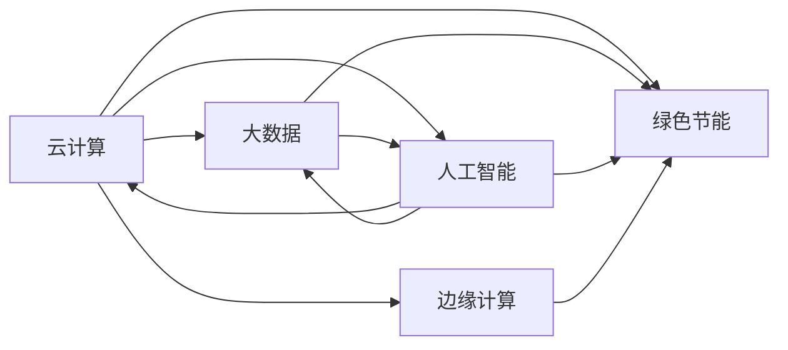

# IT战略规划：企业级数据中心的未来发展与创新

关键词：IT战略规划、企业级数据中心、云计算、大数据、人工智能、边缘计算、绿色节能

## 1. 背景介绍
### 1.1  问题的由来
在当今数字化转型的浪潮下,企业对IT基础设施的依赖程度越来越高。传统的数据中心已经无法满足企业快速发展的需求,面临着诸多挑战,如高能耗、高成本、扩展性差、灵活性不足等问题。因此,企业亟需制定IT战略规划,重新审视和规划数据中心,以适应未来业务发展。

### 1.2  研究现状
近年来,云计算、大数据、人工智能等新兴技术的崛起,为数据中心的发展带来了新的机遇和挑战。各大IT厂商和企业纷纷加大投入,探索数据中心创新之路。Gartner预测,到2025年,80%的企业将关闭传统数据中心,转向云和边缘计算。IDC报告显示,2021年全球超大规模数据中心数量将达到600个,同比增长26%。可见,数据中心正处于变革的关键期。

### 1.3  研究意义 
企业级数据中心作为IT基础设施的核心,其规划和建设直接影响着企业的数字化转型成败。科学合理的IT战略规划,有助于企业构建高效、灵活、安全的新一代数据中心,赋能业务创新,提升市场竞争力。同时,数据中心的绿色节能也是大势所趋,有利于企业践行社会责任,实现可持续发展。

### 1.4  本文结构
本文将围绕IT战略规划展开,重点探讨企业级数据中心的未来发展与创新。内容涵盖核心概念、关键技术、架构演进、最佳实践、发展趋势等多个方面。通过理论阐述和案例分析,为企业制定数据中心战略提供参考和指导。

## 2. 核心概念与联系
在讨论企业级数据中心的未来发展之前,有必要厘清几个核心概念:

- 云计算:通过网络按需提供可伸缩的IT资源池,实现资源的弹性供应和使用。
- 大数据:海量、高速、多样的数据集,需要新处理模式才能发挥数据价值。  
- 人工智能:由机器模拟人类智能,具备感知、学习、推理等能力。
- 边缘计算:在靠近物或数据源头的网络边缘侧,融合网络、计算、存储、应用核心能力的分布式开放平台。
- 绿色节能:在保证性能的同时,最大限度地降低能源消耗,实现节能减排。

这些概念之间相互关联,共同构成了数据中心的技术生态。云计算为大数据、人工智能提供了弹性算力;大数据为人工智能提供了训练数据;人工智能反过来优化云平台和大数据处理;边缘计算是云计算的补充,将服务延伸至更近用户侧;绿色节能则是数据中心发展的重要目标。把握概念内涵和联系,有助于更好地理解数据中心的发展脉络。



## 3. 核心算法原理 & 具体操作步骤
### 3.1  算法原理概述
数据中心涉及诸多核心算法,如资源调度、任务编排、负载均衡、容量规划、能效优化等。本节以资源调度为例,介绍相关算法原理。

资源调度旨在将数据中心的计算、存储、网络等资源高效分配给用户请求,保证服务质量和资源利用率。常见的调度算法有贪心、动态规划、启发式搜索等。其中,基于强化学习的调度算法备受关注,能够根据系统状态和历史经验自主学习优化策略。

### 3.2  算法步骤详解
强化学习调度可分为以下步骤:
1. 定义状态空间、动作空间和奖励函数。状态包括各资源的使用情况,动作为调度决策,奖励与系统效用相关。
2. 初始化Q值表或神经网络。Q值表存储状态-动作值,神经网络拟合Q函数。
3. 采集环境状态,选择动作。一般采用 ε-贪心策略平衡探索和利用。
4. 执行动作,观察下一状态和奖励,更新Q值表或神经网络参数。
5. 重复步骤3-4,直至收敛或达到预设迭代次数。
6. 应用学到的策略指导实际调度。

### 3.3  算法优缺点
强化学习调度的优点在于:
- 适应动态环境,能持续学习和优化
- 无需预先建模,通过试错探索策略空间  
- 可并行化,提高训练效率

缺点包括:
- 状态和动作空间过大时,训练难度增加  
- 样本利用率低,学习效率不高
- 难以处理长期回报,易陷入局部最优

### 3.4  算法应用领域
强化学习调度在数据中心资源管理中有广泛应用,可用于VM放置、容器编排、作业调度、能耗优化等任务。此外,在自动驾驶、智能电网、网络控制等领域也有实践。

## 4. 数学模型和公式 & 详细讲解 & 举例说明
### 4.1  数学模型构建
强化学习可用马尔可夫决策过程(MDP)建模,其核心要素包括:
- 状态集合 $\mathcal{S}$
- 动作集合 $\mathcal{A}$ 
- 状态转移概率 $\mathcal{P}_{ss'}^a$ 
- 奖励函数 $\mathcal{R}_s^a$
- 折扣因子 $\gamma$

目标是寻找最优策略 $\pi^*$,使得期望累积奖励最大化:

$$\pi^* = \arg\max_{\pi} \mathbb{E}\left[\sum_{t=0}^{\infty} \gamma^t \mathcal{R}_{s_t}^{a_t} \right]$$

### 4.2  公式推导过程
Q学习是一种值迭代方法,通过不断更新状态-动作值函数 $Q(s,a)$ 来逼近最优策略。Q函数满足贝尔曼最优方程:

$$Q^*(s,a) = \mathcal{R}_s^a + \gamma \sum_{s' \in \mathcal{S}} \mathcal{P}_{ss'}^a \max_{a'} Q^*(s',a')$$

Q学习的更新公式为:

$$Q(s_t,a_t) \leftarrow Q(s_t,a_t) + \alpha \left[ \mathcal{R}_{s_t}^{a_t} + \gamma \max_a Q(s_{t+1},a) - Q(s_t,a_t) \right]$$

其中 $\alpha$ 为学习率。重复应用该更新规则,Q值最终收敛至 $Q^*$。

### 4.3  案例分析与讲解
考虑一个简化的数据中心调度案例。状态为各服务器的CPU、内存使用率,动作为新任务分配至某台服务器,奖励与任务完成时间相关。假设有2台服务器,CPU和内存均分为高、中、低三档,则状态空间大小为 $3^4=81$。如果平均每台服务器要处理10个任务,则动作空间大小为 $2^{10}=1024$。Q表的存储开销为 $O(|\mathcal{S}||\mathcal{A}|)$。

在实际系统中,状态和动作空间往往更大,Q表难以存储,因此多使用函数逼近如神经网络。此时,更新目标为最小化TD误差:

$$\mathcal{L}(\theta) = \mathbb{E} \left[ \left( \mathcal{R}_{s_t}^{a_t} + \gamma \max_a Q(s_{t+1},a;\theta) - Q(s_t,a_t;\theta) \right)^2 \right]$$

其中 $\theta$ 为网络参数。采用随机梯度下降等优化算法,不断调整 $\theta$ 以拟合最优Q函数。

### 4.4  常见问题解答
- Q: 如何设置奖励函数?
- A: 奖励设置需要平衡多个目标,如平均完成时间、SLA违约率、能耗等。可采用加权和或乘积形式,权重反映目标重要性。奖励应归一化至固定范围如[0,1],以便训练。

- Q: 如何选择动作探索策略?
- A: ε-贪心是常用策略,以 $\epsilon$ 概率随机选择动作,以 $1-\epsilon$ 概率选择当前Q值最大的动作。 $\epsilon$ 可随训练进行衰减,初期多探索,后期偏向利用。此外还有Upper Confidence Bound、Thompson Sampling等高级探索策略。

- Q: 如何评估和部署训练好的模型?
- A: 可在测试环境中评估模型性能,如平均奖励、任务完成率等。超参数如折扣因子 $\gamma$、学习率 $\alpha$、网络结构等需调优。模型部署时,可周期性离线训练,或在线边学习边部署。需要监控模型性能,必要时进行重训练。

## 5. 项目实践：代码实例和详细解释说明
### 5.1  开发环境搭建
强化学习调度可使用Python生态实现。核心依赖包括:
- Gym:强化学习环境接口,可自定义环境
- PyTorch:深度学习框架,搭建和训练Q网络
- NumPy:数值计算库,进行矩阵运算
- Matplotlib:绘图库,可视化训练过程

### 5.2  源代码详细实现
首先定义数据中心环境类,继承自Gym的Env:

```python
class DCEnv(gym.Env): 
    def __init__(self, n_servers, n_jobs):
        self.n_servers = n_servers
        self.n_jobs = n_jobs
        self.obs_dim = n_servers * 2  # CPU和内存
        self.action_dim = n_servers
        
        self.observation_space = spaces.Box(low=0, high=1, shape=(self.obs_dim,))
        self.action_space = spaces.Discrete(self.action_dim)
        
    def reset(self):
        self.obs = np.random.uniform(0, 0.5, self.obs_dim)
        return self.obs
    
    def step(self, action):
        # 更新服务器资源使用情况
        # 计算任务完成时间等
        reward = ...
        done = ...
        return self.obs, reward, done, {}
```

然后定义DQN智能体,使用PyTorch实现Q网络:

```python
class DQNAgent:
    def __init__(self, obs_dim, action_dim):
        self.obs_dim = obs_dim
        self.action_dim = action_dim
        
        self.Q = nn.Sequential(
            nn.Linear(obs_dim, 128), 
            nn.ReLU(),
            nn.Linear(128, 128), 
            nn.ReLU(),
            nn.Linear(128, action_dim)
        )
        
        self.optimizer = optim.Adam(self.Q.parameters())
        
    def act(self, obs, epsilon):
        if np.random.rand() < epsilon:
            return np.random.randint(self.action_dim) 
        else:
            obs = torch.FloatTensor(obs).unsqueeze(0)
            Q_values = self.Q(obs)
            return Q_values.argmax().item()
        
    def train(self, obs, action, reward, next_obs, done):
        obs = torch.FloatTensor(obs).unsqueeze(0) 
        next_obs = torch.FloatTensor(next_obs).unsqueeze(0)
        
        Q_values = self.Q(obs)
        target_Q = reward + (1 - done) * 0.99 * self.Q(next_obs).max()
        
        loss = nn.MSELoss()(Q_values[0, action], target_Q)
        
        self.optimizer.zero_grad()
        loss.backward()
        self.optimizer.step()
```

最后编写训练循环,在环境中训练DQN智能体:

```python
env = DCEnv(n_servers=5, n_jobs=10)
agent = DQNAgent(env.obs_dim, env.action_dim)

for episode in range(1000):
    obs = env.reset()
    done = False
    total_reward = 0
    
    while not done:
        epsilon = max(0.01, 0.5 - episode / 1000)  # 探索率衰减
        action = agent.act(obs, epsilon)
        next_obs, reward, done, _ = env.step