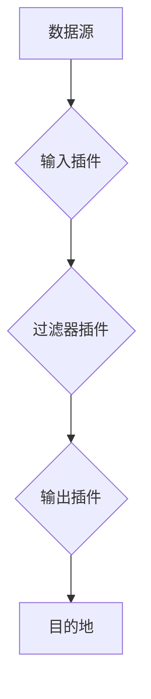

# Logstash原理与代码实例讲解

作者：禅与计算机程序设计艺术 / Zen and the Art of Computer Programming

## 1. 背景介绍
### 1.1 问题的由来

随着互联网和大数据时代的到来，企业内部产生的数据量呈爆炸式增长。这些数据包括日志、监控数据、业务数据等，它们对于企业的决策、运营和优化至关重要。然而，这些数据往往分散在各个系统、设备、平台中，格式不统一，难以直接分析和利用。

为了解决这一难题，日志收集、存储和查询工具应运而生。Logstash 是一款开源的日志管道工具，它能够将来自各种来源的数据源进行采集、转换和输出到目的地，如 Elasticsearch、Hadoop、File 等。本文将详细介绍 Logstash 的原理和代码实例，帮助读者深入理解其工作流程和应用场景。

### 1.2 研究现状

目前，日志管理领域存在许多优秀的工具，如 Logstash、Fluentd、Log4j 等。其中，Logstash 因其强大的数据处理能力和灵活的插件机制而受到广泛关注。

Logstash 的核心优势包括：

- 支持多种数据源，如文件、网络、数据库等。
- 支持多种数据格式，如 JSON、XML、CSV 等。
- 提供丰富的插件机制，可自定义数据处理逻辑。
- 与 Elasticsearch、Kibana 等工具配合，实现高效的日志存储和分析。

### 1.3 研究意义

研究 Logstash 的原理和应用，对于以下方面具有重要意义：

- 帮助开发者理解日志收集、存储和查询的流程。
- 提高日志管理效率和数据分析能力。
- 为企业构建高效的日志系统提供技术支持。

### 1.4 本文结构

本文将按照以下结构展开：

- 第 2 部分：介绍 Logstash 的核心概念和联系。
- 第 3 部分：详细阐述 Logstash 的核心算法原理和具体操作步骤。
- 第 4 部分：讲解 Logstash 中的数学模型、公式和案例。
- 第 5 部分：提供 Logstash 代码实例和详细解释。
- 第 6 部分：分析 Logstash 在实际应用场景中的应用。
- 第 7 部分：推荐 Logstash 相关的学习资源、开发工具和参考文献。
- 第 8 部分：总结 Logstash 的未来发展趋势和挑战。
- 第 9 部分：提供常见问题与解答。

## 2. 核心概念与联系

为了更好地理解 Logstash，以下介绍几个核心概念及其相互关系：

- 数据源：指 Logstash 采集数据的来源，如文件、网络、数据库等。
- 数据格式：指数据源的格式，如 JSON、XML、CSV 等。
- 输入插件：指 Logstash 采集数据源的插件，如 file、tcp、jdbc 等。
- 过滤器插件：指对采集到的数据进行转换和处理的插件，如 grok、date、mutate 等。
- 输出插件：指将数据处理后的数据输出到目的地的插件，如 elasticsearch、file、graphite 等。
- 配置文件：指 Logstash 的配置文件，用于定义数据源、过滤器插件和输出插件的配置。

以下用 Mermaid 流程图展示 Logstash 的工作流程：



可以看出，Logstash 的工作流程为：从数据源采集数据，通过输入插件进行初步处理，再通过过滤器插件进行转换和处理，最后通过输出插件将数据输出到目的地。

## 3. 核心算法原理 & 具体操作步骤
### 3.1 算法原理概述

Logstash 的核心算法原理可以概括为以下几个步骤：

1. 从数据源采集数据。
2. 使用输入插件对数据进行初步处理，如解析数据格式、提取关键信息等。
3. 使用过滤器插件对数据进行转换和处理，如格式化、过滤、聚合等。
4. 使用输出插件将数据输出到目的地，如 Elasticsearch、File 等。

### 3.2 算法步骤详解

以下详细讲解 Logstash 的工作流程：

1. **采集数据**：Logstash 支持多种数据源，如文件、网络、数据库等。开发者需要根据实际需求选择合适的输入插件，并配置其参数，如文件路径、网络地址、数据库连接等。

2. **初步处理**：输入插件将采集到的数据转换为 Logstash 内部可识别的数据格式，如 JSON 格式。同时，输入插件还可以提取数据中的关键信息，如时间戳、IP 地址等。

3. **数据转换和处理**：过滤器插件对采集到的数据进行转换和处理。常见的过滤器插件包括：

    - **grok**：基于正则表达式的文本解析器，可以将文本数据解析为结构化的数据。
    - **date**：日期解析器，可以将时间戳转换为日期对象。
    - **mutate**：数据转换器，可以对数据进行各种转换操作，如添加字段、修改字段值等。

4. **数据输出**：输出插件将处理后的数据输出到目的地。常见的输出插件包括：

    - **elasticsearch**：将数据输出到 Elasticsearch 集群，便于后续的数据分析和查询。
    - **file**：将数据输出到文件系统，便于数据的存储和备份。
    - **graphite**：将数据输出到 Graphite 集群，便于数据的监控和可视化。

### 3.3 算法优缺点

Logstash 的优势如下：

- 支持多种数据源和目的地，具有高度的灵活性。
- 提供丰富的插件机制，可自定义数据处理逻辑。
- 配置文件简单易读，便于开发和维护。
- 与 Elasticsearch、Kibana 等工具配合，实现高效的数据分析和可视化。

然而，Logstash 也存在一些缺点：

- 配置复杂：对于复杂的日志处理逻辑，配置文件可能变得较为复杂，难以维护。
- 性能瓶颈：在处理大量数据时，Logstash 可能存在性能瓶颈。
- 依赖外部库：Logstash 需要依赖外部库，如 Elasticsearch、JDBC 等，增加了部署和运维的复杂性。

### 3.4 算法应用领域

Logstash 在以下领域具有广泛的应用：

- 日志管理：将来自各个系统和设备的日志收集、存储和查询，便于日志分析和问题排查。
- 监控数据采集：将来自监控系统的数据采集、存储和查询，便于监控数据分析和系统性能优化。
- 数据集成：将来自不同数据源的数据进行集成，便于数据分析和业务决策。

## 4. 数学模型和公式 & 详细讲解 & 举例说明
### 4.1 数学模型构建

Logstash 本身不涉及复杂的数学模型和公式。其主要功能是数据的采集、转换和输出，因此不涉及数学建模。

### 4.2 公式推导过程

由于 Logstash 本身不涉及数学建模，因此不涉及公式推导过程。

### 4.3 案例分析与讲解

以下以一个简单的 Logstash 配置文件为例，说明其工作流程：

```conf
input {
  file {
    path => "/var/log/*.log"
    start_position => "begin"
    sincedb_path => "/dev/null"
  }
}

filter {
  grok {
    match => { "message" => "%{DATE:log_date} %{INT:log_level} %{GREEDYDATA:log_message}" }
    date {
      match => { "log_date" => "ISO8601" }
    }
  }
  mutate {
    convert => {
      log_level => "integer"
    }
  }
}

output {
  elasticsearch {
    hosts => ["localhost:9200"]
    index => "logstash-%{+YYYY.MM.dd}"
  }
}
```

该配置文件定义了一个 Logstash 任务，其工作流程如下：

1. 从 `/var/log/*.log` 文件夹中采集日志数据。
2. 使用 grok 过滤器解析日志格式，提取日期、日志级别和日志内容。
3. 使用 date 过滤器将日期转换为日期对象。
4. 使用 mutate 过滤器将日志级别转换为整数。
5. 将处理后的数据输出到 Elasticsearch 集群，索引名为 `logstash-%{+YYYY.MM.dd}`。

### 4.4 常见问题解答

**Q1：如何将 Logstash 与 Elasticsearch、Kibana 配合使用？**

A：Logstash 可以将数据输出到 Elasticsearch 集群，Kibana 可以通过 Elasticsearch 集群查询和分析数据。具体操作如下：

1. 安装 Elasticsearch 和 Kibana。
2. 配置 Logstash 的输出插件为 Elasticsearch，指定 Elasticsearch 集群的地址。
3. 在 Kibana 中创建索引模式，选择与 Logstash 输出索引名匹配的模式。
4. 在 Kibana 的 Discover 页面搜索索引，即可查看和分析数据。

**Q2：如何自定义 Logstash 过滤器插件？**

A：自定义过滤器插件需要编写 Java 代码，并打包成 JAR 包。以下是一个简单的自定义过滤器插件示例：

```java
package com.example.logstash.filter;

import org.elasticsearch.index.shard.DocsStats;
import org.elasticsearch.search.SearchHit;
import org.logstash.config.pipeline.Filter;
import org.logstash.config.pipeline.FilterConfig;
import org.logstash.pipeline.FilterBase;

import java.io.IOException;
import java.util.Collections;
import java.util.Map;

public class CustomFilter extends FilterBase {
    public CustomFilter(FilterConfig config) throws IOException {
        super(config);
    }

    @Override
    public void filter(Map<String, Object> event) throws IOException {
        // 自定义处理逻辑
        event.put("custom_field", "custom_value");
    }
}
```

将代码打包成 JAR 包，并在 Logstash 配置文件中引用该插件：

```conf
filter {
  custom_filter {
    plugin => "com.example.logstash.filter.CustomFilter"
  }
}
```

**Q3：如何优化 Logstash 的性能？**

A：以下是一些优化 Logstash 性能的方法：

- 选择合适的输入插件：对于文件数据，使用 `file` 插件；对于网络数据，使用 `tcp` 插件。
- 使用多线程：通过配置 Logstash 的 `pipeline.workers` 和 `pipeline.batch.size` 参数，可以启动多个工作线程并行处理数据。
- 调整内存和 CPU：根据实际需求调整 Logstash 服务的内存和 CPU 资源。
- 使用高效的过滤器插件：选择性能优异的过滤器插件，如 `grok`、`date`、`mutate` 等。

## 5. 项目实践：代码实例和详细解释说明
### 5.1 开发环境搭建

在进行 Logstash 项目实践之前，我们需要搭建相应的开发环境。以下是使用 Java 进行 Logstash 开发的环境配置流程：

1. 安装 Java 开发环境：从官网下载并安装 Java 开发工具包 (JDK)。
2. 安装 Maven：从官网下载并安装 Maven 构建工具。
3. 创建 Logstash 项目：使用 Maven 创建一个新的 Java 项目，并添加 Logstash 依赖。

### 5.2 源代码详细实现

以下是一个简单的 Logstash 自定义过滤器插件示例：

```java
package com.example.logstash.filter;

import org.elasticsearch.index.shard.DocsStats;
import org.elasticsearch.search.SearchHit;
import org.logstash.config.pipeline.Filter;
import org.logstash.config.pipeline.FilterConfig;
import org.logstash.pipeline.FilterBase;

import java.io.IOException;
import java.util.Collections;
import java.util.Map;

public class CustomFilter extends FilterBase {
    public CustomFilter(FilterConfig config) throws IOException {
        super(config);
    }

    @Override
    public void filter(Map<String, Object> event) throws IOException {
        // 自定义处理逻辑
        event.put("custom_field", "custom_value");
    }
}
```

该示例定义了一个名为 `CustomFilter` 的自定义过滤器插件，其在 `filter` 方法中添加了一个名为 `custom_field` 的新字段，字段值为 `custom_value`。

### 5.3 代码解读与分析

在 `CustomFilter` 类中，我们定义了以下方法：

- `CustomFilter(FilterConfig config)`：构造方法，用于初始化过滤器插件。
- `filter(Map<String, Object> event)`：处理事件的方法，用于对事件进行自定义处理。在该示例中，我们将一个名为 `custom_field` 的新字段添加到事件中，字段值为 `custom_value`。

### 5.4 运行结果展示

将自定义过滤器插件打包成 JAR 包，并在 Logstash 配置文件中引用该插件：

```conf
filter {
  custom_filter {
    plugin => "com.example.logstash.filter.CustomFilter"
  }
}
```

运行 Logstash 任务后，可以看到事件中新增了一个名为 `custom_field` 的字段，字段值为 `custom_value`。

## 6. 实际应用场景
### 6.1 日志管理

Logstash 在日志管理领域具有广泛的应用，以下是一些典型场景：

- 将来自各个系统和设备的日志收集、存储和查询，便于日志分析和问题排查。
- 分析系统性能瓶颈，优化系统性能。
- 监控业务指标，发现潜在问题。

### 6.2 监控数据采集

Logstash 可以将来自监控系统的数据采集、存储和查询，以下是一些典型场景：

- 将来自各种监控设备的性能指标采集、存储和查询，便于监控数据分析和系统性能优化。
- 分析系统运行状态，及时发现潜在问题。
- 根据监控数据制定合理的运维策略。

### 6.3 数据集成

Logstash 可以将来自不同数据源的数据进行集成，以下是一些典型场景：

- 将来自各个系统和设备的业务数据集成，便于数据分析和管理。
- 将来自不同数据源的用户行为数据集成，分析用户行为特征。
- 将来自不同数据源的企业数据集成，进行综合分析和决策。

## 7. 工具和资源推荐
### 7.1 学习资源推荐

以下是一些学习 Logstash 的推荐资源：

1. 《Logstash权威指南》：详细介绍 Logstash 的使用方法、配置和插件机制。
2. Logstash 官方文档：Logstash 的官方文档，提供了详细的配置说明、插件介绍和最佳实践。
3. Logstash 用户论坛：Logstash 用户社区，可以交流经验和解决问题。

### 7.2 开发工具推荐

以下是一些用于 Logstash 开发的推荐工具：

1. Maven：Java 项目的构建工具，用于管理 Logstash 项目的依赖。
2. IntelliJ IDEA：Java 开发工具，可以方便地开发、调试和测试 Logstash 插件。

### 7.3 相关论文推荐

以下是一些与 Logstash 相关的论文推荐：

1. 《Logstash: The Serverless Log Processing Pipeline》：介绍了 Logstash 的架构和设计思想。
2. 《Logstash: An open-source log processing pipeline》：详细介绍了 Logstash 的功能和使用方法。

### 7.4 其他资源推荐

以下是一些其他与 Logstash 相关的资源推荐：

1. Logstash GitHub 仓库：Logstash 的源代码和示例代码。
2. Logstash 用户社区：Logstash 用户交流社区，可以交流经验和解决问题。

## 8. 总结：未来发展趋势与挑战
### 8.1 研究成果总结

本文详细介绍了 Logstash 的原理、配置和使用方法，并通过代码实例和案例讲解了 Logstash 在实际应用场景中的应用。通过学习本文，读者可以了解 Logstash 的核心概念、工作流程和配置方法，掌握 Logstash 在日志管理、监控数据采集和数据集成等领域的应用技巧。

### 8.2 未来发展趋势

随着大数据和云计算技术的不断发展，Logstash 也将不断演进和优化，以下是一些未来发展趋势：

1. 支持更多数据源和目的地。
2. 提供更丰富的插件机制，方便自定义数据处理逻辑。
3. 提高数据处理效率和性能。
4. 加强与其他大数据和云计算平台的集成。

### 8.3 面临的挑战

Logstash 在发展过程中也面临着一些挑战，以下是一些主要挑战：

1. 性能瓶颈：在处理大量数据时，Logstash 可能存在性能瓶颈。
2. 配置复杂：对于复杂的日志处理逻辑，配置文件可能变得较为复杂，难以维护。
3. 依赖外部库：Logstash 需要依赖外部库，如 Elasticsearch、JDBC 等，增加了部署和运维的复杂性。

### 8.4 研究展望

为了应对未来发展趋势和挑战，以下是一些建议：

1. 优化 Logstash 的性能，提高数据处理效率和性能。
2. 简化配置文件，提高可维护性。
3. 减少对外部库的依赖，降低部署和运维的复杂性。

相信通过不断的技术创新和优化，Logstash 将在日志管理、监控数据采集和数据集成等领域发挥更大的作用，为大数据和云计算的发展贡献力量。

## 9. 附录：常见问题与解答

**Q1：如何选择合适的 Logstash 输入插件？**

A：选择合适的输入插件需要根据实际数据源进行判断。以下是一些常见输入插件的适用场景：

- `file`：适用于采集文件系统中的日志文件。
- `tcp`：适用于采集网络数据。
- `jdbc`：适用于采集数据库数据。
- `filebeat`：适用于采集系统日志。
- `syslog-udp`：适用于采集 UDP 协议的 Syslog 数据。

**Q2：如何选择合适的 Logstash 输出插件？**

A：选择合适的输出插件需要根据实际需求进行判断。以下是一些常见输出插件的适用场景：

- `elasticsearch`：适用于将数据输出到 Elasticsearch 集群。
- `file`：适用于将数据输出到文件系统。
- `graphite`：适用于将数据输出到 Graphite 集群。
- `redis`：适用于将数据输出到 Redis 缓存。
- `mongodb`：适用于将数据输出到 MongoDB 数据库。

**Q3：如何自定义 Logstash 过滤器插件？**

A：自定义 Logstash 过滤器插件需要编写 Java 代码，并打包成 JAR 包。以下是一个简单的自定义过滤器插件示例：

```java
package com.example.logstash.filter;

import org.elasticsearch.index.shard.DocsStats;
import org.elasticsearch.search.SearchHit;
import org.logstash.config.pipeline.Filter;
import org.logstash.config.pipeline.FilterConfig;
import org.logstash.pipeline.FilterBase;

import java.io.IOException;
import java.util.Collections;
import java.util.Map;

public class CustomFilter extends FilterBase {
    public CustomFilter(FilterConfig config) throws IOException {
        super(config);
    }

    @Override
    public void filter(Map<String, Object> event) throws IOException {
        // 自定义处理逻辑
        event.put("custom_field", "custom_value");
    }
}
```

将代码打包成 JAR 包，并在 Logstash 配置文件中引用该插件：

```conf
filter {
  custom_filter {
    plugin => "com.example.logstash.filter.CustomFilter"
  }
}
```

**Q4：如何优化 Logstash 的性能？**

A：以下是一些优化 Logstash 性能的方法：

1. 选择合适的输入插件：对于文件数据，使用 `file` 插件；对于网络数据，使用 `tcp` 插件。
2. 使用多线程：通过配置 Logstash 的 `pipeline.workers` 和 `pipeline.batch.size` 参数，可以启动多个工作线程并行处理数据。
3. 调整内存和 CPU：根据实际需求调整 Logstash 服务的内存和 CPU 资源。
4. 使用高效的过滤器插件：选择性能优异的过滤器插件，如 `grok`、`date`、`mutate` 等。

**Q5：如何将 Logstash 与 Elasticsearch、Kibana 配合使用？**

A：Logstash 可以将数据输出到 Elasticsearch 集群，Kibana 可以通过 Elasticsearch 集群查询和分析数据。具体操作如下：

1. 安装 Elasticsearch 和 Kibana。
2. 配置 Logstash 的输出插件为 Elasticsearch，指定 Elasticsearch 集群的地址。
3. 在 Kibana 中创建索引模式，选择与 Logstash 输出索引名匹配的模式。
4. 在 Kibana 的 Discover 页面搜索索引，即可查看和分析数据。

作者：禅与计算机程序设计艺术 / Zen and the Art of Computer Programming