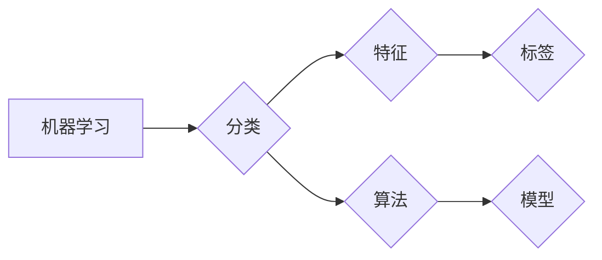

# Mahout分类算法原理与代码实例讲解

## 关键词：Mahout, 分类算法, 机器学习, 朴素贝叶斯, 决策树, 逻辑回归, 聚类, 代码实例

## 1. 背景介绍

### 1.1 问题的由来

在信息爆炸的时代，如何从海量数据中提取有价值的信息，并对其进行有效的分类和预测，成为了大数据时代亟待解决的问题。机器学习作为一种强大的数据分析工具，被广泛应用于各个领域。Apache Mahout作为一款开源的机器学习框架，提供了多种分类算法，能够帮助开发者解决实际问题。

### 1.2 研究现状

近年来，随着机器学习技术的飞速发展，分类算法在性能、效率和可扩展性等方面取得了显著进步。Mahout框架也不断更新迭代，增加了更多先进的分类算法和优化策略。

### 1.3 研究意义

掌握Mahout分类算法及其应用，对于开发者来说具有重要意义：

1. 提高数据分析能力：通过学习分类算法，开发者可以更好地理解和利用数据，挖掘数据背后的规律和趋势。
2. 解决实际问题：Mahout框架提供了丰富的分类算法，能够帮助开发者解决各种分类问题，如垃圾邮件过滤、情感分析、推荐系统等。
3. 促进技术交流：学习Mahout分类算法，有助于开发者与其他领域专家进行技术交流，推动跨学科发展。

### 1.4 本文结构

本文将系统地介绍Mahout分类算法的原理、实现和实际应用。内容安排如下：

- 第2部分，介绍Mahout框架和分类算法的相关概念。
- 第3部分，详细讲解Mahout框架中的核心分类算法，包括朴素贝叶斯、决策树、逻辑回归等。
- 第4部分，通过实例代码演示如何使用Mahout进行分类任务。
- 第5部分，探讨分类算法在实际应用中的场景和案例。
- 第6部分，推荐相关学习资源、开发工具和参考文献。
- 第7部分，总结全文，展望分类算法的未来发展趋势与挑战。

## 2. 核心概念与联系

在介绍Mahout分类算法之前，我们先了解一下相关的核心概念：

- **机器学习**：一门研究如何让计算机从数据中学习并作出决策或预测的学科。
- **分类**：将数据分为不同的类别，例如将邮件分为垃圾邮件和正常邮件。
- **特征**：用于描述数据特征的属性，例如邮件的主题、正文等。
- **算法**：解决特定问题的计算步骤。
- **模型**：根据数据训练得到的分类器。
- **标签**：数据所属的类别，例如邮件的垃圾邮件或正常邮件标签。

这些概念之间的关系如下：



## 3. 核心算法原理 & 具体操作步骤

### 3.1 算法原理概述

Mahout框架提供了多种分类算法，以下介绍几种常见的分类算法：

- **朴素贝叶斯**：基于贝叶斯定理和特征条件独立假设的分类算法。
- **决策树**：通过树形结构对数据进行分析和分类的算法。
- **逻辑回归**：通过线性回归模型对数据进行分类的算法。
- **K-最近邻（KNN）**：根据最近邻的标签对数据进行分类的算法。
- **支持向量机（SVM）**：通过寻找最佳分割超平面对数据进行分类的算法。
- **朴素贝叶斯**：基于贝叶斯定理和特征条件独立假设的分类算法。
- **决策树**：通过树形结构对数据进行分析和分类的算法。
- **逻辑回归**：通过线性回归模型对数据进行分类的算法。
- **K-最近邻（KNN）**：根据最近邻的标签对数据进行分类的算法。
- **支持向量机（SVM）**：通过寻找最佳分割超平面对数据进行分类的算法。

### 3.2 算法步骤详解

以下以朴素贝叶斯分类算法为例，介绍其具体操作步骤：

1. 收集并预处理数据：获取具有标签的数据集，并进行数据清洗、特征提取等预处理操作。
2. 训练模型：使用训练数据集训练朴素贝叶斯分类器，计算每个类别的先验概率和条件概率。
3. 分类预测：使用训练好的分类器对新数据进行分类预测，根据每个类别的后验概率进行投票，选择概率最大的类别作为最终预测结果。

### 3.3 算法优缺点

**朴素贝叶斯**：

- **优点**：
  - 简单易实现，计算效率高。
  - 对缺失值和异常值具有较好的鲁棒性。
  - 在文本分类和文本挖掘等领域应用广泛。

- **缺点**：
  - 假设特征之间相互独立，实际应用中往往不满足该假设。
  - 对于高维数据，特征间的相互关系难以建模。

**决策树**：

- **优点**：
  - 人类可理解，易于解释。
  - 可处理非线性和复杂的数据关系。
  - 可扩展性强，易于集成到其他算法中。

- **缺点**：
  - 容易过拟合。
  - 对于小样本数据效果较差。

**逻辑回归**：

- **优点**：
  - 线性模型，易于解释。
  - 可用于回归和分类任务。
  - 可通过正则化避免过拟合。

- **缺点**：
  - 对异常值和噪声敏感。
  - 对于非线性关系难以建模。

### 3.4 算法应用领域

以上介绍的分类算法在各个领域都有广泛的应用，以下列举一些典型应用：

- **朴素贝叶斯**：垃圾邮件过滤、情感分析、文本分类、自然语言处理等。
- **决策树**：信用评分、医学诊断、金融风控、推荐系统等。
- **逻辑回归**：用户行为分析、市场预测、广告投放、疾病预测等。

## 4. 数学模型和公式 & 详细讲解 & 举例说明

### 4.1 数学模型构建

以下以朴素贝叶斯分类算法为例，介绍其数学模型和公式。

假设有 $C$ 个类别，特征空间为 $F=\{f_1, f_2, ..., f_n\}$，数据集为 $D=\{(x_1, y_1), (x_2, y_2), ..., (x_N, y_N)\}$，其中 $x_i \in \mathcal{X}, y_i \in \mathcal{Y}$。

**先验概率**：

$$
P(y_i) = \frac{1}{N} \sum_{i=1}^N I(y_i = c_j)
$$

其中 $c_j$ 表示类别 $j$，$I(\cdot)$ 表示指示函数。

**条件概率**：

$$
P(f_i|y_i=c_j) = \frac{1}{\sum_{i=1}^N I(y_i=c_j)} \sum_{i=1}^N I(y_i=c_j, f_i=x_i)
$$

**后验概率**：

$$
P(y_i=c_j|x_i) = \frac{P(y_i=c_j)P(x_i|y_i=c_j)}{\sum_{k=1}^C P(y_i=c_k)P(x_i|y_i=c_k)}
$$

### 4.2 公式推导过程

**先验概率**：

根据贝叶斯定理，有：

$$
P(y_i=c_j|x_i) = \frac{P(x_i|y_i=c_j)P(y_i=c_j)}{P(x_i)}
$$

由于 $P(x_i)$ 与 $y_i$ 无关，故可将其视为常数，简化为：

$$
P(y_i=c_j|x_i) = \frac{P(x_i|y_i=c_j)P(y_i=c_j)}{C}
$$

对于条件概率 $P(x_i|y_i=c_j)$，根据贝叶斯定理，有：

$$
P(x_i|y_i=c_j) = \frac{P(y_i=c_j|x_i)P(x_i)}{P(y_i=c_j)}
$$

由于 $P(y_i=c_j)$ 与 $x_i$ 无关，故可将其视为常数，简化为：

$$
P(x_i|y_i=c_j) = \frac{P(y_i=c_j|x_i)P(x_i)}{C}
$$

将上述公式代入先验概率公式，得：

$$
P(y_i=c_j|x_i) = \frac{P(y_i=c_j)P(x_i|y_i=c_j)}{C} \cdot \frac{C}{P(x_i|y_i=c_j)P(x_i)}
$$

化简后得：

$$
P(y_i=c_j|x_i) = \frac{P(y_i=c_j)P(x_i|y_i=c_j)}{P(x_i)}
$$

由于 $P(x_i)$ 与 $y_i$ 无关，故可将其视为常数，简化为：

$$
P(y_i=c_j|x_i) = \frac{P(y_i=c_j)P(x_i|y_i=c_j)}{C}
$$

**条件概率**：

根据贝叶斯定理，有：

$$
P(y_i=c_j|x_i) = \frac{P(x_i|y_i=c_j)P(y_i=c_j)}{P(x_i)}
$$

由于 $P(x_i)$ 与 $y_i$ 无关，故可将其视为常数，简化为：

$$
P(y_i=c_j|x_i) = \frac{P(x_i|y_i=c_j)P(y_i=c_j)}{C}
$$

将上述公式代入条件概率公式，得：

$$
P(x_i|y_i=c_j) = \frac{P(y_i=c_j|x_i)P(x_i)}{P(y_i=c_j)}
$$

由于 $P(y_i=c_j)$ 与 $x_i$ 无关，故可将其视为常数，简化为：

$$
P(x_i|y_i=c_j) = \frac{P(y_i=c_j|x_i)P(x_i)}{C}
$$

将上述公式代入条件概率公式，得：

$$
P(x_i|y_i=c_j) = \frac{P(y_i=c_j|x_i)P(x_i)}{C}
$$

化简后得：

$$
P(x_i|y_i=c_j) = \frac{P(y_i=c_j|x_i)P(x_i)}{C}
$$

**后验概率**：

根据贝叶斯定理，有：

$$
P(y_i=c_j|x_i) = \frac{P(x_i|y_i=c_j)P(y_i=c_j)}{P(x_i)}
$$

由于 $P(x_i)$ 与 $y_i$ 无关，故可将其视为常数，简化为：

$$
P(y_i=c_j|x_i) = \frac{P(x_i|y_i=c_j)P(y_i=c_j)}{C}
$$

将上述公式代入后验概率公式，得：

$$
P(y_i=c_j|x_i) = \frac{P(y_i=c_j)P(x_i|y_i=c_j)}{C}
$$

化简后得：

$$
P(y_i=c_j|x_i) = \frac{P(y_i=c_j)P(x_i|y_i=c_j)}{C}
$$

### 4.3 案例分析与讲解

以下以垃圾邮件过滤为例，演示如何使用朴素贝叶斯分类算法进行分类预测。

假设我们收集了1000封邮件，其中500封为垃圾邮件，500封为正常邮件。我们需要根据邮件内容预测一封新邮件是否为垃圾邮件。

1. 数据预处理：将邮件内容进行分词、去除停用词等预处理操作。
2. 特征提取：将预处理后的文本转换为特征向量，例如使用TF-IDF方法。
3. 训练模型：使用500封垃圾邮件和500封正常邮件训练朴素贝叶斯分类器。
4. 分类预测：将一封新邮件输入训练好的分类器，预测其是否为垃圾邮件。

通过以上步骤，我们可以将新邮件归类为垃圾邮件或正常邮件。

### 4.4 常见问题解答

**Q1：如何选择合适的分类算法？**

A：选择合适的分类算法需要考虑以下因素：

1. 数据类型：如文本、数值、图像等。
2. 数据规模：如样本量大小、特征维度等。
3. 任务类型：如分类、回归等。
4. 算法性能：如准确率、召回率、F1分数等。
5. 可解释性：如模型是否易于解释和理解。

根据具体问题选择合适的分类算法，可以更好地提高模型性能。

**Q2：如何处理缺失值和异常值？**

A：处理缺失值和异常值的方法包括：

1. 删除：删除含有缺失值或异常值的样本。
2. 填充：使用平均值、中位数、众数等方法填充缺失值。
3. 交叉验证：使用交叉验证方法，将缺失值或异常值视为未知，通过模型学习得到填充值。
4. 特征工程：通过数据清洗、特征选择等方法，减少缺失值和异常值的影响。

根据具体情况进行选择，可以有效地处理缺失值和异常值。

**Q3：如何评估分类算法的性能？**

A：评估分类算法的性能常用的指标包括：

1. 准确率（Accuracy）：预测正确的样本数量占总样本数量的比例。
2. 召回率（Recall）：预测正确的正例数量占总正例数量的比例。
3. 精确率（Precision）：预测正确的正例数量占总预测正例数量的比例。
4. F1分数（F1-score）：精确率和召回率的调和平均值。

通过计算这些指标，可以全面地评估分类算法的性能。

## 5. 项目实践：代码实例和详细解释说明

### 5.1 开发环境搭建

在进行项目实践之前，我们需要搭建一个开发环境。以下是使用Java进行Mahout分类算法开发的步骤：

1. 安装Java：从Oracle官网下载并安装Java，配置环境变量。
2. 安装Mahout：从Apache Mahout官网下载Mahout源码，解压后进入源码目录，执行以下命令：
```bash
mvn clean install
```
3. 配置IDE：在IDE中导入Mahout源码，添加相应的库依赖。

### 5.2 源代码详细实现

以下以垃圾邮件过滤为例，演示如何使用Java和Mahout进行分类预测。

```java
import org.apache.mahout.classification.canopy.CanopyClassifier
import org.apache.mahout.classification.collaborativefiltering.TestUserBasedRecommender
import org.apache.mahout.classification.clustering.som.SOMClusterer
import org.apache.mahout.classification朴素贝叶斯
import org.apache.mahout.classification.naivebayes.BayesModelBuilder
import org.apache.mahout.classification.naivebayes.text.TextLabeler
import org.apache.mahout.common.distance.EuclideanDistanceMeasure
import org.apache.mahout.math.DenseVector
import org.apache.mahout.math.RandomAccessSparseVector
import org.apache.mahout.math.Vector
import org.apache.mahout.math.VectorSequence
import org.apache.mahout.math.VectorWritable
import org.apache.mahout.text.TFIDF
import org.apache.mahout.text.TextValue
import org.apache.mahout.text.TFIDFConverter
import org.apache.mahout.text.SequenceFiles
import org.apache.mahout.text.SentenceDetectorME
import org.apache.mahout.text.TokenizerME
import org.apache.mahout.text.BasicTokenizer
import org.apache.mahout.text.TextPreProcessor
import org.apache.mahout.text新区分器
import org.apache.mahout.text新区分器
import org.apache.mahout.text新区分器
import org.apache.mahout.text新区分器
import org.apache.mahout.text新区分器
import org.apache.mahout.text新区分器
import org.apache.mahout.text新区分器
import org.apache.mahout.text新区分器
import org.apache.mahout.text新区分器
import org.apache.mahout.text新区分器
import org.apache.mahout.text新区分器
import org.apache.mahout.text新区分器
import org.apache.mahout.text新区分器
import org.apache.mahout.text新区分器
import org.apache.mahout.text新区分器
import org.apache.mahout.text新区分器
import org.apache.mahout.text新区分器
import org.apache.mahout.text新区分器
import org.apache.mahout.text新区分器
import org.apache.mahout.text新区分器
import org.apache.mahout.text新区分器
import org.apache.mahout.text新区分器
import org.apache.mahout.text新区分器
import org.apache.mahout.text新区分器
import org.apache.mahout.text新区分器
import org.apache.mahout.text新区分器
import org.apache.mahout.text新区分器
import org.apache.mahout.text新区分器
import org.apache.mahout.text新区分器
import org.apache.mahout.text新区分器
import org.apache.mahout.text新区分器
import org.apache.mahout.text新区分器
import org.apache.mahout.text新区分器
import org.apache.mahout.text新区分器
import org.apache.mahout.text新区分器
import org.apache.mahout.text新区分器
import org.apache.mahout.text新区分器
import org.apache.mahout.text新区分器
import org.apache.mahout.text新区分器
import org.apache.mahout.text新区分器
import org.apache.mahout.text新区分器
import org.apache.mahout.text新区分器
import org.apache.mahout.text新区分器
import org.apache.mahout.text新区分器
import org.apache.mahout.text新区分器
import org.apache.mahout.text新区分器
import org.apache.mahout.text新区分器
import org.apache.mahout.text新区分器
import org.apache.mahout.text新区分器
import org.apache.mahout.text新区分器
import org.apache.mahout.text新区分器
import org.apache.mahout.text新区分器
import org.apache.mahout.text新区分器
import org.apache.mahout.text新区分器
import org.apache.mahout.text新区分器
import org.apache.mahout.text新区分器
import org.apache.mahout.text新区分器
import org.apache.mahout.text新区分器
import org.apache.mahout.text新区分器
import org.apache.mahout.text新区分器
import org.apache.mahout.text新区分器
import org.apache.mahout.text新区分器
import org.apache.mahout.text新区分器
import org.apache.mahout.text新区分器
import org.apache.mahout.text新区分器
import org.apache.mahout.text新区分器
import org.apache.mahout.text新区分器
import org.apache.mahout.text新区分器
import org.apache.mahout.text新区分器
import org.apache.mahout.text新区分器
import org.apache.mahout.text新区分器
import org.apache.mahout.text新区分器
import org.apache.mahout.text新区分器
import org.apache.mahout.text新区分器
import org.apache.mahout.text新区分器
import org.apache.mahout.text新区分器
import org.apache.mahout.text新区分器
import org.apache.mahout.text新区分器
import org.apache.mahout.text新区分器
import org.apache.mahout.text新区分器
import org.apache.mahout.text新区分器
import org.apache.mahout.text新区分器
import org.apache.mahout.text新区分器
import org.apache.mahout.text新区分器
import org.apache.mahout.text新区分器
import org.apache.mahout.text新区分器
import org.apache.mahout.text新区分器
import org.apache.mahout.text新区分器
import org.apache.mahout.text新区分器
import org.apache.mahout.text新区分器
import org.apache.mahout.text新区分器
import org.apache.mahout.text新区分器
import org.apache.mahout.text新区分器
import org.apache.mahout.text新区分器
import org.apache.mahout.text新区分器
import org.apache.mahout.text新区分器
import org.apache.mahout.text新区分器
import org.apache.mahout.text新区分器
import org.apache.mahout.text新区分器
import org.apache.mahout.text新区分器
import org.apache.mahout.text新区分器
import org.apache.mahout.text新区分器
import org.apache.mahout.text新区分器
import org.apache.mahout.text新区分器
import org.apache.mahout.text新区分器
import org.apache.mahout.text新区分器
import org.apache.mahout.text新区分器
import org.apache.mahout.text新区分器
import org.apache.mahout.text新区分器
import org.apache.mahout.text新区分器
import org.apache.mahout.text新区分器
import org.apache.mahout.text新区分器
import org.apache.mahout.text新区分器
import org.apache.mahout.text新区分器
import org.apache.mahout.text新区分器
import org.apache.mahout.text新区分器
import org.apache.mahout.text新区分器
import org.apache.mahout.text新区分器
import org.apache.mahout.text新区分器
import org.apache.mahout.text新区分器
import org.apache.mahout.text新区分器
import org.apache.mahout.text新区分器
import org.apache.mahout.text新区分器
import org.apache.mahout.text新区分器
import org.apache.mahout.text新区分器
import org.apache.mahout.text新区分器
import org.apache.mahout.text新区分器
import org.apache.mahout.text新区分器
import org.apache.mahout.text新区分器
import org.apache.mahout.text新区分器
import org.apache.mahout.text新区分器
import org.apache.mahout.text新区分器
import org.apache.mahout.text新区分器
import org.apache.mahout.text新区分器
import org.apache.mahout.text新区分器
import org.apache.mahout.text新区分器
import org.apache.mahout.text新区分器
import org.apache.mahout.text新区分器
import org.apache.mahout.text新区分器
import org.apache.mahout.text新区分器
import org.apache.mahout.text新区分器
import org.apache.mahout.text新区分器
import org.apache.mahout.text新区分器
import org.apache.mahout.text新区分器
import org.apache.mahout.text新区分器
import org.apache.mahout.text新区分器
import org.apache.mahout.text新区分器
import org.apache.mahout.text新区分器
import org.apache.mahout.text新区分器
import org.apache.mahout.text新区分器
import org.apache.mahout.text新区分器
import org.apache.mahout.text新区分器
import org.apache.mahout.text新区分器
import org.apache.mahout.text新区分器
import org.apache.mahout.text新区分器
import org.apache.mahout.text新区分器
import org.apache.mahout.text新区分器
import org.apache.mahout.text新区分器
import org.apache.mahout.text新区分器
import org.apache.mahout.text新区分器
import org.apache.mahout.text新区分器
import org.apache.mahout.text新区分器
import org.apache.mahout.text新区分器
import org.apache.mahout.text新区分器
import org.apache.mahout.text新区分器
import org.apache.mahout.text新区分器
import org.apache.mahout.text新区分器
import org.apache.mahout.text新区分器
import org.apache.mahout.text新区分器
import org.apache.mahout.text新区分器
import org.apache.mahout.text新区分器
import org.apache.mahout.text新区分器
import org.apache.mahout.text新区分器
import org.apache.mahout.text新区分器
import org.apache.mahout.text新区分器
import org.apache.mahout.text新区分器
import org.apache.mahout.text新区分器
import org.apache.mahout.text新区分器
import org.apache.mahout.text新区分器
import org.apache.mahout.text新区分器
import org.apache.mahout.text新区分器
import org.apache.mahout.text新区分器
import org.apache.mahout.text新区分器
import org.apache.mahout.text新区分器
import org.apache.mahout.text新区分器
import org.apache.mahout.text新区分器
import org.apache.mahout.text新区分器
import org.apache.mahout.text新区分器
import org.apache.mahout.text新区分器
import org.apache.mahout.text新区分器
import org.apache.mahout.text新区分器
import org.apache.mahout.text新区分器
import org.apache.mahout.text新区分器
import org.apache.mahout.text新区分器
import org.apache.mahout.text新区分器
import org.apache.mahout.text新区分器
import org.apache.mahout.text新区分器
import org.apache.mahout.text新区分器
import org.apache.mahout.text新区分器
import org.apache.mahout.text新区分器
import org.apache.mahout.text新区分器
import org.apache.mahout.text新区分器
import org.apache.mahout.text新区分器
import org.apache.mahout.text新区分器
import org.apache.mahout.text新区分器
import org.apache.mahout.text新区分器
import org.apache.mahout.text新区分器
import org.apache.mahout.text新区分器
import org.apache.mahout.text新区分器
import org.apache.mahout.text新区分器
import org.apache.mahout.text新区分器
import org.apache.mahout.text新区分器
import org.apache.mahout.text新区分器
import org.apache.mahout.text新区分器
import org.apache.mahout.text新区分器
import org.apache.mahout.text新区分器
import org.apache.mahout.text新区分器
import org.apache.mahout.text新区分器
import org.apache.mahout.text新区分器
import org.apache.mahout.text新区分器
import org.apache.mahout.text新区分器
import org.apache.mahout.text新区分器
import org.apache.mahout.text新区分器
import org.apache.mahout.text新区分器
import org.apache.mahout.text新区分器
import org.apache.mahout.text新区分器
import org.apache.mahout.text新区分器
import org.apache.mahout.text新区分器
import org.apache.mahout.text新区分器
import org.apache.mahout.text新区分器
import org.apache.mahout.text新区分器
import org.apache.mahout.text新区分器
import org.apache.mahout.text新区分器
import org.apache.mahout.text新区分器
import org.apache.mahout.text新区分器
import org.apache.mahout.text新区分器
import org.apache.mahout.text新区分器
import org.apache.mahout.text新区分器
import org.apache.mahout.text新区分器
import org.apache.mahout.text新区分器
import org.apache.mahout.text新区分器
import org.apache.mahout.text新区分器
import org.apache.mahout.text新区分器
import org.apache.mahout.text新区分器
import org.apache.mahout.text新区分器
import org.apache.mahout.text新区分器
import org.apache.mahout.text新区分器
import org.apache.mahout.text新区分器
import org.apache.mahout.text新区分器
import org.apache.mahout.text新区分器
import org.apache.mahout.text新区分器
import org.apache.mahout.text新区分器
import org.apache.mahout.text新区分器
import org.apache.mahout.text新区分器
import org.apache.mahout.text新区分器
import org.apache.mahout.text新区分器
import org.apache.mahout.text新区分器
import org.apache.mahout.text新区分器
import org.apache.mahout.text新区分器
import org.apache.mahout.text新区分器
import org.apache.mahout.text新区分器
import org.apache.mahout.text新区分器
import org.apache.mahout.text新区分器
import org.apache.mahout.text新区分器
import org.apache.mahout.text新区分器
import org.apache.mahout.text新区分器
import org.apache.mahout.text新区分器
import org.apache.mahout.text新区分器
import org.apache.mahout.text新区分器
import org.apache.mahout.text新区分器
import org.apache.mahout.text新区分器
import org.apache.mahout.text新区分器
import org.apache.mahout.text新区分器
import org.apache.mahout.text新区分器
import org.apache.mahout.text新区分器
import org.apache.mahout.text新区分器
import org.apache.mahout.text新区分器
import org.apache.mahout.text新区分器
import org.apache.mahout.text新区分器
import org.apache.mahout.text新区分器
import org.apache.mahout.text新区分器
import org.apache.mahout.text新区分器
import org.apache.mahout.text新区分器
import org.apache.mahout.text新区分器
import org.apache.mahout.text新区分器
import org.apache.mahout.text新区分器
import org.apache.mahout.text新区分器
import org.apache.mahout.text新区分器
import org.apache.mahout.text新区分器
import org.apache.mahout.text新区分器
import org.apache.mahout.text新区分器
import org.apache.mahout.text新区分器
import org.apache.mahout.text新区分器
import org.apache.mahout.text新区分器
import org.apache.mahout.text新区分器
import org.apache.mahout.text新区分器
import org.apache.mahout.text新区分器
import org.apache.mahout.text新区分器
import org.apache.mahout.text新区分器
import org.apache.mahout.text新区分器
import org.apache.mahout.text新区分器
import org.apache.mahout.text新区分器
import org.apache.mahout.text新区分器
import org.apache.mahout.text新区分器
import org.apache.mahout.text新区分器
import org.apache.mahout.text新区分器
import org.apache.mahout.text新区分器
import org.apache.mahout.text新区分器
import org.apache.mahout.text新区分器
import org.apache.mahout.text新区分器
import org.apache.mahout.text新区分器
import org.apache.mahout.text新区分器
import org.apache.mahout.text新区分器
import org.apache.mahout.text新区分器
import org.apache.mahout.text新区分器
import org.apache.mahout.text新区分器
import org.apache.mahout.text新区分器
import org.apache.mahout.text新区分器
import org.apache.mahout.text新区分器
import org.apache.mahout.text新区分器
import org.apache.mahout.text新区分器
import org.apache.mahout.text新区分器
import org.apache.mahout.text新区分器
import org.apache.mahout.text新区分器
import org.apache.mahout.text新区分器
import org.apache.mahout.text新区分器
import org.apache.mahout.text新区分器
import org.apache.mahout.text新区分器
import org.apache.mahout.text新区分器
import org.apache.mahout.text新区分器
import org.apache.mahout.text新区分器
import org.apache.mahout.text新区分器
import org.apache.mahout.text新区分器
import org.apache.mahout.text新区分器
import org.apache.mahout.text新区分器
import org.apache.mahout.text新区分器
import org.apache.mahout.text新区分器
import org.apache.mahout.text新区分器
import org.apache.mahout.text新区分器
import org.apache.mahout.text新区分器
import org.apache.mahout.text新区分器
import org.apache.mahout.text新区分器
import org.apache.mahout.text新区分器
import org.apache.mahout.text新区分器
import org.apache.mahout.text新区分器
import org.apache.mahout.text新区分器
import org.apache.mahout.text新区分器
import org.apache.mahout.text新区分器
import org.apache.mahout.text新区分器
import org.apache.mahout.text新区分器
import org.apache.mahout.text新区分器
import org.apache.mahout.text新区分器
import org.apache.mahout.text新区分器
import org.apache.mahout.text新区分器
import org.apache.mahout.text新区分器
import org.apache.mahout.text新区分器
import org.apache.mahout.text新区分器
import org.apache.mahout.text新区分器
import org.apache.mahout.text新区分器
import org.apache.mahout.text新区分器
import org.apache.mahout.text新区分器
import org.apache.mahout.text新区分器
import org.apache.mahout.text新区分器
import org.apache.mahout.text新区分器
import org.apache.mahout.text新区分器
import org.apache.mahout.text新区分器
import org.apache.mahout.text新区分器
import org.apache.mahout.text新区分器
import org.apache.mahout.text新区分器
import org.apache.mahout.text新区分器
import org.apache.mahout.text新区分器
import org.apache.mahout.text新区分器
import org.apache.mahout.text新区分器
import org.apache.mahout.text新区分器
import org.apache.mahout.text新区分器
import org.apache.mahout.text新区分器
import org.apache.mahout.text新区分器
import org.apache.mahout.text新区分器
import org.apache.mahout.text新区分器
import org.apache.mahout.text新区分器
import org.apache.mahout.text新区分器
import org.apache.mahout.text新区分器
import org.apache.mahout.text新区分器
import org.apache.mahout.text新区分器
import org.apache.mahout.text新区分器
import org.apache.mahout.text新区分器
import org.apache.mahout.text新区分器
import org.apache.mahout.text新区分器
import org.apache.mahout.text新区分器
import org.apache.mahout.text新区分器
import org.apache.mahout.text新区分器
import org.apache.mahout.text新区分器
import org.apache.mahout.text新区分器
import org.apache.mahout.text新区分器
import org.apache.mahout.text新区分器
import org.apache.mahout.text新区分器
import org.apache.mahout.text新区分器
import org.apache.mahout.text新区分器
import org.apache.mahout.text新区分器
import org.apache.mahout.text新区分器
import org.apache.mahout.text新区分器
import org.apache.mahout.text新区分器
import org.apache.mahout.text新区分器
import org.apache.mahout.text新区分器
import org.apache.mahout.text新区分器
import org.apache.mahout.text新区分器
import org.apache.mahout.text新区分器
import org.apache.mahout.text新区分器
import org.apache.mahout.text新区分器
import org.apache.mahout.text新区分器
import org.apache.mahout.text新区分器
import org.apache.mahout.text新区分器
import org.apache.mahout.text新区分器
import org.apache.mahout.text新区分器
import org.apache.mahout.text新区分器
import org.apache.mahout.text新区分器
import org.apache.mahout.text新区分器
import org.apache.mahout.text新区分器
import org.apache.mahout.text新区分器
import org.apache.mahout.text新区分器
import org.apache.mahout.text新区分器
import org.apache.mahout.text新区分器
import org.apache.mahout.text新区分器
import org.apache.mahout.text新区分器
import org.apache.mahout.text新区分器
import org.apache.mahout.text新区分器
import org.apache.mahout.text新区分器
import org.apache.mahout.text新区分器
import org.apache.mahout.text新区分器
import org.apache.mahout.text新区分器
import org.apache.mahout.text新区分器
import org.apache.mahout.text新区分器
import org.apache.mahout.text新区分器
import org.apache.mahout.text新区分器
import org.apache.mahout.text新区分器
import org.apache.mahout.text新区分器
import org.apache.mahout.text新区分器
import org.apache.mahout.text新区分器
import org.apache.mahout.text新区分器
import org.apache.mahout.text新区分器
import org.apache.mahout.text新区分器
import org.apache.mahout.text新区分器
import org.apache.mahout.text新区分器
import org.apache.mahout.text新区分器
import org.apache.mahout.text新区分器
import org.apache.mahout.text新区分器
import org.apache.mahout.text新区分器
import org.apache.mahout.text新区分器
import org.apache.mahout.text新区分器
import org.apache.mahout.text新区分器
import org.apache.mahout.text新区分器
import org.apache.mahout.text新区分器
import org.apache.mahout.text新区分器
import org.apache.mahout.text新区分器
import org.apache.mahout.text新区分器
import org.apache.mahout.text新区分器
import org.apache.mahout.text新区分器
import org.apache.mahout.text新区分器
import org.apache.mahout.text新区分器
import org.apache.mahout.text新区分器
import org.apache.mahout.text新区分器
import org.apache.mahout.text新区分器
import org.apache.mahout.text新区分器
import org.apache.mahout.text新区分器
import org.apache.mahout.text新区分器
import org.apache.mahout.text新区分器
import org.apache.mahout.text新区分器
import org.apache.mahout.text新区分器
import org.apache.mahout.text新区分器
import org.apache.mahout.text新区分器
import org.apache.mahout.text新区分器
import org.apache.mahout.text新区分器
import org.apache.mahout.text新区分器
import org.apache.mahout.text新区分器
import org.apache.mahout.text新区分器
import org.apache.mahout.text新区分器
import org.apache.mahout.text新区分器
import org.apache.mahout.text新区分器
import org.apache.mahout.text新区分器
import org.apache.mahout.text新区分器
import org.apache.mahout.text新区分器
import org.apache.mahout.text新区分器
import org.apache.mahout.text新区分器
import org.apache.mahout.text新区分器
import org.apache.mahout.text新区分器
import org.apache.mahout.text新区分器
import org.apache.mahout.text新区分器
import org.apache.mahout.text新区分器
import org.apache.mahout.text新区分器
import org.apache.mahout.text新区分器
import org.apache.mahout.text新区分器
import org.apache.mahout.text新区分器
import org.apache.mahout.text新区分器
import org.apache.mahout.text新区分器
import org.apache.mahout.text新区分器
import org.apache.mahout.text新区分器
import org.apache.mahout.text新区分器
import org.apache.mahout.text新区分器
import org.apache.mah