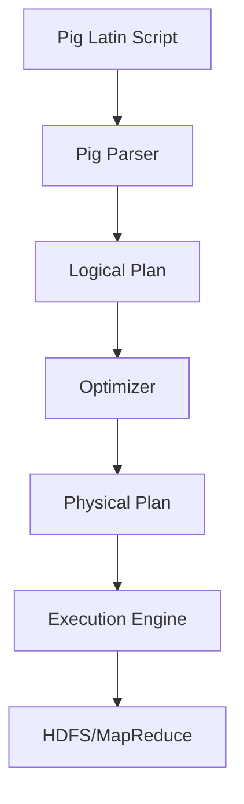

# Pig原理与代码实例讲解

## 1. 背景介绍

### 1.1 问题的由来

在大数据时代,海量数据的存储和处理成为了一个巨大的挑战。传统的数据处理方式已经无法满足现代数据密集型应用的需求。这促使了一种新型的数据处理范式——大数据处理的兴起。Apache Pig就是为了解决这一问题而诞生的,它提供了一种高级的数据流语言,使得程序员可以更加轻松地处理大规模数据集。

### 1.2 研究现状

Apache Pig是Apache软件基金会的一个开源项目,最初由Yahoo!研究院开发。它为并行计算提供了一种简单的脚本语言——Pig Latin,使程序员能够用一种类SQL的语言来描述复杂的数据分析任务。Pig Latin程序会被翻译成一系列的MapReduce任务,由Hadoop集群来执行。

目前,Pig已经被广泛应用于各种大数据处理场景,如网络日志分析、网页链接分析、用户行为分析等。它简单易学的语法和强大的数据处理能力,使其成为大数据开发者的重要工具之一。

### 1.3 研究意义

学习Apache Pig对于以下几个方面具有重要意义:

1. **简化大数据处理**:Pig Latin语言为复杂的数据处理任务提供了一种高级抽象,使得开发者可以更加专注于数据处理逻辑本身,而不必过多关注底层实现细节。

2. **提高开发效率**:相比于直接使用MapReduce编程,Pig Latin语言更加简洁,可以极大地提高开发效率。

3. **优化执行效率**:Pig内置了许多优化策略,能够自动优化执行计划,提高数据处理的效率。

4. **扩展性强**:Pig提供了丰富的用户自定义函数(UDF)接口,允许开发者根据需求扩展其功能。

5. **与生态圈无缝集成**:Pig可以与Hadoop生态圈中的其他组件(如Hive、HBase等)无缝集成,形成强大的大数据处理平台。

### 1.4 本文结构

本文将全面介绍Apache Pig的原理和实践。首先阐述Pig的核心概念和架构设计,然后深入探讨其算法原理和数学模型,并通过代码实例讲解具体的实现细节。此外,还将介绍Pig在实际应用中的场景,以及相关的工具和资源。最后,对Pig的发展趋势和面临的挑战进行展望和总结。

## 2. 核心概念与联系

Apache Pig的核心概念包括:

1. **Pig Latin**:Pig提供的数据流语言,用于描述数据处理流程。

2. **数据模型**:Pig采用关系数据模型,所有数据都被组织为数据集(Dataset)。

3. **运行机制**:Pig程序会被翻译成一系列MapReduce任务,由Hadoop集群执行。

4. **执行框架**:Pig包含一个解释器,负责解析Pig Latin脚本、构建逻辑计划、优化执行计划等。

5. **优化策略**:Pig内置了多种优化策略,如投影剪裁、过滤器推导、MapReduce合并等。

6. **扩展性**:Pig支持用户自定义函数(UDF)、流式数据处理、HCatalog集成等扩展功能。

这些核心概念相互关联,共同构建了Pig的整体架构和运行机制。下面是一个简单的Mermaid流程图,展示了Pig的执行过程:

## 3. 核心算法原理 & 具体操作步骤

### 3.1 算法原理概述

Pig的核心算法原理可以概括为以下几个方面:

1. **查询解析**:将Pig Latin脚本解析为逻辑计划(Logical Plan)。

2. **逻辑优化**:对逻辑计划进行一系列优化,如投影剪裁、过滤器推导等。

3. **物理优化**:将优化后的逻辑计划翻译为物理计划(Physical Plan),并进行进一步优化,如MapReduce合并等。

4. **执行调度**:将物理计划分解为一系列MapReduce任务,并提交到Hadoop集群执行。

5. **结果收集**:从HDFS中收集MapReduce任务的输出结果。

### 3.2 算法步骤详解

1. **查询解析**

   Pig使用ANTLR解析器将Pig Latin脚本解析为抽象语法树(AST),然后构建出逻辑计划。逻辑计划由一系列逻辑运算符(如LOAD、FILTER、JOIN等)组成,描述了数据处理的逻辑流程。

2. **逻辑优化**

   Pig的优化器会对逻辑计划进行一系列优化,以提高执行效率。主要优化策略包括:

   - **投影剪裁(Project Pruning)**:去除不需要的列,减少数据传输量。
   - **过滤器推导(Filter Pushdown)**:将过滤操作尽可能下推,减少中间数据。
   - **MapSide合并(Map-Side Merge)**:在Map端合并小文件,减少MapReduce任务数量。
   - **MapReduce合并(MapReduce Merge)**:将连续的MapReduce任务合并,减少作业启动开销。

3. **物理优化**

   逻辑计划经过优化后,会被翻译为物理计划。物理计划由一系列物理运算符(如MapReduce任务、本地运算等)组成,描述了具体的执行方式。

   在这个阶段,Pig还会进行一些进一步的优化,如:

   - **分区剪裁(Partition Pruning)**:只读取所需的HDFS分区数据。
   - **MapReduce合并(MapReduce Merge)**:继续合并连续的MapReduce任务。
   - **压缩优化**:对中间数据进行压缩,减少网络传输开销。

4. **执行调度**

   物理计划会被分解为一系列MapReduce任务,并提交到Hadoop集群执行。Pig会根据数据的位置和集群资源状况,合理调度任务的执行。

5. **结果收集**

   MapReduce任务执行完毕后,Pig会从HDFS中收集输出结果,并返回给用户。

### 3.3 算法优缺点

**优点**:

- 简化了大数据处理流程,提高了开发效率。
- 内置了多种优化策略,能够自动优化执行计划,提高性能。
- 支持用户自定义函数(UDF),具有很强的扩展性。
- 与Hadoop生态圈无缝集成,可以方便地与其他大数据组件协同工作。

**缺点**:

- 由于需要将Pig Latin脚本翻译为MapReduce任务,存在一定的启动开销。
- 对于迭代式计算和流式计算,Pig的性能可能不如专门设计的系统(如Spark等)。
- 调试和错误处理相对比较困难,缺乏良好的可视化工具支持。
- 对于复杂的数据处理任务,Pig Latin语言的表达能力可能不足。

### 3.4 算法应用领域

Pig主要应用于以下几个领域:

1. **网络日志分析**:分析网站访问日志,了解用户行为模式。
2. **网页链接分析**:计算网页之间的链接关系,用于网页排名等。
3. **用户行为分析**:分析用户在网站/APP上的行为数据,进行个性化推荐等。
4. **数据转换**:将数据从一种格式转换为另一种格式,用于数据集成等。
5. **数据探索**:对海量数据进行初步探索和分析,为进一步的数据挖掘奠定基础。

## 4. 数学模型和公式 & 详细讲解 & 举例说明

### 4.1 数学模型构建

在介绍Pig的数学模型之前,我们先来回顾一下Pig的数据模型。Pig采用关系数据模型,所有数据都被组织为数据集(Dataset)。每个数据集由一个或多个Bag组成,而每个Bag又包含多个Tuple。可以将Tuple看作一行记录,其中每个字段可以是原子值或者嵌套的Bag/Tuple。

我们可以使用集合论的概念来形式化描述Pig的数据模型:

- 设 $\Omega$ 为所有可能的原子值(如数字、字符串等)的集合。
- 定义元组(Tuple) $T$ 为有序的异构元素对 $(x_1, x_2, \ldots, x_n)$,其中 $x_i \in \Omega \cup \mathcal{B} \cup \mathcal{T}$ ($1 \leq i \leq n$)。$\mathcal{T}$ 表示所有可能的元组集合。
- 定义袋(Bag) $B$ 为无序的元组集合,即 $B = \{T_1, T_2, \ldots, T_m\}$,其中 $T_i \in \mathcal{T}$ ($1 \leq i \leq m$)。$\mathcal{B}$ 表示所有可能的袋集合。
- 定义数据集(Dataset) $D$ 为有序的异构元素对 $(B_1, B_2, \ldots, B_k)$,其中 $B_i \in \mathcal{B}$ ($1 \leq i \leq k$)。

使用这种数学模型,我们可以准确描述Pig中的数据结构,并为后续的算法设计和优化奠定理论基础。

### 4.2 公式推导过程

在Pig中,常见的数据处理操作包括投影(Project)、过滤(Filter)、连接(Join)等。下面我们将以投影操作为例,推导其数学公式。

投影操作的作用是从数据集中选择出特定的列(字段)。设有数据集 $D = (B_1, B_2, \ldots, B_k)$,我们希望从中选择出第 $i_1, i_2, \ldots, i_m$ 列,构成新的数据集 $D'$。数学上,这个过程可以表示为:

$$
\begin{aligned}
D' &= \pi_{i_1, i_2, \ldots, i_m}(D) \\
   &= \pi_{i_1, i_2, \ldots, i_m}((B_1, B_2, \ldots, B_k)) \\
   &= (\pi_{i_1, i_2, \ldots, i_m}(B_1), \pi_{i_1, i_2, \ldots, i_m}(B_2), \ldots, \pi_{i_1, i_2, \ldots, i_m}(B_k))
\end{aligned}
$$

其中 $\pi$ 为投影运算符,下标 $i_1, i_2, \ldots, i_m$ 表示要选择的列索引。

对于每个袋 $B_j$ ($1 \leq j \leq k$),投影操作可以进一步推导为:

$$
\begin{aligned}
\pi_{i_1, i_2, \ldots, i_m}(B_j) &= \{\pi_{i_1, i_2, \ldots, i_m}(T) | T \in B_j\} \\
                               &= \{(x_{i_1}, x_{i_2}, \ldots, x_{i_m}) | (x_1, x_2, \ldots, x_n) \in B_j\}
\end{aligned}
$$

即对每个元组 $T = (x_1, x_2, \ldots, x_n)$,只保留索引为 $i_1, i_2, \ldots, i_m$ 的元素,构成新的元组。

通过这种数学推导,我们可以准确描述投影操作的语义,为其实现和优化提供理论依据。类似的,我们也可以为其他操作(如过滤、连接等)建立数学模型。

### 4.3 案例分析与讲解

为了更好地理解上述数学模型和公式,我们来看一个具体的案例。假设有一个记录网站访问日志的数据集 $D$,其中每个元组包含以下字段:

- 时间戳(timestamp)
- 用户ID(userId)
- 请求URL(requestUrl)
- HTTP状态码(statusCode)
- 响应时间(responseTime)

现在,我们希望从中选择出时间戳、用户ID和请求URL这三个字段,构成新的数据集 $D'$。根据前面的公式,这个过程可以表示为:

$$
D' = \pi_{0, 1, 2}(D)
$$

假设原始数据集 $D$ 中有两个袋 $B_1$