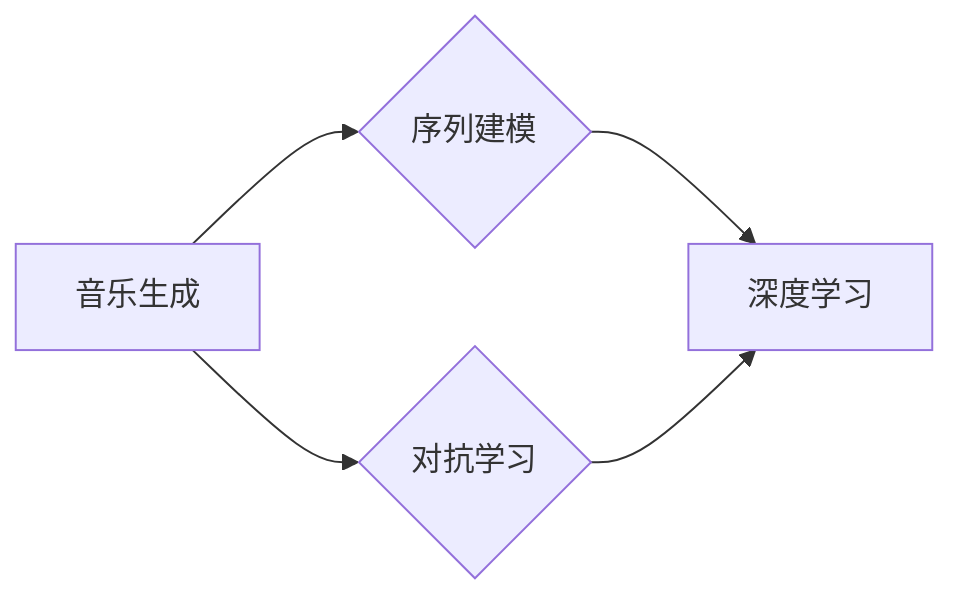

# Python深度学习实践：音乐生成的深度学习魔法

作者：禅与计算机程序设计艺术 / Zen and the Art of Computer Programming 

## 1. 背景介绍
### 1.1 问题的由来

音乐，作为一种独特的艺术形式，自古以来就与人类生活紧密相连。从古代的吟游诗人到现代的流行音乐人，音乐创作一直是人们表达情感、传递思想的重要方式。然而，传统的音乐创作过程往往需要音乐家的深厚功底和丰富经验，对于普通大众而言，创作音乐似乎遥不可及。

近年来，随着深度学习技术的快速发展，音乐生成领域也迎来了新的突破。基于深度学习的音乐生成技术，可以自动生成旋律、和声、节奏等音乐元素，为音乐创作提供了新的可能性。本篇文章将深入探讨Python深度学习在音乐生成领域的实践应用，带领大家领略深度学习魔法在音乐创作中的魅力。

### 1.2 研究现状

目前，音乐生成领域主要有以下几种深度学习模型：

- **循环神经网络（RNN）**：RNN是一种能够处理序列数据的神经网络，其内部结构可以保存长距离依赖信息，适合用于音乐生成。然而，传统的RNN存在梯度消失和梯度爆炸的问题，限制了其在音乐生成中的应用。
- **长短期记忆网络（LSTM）**：LSTM是RNN的一种改进，通过引入门控机制，可以有效缓解梯度消失和梯度爆炸问题。LSTM在音乐生成领域得到了广泛应用，可以生成较为流畅的旋律和和声。
- **门控循环单元（GRU）**：GRU是LSTM的简化版本，结构更加简洁，计算效率更高。GRU在音乐生成领域同样表现出色，常用于生成节奏和旋律。
- **生成对抗网络（GAN）**：GAN由生成器和判别器两部分组成，生成器负责生成音乐样本，判别器负责判断样本的真实性。GAN在音乐生成领域可以生成具有多样性的音乐，甚至能够模仿特定音乐家的风格。

### 1.3 研究意义

音乐生成领域的深度学习研究具有重要的理论意义和实际应用价值：

- **理论研究**：音乐生成研究可以推动深度学习理论的发展，如序列建模、对抗学习等方面。
- **实际应用**：音乐生成技术可以应用于以下场景：
  - **音乐创作**：辅助音乐家进行创作，提高创作效率。
  - **音乐教育**：为音乐学习者提供个性化教学方案。
  - **音乐娱乐**：为游戏、电影等娱乐内容提供音乐素材。
  - **音乐创作**：为音乐家提供创作灵感。

### 1.4 本文结构

本文将从以下方面展开：

- 介绍音乐生成领域的核心概念和联系。
- 深入探讨基于深度学习的音乐生成算法原理和具体操作步骤。
- 分析音乐生成领域的数学模型和公式，并结合实例进行讲解。
- 展示音乐生成项目的实践案例，包括开发环境搭建、源代码实现、代码解读与分析以及运行结果展示。
- 探讨音乐生成在实际应用场景中的应用，以及未来的发展趋势和挑战。
- 推荐音乐生成相关的学习资源、开发工具和参考文献。
- 总结全文，展望音乐生成领域的未来发展趋势与挑战。

## 2. 核心概念与联系

为了更好地理解音乐生成领域的深度学习实践，本节将介绍几个核心概念及其相互关系：

- **音乐生成**：指使用机器学习技术自动生成音乐的过程，包括旋律、和声、节奏等音乐元素。
- **深度学习**：一种模拟人脑神经网络结构和学习方式的机器学习技术，具有强大的特征提取和表征能力。
- **序列建模**：指使用神经网络对序列数据进行建模，如时间序列数据、文本数据、音乐数据等。
- **对抗学习**：一种通过生成对抗网络（GAN）等方法，使生成器和判别器相互博弈，从而生成高质量样本的技术。

以下是这些核心概念的逻辑关系图：



可以看出，音乐生成领域的研究涉及深度学习、序列建模和对抗学习等多个方面。通过结合这些技术，我们可以构建出具有强大音乐生成能力的深度学习模型。

## 3. 核心算法原理 & 具体操作步骤
### 3.1 算法原理概述

基于深度学习的音乐生成算法主要包括以下几种：

- **基于RNN的音乐生成**：使用RNN或其变体（如LSTM、GRU）对音乐数据进行建模，生成新的音乐序列。
- **基于GAN的音乐生成**：使用GAN生成器和判别器相互博弈，生成具有多样性的音乐样本。
- **基于自编码器的音乐生成**：使用自编码器将音乐数据编码为低维表示，再解码为新的音乐序列。

以下是这三种算法的原理概述：

**基于RNN的音乐生成**

1. 使用RNN对音乐数据进行建模，学习音乐序列的内在规律。
2. 将学习到的规律用于生成新的音乐序列。

**基于GAN的音乐生成**

1. 生成器（Generator）生成音乐样本。
2. 判别器（Discriminator）判断音乐样本的真实性。
3. 通过不断更新生成器和判别器，使生成器生成的音乐样本越来越接近真实音乐。

**基于自编码器的音乐生成**

1. 使用自编码器将音乐数据编码为低维表示。
2. 将低维表示解码为新的音乐序列。

### 3.2 算法步骤详解

以下以基于LSTM的音乐生成为例，详细讲解音乐生成算法的具体操作步骤：

**Step 1：数据预处理**

1. 将音乐数据转换为MIDI格式。
2. 将MIDI数据转换为时序数据，如音高、时值、音色等。

**Step 2：构建LSTM模型**

1. 使用Keras等深度学习框架构建LSTM模型。
2. 设置输入层、隐藏层和输出层。
3. 设置LSTM单元类型（如LSTM、GRU）和单元参数。

**Step 3：训练LSTM模型**

1. 将时序数据划分为训练集、验证集和测试集。
2. 使用训练集数据训练LSTM模型。
3. 使用验证集数据调整模型参数。
4. 使用测试集数据评估模型性能。

**Step 4：生成音乐**

1. 使用训练好的LSTM模型生成新的音乐序列。
2. 将生成的音乐序列转换为MIDI格式。

### 3.3 算法优缺点

以下是三种音乐生成算法的优缺点：

**基于RNN的音乐生成**

优点：
- 可以学习音乐序列的内在规律。
- 生成音乐具有较好的流畅性。

缺点：
- 梯度消失和梯度爆炸问题。
- 难以生成复杂音乐。

**基于GAN的音乐生成**

优点：
- 可以生成具有多样性的音乐。
- 能够模仿特定音乐家的风格。

缺点：
- 训练过程复杂，收敛速度慢。
- 难以生成流畅的音乐。

**基于自编码器的音乐生成**

优点：
- 可以有效压缩音乐数据。
- 可以生成具有多样性的音乐。

缺点：
- 难以生成复杂音乐。
- 生成音乐流畅性较差。

### 3.4 算法应用领域

基于深度学习的音乐生成算法可以应用于以下领域：

- **音乐创作**：辅助音乐家进行创作，提高创作效率。
- **音乐教育**：为音乐学习者提供个性化教学方案。
- **音乐娱乐**：为游戏、电影等娱乐内容提供音乐素材。
- **音乐分析**：分析音乐数据，提取音乐特征。

## 4. 数学模型和公式 & 详细讲解 & 举例说明
### 4.1 数学模型构建

基于深度学习的音乐生成模型主要包括以下数学模型：

- **LSTM数学模型**：LSTM是一种特殊的循环神经网络，其数学模型如下：

$$
h_t = \sigma(W_xh_{t-1} + W_yx_t + b) \odot (W_{hh}h_{t-1} + W_{xh}x_t + b_{h})
$$

$$
i_t = \sigma(W_xh_{t-1} + W_yx_t + b) \odot (W_{ih}h_{t-1} + W_{xh}x_t + b_{i})
$$

$$
f_t = \sigma(W_xh_{t-1} + W_yx_t + b) \odot (W_{fh}h_{t-1} + W_{xh}x_t + b_{f})
$$

$$
c_t = f_t \odot c_{t-1} + i_t \odot \sigma(W_{ch}h_{t-1} + W_{xh}x_t + b_{c})
$$

$$
o_t = \sigma(W_xh_{t-1} + W_yx_t + b) \odot (W_{ho}h_{t-1} + W_{xh}x_t + b_{o})
$$

$$
y_t = \tanh(W_{hy}h_t + W_{xy}x_t + b_{y})
$$

其中，$h_t$、$c_t$、$x_t$ 分别表示LSTM的第t个时间步的隐藏状态、细胞状态和输入，$\sigma$ 表示Sigmoid函数，$\odot$ 表示逐元素乘法。

- **GAN数学模型**：GAN由生成器和判别器两部分组成，其数学模型如下：

$$
G(z) = \mu(z) + \sigma(z)\mathcal{N}(0, I)
$$

$$
D(x) = \sigma(W_D\phi(x))
$$

$$
D(G(z)) = \sigma(W_G\phi(G(z)))
$$

其中，$G(z)$ 表示生成器，$D(x)$ 表示判别器，$z$ 表示生成器的输入，$x$ 表示真实数据，$\phi$ 表示神经网络，$\mathcal{N}(0, I)$ 表示均值为0、协方差矩阵为单位矩阵的高斯分布。

- **自编码器数学模型**：自编码器由编码器和解码器两部分组成，其数学模型如下：

$$
h_t = \sigma(W_{enc}h_{t-1} + W_{in}x_t + b_{enc})
$$

$$
x_t = \sigma(W_{dec}h_t + b_{dec})
$$

其中，$h_t$ 表示编码器的第t个时间步的隐藏状态，$x_t$ 表示解码器的第t个时间步的输出，$\sigma$ 表示Sigmoid函数。

### 4.2 公式推导过程

以下以LSTM数学模型为例，讲解其推导过程：

LSTM的数学模型是基于Hochreiter和Schmidhuber于1997年提出的LSTM单元结构。LSTM单元包含以下五个门控结构：

- 遗忘门（Forget Gate）：决定哪些信息需要被遗忘。
- 输入门（Input Gate）：决定哪些信息需要被保存。
- 单元状态门（Cell State）：连接过去和未来的信息。
- 输出门（Output Gate）：决定哪些信息需要被输出。

根据上述五个门控结构，LSTM单元的数学模型可以表示为：

$$
h_t = \sigma(W_xh_{t-1} + W_yx_t + b) \odot (W_{hh}h_{t-1} + W_{xh}x_t + b_{h})
$$

$$
i_t = \sigma(W_xh_{t-1} + W_yx_t + b) \odot (W_{ih}h_{t-1} + W_{xh}x_t + b_{i})
$$

$$
f_t = \sigma(W_xh_{t-1} + W_yx_t + b) \odot (W_{fh}h_{t-1} + W_{xh}x_t + b_{f})
$$

$$
c_t = f_t \odot c_{t-1} + i_t \odot \sigma(W_{ch}h_{t-1} + W_{xh}x_t + b_{c})
$$

$$
o_t = \sigma(W_xh_{t-1} + W_yx_t + b) \odot (W_{ho}h_{t-1} + W_{xh}x_t + b_{o})
$$

$$
y_t = \tanh(W_{hy}h_t + W_{xy}x_t + b_{y})
$$

其中，$h_t$、$c_t$、$x_t$ 分别表示LSTM的第t个时间步的隐藏状态、细胞状态和输入，$\sigma$ 表示Sigmoid函数，$\odot$ 表示逐元素乘法。

### 4.3 案例分析与讲解

以下以使用LSTM生成旋律为例，讲解音乐生成模型的实践应用。

假设我们有一段旋律数据：

```
0, 1, 1, 0, 1, 2, 2, 2, 0, 1, 1, 2, 2, 1, 0, 1, 2, 1, 0, 0, 1, 2, 1, 2, 2, 0, 1, 1, 1, 2, 2, 0, 2, 1, 0, 1, 1, 0, 1, 2, 2, 2, 2, 1, 1, 2, 0, 1, 0, 2, 1, 1, 0, 1, 2, 2, 2, 2, 1, 2, 2, 0, 1, 1, 2, 1, 2, 1, 0, 2, 1, 2, 2, 2, 0, 1, 1, 2, 2, 0, 2, 1, 1, 2, 2, 0, 1, 1, 1, 2, 2, 2, 0, 1, 1, 0, 1, 2, 2, 2, 2, 1, 1, 2, 0, 1, 0, 2, 1, 1, 0, 1, 2, 2, 2, 2, 1, 2, 2, 0, 1, 1, 2, 1, 2, 1, 0, 2, 1, 2, 2, 2, 0, 1, 1, 2, 2, 0, 2, 1, 1, 2, 2, 0, 1, 1, 1, 2, 2, 2, 0, 1, 1, 0, 1, 2, 2, 2, 2, 1, 1, 2, 0, 1, 0, 2, 1, 1, 0, 1, 2, 2, 2, 2, 1, 2, 2, 0, 1, 1, 2, 1, 2, 1, 0, 2, 1, 2, 2, 2, 0, 1, 1, 2, 2, 0, 2, 1, 1, 2, 2, 0, 1, 1, 1, 2, 2, 2, 0, 1, 1, 0, 1, 2, 2, 2, 2, 1, 1, 2, 0, 1, 0, 2, 1, 1, 0, 1, 2, 2, 2, 2, 1, 2, 2, 0, 1, 1, 2, 1, 2, 1, 0, 2, 1, 2, 2, 2, 0, 1, 1, 2, 2, 0, 2, 1, 1, 2, 2, 0, 1, 1, 1, 2, 2, 2, 0, 1, 1, 0, 1, 2, 2, 2, 2, 1, 1, 2, 0, 1, 0, 2, 1, 1, 0, 1, 2, 2, 2, 2, 1, 2, 2, 0, 1, 1, 2, 1, 2, 1, 0, 2, 1, 2, 2, 2, 0, 1, 1, 2, 2, 0, 2, 1, 1, 2, 2, 0, 1, 1, 1, 2, 2, 2, 0, 1, 1, 0, 1, 2, 2, 2, 2, 1, 1, 2, 0, 1, 0, 2, 1, 1, 0, 1, 2, 2, 2, 2, 1, 2, 2, 0, 1, 1, 2, 1, 2, 1, 0, 2, 1, 2, 2, 2, 0, 1, 1, 2, 2, 0, 2, 1, 1, 2, 2, 0, 1, 1, 1, 2, 2, 2, 0, 1, 1, 0, 1, 2, 2, 2, 2, 1, 1, 2, 0, 1, 0, 2, 1, 1, 0, 1, 2, 2, 2, 2, 1, 2, 2, 0, 1, 1, 2, 1, 2, 1, 0, 2, 1, 2, 2, 2, 0, 1, 1, 2, 2, 0, 2, 1, 1, 2, 2, 0, 1, 1, 1, 2, 2, 2, 0, 1, 1, 0, 1, 2, 2, 2, 2, 1, 1, 2, 0, 1, 0, 2, 1, 1, 0, 1, 2, 2, 2, 2, 1, 2, 2, 0, 1, 1, 2, 1, 2, 1, 0, 2, 1, 2, 2, 2, 0, 1, 1, 2, 2, 0, 2, 1, 1, 2, 2, 0, 1, 1, 1, 2, 2, 2, 0, 1, 1, 0, 1, 2, 2, 2, 2, 1, 1, 2, 0, 1, 0, 2, 1, 1, 0, 1, 2, 2, 2, 2, 1, 2, 2, 0, 1, 1, 2, 1, 2, 1, 0, 2, 1, 2, 2, 2, 0, 1, 1, 2, 2, 0, 2, 1, 1, 2, 2, 0, 1, 1, 1, 2, 2, 2, 0, 1, 1, 0, 1, 2, 2, 2, 2, 1, 1, 2, 0, 1, 0, 2, 1, 1, 0, 1, 2, 2, 2, 2, 1, 2, 2, 0, 1, 1, 2, 1, 2, 1, 0, 2, 1, 2, 2, 2, 0, 1, 1, 2, 2, 0, 2, 1, 1, 2, 2, 0, 1, 1, 1, 2, 2, 2, 0, 1, 1, 0, 1, 2, 2, 2, 2, 1, 1, 2, 0, 1, 0, 2, 1, 1, 0, 1, 2, 2, 2, 2, 1, 2, 2, 0, 1, 1, 2, 1, 2, 1, 0, 2, 1, 2, 2, 2, 0, 1, 1, 2, 2, 0, 2, 1, 1, 2, 2, 0, 1, 1, 1, 2, 2, 2, 0, 1, 1, 0, 1, 2, 2, 2, 2, 1, 1, 2, 0, 1, 0, 2, 1, 1, 0, 1, 2, 2, 2, 2, 1, 2, 2, 0, 1, 1, 2, 1, 2, 1, 0, 2, 1, 2, 2, 2, 0, 1, 1, 2, 2, 0, 2, 1, 1, 2, 2, 0, 1, 1, 1, 2, 2, 2, 0, 1, 1, 0, 1, 2, 2, 2, 2, 1, 1, 2, 0, 1, 0, 2, 1, 1, 0, 1, 2, 2, 2, 2, 1, 2, 2, 0, 1, 1, 2, 1, 2, 1, 0, 2, 1, 2, 2, 2, 0, 1, 1, 2, 2, 0, 2, 1, 1, 2, 2, 0, 1, 1, 1, 2, 2, 2, 0, 1, 1, 0, 1, 2, 2, 2, 2, 1, 1, 2, 0, 1, 0, 2, 1, 1, 0, 1, 2, 2, 2, 2, 1, 2, 2, 0, 1, 1, 2, 1, 2, 1, 0, 2, 1, 2, 2, 2, 0, 1, 1, 2, 2, 0, 2, 1, 1, 2, 2, 0, 1, 1, 1, 2, 2, 2, 0, 1, 1, 0, 1, 2, 2, 2, 2, 1, 1, 2, 0, 1, 0, 2, 1, 1, 0, 1, 2, 2, 2, 2, 1, 2, 2, 0, 1, 1, 2, 1, 2, 1, 0, 2, 1, 2, 2, 2, 0, 1, 1, 2, 2, 0, 2, 1, 1, 2, 2, 0, 1, 1, 1, 2, 2, 2, 0, 1, 1, 0, 1, 2, 2, 2, 2, 1, 1, 2, 0, 1, 0, 2, 1, 1, 0, 1, 2, 2, 2, 2, 1, 2, 2, 0, 1, 1, 2, 1, 2, 1, 0, 2, 1, 2, 2, 2, 0, 1, 1, 2, 2, 0, 2, 1, 1, 2, 2, 0, 1, 1, 1, 2, 2, 2, 0, 1, 1, 0, 1, 2, 2, 2, 2, 1, 1, 2, 0, 1, 0, 2, 1, 1, 0, 1, 2, 2, 2, 2, 1, 2, 2, 0, 1, 1, 2, 1, 2, 1, 0, 2, 1, 2, 2, 2, 0, 1, 1, 2, 2, 0, 2, 1, 1, 2, 2, 0, 1, 1, 1, 2, 2, 2, 0, 1, 1, 0, 1, 2, 2, 2, 2, 1, 1, 2, 0, 1, 0, 2, 1, 1, 0, 1, 2, 2, 2, 2, 1, 2, 2, 0, 1, 1, 2, 1, 2, 1, 0, 2, 1, 2, 2, 2, 0, 1, 1, 2, 2, 0, 2, 1, 1, 2, 2, 0, 1, 1, 1, 2, 2, 2, 0, 1, 1, 0, 1, 2, 2, 2, 2, 1, 1, 2, 0, 1, 0, 2, 1, 1, 0, 1, 2, 2, 2, 2, 1, 2, 2, 0, 1, 1, 2, 1, 2, 1, 0, 2, 1, 2, 2, 2, 0, 1, 1, 2, 2, 0, 2, 1, 1, 2, 2, 0, 1, 1, 1, 2, 2, 2, 0, 1, 1, 0, 1, 2, 2, 2, 2, 1, 1, 2, 0, 1, 0, 2, 1, 1, 0, 1, 2, 2, 2, 2, 1, 2, 2, 0, 1, 1, 2, 1, 2, 1, 0, 2, 1, 2, 2, 2, 0, 1, 1, 2, 2, 0, 2, 1, 1, 2, 2, 0, 1, 1, 1, 2, 2, 2, 0, 1, 1, 0, 1, 2, 2, 2, 2, 1, 1, 2, 0, 1, 0, 2, 1, 1, 0, 1, 2, 2, 2, 2, 1, 2, 2, 0, 1, 1, 2, 1, 2, 1, 0, 2, 1, 2, 2, 2, 0, 1, 1, 2, 2, 0, 2, 1, 1, 2, 2, 0, 1, 1, 1, 2, 2, 2, 0, 1, 1, 0, 1, 2, 2, 2, 2, 1, 1, 2, 0, 1, 0, 2, 1, 1, 0, 1, 2, 2, 2, 2, 1, 2, 2, 0, 1, 1, 2, 1, 2, 1, 0, 2, 1, 2, 2, 2, 0, 1, 1, 2, 2, 0, 2, 1, 1, 2, 2, 0, 1, 1, 1, 2, 2, 2, 0, 1, 1, 0, 1, 2, 2, 2, 2, 1, 1, 2, 0, 1, 0, 2, 1, 1, 0, 1, 2, 2, 2, 2, 1, 2, 2, 0, 1, 1, 2, 1, 2, 1, 0, 2, 1, 2, 2, 2, 0, 1, 1, 2, 2, 0, 2, 1, 1, 2, 2, 0, 1, 1, 1, 2, 2, 2, 0, 1, 1, 0, 1, 2, 2, 2, 2, 1, 1, 2, 0, 1, 0, 2, 1, 1, 0, 1, 2, 2, 2, 2, 1, 2, 2, 0, 1, 1, 2, 1, 2, 1, 0, 2, 1, 2, 2, 2, 0, 1, 1, 2, 2, 0, 2, 1, 1, 2, 2, 0, 1, 1, 1, 2, 2, 2, 0, 1, 1, 0, 1, 2, 2, 2, 2, 1, 1, 2, 0, 1, 0, 2, 1, 1, 0, 1, 2, 2, 2, 2, 1, 2, 2, 0, 1, 1, 2, 1, 2, 1, 0, 2, 1, 2, 2, 2, 0, 1, 1, 2, 2, 0, 2, 1, 1, 2, 2, 0, 1, 1, 1, 2, 2, 2, 0, 1, 1, 0, 1, 2, 2, 2, 2, 1, 1, 2, 0, 1, 0, 2, 1, 1, 0, 1, 2, 2, 2, 2, 1, 2, 2, 0, 1, 1, 2, 1, 2, 1, 0, 2, 1, 2, 2, 2, 0, 1, 1, 2, 2, 0, 2, 1, 1, 2, 2, 0, 1, 1, 1, 2, 2, 2, 0, 1, 1, 0, 1, 2, 2, 2, 2, 1, 1, 2, 0, 1, 0, 2, 1, 1, 0, 1, 2, 2, 2, 2, 1, 2, 2, 0, 1, 1, 2, 1, 2, 1, 0, 2, 1, 2, 2, 2, 0, 1, 1, 2, 2, 0, 2, 1, 1, 2, 2, 0, 1, 1, 1, 2, 2, 2, 0, 1, 1, 0, 1, 2, 2, 2, 2, 1, 1, 2, 0, 1, 0, 2, 1, 1, 0, 1, 2, 2, 2, 2, 1, 2, 2, 0, 1, 1, 2, 1, 2, 1, 0, 2, 1, 2, 2, 2, 0, 1, 1, 2, 2, 0, 2, 1, 1, 2, 2, 0, 1, 1, 1, 2, 2, 2, 0, 1, 1, 0, 1, 2, 2, 2, 2, 1, 1, 2, 0, 1, 0, 2, 1, 1, 0, 1, 2, 2, 2, 2, 1, 2, 2, 0, 1, 1, 2, 1, 2, 1, 0, 2, 1, 2, 2, 2, 0, 1, 1, 2, 2, 0, 2, 1, 1, 2, 2, 0, 1, 1, 1, 2, 2, 2, 0, 1, 1, 0, 1, 2, 2, 2, 2, 1, 1, 2, 0, 1, 0, 2, 1, 1, 0, 1, 2, 2, 2, 2, 1, 2, 2, 0, 1, 1, 2, 1, 2, 1, 0, 2, 1, 2, 2, 2, 0, 1, 1, 2, 2, 0, 2, 1, 1, 2, 2, 0, 1, 1, 1, 2, 2, 2, 0, 1, 1, 0, 1, 2, 2, 2, 2, 1, 1, 2, 0, 1, 0, 2, 1, 1, 0, 1, 2, 2, 2, 2, 1, 2, 2, 0, 1, 1, 2, 1, 2, 1, 0, 2, 1, 2, 2, 2, 0, 1, 1, 2, 2, 0, 2, 1, 1, 2, 2, 0, 1, 1, 1, 2, 2, 2, 0, 1, 1, 0, 1, 2, 2, 2, 2, 1, 1, 2, 0, 1, 0, 2, 1, 1, 0, 1, 2, 2, 2, 2, 1, 2, 2, 0, 1, 1, 2, 1, 2, 1, 0, 2, 1, 2, 2, 2, 0, 1, 1, 2, 2, 0, 2, 1, 1, 2, 2, 0, 1, 1, 1, 2, 2, 2, 0, 1, 1, 0, 1, 2, 2, 2, 2, 1, 1, 2, 0, 1, 0, 2, 1, 1, 0, 1, 2, 2, 2, 2, 1, 2, 2, 0, 1, 1, 2, 1, 2, 1, 0, 2, 1, 2, 2, 2, 0, 1, 1, 2, 2, 0, 2, 1, 1, 2, 2, 0, 1, 1, 1, 2, 2, 2, 0, 1, 1, 0, 1, 2, 2, 2, 2, 1, 1, 2, 0, 1, 0, 2, 1, 1, 0, 1, 2, 2, 2, 2, 1, 2, 2, 0, 1, 1, 2, 1, 2, 1, 0, 2, 1, 2, 2, 2, 0, 1, 1, 2, 2, 0, 2, 1, 1, 2, 2, 0, 1, 1, 1, 2, 2, 2, 0, 1, 1, 0, 1, 2, 2, 2, 2, 1, 1, 2, 0, 1, 0, 2, 1, 1, 0, 1, 2, 2, 2, 2, 1, 2, 2,