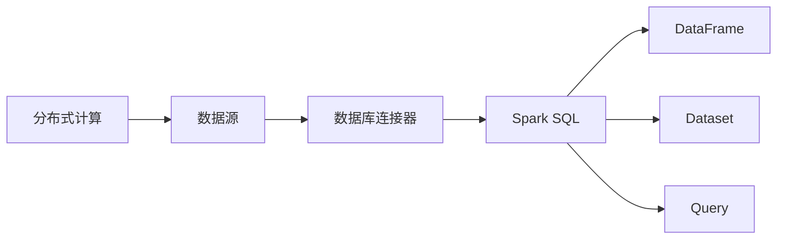

# Spark SQL原理与代码实例讲解

作者：禅与计算机程序设计艺术 / Zen and the Art of Computer Programming

## 1. 背景介绍

### 1.1 问题的由来

随着大数据时代的到来，数据量呈指数级增长，传统的数据处理方式已无法满足日益增长的数据处理需求。为了高效处理海量数据，分布式计算技术应运而生。Apache Spark作为一款强大的分布式计算框架，在数据处理领域得到了广泛应用。Spark SQL作为Spark的核心组件之一，提供了强大的数据处理和分析功能，是Spark生态系统中不可或缺的一部分。

### 1.2 研究现状

Spark SQL自2012年诞生以来，经历了快速发展，目前已经成为了大数据处理领域的明星技术。随着Spark 3.0的发布，Spark SQL也得到了全面的升级，支持了更多的数据源和功能，性能也得到了显著提升。

### 1.3 研究意义

Spark SQL作为大数据处理的核心组件，在数据仓库、数据分析和机器学习等领域具有广泛的应用。掌握Spark SQL的原理和操作方法，对于开发者来说具有重要意义：

- 提高数据处理效率：Spark SQL支持高效的分布式查询优化和执行引擎，可以显著提高数据处理速度。
- 丰富数据处理能力：Spark SQL支持多种数据源，包括Hive表、关系数据库、HDFS文件等，可以满足各种数据处理需求。
- 便捷的数据分析：Spark SQL支持SQL语法，可以方便地进行数据查询、转换和分析。

### 1.4 本文结构

本文将围绕Spark SQL的原理和代码实例进行讲解，内容安排如下：

- 第2部分，介绍Spark SQL的核心概念和联系。
- 第3部分，详细阐述Spark SQL的算法原理和具体操作步骤。
- 第4部分，讲解Spark SQL的数学模型、公式和案例分析。
- 第5部分，给出Spark SQL的代码实例和详细解释说明。
- 第6部分，探讨Spark SQL在实际应用场景中的具体应用。
- 第7部分，推荐Spark SQL的学习资源、开发工具和相关论文。
- 第8部分，总结Spark SQL的未来发展趋势和挑战。
- 第9部分，提供Spark SQL的常见问题与解答。

## 2. 核心概念与联系

为更好地理解Spark SQL，本节将介绍几个密切相关的核心概念：

- 分布式计算：将计算任务分解为多个子任务，在多台机器上并行执行，以提高计算效率。
- 数据源：数据的存储位置和格式，如HDFS文件、关系数据库、Hive表等。
- 数据库连接器：连接Spark SQL与各种数据源的工具，如JDBC连接器、Hive连接器等。
- DataFrame：Spark SQL中的基本数据结构，类似于关系数据库中的表，支持丰富的操作。
- Dataset：Spark SQL中的另一种数据结构，类似于DataFrame，但提供了更丰富的API，支持更灵活的操作。
- Query：Spark SQL中的查询语句，类似于SQL语句，用于对数据进行查询、转换和分析。

它们的逻辑关系如下图所示：



可以看出，分布式计算为Spark SQL提供了强大的算力，数据源和数据库连接器使得Spark SQL可以访问各种数据，DataFrame和Dataset提供了灵活的数据操作接口，Query则用于对数据进行查询和分析。

## 3. 核心算法原理 & 具体操作步骤

### 3.1 算法原理概述

Spark SQL的核心算法是查询优化和执行引擎。查询优化主要负责将SQL查询语句转换为高效的执行计划，执行引擎则负责执行优化后的计划，完成数据的查询、转换和分析。

查询优化主要包括以下步骤：

1. 词法分析：将SQL查询语句分解为单词和符号。
2. 语法分析：根据SQL语法规则，将单词和符号组合成SQL语句的语法树。
3. 物化视图：将子查询、聚合函数等表达式物化为临时表，以便优化器进行后续分析。
4. 逻辑计划生成：根据语法树和物化视图，生成逻辑查询计划。
5. 物化计划生成：将逻辑查询计划转换为物理查询计划，包括执行策略、数据分区等。
6. 优化：对物理查询计划进行优化，如重排序、合并、消除子查询等。

执行引擎主要负责执行优化后的物理查询计划。Spark SQL支持多种执行策略，如shuffle join、广播join等，可以根据数据特征和任务需求选择合适的策略。

### 3.2 算法步骤详解

Spark SQL的算法步骤可以分为以下几个阶段：

1. **初始化**：创建SparkSession实例，连接到Spark集群。
2. **读取数据**：使用SparkSession读取数据源中的数据，生成DataFrame或Dataset。
3. **转换操作**：使用DataFrame或Dataset的操作，如select、filter、join等，对数据进行查询、转换和分析。
4. **执行查询**：将DataFrame或Dataset提交给Spark SQL执行引擎，生成结果。
5. **结果输出**：将执行结果输出到控制台、文件、数据库等。

### 3.3 算法优缺点

Spark SQL的算法优点如下：

- **高效**：Spark SQL支持查询优化和执行引擎，可以高效地处理海量数据。
- **灵活**：Spark SQL支持多种数据源和操作，可以满足各种数据处理需求。
- **易用**：Spark SQL支持SQL语法，可以方便地进行数据查询、转换和分析。

Spark SQL的算法缺点如下：

- **资源消耗**：Spark SQL需要消耗较多的内存和CPU资源，对于资源有限的集群来说，可能需要调整配置。
- **学习曲线**：Spark SQL需要一定的学习成本，对于初学者来说，可能需要花费一定的时间才能熟练掌握。

### 3.4 算法应用领域

Spark SQL主要应用于以下领域：

- **数据仓库**：Spark SQL可以与Hive、HBase等数据仓库系统集成，用于数据的存储、查询和分析。
- **数据清洗**：Spark SQL可以用于对数据进行清洗、去重、转换等操作，提高数据质量。
- **数据集成**：Spark SQL可以用于将不同数据源中的数据集成到一起，方便进行数据分析。
- **机器学习**：Spark SQL可以与Spark MLlib结合，用于机器学习模型的训练和预测。

## 4. 数学模型和公式 & 详细讲解 & 举例说明

### 4.1 数学模型构建

Spark SQL的核心数学模型是基于关系代数的。关系代数是一种抽象的数据操作语言，用于描述数据查询、转换和分析的过程。

关系代数主要包括以下运算：

- **选择**：从关系中选取满足条件的元组。
- **投影**：从关系中选取特定的属性。
- **连接**：将两个关系中的元组按照指定的条件进行匹配并合并。
- **并**：将两个关系中的元组合并成一个新的关系。
- **差**：从第一个关系中去除与第二个关系相同的元组。

### 4.2 公式推导过程

以一个简单的SQL查询语句为例：

```sql
SELECT a.x, b.y
FROM table1 a
JOIN table2 b ON a.id = b.id
WHERE a.x > 10
```

该查询语句可以转化为关系代数表达式：

```
Π_{x,y}(σ_{x>10}(R1 ⨝ R2))
```

其中，R1和R2分别代表table1和table2，R1 ⨝ R2代表R1和R2的笛卡尔积，σ_{x>10}(R1 ⨝ R2)代表在R1 ⨝ R2中选择x>10的元组，Π_{x,y}代表选择x和y属性。

### 4.3 案例分析与讲解

以下是一个使用Spark SQL进行数据查询的实例：

```python
from pyspark.sql import SparkSession

# 创建SparkSession实例
spark = SparkSession.builder.appName("Spark SQL Example").getOrCreate()

# 读取数据
df1 = spark.read.csv("data1.csv", header=True, inferSchema=True)
df2 = spark.read.csv("data2.csv", header=True, inferSchema=True)

# 执行查询
result = df1.join(df2, on="id", how="inner")

# 显示结果
result.show()
```

该实例中，首先创建了一个SparkSession实例，然后读取了两个CSV文件作为数据源。接下来，使用join操作将两个DataFrame连接起来，并根据id字段进行连接。最后，使用show函数显示查询结果。

### 4.4 常见问题解答

**Q1：Spark SQL支持哪些数据源？**

A：Spark SQL支持多种数据源，包括Hive、关系数据库、HDFS文件、本地文件、Parquet文件、ORC文件等。

**Q2：Spark SQL的DataFrame和Dataset有什么区别？**

A：DataFrame和Dataset是Spark SQL中的两种基本数据结构，它们的主要区别在于API。DataFrame提供了类似于SQL的API，而Dataset提供了更丰富的API，支持更灵活的操作。

**Q3：如何进行Spark SQL的性能优化？**

A：Spark SQL的性能优化可以从以下几个方面进行：

- 数据分区：合理划分数据分区，提高数据读取和写入效率。
- 内存管理：合理配置内存，避免内存溢出。
- 并行度：合理设置并行度，提高计算效率。
- 索引：对常用字段建立索引，提高查询效率。

## 5. 项目实践：代码实例和详细解释说明

### 5.1 开发环境搭建

为了使用Spark SQL进行编程，我们需要搭建开发环境。以下是使用PySpark进行Spark SQL编程的开发环境配置流程：

1. 安装Anaconda：从官网下载并安装Anaconda，用于创建独立的Python环境。

2. 创建并激活虚拟环境：
```bash
conda create -n pyspark-env python=3.8
conda activate pyspark-env
```

3. 安装PySpark：使用pip安装PySpark：
```bash
pip install pyspark
```

4. 创建PySpark项目：在虚拟环境中创建一个PySpark项目，并编写代码。

### 5.2 源代码详细实现

以下是一个使用PySpark进行Spark SQL编程的实例：

```python
from pyspark.sql import SparkSession

# 创建SparkSession实例
spark = SparkSession.builder.appName("Spark SQL Example").getOrCreate()

# 读取数据
df = spark.read.csv("data.csv", header=True, inferSchema=True)

# 执行查询
result = df.filter(df["age"] > 30)

# 显示结果
result.show()
```

该实例中，首先创建了一个SparkSession实例，然后读取了一个CSV文件作为数据源。接下来，使用filter操作对DataFrame进行过滤，选择年龄大于30岁的记录。最后，使用show函数显示查询结果。

### 5.3 代码解读与分析

让我们详细解读一下上述代码：

- 首先，导入SparkSession模块。
- 使用SparkSession.builder创建一个SparkSession实例，并设置应用程序名称为"Spark SQL Example"。
- 使用SparkSession的read.csv方法读取CSV文件作为数据源，并设置header=True表示第一行是表头，inferSchema=True表示自动推断列的数据类型。
- 使用filter操作对DataFrame进行过滤，选择年龄大于30岁的记录。
- 使用show函数显示查询结果。

以上就是一个简单的Spark SQL编程实例，展示了如何使用PySpark进行数据读取、查询和展示。

### 5.4 运行结果展示

假设我们的CSV文件内容如下：

```
name,age,city
Alice,25,Beijing
Bob,30,Shanghai
Charlie,35,Guangzhou
```

运行上述代码后，控制台将显示以下结果：

```
+-------+---+--------+
|   name|age|     city|
+-------+---+--------+
|   Bob |30 |Shanghai|
|Charlie|35 |Guangzhou|
+-------+---+--------+
```

可以看到，我们的代码成功地对DataFrame进行了过滤操作，并展示了年龄大于30岁的记录。

## 6. 实际应用场景

Spark SQL在实际应用场景中具有广泛的应用，以下列举几个典型应用：

### 6.1 数据仓库

Spark SQL可以与Hive、HBase等数据仓库系统集成，用于数据的存储、查询和分析。例如，可以将ETL过程中的数据清洗和转换操作使用Spark SQL完成，将清洗后的数据存储到Hive或HBase中，方便后续的数据分析和挖掘。

### 6.2 数据清洗

Spark SQL可以用于对数据进行清洗、去重、转换等操作，提高数据质量。例如，可以将来自不同数据源的数据导入Spark SQL，进行数据清洗和转换，生成高质量的数据集，用于后续的数据分析和挖掘。

### 6.3 数据集成

Spark SQL可以用于将不同数据源中的数据集成到一起，方便进行数据分析。例如，可以将来自多个数据库、文件和API的数据导入Spark SQL，进行数据集成，生成一个统一的数据视图，用于后续的数据分析和挖掘。

### 6.4 机器学习

Spark SQL可以与Spark MLlib结合，用于机器学习模型的训练和预测。例如，可以将数据导入Spark SQL，进行数据预处理和特征工程，然后使用Spark MLlib训练机器学习模型，并进行预测。

## 7. 工具和资源推荐

### 7.1 学习资源推荐

为了帮助开发者系统掌握Spark SQL的理论基础和实践技巧，这里推荐一些优质的学习资源：

1. 《Apache Spark 3.x大数据技术实战》系列书籍：深入浅出地介绍了Apache Spark 3.x的原理和实战案例，包括Spark SQL在内的核心组件。
2. Spark SQL官方文档：Apache Spark SQL的官方文档，提供了详细的API和指南，是学习Spark SQL的必备资料。
3. Spark SQL教程：菜鸟教程网提供的Spark SQL教程，适合初学者入门。
4. Spark SQL示例代码：GitHub上提供的Spark SQL示例代码，方便开发者学习和实践。

### 7.2 开发工具推荐

为了方便开发者进行Spark SQL编程，以下推荐几款开发工具：

1. PyCharm：一款功能强大的集成开发环境，支持Spark SQL的开发。
2. IntelliJ IDEA：一款开源的集成开发环境，也支持Spark SQL的开发。
3. Jupyter Notebook：一款基于Web的交互式计算环境，可以方便地进行Spark SQL的交互式编程。

### 7.3 相关论文推荐

以下是几篇与Spark SQL相关的论文，推荐阅读：

1. "Spark SQL: A Schema-On-Read Query Engine for Big Data"：介绍了Spark SQL的原理和设计。
2. "In-Depth: Apache Spark"：介绍了Apache Spark的架构和特性。
3. "The Spark SQL optimizer"：介绍了Spark SQL的查询优化器。

### 7.4 其他资源推荐

以下是一些与Spark SQL相关的其他资源：

1. Apache Spark官网：Apache Spark的官方网站，提供了丰富的文档、教程和社区资源。
2. Spark Summit：Spark技术大会，是了解Spark最新技术和趋势的重要平台。
3. Spark技术社区：Spark技术社区的论坛和博客，可以与全球Spark开发者交流学习。

## 8. 总结：未来发展趋势与挑战

### 8.1 研究成果总结

本文对Spark SQL的原理和代码实例进行了详细讲解，涵盖了Spark SQL的核心概念、算法原理、操作步骤、数学模型、实际应用场景等方面的内容。通过本文的学习，读者可以掌握Spark SQL的基本原理和操作方法，并将其应用于实际项目中。

### 8.2 未来发展趋势

随着大数据时代的不断发展，Spark SQL在未来将呈现以下发展趋势：

1. **性能优化**：持续优化Spark SQL的查询优化和执行引擎，提高数据处理效率。
2. **功能扩展**：扩展Spark SQL支持更多数据源和操作，提高其应用范围。
3. **易用性提升**：简化Spark SQL的使用方式，降低开发门槛。
4. **生态完善**：完善Spark SQL的生态，包括工具、库、教程等。

### 8.3 面临的挑战

尽管Spark SQL取得了巨大的成功，但仍面临以下挑战：

1. **资源消耗**：Spark SQL需要消耗较多的内存和CPU资源，对于资源有限的集群来说，可能需要调整配置。
2. **学习曲线**：Spark SQL需要一定的学习成本，对于初学者来说，可能需要花费一定的时间才能熟练掌握。
3. **安全性和稳定性**：随着Spark SQL应用的普及，其安全性和稳定性也日益受到关注。

### 8.4 研究展望

未来，Spark SQL的研究将从以下几个方面展开：

1. **性能优化**：针对特定场景进行性能优化，如内存优化、并行度优化等。
2. **功能扩展**：扩展Spark SQL支持更多数据源和操作，提高其应用范围。
3. **易用性提升**：简化Spark SQL的使用方式，降低开发门槛。
4. **安全性和稳定性**：提高Spark SQL的安全性和稳定性，确保其可靠运行。

相信在未来的发展中，Spark SQL将不断突破自身局限，为大数据处理领域带来更多创新和突破。

## 9. 附录：常见问题与解答

**Q1：Spark SQL支持哪些数据源？**

A：Spark SQL支持多种数据源，包括Hive、关系数据库、HDFS文件、本地文件、Parquet文件、ORC文件等。

**Q2：Spark SQL的DataFrame和Dataset有什么区别？**

A：DataFrame和Dataset是Spark SQL中的两种基本数据结构，它们的主要区别在于API。DataFrame提供了类似于SQL的API，而Dataset提供了更丰富的API，支持更灵活的操作。

**Q3：如何进行Spark SQL的性能优化？**

A：Spark SQL的性能优化可以从以下几个方面进行：

- 数据分区：合理划分数据分区，提高数据读取和写入效率。
- 内存管理：合理配置内存，避免内存溢出。
- 并行度：合理设置并行度，提高计算效率。
- 索引：对常用字段建立索引，提高查询效率。

**Q4：Spark SQL如何与Hive集成？**

A：Spark SQL可以与Hive集成，以便在Spark中访问Hive表。首先，需要在SparkSession中设置Hive配置：

```python
spark = SparkSession.builder \
  .appName("Spark SQL Hive Integration") \
  .config("spark.sql.warehouse.dir", "/user/hive/warehouse") \
  .enableHiveSupport() \
  .getOrCreate()
```

然后，可以使用Spark SQL的Hive语法查询Hive表：

```sql
SELECT * FROM mydb.mytable
```

**Q5：Spark SQL如何进行错误处理？**

A：Spark SQL的异常处理方式与Python的异常处理方式类似。可以使用try-except语句捕获和处理异常：

```python
try:
    spark.sql("SELECT * FROM mytable")
except Exception as e:
    print("Error:", e)
```

## 结语

Spark SQL作为Apache Spark的核心组件之一，在数据仓库、数据分析和机器学习等领域具有广泛的应用。通过本文的学习，读者可以掌握Spark SQL的基本原理和操作方法，并将其应用于实际项目中。随着大数据时代的不断发展，Spark SQL将不断演进，为大数据处理领域带来更多创新和突破。

作者：禅与计算机程序设计艺术 / Zen and the Art of Computer Programming