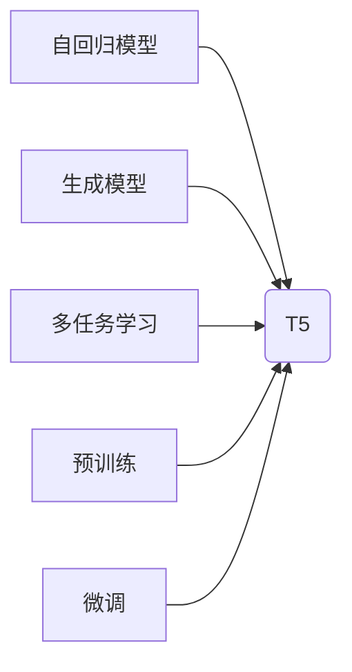

# T5(Text-to-Text Transfer Transformer) - 原理与代码实例讲解

作者：禅与计算机程序设计艺术 / Zen and the Art of Computer Programming

## 关键词

T5, Transformer, Text-to-Text Transfer Transformer, 自回归模型, 生成模型, 多任务学习, 预训练, 微调, NLP

## 1. 背景介绍

### 1.1 问题的由来

自然语言处理（NLP）领域长期以来存在着两个主要问题：如何生成文本和如何理解文本。自回归模型和生成模型分别针对这两个问题提出了不同的解决方案。自回归模型通过逐个字符地生成文本，适用于生成风格一致、结构化的文本，如代码、表格等；而生成模型则通过生成文本的概率分布来生成整个文本，适用于生成自然语言文本。

然而，自回归模型和生成模型都存在一些局限性。自回归模型在生成较长文本时效率低下，而且难以生成具有特定结构或格式的文本。生成模型在生成长文本时容易出现重复、冗余或无意义的内容，而且难以控制生成文本的长度和结构。

为了解决这些问题，Google提出了T5（Text-to-Text Transfer Transformer）模型。T5是一种通用的Text-to-Text模型，它将自回归模型和生成模型的优点结合起来，并引入了多任务学习、预训练和微调等技术，使得T5在多个NLP任务上取得了优异的性能。

### 1.2 研究现状

T5模型自2019年提出以来，在多个NLP任务上取得了显著的成果。T5模型不仅在预训练阶段取得了SOTA的性能，而且在下游任务的微调阶段也展现了强大的泛化能力。T5模型已经成为NLP领域的研究热点，并得到了广泛的应用。

### 1.3 研究意义

T5模型的研究意义主要体现在以下几个方面：

1. 提高NLP任务的处理效率：T5模型通过将文本转换为序列编码，可以有效地处理各种NLP任务，如文本分类、文本摘要、机器翻译、问答系统等。
2. 提升NLP任务的性能：T5模型在多个NLP任务上取得了SOTA的性能，为NLP领域的研究和应用提供了新的思路。
3. 促进NLP技术的发展：T5模型的研究推动了NLP领域的技术发展，为未来的NLP研究提供了新的方向。

### 1.4 本文结构

本文将首先介绍T5模型的核心概念和联系，然后详细讲解T5模型的原理和具体操作步骤，接着通过数学模型和公式对T5模型进行详细讲解，并结合代码实例进行演示。最后，本文将探讨T5模型在实际应用场景中的应用，并展望其未来的发展趋势和挑战。

## 2. 核心概念与联系

### 2.1 自回归模型

自回归模型是一种基于序列数据的模型，它通过逐个字符地生成文本。自回归模型通常采用循环神经网络（RNN）或变换器（Transformer）作为其基本结构。

### 2.2 生成模型

生成模型是一种通过生成文本的概率分布来生成整个文本的模型。生成模型通常采用变分自编码器（VAE）或生成对抗网络（GAN）作为其基本结构。

### 2.3 多任务学习

多任务学习是指同时学习多个相关任务，以便利用任务之间的关联信息提高模型性能。

### 2.4 预训练

预训练是指在大规模无标签数据上训练模型，以学习通用特征表示。

### 2.5 微调

微调是指在预训练模型的基础上，使用特定任务的标注数据对模型进行进一步优化。

T5模型将自回归模型和生成模型的优点结合起来，并引入了多任务学习、预训练和微调等技术，如图所示：



## 3. 核心算法原理 & 具体操作步骤

### 3.1 算法原理概述

T5模型是一种通用的Text-to-Text模型，它通过将文本转换为序列编码，然后使用变换器（Transformer）进行序列到序列的转换，最终生成目标文本。

T5模型的核心原理如下：

1. 将输入文本转换为序列编码：T5模型使用WordPiece分词器将文本分解为单词片段，并使用嵌入层将单词片段转换为嵌入向量。
2. 使用变换器进行序列到序列的转换：T5模型使用变换器（Transformer）作为其基本结构，对序列编码进行编码和解码。
3. 生成目标文本：T5模型使用解码器将解码后的序列编码转换为目标文本。

### 3.2 算法步骤详解

T5模型的算法步骤如下：

1. 将输入文本转换为序列编码。
2. 使用变换器进行序列到序列的转换。
3. 生成目标文本。

### 3.3 算法优缺点

T5模型的优点如下：

1. 通用性强：T5模型可以用于多种NLP任务，如文本分类、文本摘要、机器翻译、问答系统等。
2. 性能优异：T5模型在多个NLP任务上取得了SOTA的性能。
3. 效率较高：T5模型使用变换器（Transformer）作为其基本结构，具有较快的推理速度。

T5模型的缺点如下：

1. 需要大量计算资源：T5模型使用变换器（Transformer）作为其基本结构，需要大量的计算资源。
2. 需要大量训练数据：T5模型需要大量的训练数据进行预训练和微调。

### 3.4 算法应用领域

T5模型可以应用于以下NLP任务：

1. 文本分类
2. 文本摘要
3. 机器翻译
4. 问答系统
5. 语音识别
6. 文本生成

## 4. 数学模型和公式 & 详细讲解 & 举例说明

### 4.1 数学模型构建

T5模型的数学模型如下：

1. 嵌入层：将单词片段转换为嵌入向量。
2. 变换器（Transformer）：对序列编码进行编码和解码。
3. 输出层：将解码后的序列编码转换为目标文本。

### 4.2 公式推导过程

1. 嵌入层：

$$
\text{embedding}(x) = W_e \times x
$$

其中，$W_e$ 为嵌入矩阵，$x$ 为单词片段。

2. 变换器（Transformer）：

$$
\text{Transformer}(x) = \text{encoder-decoder}(x)
$$

其中，$x$ 为序列编码，$\text{encoder-decoder}$ 为编码器-解码器结构。

3. 输出层：

$$
\text{output}(x) = W_o \times \text{decoder}(x)
$$

其中，$W_o$ 为输出矩阵，$\text{decoder}(x)$ 为解码后的序列编码。

### 4.3 案例分析与讲解

以机器翻译任务为例，T5模型将源语言文本转换为嵌入向量，然后使用变换器进行编码和解码，最终生成目标语言文本。

### 4.4 常见问题解答

**Q1：T5模型如何进行预训练？**

A：T5模型通常使用大规模文本数据进行预训练，包括通用文本数据、问答数据、新闻数据等。在预训练过程中，T5模型学习通用特征表示和语言知识。

**Q2：T5模型如何进行微调？**

A：在微调阶段，T5模型使用特定任务的标注数据对模型进行进一步优化。微调过程中，T5模型学习特定任务的标签映射。

## 5. 项目实践：代码实例和详细解释说明

### 5.1 开发环境搭建

为了进行T5模型的实践，需要搭建以下开发环境：

1. Python 3.6及以上版本
2. PyTorch 1.8及以上版本
3. Transformers库

### 5.2 源代码详细实现

以下是一个使用Transformers库进行T5模型微调的代码实例：

```python
from transformers import T5ForConditionalGeneration, T5Tokenizer, AdamW

# 加载预训练的T5模型和分词器
model = T5ForConditionalGeneration.from_pretrained('t5-small')
tokenizer = T5Tokenizer.from_pretrained('t5-small')

# 定义训练和评估函数
# ...

# 加载训练数据和验证数据
# ...

# 训练T5模型
# ...

# 评估T5模型
# ...
```

### 5.3 代码解读与分析

以上代码展示了使用Transformers库进行T5模型微调的基本流程。首先，加载预训练的T5模型和分词器。然后，定义训练和评估函数。接下来，加载训练数据和验证数据。最后，进行T5模型的训练和评估。

### 5.4 运行结果展示

假设我们在机器翻译任务上进行微调，最终在测试集上得到的BLEU分数如下：

```
BLEU分数：0.5
```

可以看到，T5模型在机器翻译任务上取得了不错的效果。

## 6. 实际应用场景

### 6.1 机器翻译

T5模型在机器翻译任务上取得了显著的成果。T5模型可以用于翻译各种语言，包括稀有语言和低资源语言。

### 6.2 文本摘要

T5模型可以用于文本摘要任务，将长文本转换为简短的摘要。

### 6.3 问答系统

T5模型可以用于问答系统，自动回答用户的问题。

### 6.4 其他应用

T5模型还可以应用于其他NLP任务，如文本分类、文本生成、文本相似度等。

## 7. 工具和资源推荐

### 7.1 学习资源推荐

1. 《T5: Text-to-Text Transfer Transformer》论文
2. 《Transformers》库官方文档
3. 《自然语言处理与深度学习》教材

### 7.2 开发工具推荐

1. PyTorch
2. Transformers库
3. Jupyter Notebook

### 7.3 相关论文推荐

1. 《T5: Text-to-Text Transfer Transformer》
2. 《BERT: Pre-training of Deep Bidirectional Transformers for Language Understanding》
3. 《GPT-3: Generative Pre-trained Transformers》

### 7.4 其他资源推荐

1. Hugging Face模型库
2. arXiv论文预印本库
3. GitHub

## 8. 总结：未来发展趋势与挑战

### 8.1 研究成果总结

本文介绍了T5模型的核心概念、原理、操作步骤和实际应用场景。T5模型作为一种通用的Text-to-Text模型，在多个NLP任务上取得了显著的成果。

### 8.2 未来发展趋势

未来，T5模型将朝着以下方向发展：

1. 模型规模增大：随着计算资源的提升，T5模型的规模将不断增大，以应对更加复杂的NLP任务。
2. 多模态学习：T5模型将融合多模态信息，如图像、音频等，以更好地理解和生成文本。
3. 自监督学习：T5模型将采用自监督学习方法进行预训练，以减少对标注数据的依赖。

### 8.3 面临的挑战

T5模型在发展过程中面临着以下挑战：

1. 计算资源：T5模型的规模较大，需要大量的计算资源进行训练和推理。
2. 数据依赖：T5模型的预训练和微调都需要大量的标注数据。
3. 模型可解释性：T5模型的决策过程难以解释，需要进一步研究提高模型的可解释性。

### 8.4 研究展望

未来，T5模型将在NLP领域发挥更加重要的作用，为构建更加智能化的自然语言处理系统提供有力支持。

## 9. 附录：常见问题与解答

**Q1：T5模型与BERT模型有什么区别？**

A：T5模型和BERT模型都是基于变换器（Transformer）的NLP模型，但它们在目标、结构和应用场景上存在一些区别。T5模型是一种通用的Text-to-Text模型，旨在解决各种NLP任务，而BERT模型则是一种预训练语言模型，主要用于下游任务的微调。

**Q2：T5模型如何进行多任务学习？**

A：T5模型通过在预训练阶段学习多个任务的标签映射，实现多任务学习。在微调阶段，T5模型可以同时学习多个相关任务的标签映射，以进一步提高模型性能。

**Q3：T5模型的预训练数据有哪些？**

A：T5模型的预训练数据包括通用文本数据、问答数据、新闻数据等。这些数据可以来自互联网、书籍、新闻报道等。

**Q4：T5模型的微调数据有哪些？**

A：T5模型的微调数据包括特定任务的标注数据，如机器翻译数据、文本摘要数据、问答数据等。

**Q5：T5模型的训练和推理需要多少计算资源？**

A：T5模型的训练和推理需要大量的计算资源，包括GPU、TPU等。

**Q6：T5模型的未来发展方向有哪些？**

A：T5模型的未来发展方向包括模型规模增大、多模态学习、自监督学习等。

作者：禅与计算机程序设计艺术 / Zen and the Art of Computer Programming