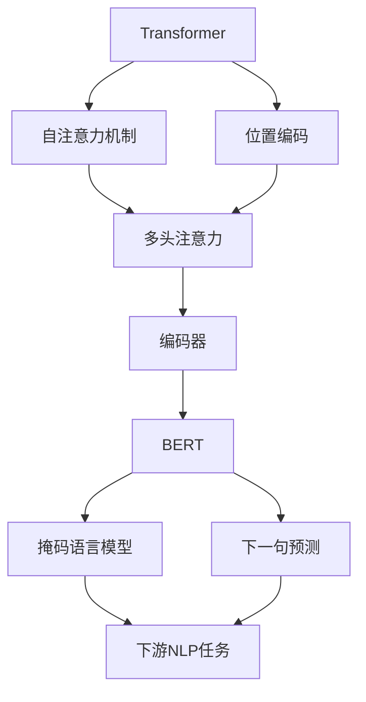

# Transformer大模型实战 汉语的BERT模型

## 1. 背景介绍

### 1.1 问题的由来

在自然语言处理(NLP)领域,机器理解人类语言一直是一个巨大的挑战。传统的NLP模型往往基于统计机器学习方法,需要大量的人工特征工程,且难以捕捉语义和上下文信息。随着深度学习的兴起,神经网络模型展现出了强大的语言理解能力,尤其是Transformer模型的出现,使得NLP领域取得了突破性进展。

BERT(Bidirectional Encoder Representations from Transformers)作为Transformer在NLP领域的杰出代表,自2018年发布以来,在众多下游NLP任务中表现出色,成为语言模型的新标杆。然而,原版BERT模型是基于英语语料训练的,对于汉语等其他语种的支持仍有局限。因此,针对汉语NLP任务,开发适配的BERT模型变得迫在眉睫。

### 1.2 研究现状

近年来,研究人员致力于为汉语开发高质量的BERT模型。其中,谷歌的ALBERT模型、哈工大的BERT-wwm模型、华为的TinyBERT模型等都是值得关注的尝试。这些模型通过预训练策略的优化、模型结构的改进等手段,在一定程度上提升了汉语NLP任务的性能。

然而,现有的汉语BERT模型仍存在一些不足,如预训练语料覆盖面有限、模型规模较小、任务适配性不够等。因此,开发更加通用、强大的汉语BERT模型,仍是当前研究的重点方向。

### 1.3 研究意义

优秀的汉语BERT模型不仅能够显著提升汉语NLP任务的性能,还可以推动相关领域的发展,如机器翻译、问答系统、信息检索等。此外,高质量的语言模型也是构建通用人工智能(AGI)的基础,对于推进人工智能技术的发展具有重要意义。

### 1.4 本文结构

本文将全面介绍Transformer大模型在汉语BERT模型中的实战应用。首先阐述BERT模型的核心概念和原理;然后详细解析BERT模型的数学建模过程;接着通过代码实例展示BERT模型的实现细节;最后探讨BERT模型在实际场景中的应用,并对未来的发展趋势和挑战进行展望。

## 2. 核心概念与联系

BERT模型的核心是Transformer架构,它包含以下关键概念:

1. **自注意力机制(Self-Attention)**: 允许模型捕捉输入序列中任意两个位置之间的依赖关系,克服了RNN的局限性。

2. **位置编码(Positional Encoding)**: 由于Transformer没有递归或卷积结构,因此需要位置编码来提供序列的位置信息。

3. **多头注意力(Multi-Head Attention)**: 将注意力机制进行多路分支运算,以捕捉不同的依赖关系。

4. **编码器(Encoder)**: Transformer的主体部分,由多个相同的编码器层堆叠而成,每层包含多头注意力和前馈神经网络。

BERT模型在Transformer的基础上,引入了两个预训练任务:

1. **掩码语言模型(Masked Language Model)**: 随机掩码部分输入Token,模型需要预测被掩码的Token。

2. **下一句预测(Next Sentence Prediction)**: 判断两个句子是否相邻,以捕捉句子之间的关系。

通过上述两个预训练任务,BERT模型可以学习到深层次的语义和上下文表示,从而在下游NLP任务中表现出色。

## 3. 核心算法原理 & 具体操作步骤

### 3.1 算法原理概述

BERT模型的核心算法原理可以概括为以下三个方面:

1. **Transformer编码器**: BERT使用了Transformer的编码器结构,通过自注意力机制捕捉输入序列中任意两个位置之间的依赖关系,克服了RNN的局限性。

2. **双向编码**: 与传统的单向语言模型不同,BERT采用了双向编码的方式,即在编码时融合了上下文的左右两侧信息,从而获得更加丰富的语义表示。

3. **预训练 + 微调**: BERT先在大规模无标注语料上进行预训练,学习通用的语言表示;然后在特定的下游NLP任务上进行微调,转移通用知识,快速收敛。

### 3.2 算法步骤详解

1. **输入表示**: 将输入文本按Token进行分词,每个Token使用WordPiece嵌入表示,并添加特殊Token [CLS]和[SEP]。

2. **位置编码**: 为每个Token添加位置编码,提供序列的位置信息。

3. **编码器层**: 输入序列通过多个编码器层进行编码,每层包含以下子层:
   
   a. **多头注意力**: 对输入进行多路分支的注意力计算,捕捉不同依赖关系。
   
   b. **残差连接**: 将注意力输出与输入相加,实现残差学习。
   
   c. **层归一化**: 对残差输出进行归一化,加速收敛。
   
   d. **前馈网络**: 两层全连接网络,对每个位置的表示进行非线性映射。

4. **预训练任务**:
   
   a. **掩码语言模型**: 随机掩码部分输入Token,模型需要预测被掩码的Token。
   
   b. **下一句预测**: 判断两个句子是否相邻,以捕捉句子之间的关系。

5. **微调**: 在下游NLP任务上,对BERT模型的部分参数进行微调,使其适应特定任务。

6. **输出层**: 根据不同的NLP任务,设计合适的输出层(如分类、序列标注等)。

### 3.3 算法优缺点

**优点**:

1. **双向编码**: 捕捉上下文的左右两侧信息,获得更丰富的语义表示。
2. **注意力机制**: 克服RNN的局限性,能够更好地捕捉长距离依赖关系。
3. **预训练 + 微调**: 通过预训练学习通用知识,微调时快速收敛,提高效率。
4. **可扩展性强**: 模型规模可以通过增加编码器层数和注意力头数进行扩展。

**缺点**:

1. **训练成本高**: 预训练过程需要消耗大量计算资源和时间。
2. **序列长度限制**: 由于自注意力机制的计算复杂度较高,BERT对输入序列长度有一定限制。
3. **缺乏归纳偏置**: 与CNN相比,BERT缺乏对局部模式的归纳偏置。
4. **预训练-微调不一致**: 预训练和微调任务之间存在一定差异,可能导致知识转移不完全。

### 3.4 算法应用领域

BERT模型及其变体已被广泛应用于各种NLP任务,包括但不限于:

1. **文本分类**: 新闻分类、情感分析、垃圾邮件检测等。
2. **序列标注**: 命名实体识别、关系抽取、事件抽取等。
3. **问答系统**: 阅读理解、开放域问答等。
4. **文本生成**: 文本摘要、机器翻译、对话系统等。
5. **其他任务**: 如代码理解、蛋白质序列分析等。

## 4. 数学模型和公式 & 详细讲解 & 举例说明

### 4.1 数学模型构建

BERT模型的核心是Transformer编码器,其数学模型可以概括为以下几个部分:

1. **输入表示**:

$$\mathbf{X} = [\mathbf{x}_1, \mathbf{x}_2, \dots, \mathbf{x}_n]$$

其中$\mathbf{X}$是输入序列,$\mathbf{x}_i$是第$i$个Token的嵌入表示,包括Token嵌入、分段嵌入和位置嵌入。

2. **多头注意力**:

$$\text{MultiHead}(\mathbf{Q}, \mathbf{K}, \mathbf{V}) = \text{Concat}(\text{head}_1, \dots, \text{head}_h)\mathbf{W}^O$$
$$\text{head}_i = \text{Attention}(\mathbf{Q}\mathbf{W}_i^Q, \mathbf{K}\mathbf{W}_i^K, \mathbf{V}\mathbf{W}_i^V)$$
$$\text{Attention}(\mathbf{Q}, \mathbf{K}, \mathbf{V}) = \text{softmax}(\frac{\mathbf{Q}\mathbf{K}^\top}{\sqrt{d_k}})\mathbf{V}$$

其中$\mathbf{Q}$、$\mathbf{K}$、$\mathbf{V}$分别是查询(Query)、键(Key)和值(Value)矩阵,$h$是注意力头数,$d_k$是每个注意力头的维度。

3. **前馈网络**:

$$\text{FFN}(\mathbf{x}) = \max(0, \mathbf{x}\mathbf{W}_1 + \mathbf{b}_1)\mathbf{W}_2 + \mathbf{b}_2$$

其中$\mathbf{W}_1$、$\mathbf{W}_2$、$\mathbf{b}_1$、$\mathbf{b}_2$是可训练参数。

4. **编码器层**:

$$\mathbf{z}_0 = \mathbf{X}$$
$$\mathbf{z}_l^\prime = \text{MultiHead}(\mathbf{z}_{l-1}, \mathbf{z}_{l-1}, \mathbf{z}_{l-1}) + \mathbf{z}_{l-1}$$
$$\mathbf{z}_l = \text{FFN}(\text{LN}(\mathbf{z}_l^\prime)) + \mathbf{z}_l^\prime$$

其中$\mathbf{z}_l$是第$l$层编码器的输出,$\text{LN}$是层归一化操作。

5. **预训练目标**:

对于掩码语言模型任务,目标是最大化掩码Token的条件概率:

$$\mathcal{L}_{\text{MLM}} = -\mathbb{E}_{\mathbf{x}, \mathbf{x}_\text{mask}}\left[\sum_i \log P(x_i|\mathbf{x}_\text{mask}, \theta)\right]$$

对于下一句预测任务,目标是最大化句子关系的条件概率:

$$\mathcal{L}_{\text{NSP}} = -\mathbb{E}_{\mathbf{x}^{(A)}, \mathbf{x}^{(B)}}\left[\log P(y|\mathbf{x}^{(A)}, \mathbf{x}^{(B)}, \theta)\right]$$

其中$y$是句子关系标签,$\theta$是模型参数。

总的预训练损失函数为:

$$\mathcal{L} = \mathcal{L}_{\text{MLM}} + \mathcal{L}_{\text{NSP}}$$

### 4.2 公式推导过程

1. **自注意力计算**:

我们先来推导自注意力的计算过程。给定查询$\mathbf{Q}$、键$\mathbf{K}$和值$\mathbf{V}$,注意力计算公式为:

$$\begin{aligned}
\text{Attention}(\mathbf{Q}, \mathbf{K}, \mathbf{V}) &= \text{softmax}(\frac{\mathbf{Q}\mathbf{K}^\top}{\sqrt{d_k}})\mathbf{V} \\
&= \sum_{j=1}^n \alpha_{ij}\mathbf{v}_j \\
&= \sum_{j=1}^n \frac{\exp(e_{ij})}{\sum_{k=1}^n \exp(e_{ik})} \mathbf{v}_j
\end{aligned}$$

其中$e_{ij} = \frac{\mathbf{q}_i\mathbf{k}_j^\top}{\sqrt{d_k}}$是注意力能量,$\alpha_{ij}$是注意力权重。

通过上式,我们可以计算出查询$\mathbf{q}_i$对应的注意力加权值$\sum_{j=1}^n \alpha_{ij}\mathbf{v}_j$。对所有查询进行同样操作,即可得到注意力的输出。

2. **多头注意力推导**:

多头注意力是将注意力机制进行多路分支运算,以捕捉不同的依赖关系