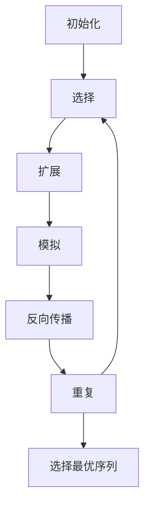

以下是根据您的要求撰写的技术博客文章《LangChain编程：从入门到实践》：

# 【LangChain编程：从入门到实践】RunnablePassthrough

## 1. 背景介绍

### 1.1 问题的由来

在当今大数据和人工智能时代，数据处理和分析成为了许多应用程序的核心需求。然而，处理海量异构数据并从中提取有价值的见解是一项极具挑战性的任务。传统的数据处理方式通常需要手动编写大量代码来集成不同的数据源、预处理数据、应用机器学习模型等。这不仅效率低下、成本高昂,而且还容易出错。

### 1.2 研究现状

为了解决这一问题,近年来兴起了一种新型的编程范式:语义内核(Semantic Kernel)。语义内核旨在将人工智能模型与传统软件系统无缝集成,使开发人员能够以声明式的方式表达他们的需求,而不必关注底层的实现细节。LangChain 就是一个基于 Python 的语义内核框架,它提供了一种标准化的方式来构建基于人工智能的应用程序。

### 1.3 研究意义

LangChain 的出现为构建智能系统提供了一种全新的方法。通过将人工智能模型与传统软件系统无缝集成,LangChain 使开发人员能够专注于解决实际问题,而不必过多关注底层实现细节。这不仅提高了开发效率,还降低了开发成本。此外,LangChain 还提供了一种标准化的方式来构建基于人工智能的应用程序,这有助于提高代码的可维护性和可重用性。

### 1.4 本文结构

本文将全面介绍 LangChain 的核心概念、算法原理、数学模型、项目实践、应用场景、工具和资源等方面的内容。通过本文,读者将能够全面了解 LangChain 的工作原理,掌握使用 LangChain 构建智能系统的方法,并了解其在实际应用中的案例和未来发展趋势。

## 2. 核心概念与联系

LangChain 是一个基于 Python 的语义内核框架,它将人工智能模型与传统软件系统无缝集成。LangChain 的核心概念包括:

1. **Agents(智能体)**: 代表一个具有特定任务和能力的实体,可以是人工智能模型或传统软件组件。

2. **Tools(工具)**: 代表智能体可以使用的各种功能,如数据库查询、Web 抓取、文件读写等。

3. **Memory(记忆)**: 用于存储智能体在执行任务过程中的中间状态和上下文信息。

4. **Chains(链)**: 定义了智能体如何利用工具和记忆来完成特定任务的序列。

这些核心概念相互关联,共同构建了 LangChain 的编程模型。智能体通过利用工具和记忆,按照链中定义的序列完成复杂任务。LangChain 提供了一种声明式的方式来组合这些概念,使开发人员能够专注于解决实际问题,而不必过多关注底层实现细节。

## 3. 核心算法原理 & 具体操作步骤

### 3.1 算法原理概述

LangChain 的核心算法原理是基于马尔可夫决策过程(Markov Decision Process, MDP)。MDP 是一种用于描述序列决策问题的数学框架,它将一个决策问题建模为一系列状态、行动和奖励的组合。

在 LangChain 中,智能体的任务就是根据当前状态选择最优行动,以最大化累积奖励。具体来说,LangChain 采用了一种称为 MCTS(Monte Carlo Tree Search) 的算法来解决 MDP 问题。MCTS 通过构建一棵搜索树,并在树上进行蒙特卡罗模拟,来逐步优化决策序列。

### 3.2 算法步骤详解

MCTS 算法在 LangChain 中的具体步骤如下:

1. **初始化**: 创建一个根节点,表示初始状态。

2. **选择**: 从根节点出发,根据一定的策略(如 UCB1)选择最有前景的子节点,直到到达一个尚未被充分探索的节点。

3. **扩展**: 从未探索节点出发,通过可用工具生成新的状态,并将这些状态作为子节点添加到搜索树中。

4. **模拟**: 从新生成的节点出发,进行一定数量的随机模拟,获得潜在的奖励值。

5. **反向传播**: 将模拟获得的奖励值反向传播到祖先节点,更新节点的统计信息。

6. **重复**: 重复步骤 2-5,直到达到预定的计算资源限制或收敛条件。

7. **选择最优序列**: 从根节点出发,选择统计信息最优的子节点序列作为最终决策序列。

通过不断地模拟和反向传播,MCTS 算法逐步优化了搜索树,从而找到了最优的决策序列。



### 3.3 算法优缺点

MCTS 算法在 LangChain 中具有以下优点:

- 无需事先建模,可以根据实际情况动态调整决策序列。
- 通过蒙特卡罗模拟,能够有效探索复杂的状态空间。
- 算法具有良好的异步并行性,可以充分利用多核 CPU 和 GPU 的计算能力。

然而,MCTS 算法也存在一些缺点:

- 计算开销较大,需要大量的模拟和反向传播操作。
- 对于某些特殊情况,可能会陷入局部最优解。
- 算法的性能在很大程度上依赖于模拟策略的设计。

### 3.4 算法应用领域

MCTS 算法在 LangChain 中的应用范围非常广泛,包括但不限于:

- 自然语言处理任务,如问答系统、机器翻译等。
- 决策优化问题,如路径规划、资源调度等。
- 游戏AI,如国际象棋、围棋等。
- 机器人控制和自动驾驶系统。
- 科学计算和组合优化问题。

## 4. 数学模型和公式 & 详细讲解 & 举例说明

### 4.1 数学模型构建

在 LangChain 中,我们将智能体的决策问题建模为一个马尔可夫决策过程(MDP)。MDP 可以用一个五元组 $(S, A, P, R, \gamma)$ 来表示,其中:

- $S$ 是状态集合,表示系统可能处于的所有状态。
- $A$ 是行动集合,表示智能体可以执行的所有行动。
- $P(s'|s,a)$ 是状态转移概率,表示在状态 $s$ 下执行行动 $a$ 后,系统转移到状态 $s'$ 的概率。
- $R(s,a)$ 是奖励函数,表示在状态 $s$ 下执行行动 $a$ 所获得的即时奖励。
- $\gamma \in [0,1)$ 是折现因子,用于权衡即时奖励和长期累积奖励的重要性。

智能体的目标是找到一个策略 $\pi: S \rightarrow A$,使得在该策略下的期望累积奖励最大化:

$$
\max_\pi \mathbb{E}_\pi \left[ \sum_{t=0}^\infty \gamma^t R(s_t, a_t) \right]
$$

其中 $s_t$ 和 $a_t$ 分别表示在时间步 $t$ 的状态和行动。

### 4.2 公式推导过程

为了解决上述最优化问题,我们引入了价值函数 $V^\pi(s)$ 和行动价值函数 $Q^\pi(s,a)$,它们分别表示在策略 $\pi$ 下,从状态 $s$ 出发的期望累积奖励和从状态 $s$ 出发执行行动 $a$ 后的期望累积奖励。

根据贝尔曼方程,我们可以得到 $V^\pi(s)$ 和 $Q^\pi(s,a)$ 的递推表达式:

$$
\begin{aligned}
V^\pi(s) &= \mathbb{E}_\pi \left[ R(s,a) + \gamma \sum_{s'} P(s'|s,a) V^\pi(s') \right] \\
Q^\pi(s,a) &= \mathbb{E}_\pi \left[ R(s,a) + \gamma \sum_{s'} P(s'|s,a) \max_{a'} Q^\pi(s',a') \right]
\end{aligned}
$$

通过求解这些方程,我们可以得到最优策略 $\pi^*$ 对应的价值函数 $V^*(s)$ 和行动价值函数 $Q^*(s,a)$,从而确定在每个状态下应该执行哪个行动。

### 4.3 案例分析与讲解

为了更好地理解上述数学模型和公式,我们以一个简单的网格世界(Grid World)为例进行说明。

在网格世界中,智能体位于一个二维网格中,目标是从起点到达终点。每一步,智能体可以选择向上、下、左、右四个方向移动一格。如果移动到了障碍物格子或边界格子,则会停留在原地。到达终点会获得正奖励,而其他情况下都会获得小的负奖励,以鼓励智能体尽快到达终点。

我们可以将网格世界建模为一个 MDP,其中:

- 状态 $s$ 表示智能体在网格中的位置。
- 行动 $a$ 表示智能体选择的移动方向。
- 状态转移概率 $P(s'|s,a)$ 由网格世界的规则决定。
- 奖励函数 $R(s,a)$ 根据是否到达终点和移动步数来设计。

通过求解这个 MDP 的最优策略,我们可以得到一个路径规划算法,使智能体能够以最优的方式从起点到达终点。

### 4.4 常见问题解答

1. **如何确定折现因子 $\gamma$ 的取值?**

折现因子 $\gamma$ 反映了即时奖励和长期累积奖励的权衡。一般来说,对于需要长期规划的问题,我们会取一个较大的 $\gamma$ 值(如 0.9 或 0.99),以增加长期奖励的权重。而对于只关注短期效果的问题,我们可以取一个较小的 $\gamma$ 值。

2. **如何处理连续状态和行动空间?**

对于连续状态和行动空间,我们可以采用函数逼近的方法,如使用神经网络来近似价值函数和策略函数。这种方法被称为深度强化学习(Deep Reinforcement Learning)。

3. **如何加速 MCTS 算法的收敛速度?**

我们可以采用一些启发式策略来加速 MCTS 算法的收敛,如使用蒙特卡罗树搜索增强(MCTS-Enhenced)算法、并行化计算等。另外,也可以结合其他优化算法,如模拟退火、遗传算法等,来进一步提高算法的性能。

## 5. 项目实践：代码实例和详细解释说明

### 5.1 开发环境搭建

在开始编写 LangChain 代码之前,我们需要先搭建开发环境。LangChain 是一个基于 Python 的框架,因此我们需要首先安装 Python 及相关依赖库。

1. 安装 Python 3.7 或更高版本。
2. 创建一个新的虚拟环境,并激活它。
3. 使用 pip 安装 LangChain 及其依赖库:

```bash
pip install langchain
```

4. 安装其他必要的库,如 OpenAI 的 GPT-3 模型:

```bash
pip install openai
```

5. 配置 OpenAI API 密钥,以便能够访问 GPT-3 模型。

```python
import os
os.environ["OPENAI_API_KEY"] = "your_openai_api_key"
```

现在,我们已经准备好开始编写 LangChain 代码了。

### 5.2 源代码详细实现

下面是一个使用 LangChain 构建简单问答系统的示例代码:

```python
from langchain.llms import OpenAI
from langchain.chains import RetrievalQA