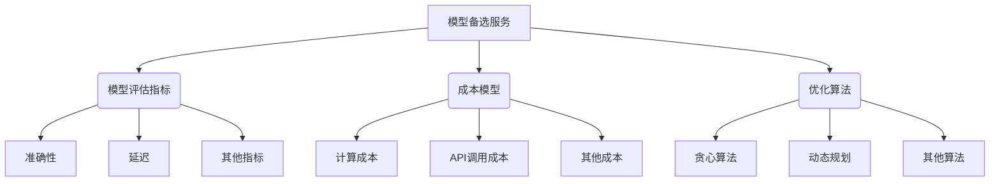

# 【LangChain编程：从入门到实践】模型备选服务

## 1. 背景介绍

### 1.1 问题的由来

在当今的人工智能时代，大型语言模型(LLM)已经成为各种自然语言处理(NLP)任务的核心驱动力。从生成创意文案到构建智能对话系统,LLM的强大能力为我们提供了前所未有的机会。然而,单一的LLM模型通常无法满足所有场景的需求,不同的模型在性能、能力和成本方面存在显著差异。因此,如何在多个可用模型中进行智能选择,以优化特定任务的性能和成本效益,成为了一个亟待解决的问题。

### 1.2 研究现状

目前,大多数现有系统都采用了静态的模型选择策略,即在系统设计阶段就确定了使用哪个LLM模型。这种方式虽然简单,但无法充分利用多个模型的优势,也无法根据实际任务需求进行动态调整。另一方面,一些研究人员提出了基于机器学习的模型选择方法,通过训练一个元模型(meta-model)来预测不同模型在特定任务上的性能。然而,这种方法需要大量的标注数据,而且训练过程复杂且昂贵。

### 1.3 研究意义

为了解决上述问题,LangChain提出了一种新颖的模型备选服务(Model Selector Service),旨在实现动态、智能的LLM模型选择。该服务可以根据任务需求、模型性能和成本约束,自动选择最优的模型组合。这不仅可以提高系统的整体性能,还能够降低运营成本,从而为各种NLP应用带来巨大的价值。

### 1.4 本文结构

本文将全面介绍LangChain中的模型备选服务。我们将首先探讨该服务的核心概念和原理,包括模型评估指标、成本模型和优化算法。接下来,我们将详细阐述模型备选服务的实现细节,包括数学模型、算法流程和代码示例。最后,我们将讨论该服务在实际应用中的场景,以及未来的发展趋势和挑战。

## 2. 核心概念与联系



模型备选服务是LangChain中一个关键的组件,它负责在多个可用的LLM模型中选择最优的模型组合,以满足特定任务的性能和成本约束。该服务的核心概念包括:

1. **模型评估指标(Model Evaluation Metrics)**: 用于衡量不同模型在特定任务上的性能表现,包括准确性、延迟等指标。这些指标将作为优化目标之一。

2. **成本模型(Cost Model)**: 描述了使用不同模型所需的各种成本,如计算成本、API调用成本等。成本模型将作为优化目标之一,与性能指标相平衡。

3. **优化算法(Optimization Algorithm)**: 根据模型评估指标和成本模型,选择最优的模型组合。常见的优化算法包括贪心算法、动态规划等。

这三个核心概念紧密相关,共同构成了模型备选服务的基础。模型评估指标和成本模型定义了优化目标,而优化算法则负责在这些目标下寻找最优解。通过巧妙地平衡性能和成本,模型备选服务可以为各种NLP任务提供高效、经济的模型选择方案。

## 3. 核心算法原理 & 具体操作步骤

### 3.1 算法原理概述

模型备选服务的核心算法原理可以概括为一个约束优化问题。给定一组可用的LLM模型$\mathcal{M} = \{M_1, M_2, \dots, M_n\}$,以及一个特定的NLP任务$\mathcal{T}$,我们需要找到一个模型组合$\mathcal{S} \subseteq \mathcal{M}$,使得在满足一定约束条件的前提下,优化一个目标函数$f(\mathcal{S}, \mathcal{T})$。

目标函数$f(\mathcal{S}, \mathcal{T})$通常是模型评估指标和成本模型的加权组合,例如:

$$f(\mathcal{S}, \mathcal{T}) = \alpha \cdot \text{Accuracy}(\mathcal{S}, \mathcal{T}) - \beta \cdot \text{Cost}(\mathcal{S}, \mathcal{T})$$

其中$\text{Accuracy}(\mathcal{S}, \mathcal{T})$表示模型组合$\mathcal{S}$在任务$\mathcal{T}$上的准确性,而$\text{Cost}(\mathcal{S}, \mathcal{T})$则表示使用该模型组合的总成本。$\alpha$和$\beta$是用于平衡准确性和成本的权重系数。

约束条件可能包括:

- 最大成本限制: $\text{Cost}(\mathcal{S}, \mathcal{T}) \leq C_{\max}$
- 最小准确性要求: $\text{Accuracy}(\mathcal{S}, \mathcal{T}) \geq A_{\min}$
- 其他约束,如延迟、内存占用等

通过解决这个约束优化问题,我们可以得到在给定约束下最优的模型组合$\mathcal{S}^*$。

### 3.2 算法步骤详解

1. **初始化**: 收集所有可用的LLM模型$\mathcal{M}$,以及它们在特定任务$\mathcal{T}$上的模型评估指标和成本信息。

2. **构建目标函数**: 根据模型评估指标和成本模型,构建目标函数$f(\mathcal{S}, \mathcal{T})$,用于衡量模型组合$\mathcal{S}$的综合性能和成本。

3. **设置约束条件**: 根据实际需求,设置一系列约束条件,如最大成本限制、最小准确性要求等。

4. **启发式搜索**: 使用启发式搜索算法(如贪心算法、动态规划等)在模型集合$\mathcal{M}$中寻找最优的模型组合$\mathcal{S}^*$,使得$f(\mathcal{S}^*, \mathcal{T})$达到最优,同时满足所有约束条件。

5. **结果输出**: 输出最优模型组合$\mathcal{S}^*$,以及相应的性能指标和成本信息。

下面是一个使用贪心算法的示例伪代码:

```python
def greedy_model_selector(models, task, max_cost, min_accuracy):
    sorted_models = sort_models_by_accuracy(models, task)
    selected_models = []
    total_cost = 0
    total_accuracy = 0

    for model in sorted_models:
        if total_cost + model.cost <= max_cost:
            selected_models.append(model)
            total_cost += model.cost
            total_accuracy += model.accuracy

            if total_accuracy >= min_accuracy:
                break

    return selected_models
```

在这个示例中,我们首先根据模型在任务$\mathcal{T}$上的准确性对模型集合$\mathcal{M}$进行排序。然后,我们使用贪心策略逐步添加模型到选择集合$\mathcal{S}$中,直到总成本超过最大成本限制$C_{\max}$或总准确性达到最小准确性要求$A_{\min}$为止。最终,我们得到了满足约束条件的最优模型组合$\mathcal{S}^*$。

### 3.3 算法优缺点

模型备选服务的算法具有以下优点:

- **动态性**: 能够根据实际任务需求和约束条件动态选择最优模型组合,而不是静态地固定使用某个模型。
- **高效性**: 通过启发式搜索算法,可以在合理的时间内找到近似最优解,避免了穷举搜索的高计算开销。
- **可扩展性**: 算法可以轻松地扩展到更多模型和更复杂的约束条件,具有良好的可扩展性。

但同时也存在一些缺点和挑战:

- **评估开销**: 需要事先评估每个模型在特定任务上的性能指标和成本信息,这可能是一个昂贵的过程。
- **局部最优**: 启发式搜索算法可能会陷入局部最优解,无法找到全局最优解。
- **动态环境**: 如果模型集合、任务特征或成本模型发生变化,可能需要重新运行算法来获得新的最优解。

### 3.4 算法应用领域

模型备选服务的算法可以广泛应用于各种NLP任务,如机器翻译、文本摘要、问答系统等。它尤其适用于以下场景:

- **多模型集成**: 通过选择多个互补的模型并将它们的输出进行集成,可以提高整体性能。
- **成本敏感型应用**: 对于需要控制成本的应用(如云服务),模型备选服务可以在性能和成本之间寻找最佳平衡点。
- **在线学习系统**: 在线学习系统需要动态调整模型,以适应不断变化的数据分布和任务需求。
- **移动和嵌入式设备**: 受限于计算资源和能源约束,需要选择最优的轻量级模型。

## 4. 数学模型和公式 & 详细讲解 & 举例说明

### 4.1 数学模型构建

为了量化模型评估指标和成本模型,我们需要构建相应的数学模型。假设我们有一个NLP任务$\mathcal{T}$,以及一组可用的LLM模型$\mathcal{M} = \{M_1, M_2, \dots, M_n\}$。

对于每个模型$M_i \in \mathcal{M}$,我们定义以下指标:

- $a_i$: 模型$M_i$在任务$\mathcal{T}$上的准确性
- $l_i$: 模型$M_i$的延迟(或响应时间)
- $c_i$: 使用模型$M_i$的成本

我们的目标是找到一个模型组合$\mathcal{S} \subseteq \mathcal{M}$,使得在满足一定约束条件的前提下,优化一个目标函数$f(\mathcal{S}, \mathcal{T})$。

目标函数$f(\mathcal{S}, \mathcal{T})$可以定义为模型评估指标和成本模型的加权组合,例如:

$$f(\mathcal{S}, \mathcal{T}) = \alpha \cdot \text{Accuracy}(\mathcal{S}, \mathcal{T}) - \beta \cdot \text{Cost}(\mathcal{S}, \mathcal{T})$$

其中$\text{Accuracy}(\mathcal{S}, \mathcal{T})$和$\text{Cost}(\mathcal{S}, \mathcal{T})$分别表示模型组合$\mathcal{S}$在任务$\mathcal{T}$上的综合准确性和总成本。$\alpha$和$\beta$是用于平衡准确性和成本的权重系数。

我们可以将$\text{Accuracy}(\mathcal{S}, \mathcal{T})$定义为模型组合中所有模型准确性的加权平均:

$$\text{Accuracy}(\mathcal{S}, \mathcal{T}) = \sum_{M_i \in \mathcal{S}} w_i a_i$$

其中$w_i$是模型$M_i$的权重,反映了它在模型组合中的重要性。

同样地,我们可以将$\text{Cost}(\mathcal{S}, \mathcal{T})$定义为模型组合中所有模型成本的总和:

$$\text{Cost}(\mathcal{S}, \mathcal{T}) = \sum_{M_i \in \mathcal{S}} c_i$$

约束条件可能包括:

- 最大成本限制: $\text{Cost}(\mathcal{S}, \mathcal{T}) \leq C_{\max}$
- 最小准确性要求: $\text{Accuracy}(\mathcal{S}, \mathcal{T}) \geq A_{\min}$
- 最大延迟限制: $\max_{M_i \in \mathcal{S}} l_i \leq L_{\max}$

通过解决这个约束优化问题,我们可以得到在给定约束下最优的模型组合$\mathcal{S}^*$。

### 4.2 公式推导过程

下面我们将详细推导目标