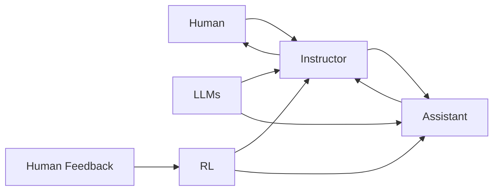

# 【大模型应用开发 动手做AI Agent】CAMEL实战

关键词：大语言模型、CAMEL、AI Agent、对话系统、自然语言处理、机器学习、深度学习

## 1. 背景介绍
### 1.1 问题的由来
随着人工智能技术的飞速发展,大语言模型(Large Language Models, LLMs)已经成为自然语言处理领域的研究热点。LLMs 通过在海量文本数据上进行预训练,可以学习到丰富的语言知识和常识,在问答、对话、文本生成等任务上取得了令人瞩目的成果。然而,如何将强大的 LLMs 应用于实际场景,构建智能化的 AI Agent,仍面临诸多挑战。
### 1.2 研究现状 
目前,业界已经涌现出一批优秀的开源 LLMs,如 GPT-3、PaLM、OPT 等,展现出了 LLMs 在通用自然语言理解和生成方面的巨大潜力。与此同时,一些研究者开始探索如何利用 LLMs 构建 AI Agent。比如 DeepMind 的 Sparrow,通过引入检索增强和人类反馈等技术,实现了一个安全、可控的对话 Agent。微软的 Promptagator 则利用 LLMs 自动生成 Prompt,实现了 AI Agent 的自我迭代优化。
### 1.3 研究意义
LLMs 驱动的 AI Agent 有望在智能客服、虚拟助手、知识问答等领域发挥重要作用,大幅提升人机交互体验。但如何平衡 Agent 的开放性与安全性,如何赋予其更强的推理和任务完成能力,仍有待进一步研究。本文将重点介绍 Anthropic 公司最新提出的 CAMEL(Communicative Agents for "Mind" Exploration of Large Language Models)。通过动手实践,讲解如何利用 CAMEL 构建一个功能丰富的 AI Agent。
### 1.4 本文结构
本文将分为以下几个部分:
- 介绍 CAMEL 的核心概念与系统架构
- 详解 CAMEL 的核心算法原理与关键步骤
- 构建 CAMEL 的数学模型,并给出详细的公式推导与案例分析
- 动手实践:利用 CAMEL 构建一个 AI Agent,并解读关键代码
- 探讨 CAMEL 驱动的 AI Agent 的实际应用场景与未来发展趋势
- 总结全文,并对 CAMEL 的研究前景进行展望

## 2. 核心概念与联系
CAMEL 的核心理念是利用 LLMs 构建communicative agents,通过agent之间的多轮对话交互,探索 LLMs 的认知能力边界(exploration of the "mind" of LLMs)。与传统的 AI Agent 相比,CAMEL 的特点包括:
- 采用 instruction tuning 方式训练 LLMs,使其能够理解并执行人类指令
- 引入 multi-agent 交互范式,通过 agent 之间的对话协作完成复杂任务
- 将 agent 视作认知系统,通过对话探索其心智(theory of mind)
- 支持 few-shot learning,可以根据用户需求快速生成新的 agent

下图展示了 CAMEL 的总体架构。CAMEL 包含 Instructor 和 Assistant 两类 agent。Instructor 负责向 Assistant 下达指令,Assistant 则根据指令执行具体任务。两类 agent 通过多轮对话不断迭代,协同完成用户提出的复杂需求。整个系统以 LLMs 为基础,利用 reinforcement learning 和 human feedback 不断优化 agent 的策略。

## 3. 核心算法原理 & 具体操作步骤
### 3.1 算法原理概述
CAMEL 的核心算法包括两个部分:instruction tuning 和 reinforcement learning。前者用于训练 LLMs 理解人类指令,后者用于优化 agent 的对话策略。
### 3.2 算法步骤详解
Instruction tuning 的主要步骤如下:
1. 准备大规模的指令-响应数据对 $\{(x_i, y_i)\}_{i=1}^N$,其中 $x_i$ 为人类指令,$y_i$ 为相应的 agent 响应。
2. 在 LLMs 上添加一个 text-to-text 的输出层,将指令 $x_i$ 映射为响应 $y_i$。
3. 最小化以下损失函数:

$$ \mathcal{L}(\theta) = -\frac{1}{N}\sum_{i=1}^N \log p_\theta(y_i|x_i) $$

其中 $\theta$ 为 LLMs 的参数。

Reinforcement learning 的主要步骤如下:
1. 将 agent 的策略建模为 $\pi_\theta(a|s)$,其中 $s$ 为对话历史,$a$ 为 agent 的响应。
2. 通过与人类交互收集数据 $\{(s_i, a_i, r_i)\}_{i=1}^M$,其中 $r_i$ 为人类对 $a_i$ 的评分。
3. 优化以下目标函数:

$$ J(\theta) = \mathbb{E}_{(s,a) \sim \pi_\theta}[r(s,a)] $$

其中 $r(s,a)$ 为对话质量的评估函数,可以由人类反馈或启发式规则定义。

### 3.3 算法优缺点
CAMEL 的优点在于:
- 利用 LLMs 强大的语言理解和生成能力,使 agent 具备开放域对话的能力
- 通过 instruction tuning 和 RL,agent 可以持续学习和优化
- 多 agent 交互有助于解决复杂任务,并探索 LLMs 的认知边界

CAMEL 的不足之处包括:
- 需要大量高质量的指令数据和人类反馈,成本较高
- RL 训练不稳定,容易出现对抗性或无意义的对话
- 缺乏对 agent 行为的可解释性和可控性

### 3.4 算法应用领域
CAMEL 在以下领域具有广阔的应用前景:
- 智能客服:通过多轮对话了解用户需求并提供个性化服务
- 虚拟助手:执行日程管理、信息检索等任务
- 知识问答:根据海量文本构建知识库,回答用户问题
- 医疗健康:为患者提供智能诊断和健康指导

## 4. 数学模型和公式 & 详细讲解 & 举例说明
### 4.1 数学模型构建
我们将 CAMEL 建模为一个 multi-agent 强化学习问题。考虑有两个 agent:Instructor 和 Assistant,分别用 $I$ 和 $A$ 表示。令 $S$ 为对话状态空间,$A^I$ 和 $A^A$ 分别为 $I$ 和 $A$ 的动作空间。一次完整的对话可以表示为:

$$ \tau = (s_0, a_0^I, s_1, a_1^A, s_2, \dots) $$

其中 $s_0$ 为初始对话状态(通常为用户输入的 query),$a_t^I \in A^I$ 为 $I$ 在 $t$ 时刻采取的动作(生成指令),$a_t^A \in A^A$ 为 $A$ 在 $t$ 时刻采取的动作(生成响应)。

我们的目标是寻找两个 agent 的最优策略 $\pi_I^*(a^I|s)$ 和 $\pi_A^*(a^A|s)$,使得整个对话的期望回报最大化:

$$ \max_{\pi_I, \pi_A} \mathbb{E}_{\tau \sim (\pi_I, \pi_A)}[R(\tau)] $$

其中 $R(\tau) = \sum_{t=0}^\infty \gamma^t r_t$ 为对话 $\tau$ 的总回报,$\gamma \in [0,1]$ 为折扣因子,$r_t$ 为第 $t$ 轮对话的奖励。

### 4.2 公式推导过程
根据 policy gradient 定理,我们可以得到 $\pi_I$ 和 $\pi_A$ 的梯度:

$$
\begin{aligned}
\nabla_{\theta_I} J(\theta_I) &= \mathbb{E}_{\tau \sim (\pi_I, \pi_A)} \left[ \sum_{t=0}^\infty \nabla_{\theta_I} \log \pi_I(a_t^I|s_t) \cdot Q^{\pi_I, \pi_A}(s_t, a_t^I) \right] \\
\nabla_{\theta_A} J(\theta_A) &= \mathbb{E}_{\tau \sim (\pi_I, \pi_A)} \left[ \sum_{t=0}^\infty \nabla_{\theta_A} \log \pi_A(a_t^A|s_t) \cdot Q^{\pi_I, \pi_A}(s_t, a_t^A) \right]
\end{aligned}
$$

其中 $Q^{\pi_I, \pi_A}(s_t, a_t)$ 为在策略 $\pi_I$ 和 $\pi_A$ 下,在状态 $s_t$ 采取动作 $a_t$ 的状态-动作值函数:

$$ Q^{\pi_I, \pi_A}(s_t, a_t) = \mathbb{E}_{\tau \sim (\pi_I, \pi_A)} \left[ \sum_{t'=t}^\infty \gamma^{t'-t} r_{t'} | s_t, a_t \right] $$

在实践中,我们通过 Monte Carlo 方法估计 $Q$ 函数:

$$ \hat{Q}^{\pi_I, \pi_A}(s_t, a_t) = \sum_{t'=t}^T \gamma^{t'-t} r_{t'} $$

其中 $T$ 为对话的总轮数。将估计的 $\hat{Q}$ 代入梯度公式,即可得到 $\pi_I$ 和 $\pi_A$ 的更新规则。

### 4.3 案例分析与讲解
下面我们以一个简单的任务为例,说明如何应用 CAMEL 构建 AI Agent。考虑一个餐厅推荐的场景,用户输入:

> 我想找一家适合约会的餐厅,要求环境浪漫,价格适中,最好是法式或意式菜。

Instructor 分析用户需求后,生成一条指令:

> 找一家位于市中心,环境浪漫,人均消费在 80-150 元,提供法式或意式菜品的餐厅。

Assistant 根据指令检索数据库,得到以下候选:
- Mon Amour:法式餐厅,市中心,人均 120 元,装修高雅,适合情侣约会
- Buongiorno:意大利餐厅,市中心,人均 100 元,有露天座位,氛围浪漫
- 巴黎小馆:法式餐厅,市中心,人均 90 元,装修简约温馨,适合闺蜜聚会

Assistant 根据 Instructor 的要求,选择 Mon Amour 作为最终推荐,并生成回复:

> 我推荐您去 Mon Amour 法式餐厅。它位于市中心商圈,装修高雅浪漫,特别适合情侣约会。人均消费在 120 元左右,性价比很高。它家的招牌菜是法式鹅肝和香煎龙虾,味道一流。需要提前预订哦,祝您约会愉快!

用户对推荐结果表示满意,并给出 4 星好评。该轮对话的奖励 $r_t$ 设为 0.8。

通过多次类似的对话交互,并利用用户反馈更新策略,CAMEL 可以不断提升 agent 的服务质量,学会理解用户需求并给出合适的推荐。

### 4.4 常见问题解答
Q:CAMEL 需要多少数据才能训练出好的 agent?
A:这取决于任务的复杂度。一般需要数千到数万轮高质量的人机对话数据,以及配套的人类反馈。数据越多,agent 的性能就越好。

Q:CAMEL 对计算资源有什么要求?  
A:由于需要在海量语料上训练 LLMs,CAMEL 对计算资源要求较高。一般需要数十个 GPU 才能支持训练。但推理阶段则可以在单个 GPU 或 CPU 上进行。

Q:如何避免 agent 生成不恰当或有害的内容?
A:可以从以下几方面着手:1)在指令数据中强调安全性和合规性;2)对 LLMs 的输出进行后处理和过滤;3)引入人类反馈,