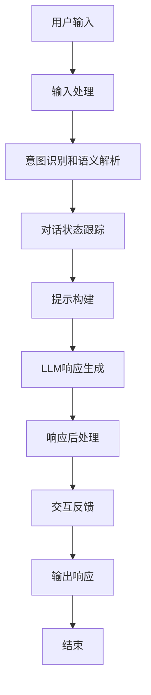

# 【大模型应用开发 动手做AI Agent】创建助手

## 1. 背景介绍

### 1.1 问题的由来

在当今时代,人工智能(AI)已经无处不在,从语音助手到自动驾驶汽车,AI正在彻底改变我们的生活和工作方式。随着大型语言模型(如GPT-3、PaLM等)的出现,构建智能对话系统或AI助手变得前所未有的简单。这些大模型具有惊人的语言理解和生成能力,为开发人机交互界面带来了新的可能性。

然而,将这些大模型应用于实际场景并非一蹴而就。开发人员需要解决诸多挑战,例如:

- 如何与大模型进行有效的交互?
- 如何控制和调整大模型的输出?
- 如何将大模型集成到现有系统中?
- 如何确保大模型输出的安全性和可靠性?

### 1.2 研究现状  

近年来,围绕大模型应用开发的研究和实践日益活跃。一些主要的研究方向包括:

1. **提示工程(Prompt Engineering)**: 通过精心设计的提示,可以指导大模型生成所需的输出。
2. **反馈循环(Feedback Loops)**: 通过人机交互,不断优化大模型的输出质量。
3. **多模态(Multimodal)**: 将视觉、语音等多种模态数据融入大模型,实现更丰富的交互体验。
4. **可解释性(Interpretability)**: 探索大模型内部机理,提高其可解释性和可控性。
5. **安全性(Safety)**: 研究如何避免大模型输出有害或不当内容。

### 1.3 研究意义

开发AI助手不仅能提高工作效率,还可以为残障人士提供便利,缓解劳动力短缺等社会问题。从长远来看,构建智能助手是实现通用人工智能(AGI)的重要一步。本文将探讨如何基于大模型开发AI助手,分享相关技术细节和实践经验,为读者提供宝贵的参考和指导。

### 1.4 本文结构

本文将从以下几个方面阐述大模型应用开发中创建AI助手的过程:

1. 介绍核心概念和技术
2. 详解算法原理和具体实现步骤  
3. 建立数学模型,推导公式并举例说明
4. 提供代码实例,并进行详细解释
5. 探讨实际应用场景及未来展望
6. 推荐相关工具和学习资源
7. 总结研究成果,分析发展趋势和面临的挑战
8. 解答常见问题

## 2. 核心概念与联系

在开发AI助手的过程中,需要理解以下几个核心概念:

1. **大型语言模型(Large Language Model, LLM)**: 通过自监督学习在海量文本数据上训练而成的深度神经网络模型,具备出色的自然语言理解和生成能力。常见的LLM包括GPT-3、PaLM、LaMDA等。

2. **对话系统(Dialog System)**: 能够与人类进行自然语言对话交互的计算机系统。对话系统需要具备自然语言理解、对话管理、响应生成等功能模块。

3. **人工智能助手(AI Assistant)**: 一种特殊的对话系统,旨在为用户提供个性化的智能服务,如问答咨询、任务规划、决策支持等。

4. **提示工程(Prompt Engineering)**: 通过精心设计的文本提示,指导LLM生成所需的输出。提示工程是将LLM应用于实际任务的关键技术。

5. **人机交互(Human-Computer Interaction, HCI)**: 研究人与计算机之间交互过程的学科,包括交互设计、用户体验等方面。开发AI助手需要优化人机交互体验。

6. **自然语言处理(Natural Language Processing, NLP)**: 研究计算机处理和理解自然语言的技术,是AI助手的核心技术基础。

这些概念相互关联、环环相扣。开发AI助手需要综合运用LLM、对话系统、提示工程、人机交互、NLP等多种技术和方法。

## 3. 核心算法原理与具体操作步骤

### 3.1 算法原理概述

开发AI助手的核心算法原理可以概括为以下几个步骤:

1. **用户输入处理**: 对用户的自然语言输入进行标准化处理,如分词、词性标注、命名实体识别等。

2. **意图识别和语义解析**: 根据上下文和领域知识,识别用户输入的意图,并解析出关键信息。

3. **对话状态跟踪**: 跟踪对话的历史上下文,维护对话状态。

4. **提示构建**: 基于对话状态和领域知识,构建适当的文本提示,以指导LLM生成响应。

5. **LLM响应生成**: 将构建好的提示输入LLM,生成自然语言响应。

6. **响应后处理**: 对LLM生成的响应进行过滤、重构等后处理,以提高响应质量。

7. **交互反馈**: 根据用户对系统响应的反馈,持续优化对话策略和LLM提示。

这一过程需要综合运用自然语言处理、对话管理、机器学习等多种技术,并紧密结合具体应用场景和领域知识。

### 3.2 算法步骤详解

我们将使用一个简化的对话流程图来详细说明上述算法步骤:

1. **用户输入处理**:  
   - 分词: 将输入文本拆分为单词序列
   - 词性标注: 为每个单词赋予词性标签(名词、动词等)
   - 命名实体识别: 识别出输入中的人名、地名、组织机构名等实体
   - ...

2. **意图识别和语义解析**:
   - 基于上下文和领域知识,判断输入的意图类型(如查询、命令等)
   - 从输入中提取关键信息,构建语义框架表示

3. **对话状态跟踪**:
   - 维护对话历史上下文
   - 更新对话状态(如已查询的实体、已完成的任务等)

4. **提示构建**:
   - 根据对话状态和领域知识,构建适当的文本提示
   - 提示可包含:
     - 指令: 明确指出LLM需要执行的任务
     - 上下文: 提供对话历史、领域知识等相关背景信息
     - 示例: 给出任务的范例,指导LLM的输出形式
     - ...

5. **LLM响应生成**:
   - 将构建好的提示输入LLM
   - LLM根据提示生成自然语言响应

6. **响应后处理**:
   - 过滤掉LLM响应中的有害、不当内容
   - 根据上下文,重构响应使其更加连贯、合理
   - ...

7. **交互反馈**:
   - 获取用户对系统响应的反馈(如满意度评分)
   - 根据反馈,持续优化对话策略和提示构建

8. **输出响应**:
   - 将经过后处理的响应呈现给用户

9. **结束**:
   - 判断对话是否结束,如果继续,则跳回第1步

### 3.3 算法优缺点

上述算法的主要优点包括:

- 充分利用大模型的强大语言能力,生成高质量的自然语言响应
- 通过提示工程,可灵活控制LLM的输出
- 将传统的NLP模块(如语义解析)与LLM相结合,发挥各自的优势
- 具有较好的可扩展性,可根据需求调整或增加模块

但同时也存在一些缺点和挑战:

- 高度依赖提示工程的效果,提示构建质量直接影响LLM输出
- LLM输出的可解释性和可控性较差
- 需要大量的人工标注数据用于模块训练(如意图识别、语义解析等)
- 缺乏情景化理解和常识推理能力

### 3.4 算法应用领域

上述算法可广泛应用于各种AI助手场景,包括但不限于:

- 智能客服: 提供7*24小时在线问答和服务支持
- 个人助理: 管理日程、规划任务、查找信息等
- 教育辅导: 作为在线教师,解答学习问题
- 医疗咨询: 为患者提供初步的症状判断和就医建议
- 旅游导览: 根据用户需求,规划行程并提供景点介绍
- 智能写作: 辅助创作、修改和优化文字内容
- ...

总的来说,任何需要与用户进行自然语言交互的场景,都可以考虑采用基于大模型的AI助手系统。

## 4. 数学模型和公式详细讲解举例说明  

### 4.1 数学模型构建

在AI助手系统中,自然语言处理(NLP)模块和LLM都需要建立在严谨的数学模型基础之上。我们将从以下几个方面构建数学模型:

1. **词向量表示**

将单词映射为实数向量,使语义相似的词有相近的向量表示。常用的词向量方法有:

- 词袋模型(Bag-of-Words)
- 词嵌入(Word Embedding),如Word2Vec、GloVe等

设词汇表$\mathcal{V}$中共有$N$个单词,每个单词$w_i$对应一个$d$维实数向量$\boldsymbol{v}_i\in\mathbb{R}^d$,则词嵌入矩阵为:

$$\boldsymbol{W}_{emb}=\begin{bmatrix}\boldsymbol{v}_1\\\boldsymbol{v}_2\\\vdots\\\boldsymbol{v}_N\end{bmatrix}\in\mathbb{R}^{N\times d}$$

2. **序列建模**

对于一个长度为$T$的单词序列$\{w_1,w_2,...,w_T\}$,我们需要一种数学模型来捕获其中的上下文语义信息。常用的序列建模方法有:

- 循环神经网络(RNN)
- 长短期记忆网络(LSTM)
- 门控循环单元(GRU)
- transformer等

以LSTM为例,对于时间步$t$,其隐状态$\boldsymbol{h}_t$的更新过程为:

$$
\begin{aligned}
\boldsymbol{f}_t &= \sigma(\boldsymbol{W}_f\cdot[\boldsymbol{h}_{t-1},\boldsymbol{x}_t]+\boldsymbol{b}_f)\\
\boldsymbol{i}_t &= \sigma(\boldsymbol{W}_i\cdot[\boldsymbol{h}_{t-1},\boldsymbol{x}_t]+\boldsymbol{b}_i)\\
\boldsymbol{o}_t &= \sigma(\boldsymbol{W}_o\cdot[\boldsymbol{h}_{t-1},\boldsymbol{x}_t]+\boldsymbol{b}_o)\\
\boldsymbol{c}_t &= \boldsymbol{f}_t\odot\boldsymbol{c}_{t-1}+\boldsymbol{i}_t\odot\tanh(\boldsymbol{W}_c\cdot[\boldsymbol{h}_{t-1},\boldsymbol{x}_t]+\boldsymbol{b}_c)\\
\boldsymbol{h}_t &= \boldsymbol{o}_t\odot\tanh(\boldsymbol{c}_t)
\end{aligned}
$$

其中,$\boldsymbol{x}_t$为时间步$t$的输入,$\boldsymbol{W}$为权重矩阵,$\boldsymbol{b}$为偏置向量,$\sigma$为sigmoid激活函数,$\odot$为元素wise乘积。

3. **注意力机制(Attention)**

注意力机制赋予模型可解释性,使其能够自动学习输入的哪些部分对当前预测任务更为重要。设有一个查询向量$\boldsymbol{q}$和$N$个键值对$(\boldsymbol{k}_i,\boldsymbol{v}_i)$,则注意力权重计算如下:

$$\alpha_i=\frac{\exp(\boldsymbol{q}\cdot\boldsymbol{k}_i)}{\sum_{j=1}^N\exp(\boldsymbol{q}\cdot\boldsymbol{