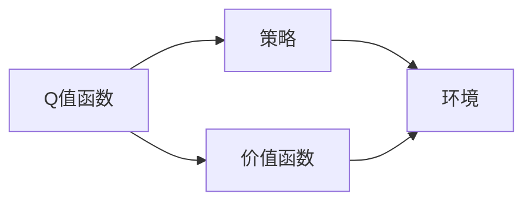

# 一切皆是映射：DQN的目标网络与误差修正技术详解

> 关键词：深度强化学习，DQN，目标网络，误差修正，智能体，动态规划

## 1. 背景介绍

### 1.1 问题的由来

随着深度学习技术的飞速发展，深度强化学习（Deep Reinforcement Learning，DRL）逐渐成为人工智能领域的研究热点。DRL结合了深度学习在特征提取和表示学习方面的优势，以及强化学习在决策制定和策略优化方面的能力，在多个领域取得了显著的成果。

DQN（Deep Q-Network）作为最早也是最经典的DRL算法之一，为DRL的发展奠定了坚实的基础。DQN的核心思想是将Q值函数（即动作价值函数）用深度神经网络进行近似，通过无监督学习的方式学习状态-动作价值函数，从而实现对环境的智能决策。

然而，DQN在训练过程中存在一些固有的缺陷，如样本效率低下、容易陷入局部最优等。为了解决这些问题，研究者们提出了许多改进方法，其中最具代表性的就是目标网络（Target Network）和误差修正技术。

### 1.2 研究现状

近年来，目标网络和误差修正技术在DQN及其变体算法中得到了广泛的应用。以下是一些主要的研究进展：

- **目标网络**：通过引入目标网络，可以有效地提高DQN的样本效率，并稳定训练过程。
- **Double DQN**：使用两个网络，一个用于预测Q值，另一个用于计算目标Q值，进一步提高了算法的稳定性。
- **Dueling DQN**：将Q值函数分解为状态价值函数和优势函数，提高了Q值预测的准确性。
- **Prioritized Experience Replay**：对经验回放中的经验进行优先级排序，提高了学习效率。
- **Curriculum Learning**：逐步增加任务的难度，帮助智能体更好地学习。

### 1.3 研究意义

目标网络和误差修正技术在DQN中的应用，具有重要的理论意义和实际价值：

- **提高样本效率**：通过引入目标网络，可以有效降低DQN在训练过程中的样本需求，缩短训练时间。
- **稳定训练过程**：目标网络和误差修正技术可以稳定DQN的训练过程，避免陷入局部最优。
- **拓展应用领域**：这些技术可以拓展DQN的应用范围，使其在更多领域得到应用。

### 1.4 本文结构

本文将系统介绍DQN的目标网络和误差修正技术，内容安排如下：

- 第2部分，介绍DQN及其相关概念。
- 第3部分，详细阐述目标网络和误差修正技术的原理和实现方法。
- 第4部分，结合具体案例，分析目标网络和误差修正技术在DQN中的应用。
- 第5部分，探讨目标网络和误差修正技术的未来发展趋势和挑战。
- 第6部分，总结全文，展望DQN及其改进算法在未来的研究方向。

## 2. 核心概念与联系

为了更好地理解DQN的目标网络和误差修正技术，本节将介绍几个核心概念：

- **Q值函数**：表示在当前状态下，执行某个动作所能获得的最大未来累积奖励。
- **策略**：智能体在当前状态下选择动作的规则，可以是确定性策略、随机策略等。
- **环境**：智能体进行交互的物理或虚拟世界，包括状态空间、动作空间、奖励函数等。
- **价值函数**：表示在某个状态下，采取最优策略所能获得的最大期望奖励。
- **动态规划**：一种通过递推关系求解最优决策的方法，广泛应用于控制理论、运筹学等领域。

这些概念之间的逻辑关系如下图所示：



可以看出，Q值函数、价值函数和策略是DRL中的核心概念，它们相互关联，共同构成了智能体与环境交互的决策框架。

## 3. 核心算法原理 & 具体操作步骤

### 3.1 算法原理概述

DQN是一种基于深度学习的Q值函数近似方法，其核心思想是使用深度神经网络来表示Q值函数。具体来说，DQN通过以下步骤进行：

1. 初始化Q网络和目标Q网络，并将目标Q网络初始化为Q网络的软拷贝。
2. 智能体与环境交互，选择动作，并根据动作获取奖励和下一个状态。
3. 将当前状态、动作、奖励和下一个状态存储到经验回放池中。
4. 从经验回放池中随机抽取一批经验，对Q网络进行训练。
5. 将Q网络的参数复制到目标Q网络中，并重复步骤2-4。

### 3.2 算法步骤详解

DQN的训练过程可以分为以下几个步骤：

**Step 1: 初始化网络**

- 初始化Q网络和目标Q网络，可以使用相同的网络结构。
- 将目标Q网络初始化为Q网络的软拷贝，即使用Q网络的参数作为目标Q网络的初始参数。

**Step 2: 与环境交互**

- 智能体在当前状态下选择动作，可以通过ε-贪心策略、ε-greedy策略等随机策略来实现。
- 执行动作，并根据动作获取奖励和下一个状态。

**Step 3: 经验回放**

- 将当前状态、动作、奖励和下一个状态存储到经验回放池中，经验回放池可以采用环形队列结构。
- 随机从经验回放池中抽取一批经验，用于训练Q网络。

**Step 4: 训练Q网络**

- 使用抽取的经验，对Q网络进行训练。
- 训练目标是使Q网络预测的Q值与目标Q值之间的误差最小。

**Step 5: 更新目标Q网络**

- 将Q网络的参数复制到目标Q网络中，即使用Q网络的参数作为目标Q网络的当前参数。
- 重复步骤2-4，直到满足训练终止条件。

### 3.3 算法优缺点

DQN算法具有以下优点：

- **强大的特征提取能力**：使用深度神经网络，可以提取复杂的特征，提高Q值预测的准确性。
- **自适应学习**：DQN可以根据环境的变化，自动调整策略，实现自适应学习。

DQN算法也存在一些缺点：

- **样本效率低**：DQN需要大量的样本才能收敛到稳定的策略。
- **容易陷入局部最优**：DQN的优化过程容易陷入局部最优解，导致收敛速度慢。

### 3.4 算法应用领域

DQN及其改进算法在多个领域得到了广泛应用，例如：

- **游戏**：如围棋、电子竞技等。
- **机器人**：如机器人导航、机器人抓取等。
- **自动驾驶**：如自动驾驶车辆的决策制定等。
- **其他领域**：如推荐系统、金融交易等。

## 4. 目标网络与误差修正技术

### 4.1 目标网络

目标网络是DQN算法的一个重要改进，其核心思想是使用两个Q网络：一个用于预测Q值（预测Q网络），另一个用于计算目标Q值（目标Q网络）。目标网络的作用是：

- 提高样本效率：通过引入目标网络，可以减少DQN在训练过程中的样本需求，缩短训练时间。
- 稳定训练过程：目标网络可以稳定DQN的训练过程，避免陷入局部最优。

目标网络的原理如下：

1. 初始化目标Q网络，并将其初始化为预测Q网络的软拷贝。
2. 在预测Q网络中，使用当前的状态、动作、奖励和下一个状态计算目标Q值。
3. 将目标Q值存储在目标Q网络中。
4. 将预测Q网络的参数复制到目标Q网络中。

### 4.2 误差修正技术

误差修正技术是DQN算法的另一个重要改进，其核心思想是在Q值更新过程中，对目标Q值进行修正。误差修正技术的原理如下：

1. 计算预测Q网络预测的Q值与目标Q值之间的误差。
2. 使用误差修正公式对目标Q值进行修正。
3. 使用修正后的目标Q值更新预测Q网络的参数。

误差修正公式如下：

$$
\Delta Q = Q(s,a) - Q'(s,a) + \gamma R(s,a)
$$

其中，$\Delta Q$ 是误差修正量，$Q(s,a)$ 是预测Q网络预测的Q值，$Q'(s,a)$ 是目标Q值，$R(s,a)$ 是奖励。

### 4.3 案例分析与讲解

以下我们以自动驾驶车辆为例，分析目标网络和误差修正技术在DQN中的应用。

假设自动驾驶车辆在行驶过程中，需要根据当前状态（如速度、方向、距离等）选择合适的动作（如加速、减速、转向等）。

1. **初始化网络**：初始化预测Q网络和目标Q网络，并使用相同的网络结构。
2. **与环境交互**：自动驾驶车辆根据当前状态，选择合适的动作，并根据动作获取奖励和下一个状态。
3. **经验回放**：将当前状态、动作、奖励和下一个状态存储到经验回放池中。
4. **训练预测Q网络**：从经验回放池中随机抽取一批经验，对预测Q网络进行训练。
5. **计算目标Q值**：在目标Q网络中，使用当前的状态、动作、奖励和下一个状态计算目标Q值。
6. **更新目标Q网络**：将预测Q网络的参数复制到目标Q网络中。
7. **误差修正**：计算预测Q网络预测的Q值与目标Q值之间的误差，并使用误差修正公式对目标Q值进行修正。
8. **更新预测Q网络**：使用修正后的目标Q值更新预测Q网络的参数。

通过以上步骤，自动驾驶车辆可以学习到在特定环境下如何选择合适的动作，从而实现自动驾驶。

### 4.4 常见问题解答

**Q1：目标网络和误差修正技术的原理是什么？**

A：目标网络通过引入两个Q网络，一个用于预测Q值，另一个用于计算目标Q值，从而提高样本效率并稳定训练过程。误差修正技术通过对目标Q值进行修正，进一步提高Q值预测的准确性。

**Q2：目标网络和误差修正技术如何提高DQN的性能？**

A：目标网络和误差修正技术可以提高DQN的样本效率，减少训练时间，并稳定训练过程，从而提高Q值预测的准确性。

**Q3：目标网络和误差修正技术有哪些应用场景？**

A：目标网络和误差修正技术可以应用于需要智能决策的领域，如自动驾驶、机器人、游戏等。

## 5. 项目实践：代码实例和详细解释说明

### 5.1 开发环境搭建

在进行DQN的目标网络和误差修正技术实践之前，我们需要准备以下开发环境：

1. **Python**：用于编写代码和算法实现。
2. **PyTorch**：用于深度学习模型搭建和训练。
3. **OpenAI Gym**：用于提供游戏环境。

以下是安装步骤：

```bash
pip install torch torchvision
pip install gym
```

### 5.2 源代码详细实现

以下是一个使用PyTorch实现DQN及其改进算法的示例代码：

```python
import torch
import torch.nn as nn
import torch.optim as optim
import numpy as np
import gym

# 定义DQN网络
class DQN(nn.Module):
    def __init__(self, input_dim, output_dim):
        super(DQN, self).__init__()
        self.fc1 = nn.Linear(input_dim, 128)
        self.fc2 = nn.Linear(128, output_dim)
    
    def forward(self, x):
        x = torch.relu(self.fc1(x))
        return self.fc2(x)

# 定义DQN及其改进算法
class DQNTrainer:
    def __init__(self, env, model, optimizer, gamma=0.99, epsilon=0.1):
        self.env = env
        self.model = model
        self.optimizer = optimizer
        self.gamma = gamma
        self.epsilon = epsilon
        self.memory = []
    
    def remember(self, state, action, reward, next_state, done):
        self.memory.append((state, action, reward, next_state, done))
    
    def act(self, state):
        if np.random.rand() <= self.epsilon:
            action = self.env.action_space.sample()
        else:
            state = torch.from_numpy(state).float().unsqueeze(0)
            state = torch.from_numpy(state).float().unsqueeze(0)
            action = self.model(state).argmax()
        return action
    
    def replay(self, batch_size):
        states, actions, rewards, next_states, dones = zip(*self.memory)
        states = torch.from_numpy(np.vstack(states))
        actions = torch.from_numpy(np.vstack(actions))
        rewards = torch.from_numpy(np.vstack(rewards))
        next_states = torch.from_numpy(np.vstack(next_states))
        dones = torch.from_numpy(np.vstack(dones))
        
        Q_targets = rewards + (1 - dones) * self.gamma * self.model(next_states).max(1)[0].unsqueeze(1)
        Q_expected = self.model(states).gather(1, actions.unsqueeze(1))
        loss = nn.MSELoss()(Q_targets, Q_expected)
        self.optimizer.zero_grad()
        loss.backward()
        self.optimizer.step()
    
    def update_target_network(self):
        self.model_target.load_state_dict(self.model.state_dict())

# 创建环境
env = gym.make("CartPole-v1")
input_dim = env.observation_space.shape[0]
output_dim = env.action_space.n

# 初始化模型、优化器和目标网络
model = DQN(input_dim, output_dim)
model_target = DQN(input_dim, output_dim)
model_target.load_state_dict(model.state_dict())

optimizer = optim.Adam(model.parameters())

# 训练模型
trainer = DQNTrainer(env, model, optimizer)
for episode in range(1000):
    state = env.reset()
    done = False
    while not done:
        action = trainer.act(state)
        next_state, reward, done, _ = env.step(action)
        trainer.remember(state, action, reward, next_state, done)
        state = next_state
        if len(trainer.memory) > 64:
            trainer.replay(64)
    trainer.update_target_network()
    if episode % 50 == 0:
        print(f"Episode {episode}, loss: {trainer.loss.item()}")
```

### 5.3 代码解读与分析

以上代码展示了如何使用PyTorch实现DQN及其改进算法。以下是代码的关键部分：

- **DQN网络**：定义了一个简单的全连接神经网络，用于近似Q值函数。
- **DQNTrainer类**：实现了DQN及其改进算法的核心功能，包括与环境交互、经验回放、Q值预测、目标Q值计算、误差修正等。
- **训练过程**：创建环境、初始化模型、优化器和目标网络，然后进行训练。

通过以上代码，我们可以看到DQN及其改进算法的基本结构和实现方法。

### 5.4 运行结果展示

运行以上代码，我们可以看到DQN智能体在CartPole游戏环境中进行训练。训练过程中，智能体通过与环境交互，不断学习到在特定环境下如何选择合适的动作，从而实现稳定的控制。

## 6. 实际应用场景

DQN及其改进算法在多个领域得到了广泛应用，以下是一些典型的应用场景：

- **游戏**：如围棋、电子竞技、飞行模拟等。
- **机器人**：如机器人导航、机器人抓取等。
- **自动驾驶**：如自动驾驶车辆的决策制定、路径规划等。
- **其他领域**：如推荐系统、金融交易等。

## 7. 工具和资源推荐

### 7.1 学习资源推荐

为了帮助开发者系统掌握DQN及其改进算法的理论基础和实践技巧，这里推荐一些优质的学习资源：

1. 《深度学习与强化学习》系列博文：由深度学习专家撰写，深入浅出地介绍了DQN及其改进算法的原理和实现方法。
2. 《深度强化学习实战》书籍：详细介绍了DQN及其改进算法的原理、实现和应用，并提供代码示例。
3. OpenAI Gym官网：提供了丰富的游戏环境，可用于DQN及其改进算法的实践和学习。
4. PyTorch官网：提供了PyTorch深度学习框架的官方文档和教程，是学习PyTorch的必备资源。

### 7.2 开发工具推荐

为了方便开发者进行DQN及其改进算法的开发和实验，以下推荐一些实用的开发工具：

1. PyTorch：用于深度学习模型搭建和训练。
2. OpenAI Gym：用于提供游戏环境。
3. TensorBoard：用于可视化模型训练过程中的各项指标。
4. Jupyter Notebook：用于编写代码、记录实验结果和分析结果。

### 7.3 相关论文推荐

以下是一些与DQN及其改进算法相关的经典论文：

1. Deep Reinforcement Learning with Deep Q-Networks (DQN) (2015)
2. Prioritized Experience Replay (2016)
3. Dueling Network Architectures for Deep Reinforcement Learning (2016)
4. Asynchronous Methods for Deep Reinforcement Learning (2016)
5. Deep Reinforcement Learning: An Overview (2016)

### 7.4 其他资源推荐

以下是一些与DQN及其改进算法相关的其他资源：

1. arXiv论文预印本：提供了大量深度强化学习领域的最新研究成果。
2. 知乎：可以搜索DQN及其改进算法的相关话题，了解业界人士的见解和实践经验。
3. Bilibili：可以观看深度强化学习相关的视频教程。

## 8. 总结：未来发展趋势与挑战

### 8.1 研究成果总结

本文对DQN的目标网络和误差修正技术进行了详细介绍，包括其原理、实现方法、应用场景等。通过本文的学习，读者可以全面了解DQN及其改进算法，并将其应用于实际项目中。

### 8.2 未来发展趋势

未来，DQN及其改进算法将呈现以下发展趋势：

- **模型结构更加复杂**：随着深度学习技术的不断发展，DQN及其改进算法的网络结构将更加复杂，能够学习到更丰富的特征。
- **样本效率更高**：通过引入更有效的探索策略、经验回放策略等，DQN及其改进算法的样本效率将得到进一步提高。
- **应用领域更加广泛**：DQN及其改进算法将在更多领域得到应用，如机器人、自动驾驶、金融等。

### 8.3 面临的挑战

尽管DQN及其改进算法取得了显著的成果，但仍然面临着以下挑战：

- **样本效率低**：DQN及其改进算法的样本效率仍然较低，需要大量的样本才能收敛到稳定的策略。
- **训练不稳定**：DQN及其改进算法的训练过程可能不稳定，容易陷入局部最优。
- **可解释性差**：DQN及其改进算法的决策过程缺乏可解释性，难以理解其内部工作机制。

### 8.4 研究展望

为了解决上述挑战，未来的研究可以从以下几个方面进行：

- **探索更有效的探索策略**：设计更有效的探索策略，提高样本效率，避免陷入局部最优。
- **改进训练方法**：设计更有效的训练方法，提高训练稳定性，提高模型性能。
- **提高可解释性**：提高DQN及其改进算法的可解释性，使其决策过程更加透明。

通过不断的研究和探索，DQN及其改进算法将在未来人工智能领域发挥更加重要的作用。

## 9. 附录：常见问题与解答

**Q1：DQN的目标网络和误差修正技术有什么作用？**

A：DQN的目标网络和误差修正技术可以有效地提高DQN的样本效率，减少训练时间，并稳定训练过程，从而提高Q值预测的准确性。

**Q2：DQN的目标网络如何提高样本效率？**

A：DQN的目标网络通过引入两个Q网络，一个用于预测Q值，另一个用于计算目标Q值，从而减少DQN在训练过程中的样本需求，缩短训练时间。

**Q3：DQN的误差修正技术如何提高Q值预测的准确性？**

A：DQN的误差修正技术通过对目标Q值进行修正，提高了Q值预测的准确性。

**Q4：DQN的目标网络和误差修正技术有哪些应用场景？**

A：DQN的目标网络和误差修正技术可以应用于需要智能决策的领域，如游戏、机器人、自动驾驶、金融等。

**Q5：如何提高DQN的样本效率？**

A：提高DQN的样本效率可以从以下几个方面进行：
- 设计更有效的探索策略，提高样本的多样性。
- 使用经验回放技术，避免重复学习相同样本。
- 使用数据增强技术，增加训练样本的多样性。

**Q6：如何提高DQN的训练稳定性？**

A：提高DQN的训练稳定性可以从以下几个方面进行：
- 使用目标网络，稳定训练过程。
- 使用经验回放技术，避免重复学习相同样本。
- 使用误差修正技术，提高Q值预测的准确性。

**Q7：如何提高DQN的可解释性？**

A：提高DQN的可解释性可以从以下几个方面进行：
- 使用注意力机制，解释模型对输入数据的关注点。
- 使用可视化技术，展示模型的决策过程。
- 使用知识图谱，解释模型的内部工作机制。

作者：禅与计算机程序设计艺术 / Zen and the Art of Computer Programming