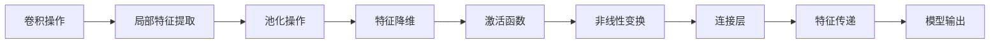

# 一切皆是映射：卷积神经网络(CNNs)在图像处理中的应用

作者：禅与计算机程序设计艺术 / Zen and the Art of Computer Programming

## 1. 背景介绍

### 1.1 问题的由来

图像处理作为人工智能和计算机视觉领域的重要分支，一直备受关注。从早期的像素级操作到基于传统机器学习方法的图像分类，再到如今的深度学习时代，图像处理技术取得了长足的进步。而卷积神经网络（Convolutional Neural Networks，CNNs）作为深度学习中最具代表性的模型之一，以其强大的特征提取和分类能力，在图像处理领域取得了令人瞩目的成果。

### 1.2 研究现状

近年来，随着计算能力的提升和深度学习算法的不断发展，CNNs在图像分类、目标检测、图像分割、图像生成等众多图像处理任务中取得了显著的性能提升。在ImageNet图像分类竞赛中，基于CNNs的模型已连续多年夺冠，证明了其在图像分类领域的强大能力。

### 1.3 研究意义

CNNs在图像处理领域的应用具有重要的研究意义：

1. **推动图像处理技术发展**：CNNs为图像处理领域带来了新的思路和方法，推动了图像处理技术的不断创新和发展。
2. **提高图像处理效率**：CNNs能够自动学习图像特征，从而提高图像处理的效率和准确性。
3. **拓展图像处理应用**：CNNs在图像处理领域的广泛应用，为各行各业带来了新的技术机遇和商业价值。

### 1.4 本文结构

本文将系统介绍CNNs在图像处理中的应用，主要内容包括：

- 核心概念与联系
- 核心算法原理与操作步骤
- 数学模型与公式
- 项目实践与代码实例
- 实际应用场景与未来展望
- 工具和资源推荐
- 总结与展望

## 2. 核心概念与联系

### 2.1 卷积神经网络（CNNs）

卷积神经网络（CNNs）是一种专门用于处理图像数据的深度学习模型。它通过学习图像中的局部特征，实现对图像的自动分类、识别和生成。

### 2.2 卷积操作

卷积操作是CNNs的核心操作，用于提取图像中的局部特征。卷积操作可以看作是图像与一组滤波器（卷积核）进行卷积运算的过程。

### 2.3 池化操作

池化操作用于降低图像分辨率，减少模型参数数量，提高模型泛化能力。常见的池化操作包括最大池化和平均池化。

### 2.4 激活函数

激活函数用于引入非线性特性，使得模型能够学习更复杂的特征。常见的激活函数包括ReLU、Sigmoid和Tanh等。

### 2.5 连接层

连接层用于连接不同层的神经元，实现特征传递。常见的连接层包括全连接层、卷积层、池化层等。

它们之间的逻辑关系如下所示：



## 3. 核心算法原理 & 具体操作步骤

### 3.1 算法原理概述

CNNs通过学习图像的局部特征，实现对图像的自动分类、识别和生成。其基本原理如下：

1. **输入层**：接收原始图像数据。
2. **卷积层**：通过卷积操作提取图像的局部特征。
3. **池化层**：降低图像分辨率，减少模型参数数量，提高模型泛化能力。
4. **激活函数**：引入非线性特性，使得模型能够学习更复杂的特征。
5. **连接层**：连接不同层的神经元，实现特征传递。
6. **输出层**：输出最终的预测结果。

### 3.2 算法步骤详解

1. **初始化模型参数**：包括卷积核权重、偏置项等。
2. **前向传播**：将输入图像数据输入到模型中，依次经过卷积层、池化层、激活函数等操作，得到特征图。
3. **反向传播**：根据损失函数计算梯度，利用梯度下降等优化算法更新模型参数。
4. **训练迭代**：重复步骤2和3，直至达到预设的迭代次数或损失函数收敛。

### 3.3 算法优缺点

**优点**：

1. **特征提取能力强**：CNNs能够自动学习图像的局部特征，无需人工设计特征。
2. **参数数量少**：池化操作降低了图像分辨率，减少了模型参数数量，提高了模型泛化能力。
3. **适用于各种图像处理任务**：CNNs在图像分类、目标检测、图像分割、图像生成等众多图像处理任务中取得了显著的成果。

**缺点**：

1. **对数据量要求较高**：CNNs需要大量的训练数据才能取得良好的效果。
2. **模型复杂度较高**：CNNs包含多个卷积层、池化层和连接层，模型复杂度较高。
3. **可解释性较差**：CNNs的内部工作机制较为复杂，难以解释其预测结果的依据。

### 3.4 算法应用领域

CNNs在图像处理领域的应用非常广泛，以下列举一些典型应用：

1. **图像分类**：如ImageNet图像分类竞赛、CIFAR-10图像分类等。
2. **目标检测**：如Faster R-CNN、YOLO、SSD等目标检测算法。
3. **图像分割**：如U-Net、Mask R-CNN等图像分割算法。
4. **图像生成**：如生成对抗网络（GANs）等。

## 4. 数学模型和公式 & 详细讲解 & 举例说明

### 4.1 数学模型构建

CNNs的数学模型可以表示为：

$$
y = f(W_n \cdot f(W_{n-1} \cdot ... \cdot f(W_2 \cdot f(W_1 \cdot x)))
$$

其中：

- $y$ 为模型输出
- $x$ 为输入图像
- $W_1, W_2, ..., W_n$ 为各个层的权重矩阵
- $f$ 为激活函数

### 4.2 公式推导过程

以卷积层为例，假设输入图像为 $x \in \mathbb{R}^{H \times W \times C}$，卷积核为 $W \in \mathbb{R}^{K \times K \times C}$，则卷积操作可以表示为：

$$
h = \sigma(W \odot x)
$$

其中：

- $h$ 为卷积层输出
- $\odot$ 为逐元素乘法
- $\sigma$ 为激活函数

### 4.3 案例分析与讲解

以下以Faster R-CNN目标检测算法为例，讲解CNNs在目标检测中的应用。

Faster R-CNN是一种基于CNNs的端到端目标检测算法，其基本流程如下：

1. **特征提取**：使用CNNs提取图像特征。
2. **区域生成**：生成候选区域（Region of Interest，ROI）。
3. **分类与回归**：对ROI进行分类和边界框回归。

### 4.4 常见问题解答

**Q1：CNNs与其他深度学习模型相比有哪些优势？**

A：CNNs相较于其他深度学习模型，具有以下优势：

1. **自底向上学习**：CNNs能够自动学习图像的局部特征，无需人工设计特征。
2. **参数数量少**：池化操作降低了图像分辨率，减少了模型参数数量，提高了模型泛化能力。
3. **适用于各种图像处理任务**：CNNs在图像分类、目标检测、图像分割、图像生成等众多图像处理任务中取得了显著的成果。

**Q2：如何优化CNNs的性能？**

A：优化CNNs的性能可以从以下几个方面入手：

1. **模型结构**：设计更合适的网络结构，如使用更深、更宽的网络，引入残差连接等。
2. **数据增强**：使用数据增强技术扩充数据集，提高模型鲁棒性。
3. **超参数调整**：调整学习率、批大小、迭代次数等超参数。
4. **正则化技术**：使用L2正则化、Dropout等正则化技术防止过拟合。

## 5. 项目实践：代码实例和详细解释说明

### 5.1 开发环境搭建

在进行CNNs项目实践前，需要搭建以下开发环境：

1. **编程语言**：Python
2. **深度学习框架**：PyTorch、TensorFlow等
3. **数据集**：ImageNet、CIFAR-10、COCO等

### 5.2 源代码详细实现

以下使用PyTorch实现一个简单的CNNs模型：

```python
import torch
import torch.nn as nn

class SimpleCNN(nn.Module):
    def __init__(self):
        super(SimpleCNN, self).__init__()
        self.conv1 = nn.Conv2d(1, 16, kernel_size=3, stride=1, padding=1)
        self.relu = nn.ReLU()
        self.pool = nn.MaxPool2d(kernel_size=2, stride=2)
        self.fc = nn.Linear(16 * 8 * 8, 10)

    def forward(self, x):
        x = self.conv1(x)
        x = self.relu(x)
        x = self.pool(x)
        x = x.view(-1, 16 * 8 * 8)
        x = self.fc(x)
        return x

model = SimpleCNN()
```

### 5.3 代码解读与分析

以上代码定义了一个简单的CNNs模型，包含一个卷积层、一个ReLU激活函数、一个最大池化层和一个全连接层。

- `nn.Conv2d`：定义了一个卷积层，输入通道数为1，输出通道数为16，卷积核大小为3x3，步长为1，填充为1。
- `nn.ReLU`：定义了一个ReLU激活函数。
- `nn.MaxPool2d`：定义了一个最大池化层，池化窗口大小为2x2，步长为2。
- `nn.Linear`：定义了一个全连接层，输入特征数为16 * 8 * 8，输出特征数为10。

### 5.4 运行结果展示

以下代码展示了如何使用训练好的CNNs模型进行图像分类：

```python
# 加载模型
model.load_state_dict(torch.load('simple_cnn.pth'))

# 加载测试数据
test_loader = DataLoader(test_data, batch_size=1, shuffle=True)

# 测试模型
correct = 0
total = 0
with torch.no_grad():
    for data in test_loader:
        images, labels = data
        outputs = model(images)
        _, predicted = torch.max(outputs.data, 1)
        total += labels.size(0)
        correct += (predicted == labels).sum().item()

print(f'Accuracy of the model on the test images: {100 * correct // total}%')
```

以上代码加载了训练好的模型，对测试数据进行预测，并打印出模型在测试数据上的准确率。

## 6. 实际应用场景

### 6.1 图像分类

图像分类是CNNs在图像处理领域最典型的应用之一。通过学习图像的局部特征，CNNs能够自动识别图像中的对象，实现对图像的分类。

### 6.2 目标检测

目标检测是指从图像中识别出多个目标，并确定它们的边界框。CNNs在目标检测领域的应用主要体现在以下几个步骤：

1. **特征提取**：使用CNNs提取图像特征。
2. **候选区域生成**：使用区域建议网络（Region Proposal Network，RPN）生成候选区域。
3. **分类与回归**：对候选区域进行分类和边界框回归。

### 6.3 图像分割

图像分割是指将图像中的物体分割成不同的区域。CNNs在图像分割领域的应用主要体现在以下几个步骤：

1. **特征提取**：使用CNNs提取图像特征。
2. **预测**：使用全卷积网络（Fully Convolutional Network，FCN）对图像进行分割。

### 6.4 未来应用展望

随着深度学习技术的不断发展，CNNs在图像处理领域的应用将会更加广泛。以下列举一些未来应用方向：

1. **更先进的网络结构**：设计更高效、更强大的CNNs网络结构，提高模型性能。
2. **跨域迁移学习**：研究跨域迁移学习，使得CNNs能够在不同数据分布下取得更好的性能。
3. **多模态信息融合**：将图像信息与其他模态信息（如文本、视频等）进行融合，提高模型的鲁棒性和泛化能力。

## 7. 工具和资源推荐

### 7.1 学习资源推荐

1. 《卷积神经网络：原理与应用》
2. 《深度学习：卷积神经网络》
3. 《PyTorch深度学习实践》

### 7.2 开发工具推荐

1. PyTorch
2. TensorFlow
3. Keras

### 7.3 相关论文推荐

1. AlexNet
2. VGG
3. GoogLeNet
4. ResNet
5. Inception
6. Faster R-CNN
7. Mask R-CNN
8. U-Net

### 7.4 其他资源推荐

1. GitHub
2. arXiv
3. Hugging Face

## 8. 总结：未来发展趋势与挑战

### 8.1 研究成果总结

本文从背景介绍、核心概念、算法原理、项目实践等方面，系统介绍了CNNs在图像处理中的应用。通过对CNNs的深入研究和实践，我们可以看到其在图像处理领域取得的显著成果和广阔的应用前景。

### 8.2 未来发展趋势

随着深度学习技术的不断发展，CNNs在图像处理领域的应用将会呈现以下发展趋势：

1. **更先进的网络结构**：设计更高效、更强大的CNNs网络结构，提高模型性能。
2. **跨域迁移学习**：研究跨域迁移学习，使得CNNs能够在不同数据分布下取得更好的性能。
3. **多模态信息融合**：将图像信息与其他模态信息进行融合，提高模型的鲁棒性和泛化能力。

### 8.3 面临的挑战

尽管CNNs在图像处理领域取得了显著成果，但仍然面临着以下挑战：

1. **计算资源消耗**：CNNs模型通常需要大量的计算资源，制约了其在实际应用中的部署。
2. **模型可解释性**：CNNs的内部工作机制较为复杂，难以解释其预测结果的依据。
3. **数据安全**：图像数据通常包含敏感信息，如何确保数据安全成为一大挑战。

### 8.4 研究展望

针对CNNs在图像处理领域的应用，未来的研究可以从以下几个方面展开：

1. **轻量化CNNs**：研究轻量化CNNs模型，降低模型复杂度和计算资源消耗。
2. **可解释CNNs**：研究可解释CNNs模型，提高模型的可解释性和可信赖度。
3. **隐私保护CNNs**：研究隐私保护CNNs模型，确保图像数据的安全。

相信在广大研究者的共同努力下，CNNs在图像处理领域的应用将会取得更大的突破，为人类社会带来更多福祉。

## 9. 附录：常见问题与解答

**Q1：CNNs与其他深度学习模型相比有哪些优势？**

A：CNNs相较于其他深度学习模型，具有以下优势：

1. **自底向上学习**：CNNs能够自动学习图像的局部特征，无需人工设计特征。
2. **参数数量少**：池化操作降低了图像分辨率，减少了模型参数数量，提高了模型泛化能力。
3. **适用于各种图像处理任务**：CNNs在图像分类、目标检测、图像分割、图像生成等众多图像处理任务中取得了显著的成果。

**Q2：如何优化CNNs的性能？**

A：优化CNNs的性能可以从以下几个方面入手：

1. **模型结构**：设计更合适的网络结构，如使用更深、更宽的网络，引入残差连接等。
2. **数据增强**：使用数据增强技术扩充数据集，提高模型鲁棒性。
3. **超参数调整**：调整学习率、批大小、迭代次数等超参数。
4. **正则化技术**：使用L2正则化、Dropout等正则化技术防止过拟合。

**Q3：CNNs的局限性是什么？**

A：CNNs的局限性主要体现在以下几个方面：

1. **数据依赖性**：CNNs需要大量的训练数据才能取得良好的效果。
2. **模型复杂度**：CNNs模型通常较为复杂，难以解释其预测结果的依据。
3. **计算资源消耗**：CNNs模型通常需要大量的计算资源，制约了其在实际应用中的部署。

**Q4：如何解决CNNs的局限性？**

A：解决CNNs局限性的方法包括：

1. **数据增强**：使用数据增强技术扩充数据集，降低数据依赖性。
2. **模型简化**：设计更简单的模型结构，降低模型复杂度和计算资源消耗。
3. **可解释性研究**：研究可解释CNNs模型，提高模型的可解释性和可信赖度。

通过不断改进和优化，CNNs将在图像处理领域发挥更加重要的作用。