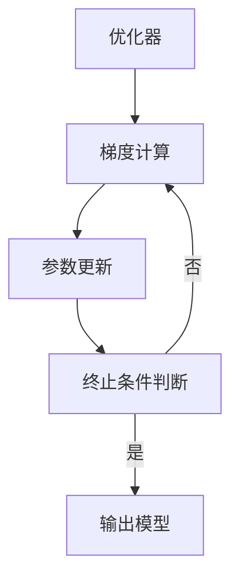

# 优化器 (Optimizer)

## 1. 背景介绍

### 1.1 问题的由来

在机器学习和深度学习领域中,优化算法扮演着至关重要的角色。训练模型的过程实际上是一个不断优化模型参数以最小化损失函数的过程。然而,由于现实世界数据的复杂性和高维特征,传统的优化算法往往在处理这些问题时表现不佳,导致收敛缓慢、陷入局部最优等问题。因此,设计出高效、鲁棒的优化算法对于提升模型性能至关重要。

### 1.2 研究现状

近年来,优化算法的研究成为了学术界和工业界的热点。研究人员不断探索和改进经典优化算法,同时也提出了许多创新的优化方法。例如,基于一阶导数的优化算法(如SGD、Momentum、Adagrad、RMSProp等)由于计算高效而广受青睐;基于二阶导数的优化算法(如L-BFGS、共轭梯度法等)虽然计算代价较高,但收敛速度更快;此外,还有一些基于启发式搜索的优化算法(如模拟退火、粒子群优化等)在特定问题上表现出色。

### 1.3 研究意义

优化算法的改进直接影响着机器学习模型的训练效率和性能表现。一款高效的优化算法不仅能够加快模型收敛速度,还能帮助模型跳出局部最优,从而获得更优的解。此外,在深度神经网络等复杂模型中,优化算法的选择也直接关系到模型是否能够成功训练。因此,研究和改进优化算法对于推动机器学习和深度学习技术的发展至关重要。

### 1.4 本文结构  

本文将全面介绍优化器的相关知识,内容包括:优化器的核心概念、常见优化算法的原理和实现步骤、相关数学模型和公式推导、实战项目案例、应用场景分析、工具和资源推荐等。通过本文的学习,读者能够全面掌握优化器的理论基础和实践技能。

## 2. 核心概念与联系

优化器(Optimizer)是机器学习和深度学习中用于更新模型参数的关键算法。其核心思想是通过一定的策略不断调整模型参数,使损失函数(Loss Function)的值不断减小,从而获得更优的模型。

优化器的工作过程可以概括为:

1. 计算损失函数相对于模型参数的梯度(Gradient)
2. 根据梯度值,通过优化算法的策略更新模型参数
3. 重复上述过程,直到满足终止条件(如损失函数收敛、达到最大迭代次数等)

常见的优化算法包括:

- 基于一阶导数:梯度下降(Gradient Descent)、随机梯度下降(SGD)、动量梯度下降(Momentum)、Adagrad、Adadelta、RMSprop、Adam等
- 基于二阶导数:牛顿法(Newton's Method)、共轭梯度法(Conjugate Gradient)、L-BFGS等
- 基于启发式搜索:模拟退火(Simulated Annealing)、粒子群优化(Particle Swarm Optimization)等

优化器的选择直接影响模型的训练效率和性能,因此需要根据具体问题的特点选择合适的优化算法。此外,超参数(如学习率)的设置也对优化器的表现有重大影响。

上图展示了优化器的基本工作流程。首先计算损失函数相对于模型参数的梯度,然后根据优化算法的策略更新参数值,重复该过程直到满足终止条件。通过不断迭代,模型参数逐渐收敛到一个局部最优解。

## 3. 核心算法原理 & 具体操作步骤

在这一部分,我们将重点介绍几种常见优化算法的原理和具体实现步骤。

### 3.1 算法原理概述

#### 3.1.1 梯度下降(Gradient Descent)

梯度下降是最基本也是最常用的一阶优化算法。其基本思路是沿着目标函数的负梯度方向更新参数,每次更新的步长由学习率决定。梯度下降分为批量梯度下降(BGD)和随机梯度下降(SGD)两种形式。

#### 3.1.2 动量梯度下降(Momentum)

动量梯度下降在梯度下降的基础上引入了"动量"概念,使得参数更新时不仅考虑当前梯度,还考虑了之前累积的"动量"。这有助于加快收敛速度并且更容易跳出局部最小值。

#### 3.1.3 Adagrad

Adagrad通过对每个参数分配自适应的学习率来解决学习率难以把控的问题。其核心思想是缓存每个参数过去梯度的平方和,并以此作为分母对学习率进行校正。这使得学习率随着迭代次数增多而不断减小。

#### 3.1.4 RMSprop 

RMSprop是Adagrad的改进版,它通过指数加权移动平均的方式来缓存梯度的平方和,从而避免了Adagrad中学习率过早衰减到接近0的问题。

#### 3.1.5 Adam

Adam算法结合了动量梯度下降和RMSprop两者的优点。它不仅利用了动量项加速收敛,还通过自适应学习率机制使得收敛更加平稳。Adam算法在很多情况下都能取得不错的效果,因此被广泛应用。

### 3.2 算法步骤详解

以下以Adam优化算法为例,详细讲解其实现步骤:

1. 初始化模型参数$\theta$,动量向量$m_0=0$,自适应学习率向量$v_0=0$,超参数$\beta_1,\beta_2,\epsilon$。
2. 对每个batch的数据:
    - 计算损失函数$J(\theta)$对参数$\theta$的梯度$g_t$
    - 更新动量向量: $m_t=\beta_1 m_{t-1}+(1-\beta_1)g_t$
    - 更新自适应学习率向量: $v_t=\beta_2 v_{t-1}+(1-\beta_2)g_t^2$
    - 修正动量向量和自适应学习率向量: $\hat{m}_t=\frac{m_t}{1-\beta_1^t}, \hat{v}_t=\frac{v_t}{1-\beta_2^t}$  
    - 更新参数: $\theta_{t+1}=\theta_t-\alpha \frac{\hat{m}_t}{\sqrt{\hat{v}_t}+\epsilon}$
3. 重复步骤2,直到满足终止条件

其中,$\beta_1$和$\beta_2$分别是动量项和自适应学习率项的指数衰减率,$\epsilon$是一个很小的正值,用于避免分母为0。

修正操作$\hat{m}_t$和$\hat{v}_t$的目的是抵消初始化值对动量项和自适应学习率项的影响。

### 3.3 算法优缺点

不同优化算法各有优缺点,需要根据具体问题进行权衡选择:

- 梯度下降:简单直观,但收敛速度慢
- 动量梯度下降:加速收敛,但可能会越过最优解
- Adagrad:自适应学习率,但学习率衰减太快
- RMSprop:解决Adagrad的衰减问题,但无法处理稀疏梯度
- Adam:收敛速度快,性能稳定,但存在偏置问题

### 3.4 算法应用领域

优化算法在机器学习和深度学习领域有着广泛的应用,包括但不限于:

- 深度神经网络训练
- 逻辑回归/线性回归
- 支持向量机(SVM)
- 聚类算法(K-Means等)
- 矩阵分解
- 强化学习算法
- ...

不同的优化算法在不同问题上的表现也有所差异,需要具体分析选择合适的算法。

## 4. 数学模型和公式 & 详细讲解 & 举例说明 

### 4.1 数学模型构建

在介绍具体的优化算法之前,我们先来构建一个通用的优化问题数学模型。

假设我们有一个目标函数$f(x)$,其中$x\in\mathbb{R}^n$是自变量向量。我们的目标是找到$x$的值,使得$f(x)$达到最小值:

$$\min\limits_{x} f(x)$$

这个最优化问题可以是无约束的,也可以加入一些约束条件:

$$
\begin{aligned}
\min\limits_{x} & \ f(x)\\
\text{s.t.} & \ g_i(x) \leq 0, \ i=1,2,...,m\\
       & \ h_j(x) = 0, \ j=1,2,...,p
\end{aligned}
$$

其中$g_i(x)$是不等式约束条件,$h_j(x)$是等式约束条件。

在机器学习中,我们通常将模型的损失函数作为优化目标。设模型的参数为$\theta$,训练数据集为$\{(x_i, y_i)\}_{i=1}^N$,损失函数为$J(\theta)$,则优化问题可以表示为:

$$\min\limits_{\theta} J(\theta) = \min\limits_{\theta} \frac{1}{N}\sum\limits_{i=1}^N L(y_i, f(x_i;\theta))$$

其中$L(\cdot)$是某种损失函数,如均方误差、交叉熵等;$f(x_i;\theta)$是模型对输入$x_i$的预测值,是参数$\theta$的函数。

通过优化算法不断迭代更新$\theta$,使得损失函数$J(\theta)$的值不断减小,最终获得一个能够很好拟合训练数据的模型参数$\theta^*$。

### 4.2 公式推导过程

接下来,我们将推导出一些常见优化算法的公式,以加深对算法本质的理解。

#### 4.2.1 梯度下降(GD)

梯度下降的基本思路是沿着目标函数的负梯度方向更新参数,每次更新的步长由学习率$\alpha$决定:

$$\theta_{t+1} = \theta_t - \alpha \nabla_\theta J(\theta_t)$$

其中$\nabla_\theta J(\theta_t)$表示损失函数$J(\theta)$在$\theta_t$处相对于$\theta$的梯度。

对于随机梯度下降(SGD),我们在每次迭代时只计算一个或一个批次数据的梯度,而不是使用整个训练数据集。设第$t$次迭代使用的数据子集为$\mathcal{B}_t$,则SGD的更新公式为:

$$\theta_{t+1} = \theta_t - \alpha \nabla_\theta \frac{1}{|\mathcal{B}_t|} \sum\limits_{i \in \mathcal{B}_t} L(y_i, f(x_i;\theta_t))$$

相比批量梯度下降,SGD具有更好的并行性和数据扰动正则化效果,但收敛过程更加振荡。

#### 4.2.2 动量梯度下降(Momentum)

动量梯度下降在梯度下降的基础上,引入了"动量"项$m_t$,使得参数更新时不仅考虑当前梯度,还考虑了之前累积的"动量":

$$
\begin{aligned}
m_t &= \beta m_{t-1} + \nabla_\theta J(\theta_t)\\
\theta_{t+1} &= \theta_t - \alpha m_t
\end{aligned}
$$

其中$\beta$是动量项的衰减系数,控制着对之前累积梯度的记忆程度。动量项有助于加快收敛速度,并且更容易跳出局部最小值。

#### 4.2.3 Adagrad

Adagrad通过对每个参数分配自适应的学习率来解决学习率难以把控的问题。其核心思想是缓存每个参数过去梯度的平方和$G_t$,并以此作为分母对学习率进行校正:

$$
\begin{aligned}
G_t &= G_{t-1} + (\nabla_\theta J(\theta_t))^2\\
\theta_{t+1} &= \theta_t - \frac{\alpha}{\sqrt{G_t+\epsilon}} \odot \nabla_\theta J(\theta_t)
\end{aligned}
$$

其中$\odot$表示