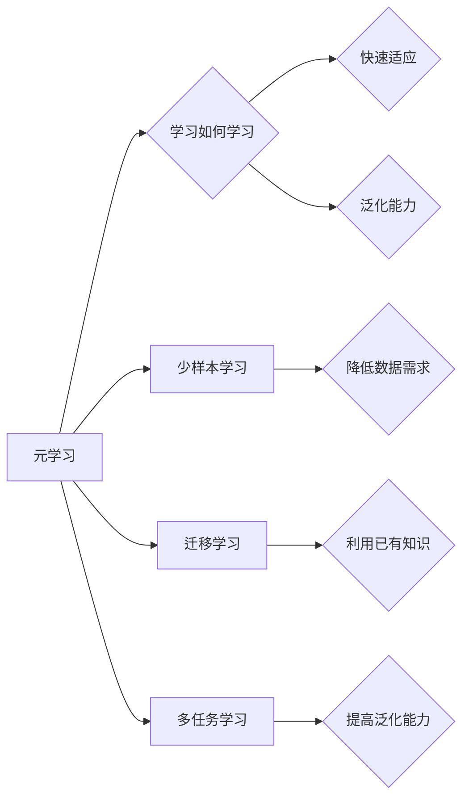

# 元学习与少样本学习原理与代码实战案例讲解

作者：禅与计算机程序设计艺术 / Zen and the Art of Computer Programming

## 1. 背景介绍

### 1.1 问题的由来

在人工智能领域，随着数据的不断积累和计算能力的提升，深度学习模型在图像识别、自然语言处理等领域的应用取得了显著的成果。然而，深度学习模型往往需要大量的标注数据进行训练，这在实际应用中往往难以满足。因此，如何利用少量样本进行学习，即少样本学习，成为了研究的热点问题。

同时，随着智能系统的应用范围越来越广，系统需要能够快速适应新的任务，即元学习。元学习旨在通过学习如何学习，使模型能够在不同的任务中快速适应和泛化，从而避免从头开始训练。

### 1.2 研究现状

近年来，元学习和少样本学习得到了广泛关注，并取得了许多突破性的成果。目前，研究主要集中在以下几个方面：

1. **元学习算法**：包括模型无关的元学习（Model-Agnostic Meta-Learning, MAML）、模型相关的元学习（Model-Agnostic Meta-Learning with MAML, Reptile）等。
2. **少样本学习算法**：包括基于距离的算法、基于原型的方法、基于生成的方法等。
3. **多任务学习**：通过学习多个相关的任务，提高模型在不同任务上的泛化能力。
4. **迁移学习**：利用已有任务的知识来加速新任务的学习。

### 1.3 研究意义

元学习和少样本学习对于人工智能领域具有重要意义：

1. **降低数据需求**：减少对标注数据的依赖，降低应用成本。
2. **提高泛化能力**：使模型能够适应不同的任务和环境。
3. **加速模型训练**：利用已有知识加速新任务的学习。

### 1.4 本文结构

本文将围绕元学习和少样本学习展开，首先介绍相关核心概念和联系，然后详细讲解核心算法原理和具体操作步骤，接着通过代码实例和案例分析，展示如何应用这些算法解决实际问题。最后，讨论元学习和少样本学习的实际应用场景和未来发展趋势。

## 2. 核心概念与联系

为了更好地理解元学习和少样本学习，我们需要了解以下几个核心概念：

- **元学习**：学习如何学习，使模型能够在不同的任务中快速适应和泛化。
- **少样本学习**：利用少量样本进行学习，减少对标注数据的依赖。
- **迁移学习**：利用已有任务的知识来加速新任务的学习。
- **多任务学习**：通过学习多个相关的任务，提高模型在不同任务上的泛化能力。

这些概念之间的关系如下所示：

## 3. 核心算法原理 & 具体操作步骤

### 3.1 算法原理概述

### 3.2 算法步骤详解

### 3.3 算法优缺点

### 3.4 算法应用领域

## 4. 数学模型和公式 & 详细讲解 & 举例说明

### 4.1 数学模型构建

### 4.2 公式推导过程

### 4.3 案例分析与讲解

### 4.4 常见问题解答

## 5. 项目实践：代码实例和详细解释说明

### 5.1 开发环境搭建

### 5.2 源代码详细实现

### 5.3 代码解读与分析

### 5.4 运行结果展示

## 6. 实际应用场景

### 6.1 图像识别

### 6.2 自然语言处理

### 6.3 强化学习

### 6.4 未来应用展望

## 7. 工具和资源推荐

### 7.1 学习资源推荐

### 7.2 开发工具推荐

### 7.3 相关论文推荐

### 7.4 其他资源推荐

## 8. 总结：未来发展趋势与挑战

### 8.1 研究成果总结

### 8.2 未来发展趋势

### 8.3 面临的挑战

### 8.4 研究展望

## 9. 附录：常见问题与解答

---

由于篇幅限制，本文仅展示了文章的目录结构。接下来，我们将按照目录结构，逐步展开对元学习和少样本学习的原理、方法、实践和展望进行详细讲解。