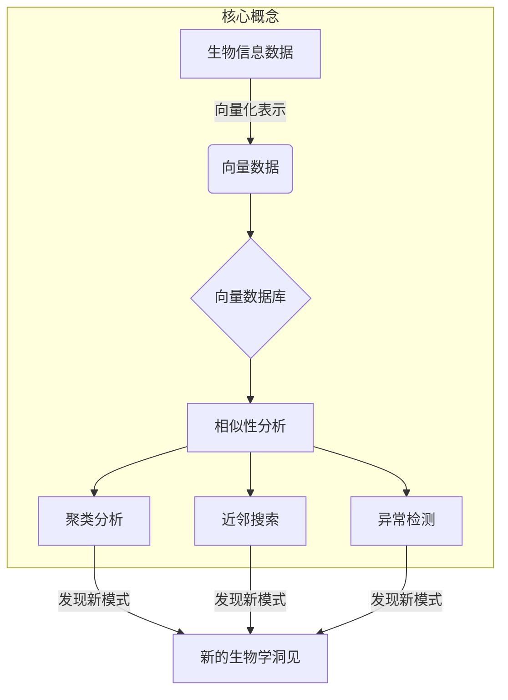

# 利用向量数据库加速生物信息数据分析

## 1. 背景介绍

### 1.1 问题的由来

随着生物信息学领域的不断发展,大量的基因组、蛋白质组和其他生物分子数据被产生和积累。这些数据的规模已经达到了前所未有的水平,给传统的数据存储和分析系统带来了巨大的挑战。生物信息数据具有以下几个特点:

1. **数据量大**:单个人类基因组就包含约30亿个碱基对,而在研究中需要分析成千上万个样本,导致数据量急剧增加。
2. **高维度**:每个生物分子都可以用数百甚至数千个特征来描述,形成高维度的数据。
3. **数据复杂性**:生物分子之间存在着错综复杂的相互作用关系,需要建模和分析。

传统的关系数据库和NoSQL数据库在处理这种海量高维度复杂数据时,存在着效率低下、可扩展性差等问题。因此,迫切需要一种新的数据存储和分析方案来应对生物信息数据带来的挑战。

### 1.2 研究现状

近年来,向量数据库(Vector Database)作为一种新兴的数据存储和分析技术引起了广泛关注。向量数据库可以高效地存储和检索高维度的向量数据,并支持基于相似性的查询和分析。这些特性使其在处理生物信息数据方面具有天然的优势。

目前,一些研究小组和公司已经开始探索将向量数据库应用于生物信息学领域。例如,斯坦福大学的研究人员利用向量数据库对基因表达数据进行聚类分析,发现了一些新的基因簇。另一个例子是Genexa公司,他们使用向量数据库构建了一个基因数据库,用于基因编辑和药物发现的研究。

然而,尽管取得了一些初步进展,但将向量数据库应用于生物信息数据分析仍然面临着诸多挑战,例如数据预处理、索引构建、相似性度量等,需要进一步的研究和探索。

### 1.3 研究意义

利用向量数据库加速生物信息数据分析具有重要的理论和应用价值:

1. **提高分析效率**:向量数据库可以高效地存储和检索高维度数据,大大加快了生物信息数据的分析速度。
2. **发现新的生物学洞见**:通过相似性分析和聚类,有望发现新的基因簇、蛋白质家族等,为生物学研究提供新的线索。
3. **促进跨学科融合**:将向量数据库技术与生物信息学相结合,是计算机科学与生命科学交叉融合的典范。
4. **推动数据驱动生物学**:向量数据库为高效处理海量生物数据提供了有力支撑,推动了数据驱动的生物学研究范式。

### 1.4 本文结构

本文将全面介绍如何利用向量数据库加速生物信息数据分析。主要内容包括:

1. 向量数据库的核心概念和原理
2. 生物信息数据的特点及向量化表示
3. 基于向量数据库的生物数据分析算法
4. 实际应用案例和性能评估
5. 未来发展趋势和挑战

接下来,我们将逐步深入探讨这些内容。

## 2. 核心概念与联系

在介绍利用向量数据库加速生物信息数据分析之前,我们需要先了解一些核心概念。

### 2.1 向量数据库

#### 2.1.1 什么是向量数据库?

向量数据库(Vector Database)是一种专门为高维度向量数据而设计的数据库系统。它能够高效地存储和检索这种数据,并支持基于相似性的查询和分析操作。

在向量数据库中,每个数据对象都被表示为一个高维度的向量,例如一个包含1000个元素的浮点数向量。这些向量通常是通过某种嵌入技术(如Word2Vec、BERT等)从原始数据(如文本、图像等)中提取得到的。

向量数据库的核心功能包括:

1. **向量存储**:能够高效地存储海量的高维度向量数据。
2. **相似性搜索**:支持基于向量相似度的近邻搜索,可以快速找到与给定向量最相似的数据对象。
3. **向量计算**:提供向量空间中的基本运算,如向量相加、相乘等。
4. **聚类分析**:可以对向量数据进行聚类,发现潜在的数据模式和结构。

#### 2.1.2 向量数据库的优势

与传统的关系数据库和NoSQL数据库相比,向量数据库在处理高维度数据时具有以下优势:

1. **高效存储和检索**:专门为向量数据优化的存储和索引结构,可以高效地存储和检索海量向量数据。
2. **相似性分析**:支持基于向量相似度的查询和分析,这对于发现数据模式和关联性至关重要。
3. **可扩展性**:大多数向量数据库采用分布式架构,可以轻松扩展以处理更大规模的数据。
4. **简化数据建模**:向量数据库将复杂的数据对象映射为向量,简化了数据建模和管理的过程。

这些优势使得向量数据库在处理生物信息数据等高维度复杂数据时具有天然的适用性。

### 2.2 生物信息数据

生物信息数据是指与生物分子相关的各种数据,包括基因组数据、蛋白质组数据、结构数据等。这些数据通常具有以下特点:

1. **高维度**:每个生物分子都可以用数百甚至数千个特征来描述,形成高维度的数据。
2. **复杂关联**:生物分子之间存在着错综复杂的相互作用关系,需要建模和分析。
3. **异构性**:生物信息数据来源多样,包括序列数据、结构数据、表达数据等,需要进行整合和关联分析。

#### 2.2.1 生物信息数据的向量化表示

为了将生物信息数据存储到向量数据库并进行相似性分析,我们需要将这些数据转换为向量形式。常见的向量化方法包括:

1. **One-hot编码**:将序列数据(如DNA、RNA、蛋白质序列)转换为高维稀疏向量。
2. **嵌入技术**:利用Word2Vec、BERT等自然语言处理技术,将序列数据嵌入到低维密集向量空间。
3. **结构特征提取**:从蛋白质或小分子的三维结构中提取几何和物理化学特征,形成结构描述向量。
4. **组合编码**:将多种特征(如序列、结构、功能注释等)组合编码,形成综合描述向量。

通过这些向量化方法,生物信息数据可以被高效地存储和分析。

### 2.3 相似性分析

相似性分析是向量数据库的核心功能之一,也是利用向量数据库加速生物信息数据分析的关键。相似性分析包括以下几个方面:

1. **相似性度量**:定义向量之间的相似性度量,如余弦相似度、欧几里得距离等。
2. **近邻搜索**:在向量空间中快速找到与给定向量最相似的 k 个近邻向量。
3. **聚类分析**:根据向量之间的相似性,将向量数据划分为多个簇或类别。
4. **异常检测**:发现与其他向量明显不同的异常向量,可用于发现新的生物模式。

相似性分析在生物信息学中有广泛的应用,例如:

- 基因或蛋白质的功能注释和分类
- 新药分子与已知药物的相似性比较
- 基因表达谱聚类分析
- 发现新的基因家族或蛋白质折叠模式

通过将生物信息数据映射到向量空间,并利用向量数据库的相似性分析能力,我们可以发现数据中隐藏的生物学模式和关联,获得新的生物学洞见。

### 2.4 Mermaid流程图

上图使用Mermaid流程图展示了利用向量数据库加速生物信息数据分析的核心概念及其联系。首先,生物信息数据通过向量化表示转换为向量数据,然后存储到向量数据库中。接下来,利用向量数据库的相似性分析功能,包括聚类分析、近邻搜索和异常检测,可以发现数据中隐藏的模式和关联性,从而获得新的生物学洞见。

## 3. 核心算法原理 & 具体操作步骤

### 3.1 算法原理概述

利用向量数据库加速生物信息数据分析的核心算法主要包括两个方面:

1. **向量化编码算法**:将生物信息数据(如基因序列、蛋白质结构等)转换为向量表示。
2. **相似性分析算法**:在向量空间中进行相似性搜索、聚类分析和异常检测等操作。

#### 3.1.1 向量化编码算法

向量化编码算法的目标是将生物信息数据映射到向量空间,使得相似的数据对象在向量空间中也彼此接近。常见的向量化编码算法包括:

1. **One-hot编码**:将序列数据(如DNA、RNA、蛋白质序列)转换为高维稀疏向量。
2. **Word2Vec**:利用Word2Vec技术将序列数据嵌入到低维密集向量空间。
3. **BERT**:使用BERT等transformer模型对序列数据进行向量化表示。
4. **结构特征提取**:从蛋白质或小分子的三维结构中提取几何和物理化学特征,形成结构描述向量。

不同的数据类型需要采用不同的向量化编码算法,以捕获数据的内在特征和模式。

#### 3.1.2 相似性分析算法

相似性分析算法在向量空间中执行各种操作,包括:

1. **相似性搜索**:给定一个查询向量,快速找到与之最相似的 k 个向量。常用的算法有基于树的算法(如球树、层次球树)和基于哈希的算法(如局部敏感哈希)。
2. **聚类分析**:根据向量之间的相似性,将向量数据划分为多个簇或类别。常用的算法有 K-means、DBSCAN、层次聚类等。
3. **异常检测**:发现与其他向量明显不同的异常向量,可用于发现新的生物模式。常用的算法有基于密度的方法、基于距离的方法等。

这些算法利用向量空间的性质,可以高效地执行相似性分析,发现数据中隐藏的模式和关联性。

### 3.2 算法步骤详解

下面我们详细介绍利用向量数据库加速生物信息数据分析的具体算法步骤。

#### 3.2.1 数据预处理

1. 收集生物信息数据,包括基因序列、蛋白质结构、表达谱等。
2. 对原始数据进行清洗和标准化,处理缺失值、异常值等问题。
3. 根据数据类型选择合适的向量化编码算法,将数据转换为向量表示。

#### 3.2.2 向量数据库构建

1. 选择一款适合的向量数据库系统,如Vestor、Pinecone、Weaviate等。
2. 将向量化后的生物信息数据批量导入向量数据库。
3. 根据需要,为向量数据构建索引以加速查询。

#### 3.2.3 相似性分析

1. **相似性搜索**
    - 给定一个查询向量(如一段基因序列或蛋白质结构)
    - 在向量数据库中搜索与之最相似的 k 个向量
    - 可用于功能注释、结构比对等任务

2. **聚类分析**
    - 对所有向量数据执行