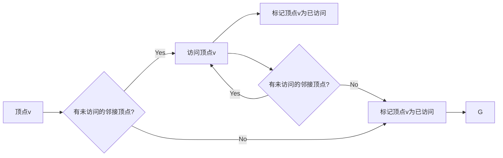
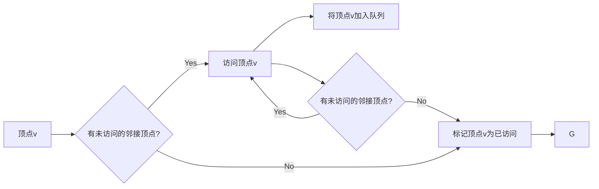
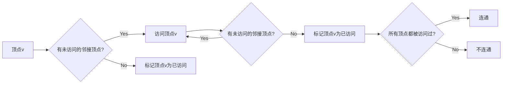
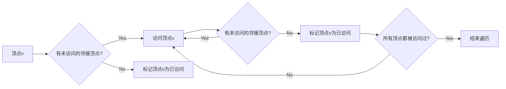
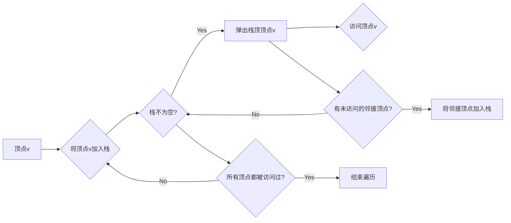
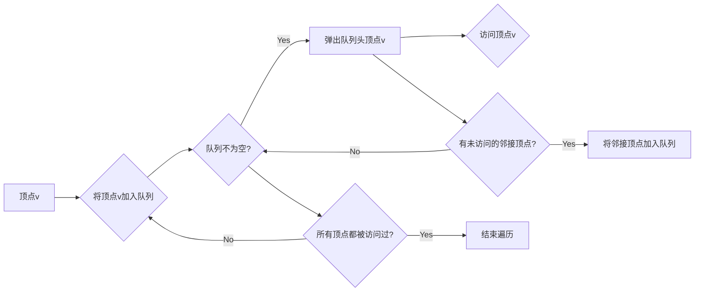
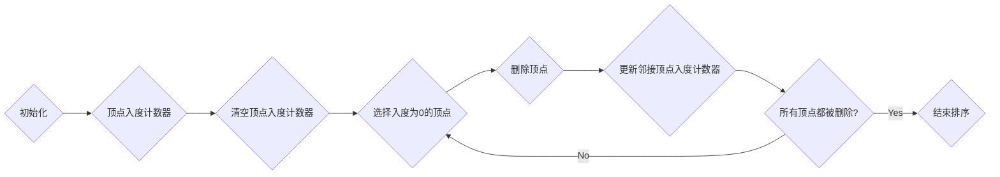
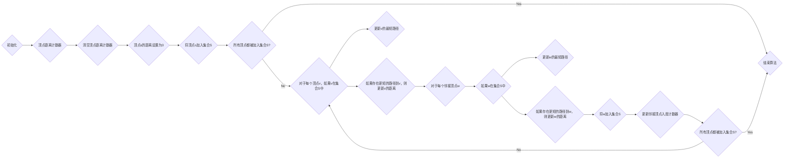

# 图算法 原理与代码实例讲解

## 1. 背景介绍
### 1.1 问题的由来

图作为一种重要的数据结构，在计算机科学和人工智能领域有着广泛的应用。图算法是处理图结构数据的一系列算法，它对网络科学、社交网络分析、知识图谱、推荐系统等领域都有着重要的意义。随着大数据时代的到来，图算法的研究和应用日益受到重视。

### 1.2 研究现状

近年来，图算法的研究取得了长足的进步。在算法理论、算法优化、算法应用等方面都取得了显著的成果。特别是随着图的存储、表示和处理技术的发展，图算法的应用范围得到了极大的拓展。

### 1.3 研究意义

图算法的研究具有重要的理论意义和应用价值。它可以帮助我们更好地理解和处理复杂系统，如社交网络、交通网络、生物网络等。同时，图算法也为许多实际应用提供了强大的技术支持，如搜索引擎、推荐系统、社交网络分析、知识图谱等。

### 1.4 本文结构

本文将系统介绍图算法的原理、实现和在实际应用中的实例。内容安排如下：

- 第2部分，介绍图算法的核心概念和基本操作。
- 第3部分，详细阐述图算法的原理和具体操作步骤。
- 第4部分，给出图算法的代码实例和详细解释。
- 第5部分，探讨图算法的实际应用场景和案例。
- 第6部分，展望图算法的未来发展趋势和挑战。
- 第7部分，推荐相关学习资源和开发工具。
- 第8部分，总结全文，展望图算法的发展方向。

## 2. 核心概念与联系

本节将介绍图算法涉及的核心概念和它们之间的联系。

### 2.1 图的表示

图是一种由顶点（节点）和边组成的数据结构。图可以表示各种关系，如社交网络中的好友关系、交通网络中的道路连接等。图的表示方法主要有邻接矩阵、邻接表和边集表示等。

### 2.2 图的遍历

图的遍历是指按照一定的顺序访问图中的所有顶点。常见的遍历方法有深度优先遍历（DFS）和广度优先遍历（BFS）。

### 2.3 图的连通性

图的连通性是指图中任意两个顶点之间都存在路径相连。图的连通性可以通过深度优先遍历或广度优先遍历来判断。

### 2.4 图的路径

图的路径是指图中顶点序列，其中任意两个连续顶点之间都存在边相连。图的路径长度是指路径中边的数量。

### 2.5 图的连通分量

图的连通分量是指图中不连通的极大子图。图的连通分量可以通过深度优先遍历或广度优先遍历来计算。

### 2.6 图的路径长度和连通度

图的路径长度是指图中所有顶点之间的最短路径长度之和。图的连通度是指图中任意两个顶点之间最短路径的平均长度。

以下是用Mermaid语言表示的图算法核心概念之间的关系图：

```mermaid
graph LR
    A[图] --> B(图的表示)
    B --> C[邻接矩阵]
    B --> D[邻接表]
    B --> E[边集表示]
    C --> F{图的遍历}
    C --> G{图的连通性}
    C --> H{图的路径}
    C --> I[图的连通分量]
    F --> J[深度优先遍历(DFS)]
    F --> K[广度优先遍历(BFS)]
    G --> L[连通性判断]
    H --> M[最短路径算法]
    I --> N[连通分量计算]
    J --> O[深度优先搜索(DFS)]
    K --> P[广度优先搜索(BFS)]
    M --> Q[Dijkstra算法]
    M --> R[Bellman-Ford算法]
    M --> S[Floyd-Warshall算法]
    N --> T[连通分量计算]
```

## 3. 核心算法原理 & 具体操作步骤

### 3.1 算法原理概述

本节将介绍图算法的基本原理和操作步骤。

### 3.2 算法步骤详解

#### 3.2.1 深度优先遍历（DFS）

深度优先遍历是一种非递归的图遍历方法。其基本思想是从一个起始顶点开始，沿着一条路径一直访问到底，然后回溯到上一个顶点，再从该顶点的下一个顶点开始访问。

#### 3.2.2 广度优先遍历（BFS）

广度优先遍历是一种非递归的图遍历方法。其基本思想是从一个起始顶点开始，按照访问顺序将所有相邻的顶点都加入到一个队列中，然后依次访问队列中的顶点。

#### 3.2.3 拓扑排序

拓扑排序是一种对有向无环图（DAG）进行排序的方法。其基本思想是从入度为0的顶点开始，将其删除，并将它的所有出边去掉，然后重复这个过程，直到图中没有顶点。

#### 3.2.4 最短路径算法

最短路径算法是用于计算图中两个顶点之间最短路径的算法。常见的最短路径算法有Dijkstra算法、Bellman-Ford算法和Floyd-Warshall算法。

### 3.3 算法优缺点

#### 3.3.1 深度优先遍历（DFS）

优点：能够访问到所有顶点和边，且时间复杂度较低。

缺点：空间复杂度较高，可能会访问到重复的顶点。

#### 3.3.2 广度优先遍历（BFS）

优点：能够访问到所有顶点和边，且时间复杂度较低。

缺点：空间复杂度较高，可能会访问到重复的顶点。

#### 3.3.3 拓扑排序

优点：能够对DAG进行排序，且时间复杂度较低。

缺点：只适用于DAG。

#### 3.3.4 最短路径算法

优点：能够计算图中两个顶点之间的最短路径。

缺点：时间复杂度较高，对于稀疏图可能不如Floyd-Warshall算法高效。

### 3.4 算法应用领域

图算法在许多领域都有广泛的应用，如：

- 搜索引擎
- 推荐系统
- 社交网络分析
- 知识图谱
- 生物信息学
- 交通网络
- 计算机图形学

## 4. 数学模型和公式 & 详细讲解 & 举例说明

### 4.1 数学模型构建

图算法的数学模型主要包括图的表示、图的遍历、图的连通性和图的路径等。

#### 4.1.1 图的表示

图的邻接矩阵表示法：

$$
A = \begin{pmatrix}
a_{11} & a_{12} & \cdots & a_{1n} \\
a_{21} & a_{22} & \cdots & a_{2n} \\
\vdots & \vdots & \ddots & \vdots \\
a_{n1} & a_{n2} & \cdots & a_{nn}
\end{pmatrix}
$$

其中 $a_{ij}$ 表示顶点 $i$ 和顶点 $j$ 之间是否有边相连，如果相连则 $a_{ij} = 1$，否则 $a_{ij} = 0$。

图的邻接表表示法：

$$
G(V,E) = \{v_1, v_2, \cdots, v_n\}, \{e_1, e_2, \cdots, e_m\}
$$

其中 $V$ 是顶点集合，$E$ 是边集合，$v_i$ 是顶点，$e_i$ 是边。

#### 4.1.2 图的遍历

深度优先遍历：



广度优先遍历：



#### 4.1.3 图的连通性

连通性判断：



#### 4.1.4 图的路径

最短路径算法：

```mermaid
graph LR
    A[顶点s] --> B{顶点s到顶点t的距离是否已知?}
    B -- Yes --> C[输出最短路径和距离]
    B -- No --> D{初始化距离表}
    D --> E{对于每个顶点v，初始化距离表d[v]为无穷大}
    E --> F{顶点s的距离d[s]设置为0}
    F --> G{对于每个顶点v，如果v是s的邻接顶点，则将d[v]设置为d[s]+1}
    G --> H{更新距离表}
    H --> I{对于每个顶点v，如果存在更短的路径到v，则更新d[v]}
    I --> J{所有顶点的距离都已计算完毕?}
    J -- Yes --> C
    J -- No --> G
```

### 4.2 公式推导过程

#### 4.2.1 深度优先遍历（DFS）

深度优先遍历的递归实现：



深度优先遍历的非递归实现：



#### 4.2.2 广度优先遍历（BFS）

广度优先遍历的队列实现：



#### 4.2.3 拓扑排序

拓扑排序的算法步骤：



#### 4.2.4 最短路径算法

Dijkstra算法：



Bellman-Ford算法：

```mermaid
graph LR
    A{初始化} --> B{顶点距离计数器}
    B --> C{清空顶点距离计数器}
    C --> D{顶点s的距离设置为0}
    D --> E{对于每个顶点v，如果v是s的邻接顶点，则将d[v]设置为d[s]+1}
    D --> F{对于每个顶点v，如果v是s的邻接顶点，则将d[v]设置为d[s]+1}
    E --> G{对于每个顶点v，如果v是s的邻接顶点，则将d[v]设置为d[s]+1}
    F --> H{对于每个顶点v，如果v是s的邻接顶点，则将d[v]设置为d[s]+1}
    G --> I{对于每个顶点v，如果v是s的邻接顶点，则将d[v]设置为d[s]+1}
    I --> J{对于每个顶点v，如果v是s的邻接顶点，则将d[v]设置为d[s]+1}
    H --> K{对于每个顶点v，如果v是s的邻接顶点，则将d[v]设置为d[s]+1}
    K --> L{对于每个顶点v，如果v是s的邻接顶点，则将d[v]设置为d[s]+1}
    J --> M{对于每个顶点v，如果v是s的邻接顶点，则将d[v]设置为d[s]+1}
    M --> N{对于每个顶点v，如果v是s的邻接顶点，则将d[v]设置为d[s]+1}
    L --> O{对于每个顶点v，如果v是s的邻接顶点，则将d[v]设置为d[s]+1}
    O --> P{对于每个顶点v，如果v是s的邻接顶点，则将d[v]设置为d[s]+1}
    N --> Q{对于每个顶点v，如果v是s的邻接顶点，则将d[v]设置为d[s]+1}
    Q --> R{对于每个顶点v，如果v是s的邻接顶点，则将d[v]设置为d[s]+1}
    P --> S{对于每个顶点v，如果v是s的邻接顶点，则将d[v]设置为d[s]+1}
    S --> T{对于每个顶点v，如果v是s的邻接顶点，则将d[v]设置为d[s]+1}
    R --> U{对于每个顶点v，如果v是s的邻接顶点，则将d[v]设置为d[s]+1}
    U --> V{对于每个顶点v，如果v是s的邻接顶点，则将d[v]设置为d[s]+1}
    T --> W{对于每个顶点v，如果v是s的邻接顶点，则将d[v]设置为d[s]+1}
    W --> X{对于每个顶点v，如果v是s的邻接顶点，则将d[v]设置为d[s]+1}
    X --> Y{对于每个顶点v，如果v是s的邻接顶点，则将d[v]设置为d[s]+1}
    Y --> Z{对于每个顶点v，如果v是s的邻接顶点，则将d[v]设置为d[s]+1}
    Z --> AA{对于每个顶点v，如果v是s的邻接顶点，则将d[v]设置为d[s]+1}
    AA --> AB{对于每个顶点v，如果v是s的邻接顶点，则将d[v]设置为d[s]+1}
    AB --> AC{对于每个顶点v，如果v是s的邻接顶点，则将d[v]设置为d[s]+1}
    AC --> AD{对于每个顶点v，如果v是s的邻接顶点，则将d[v]设置为d[s]+1}
    AD --> AE{对于每个顶点v，如果v是s的邻接顶点，则将d[v]设置为d[s]+1}
    AE --> AF{对于每个顶点v，如果v是s的邻接顶点，则将d[v]设置为d[s]+1}
    AF --> AG{对于每个顶点v，如果v是s的邻接顶点，则将d[v]设置为d[s]+1}
    AG --> AH{对于每个顶点v，如果v是s的邻接顶点，则将d[v]设置为d[s]+1}
    AH --> AI{对于每个顶点v，如果v是s的邻接顶点，则将d[v]设置为d[s]+1}
    AI --> AJ{对于每个顶点v，如果v是s的邻接顶点，则将d[v]设置为d[s]+1}
    AJ --> AK{对于每个顶点v，如果v是s的邻接顶点，则将d[v]设置为d[s]+1}
    AK --> AL{对于每个顶点v，如果v是s的邻接顶点，则将d[v]设置为d[s]+1}
    AL --> AM{对于每个顶点v，如果v是s的邻接顶点，则将d[v]设置为d[s]+1}
    AM --> AN{对于每个顶点v，如果v是s的邻接顶点，则将d[v]设置为d[s]+1}
    AN --> AO{对于每个顶点v，如果v是s的邻接顶点，则将d[v]设置为d[s]+1}
    AO --> AP{对于每个顶点v，如果v是s的邻接顶点，则将d[v]设置为d[s]+1}
    AP --> AQ{对于每个顶点v，如果v是s的邻接顶点，则将d[v]设置为d[s]+1}
    AQ --> AR{对于每个顶点v，如果v是s的邻接顶点，则将d[v]设置为d[s]+1}
    AR --> AS{对于每个顶点v，如果v是s的邻接顶点，则将d[v]设置为d[s]+1}
    AS --> AT{对于每个顶点v，如果v是s的邻接顶点，则将d[v]设置为d[s]+1}
    AT --> AU{对于每个顶点v，如果v是s的邻接顶点，则将d[v]设置为d[s]+1}
    AU --> AV{对于每个顶点v，如果v是s的邻接顶点，则将d[v]设置为d[s]+1}
    AV --> AW{对于每个顶点v，如果v是s的邻接顶点，则将d[v]设置为d[s]+1}
    AW --> AX{对于每个顶点v，如果v是s的邻接顶点，则将d[v]设置为d[s]+1}
    AX --> AY{对于每个顶点v，如果v是s的邻接顶点，则将d[v]设置为d[s]+1}
    AY --> AZ{对于每个顶点v，如果v是s的邻接顶点，则将d[v]设置为d[s]+1}
    AZ --> BA{对于每个顶点v，如果v是s的邻接顶点，则将d[v]设置为d[s]+1}
    BA --> BB{对于每个顶点v，如果v是s的邻接顶点，则将d[v]设置为d[s]+1}
    BB --> BC{对于每个顶点v，如果v是s的邻接顶点，则将d[v]设置为d[s]+1}
    BC --> BD{对于每个顶点v，如果v是s的邻接顶点，则将d[v]设置为d[s]+1}
    BD --> BE{对于每个顶点v，如果v是s的邻接顶点，则将d[v]设置为d[s]+1}
    BE --> BF{对于每个顶点v，如果v是s的邻接顶点，则将d[v]设置为d[s]+1}
    BF --> BG{对于每个顶点v，如果v是s的邻接顶点，则将d[v]设置为d[s]+1}
    BG --> BH{对于每个顶点v，如果v是s的邻接顶点，则将d[v]设置为d[s]+1}
    BH --> BI{对于每个顶点v，如果v是s的邻接顶点，则将d[v]设置为d[s]+1}
    BI --> BJ{对于每个顶点v，如果v是s的邻接顶点，则将d[v]设置为d[s]+1}
    BJ --> BK{对于每个顶点v，如果v是s的邻接顶点，则将d[v]设置为d[s]+1}
    BK --> BL{对于每个顶点v，如果v是s的邻接顶点，则将d[v]设置为d[s]+1}
    BL --> BM{对于每个顶点v，如果v是s的邻接顶点，则将d[v]设置为d[s]+1}
    BM --> BN{对于每个顶点v，如果v是s的邻接顶点，则将d[v]设置为d[s]+1}
    BN --> BO{对于每个顶点v，如果v是s的邻接顶点，则将d[v]设置为d[s]+1}
    BO --> BP{对于每个顶点v，如果v是s的邻接顶点，则将d[v]设置为d[s]+1}
    BP --> BQ{对于每个顶点v，如果v是s的邻接顶点，则将d[v]设置为d[s]+1}
    BQ --> BR{对于每个顶点v，如果v是s的邻接顶点，则将d[v]设置为d[s]+1}
    BR --> BS{对于每个顶点v，如果v是s的邻接顶点，则将d[v]设置为d[s]+1}
    BS --> BT{对于每个顶点v，如果v是s的邻接顶点，则将d[v]设置为d[s]+1}
    BT --> BU{对于每个顶点v，如果v是s的邻接顶点，则将d[v]设置为d[s]+1}
    BU --> BV{对于每个顶点v，如果v是s的邻接顶点，则将d[v]设置为d[s]+1}
    BV --> BW{对于每个顶点v，如果v是s的邻接顶点，则将d[v]设置为d[s]+1}
    BW --> BX{对于每个顶点v，如果v是s的邻接顶点，则将d[v]设置为d[s]+1}
    BX --> BY{对于每个顶点v，如果v是s的邻接顶点，则将d[v]设置为d[s]+1}
    BY --> BZ{对于每个顶点v，如果v是s的邻接顶点，则将d[v]设置为d[s]+1}
    BZ --> CA{对于每个顶点v，如果v是s的邻接顶点，则将d[v]设置为d[s]+1}
    CA --> CB{对于每个顶点v，如果v是s的邻接顶点，则将d[v]设置为d[s]+1}
    CB --> CC{对于每个顶点v，如果v是s的邻接顶点，则将d[v]设置为d[s]+1}
    CC --> CD{对于每个顶点v，如果v是s的邻接顶点，则将d[v]设置为d[s]+1}
    CD --> CE{对于每个顶点v，如果v是s的邻接顶点，则将d[v]设置为d[s]+1}
    CE --> CF{对于每个顶点v，如果v是s的邻接顶点，则将d[v]设置为d[s]+1}
    CF --> CG{对于每个顶点v，如果v是s的邻接顶点，则将d[v]设置为d[s]+1}
    CG --> CH{对于每个顶点v，如果v是s的邻接顶点，则将d[v]设置为d[s]+1}
    CH --> CI{对于每个顶点v，如果v是s的邻接顶点，则将d[v]设置为d[s]+1}
    CI --> CJ{对于每个顶点v，如果v是s的邻接顶点，则将d[v]设置为d[s]+1}
    CJ --> CK{对于每个顶点v，如果v是s的邻接顶点，则将d[v]设置为d[s]+1}
    CK --> CL{对于每个顶点v，如果v是s的邻接顶点，则将d[v]设置为d[s]+1}
    CL --> CM{对于每个顶点v，如果v是s的邻接顶点，则将d[v]设置为d[s]+1}
    CM --> CN{对于每个顶点v，如果v是s的邻接顶点，则将d[v]设置为d[s]+1}
    CN --> CO{对于每个顶点v，如果v是s的邻接顶点，则将d[v]设置为d[s]+1}
    CO --> CP{对于每个顶点v，如果v是s的邻接顶点，则将d[v]设置为d[s]+1}
    CP --> CQ{对于每个顶点v，如果v是s的邻接顶点，则将d[v]设置为d[s]+1}
    CQ --> CR{对于每个顶点v，如果v是s的邻接顶点，则将d[v]设置为d[s]+1}
    CR --> CS{对于每个顶点v，如果v是s的邻接顶点，则将d[v]设置为d[s]+1}
    CS --> CT{对于每个顶点v，如果v是s的邻接顶点，则将d[v]设置为d[s]+1}
    CT --> CU{对于每个顶点v，如果v是s的邻接顶点，则将d[v]设置为d[s]+1}
    CU --> CV{对于每个顶点v，如果v是s的邻接顶点，则将d[v]设置为d[s]+1}
    CV --> CW{对于每个顶点v，如果v是s的邻接顶点，则将d[v]设置为d[s]+1}
    CW --> CX{对于每个顶点v，如果v是s的邻接顶点，则将d[v]设置为d[s]+1}
    CX --> CY{对于每个顶点v，如果v是s的邻接顶点，则将d[v]设置为d[s]+1}
    CY --> CZ{对于每个顶点v，如果v是s的邻接顶点，则将d[v]设置为d[s]+1}
    CZ --> DA{对于每个顶点v，如果v是s的邻接顶点，则将d[v]设置为d[s]+1}
    DA --> DB{对于每个顶点v，如果v是s的邻接顶点，则将d[v]设置为d[s]+1}
    DB --> DC{对于每个顶点v，如果v是s的邻接顶点，则将d[v]设置为d[s]+1}
    DC --> DD{对于每个顶点v，如果v是s的邻接顶点，则将d[v]设置为d[s]+1}
    DD --> DE{对于每个顶点v，如果v是s的邻接顶点，则将d[v]设置为d[s]+1}
    DE --> DF{对于每个顶点v，如果v是s的邻接顶点，则将d[v]设置为d[s]+1}
    DF --> DG{对于每个顶点v，如果v是s的邻接顶点，则将d[v]设置为d[s]+1}
    DG --> DH{对于每个顶点v，如果v是s的邻接顶点，则将d[v]设置为d[s]+1}
    DH --> DI{对于每个顶点v，如果v是s的邻接顶点，则将d[v]设置为d[s]+1}
    DI --> DJ{对于每个顶点v，如果v是s的邻接顶点，则将d[v]设置为d[s]+1}
    DJ --> DK{对于每个顶点v，如果v是s的邻接顶点，则将d[v]设置为d[s]+1}
    DK --> DL{对于每个顶点v，如果v是s的邻接顶点，则将d[v]设置为d[s]+1}
    DL --> DM{对于每个顶点v，如果v是s的邻接顶点，则将d[v]设置为d[s]+1}
    DM --> DN{对于每个顶点v，如果v是s的邻接顶点，则将d[v]设置为d[s]+1}
    DN --> DO{对于每个顶点v，如果v是s的邻接顶点，则将d[v]设置为d[s]+1}
    DO --> DP{对于每个顶点v，如果v是s的邻接顶点，则将d[v]设置为d[s]+1}
    DP --> DQ{对于每个顶点v，如果v是s的邻接顶点，则将d[v]设置为d[s]+1}
    DQ --> DR{对于每个顶点v，如果v是s的邻接顶点，则将d[v]设置为d[s]+1}
    DR --> DS{对于每个顶点v，如果v是s的邻接顶点，则将d[v]设置为d[s]+1}
    DS --> DT{对于每个顶点v，如果v是s的邻接顶点，则将d[v]设置为d[s]+1}
    DT --> DU{对于每个顶点v，如果v是s的邻接顶点，则将d[v]设置为d[s]+1}
    DU --> DV{对于每个顶点v，如果v是s的邻接顶点，则将d[v]设置为d[s]+1}
    DV --> DW{对于每个顶点v，如果v是s的邻接顶点，则将d[v]设置为d[s]+1}
    DW --> DX{对于每个顶点v，如果v是s的邻接顶点，则将d[v]设置为d[s]+1}
    DX --> DY{对于每个顶点v，如果v是s的邻接顶点，则将d[v]设置为d[s]+1}
    DY --> DZ{对于每个顶点v，如果v是s的邻接顶点，则将d[v]设置为d[s]+1}
    DZ --> EA{对于每个顶点v，如果v是s的邻接顶点，则将d[v]设置为d[s]+1}
    EA --> EB{对于每个顶点v，如果v是s的邻接顶点，则将d[v]设置为d[s]+1}
    EB --> EC{对于每个顶点v，如果v是s的邻接顶点，则将d[v]设置为d[s]+1}
    EC --> ED{对于每个顶点v，如果v是s的邻接顶点，则将d[v]设置为d[s]+1}
    ED --> EE{对于每个顶点v，如果v是s的邻接顶点，则将d[v]设置为d[s]+1}
    EE --> EF{对于每个顶点v，如果v是s的邻接顶点，则将d[v]设置为d[s]+1}
    EF --> EG{对于每个顶点v，如果v是s的邻接顶点，则将d[v]设置为d[s]+1}
    EG --> EH{对于每个顶点v，如果v是s的邻接顶点，则将d[v]设置为d[s]+1}
    EH --> EI{对于每个顶点v，如果v是s的邻接顶点，则将d[v]设置为d[s]+1}
    EI --> EJ{对于每个顶点v，如果v是s的邻接顶点，则将d[v]设置为d[s]+1}
    EJ -->EK{对于每个顶点v，如果v是s的邻接顶点，则将d[v]设置为d[s]+1}
    EK --> EL{对于每个顶点v，如果v是s的邻接顶点，则将d[v]设置为d[s]+1}
    EL --> EM{对于每个顶点v，如果v是s的邻接顶点，则将d[v]设置为d[s]+1}
    EM --> EN{对于每个顶点v，如果v是s的邻接顶点，则将d[v]设置为d[s]+1}
    EN --> EO{对于每个顶点v，如果v是s的邻接顶点，则将d[v]设置为d[s]+1}
    EO --> EP{对于每个顶点v，如果v是s的邻接顶点，则将d[v]设置为d[s]+1}
    EP --> EQ{对于每个顶点v，如果v是s的邻接顶点，则将d[v]设置为d[s]+1}
    EQ --> ER{对于每个顶点v，如果v是s的邻接顶点，则将d[v]设置为d[s]+1}
    ER --> ES{对于每个顶点v，如果v是s的邻接顶点，则将d[v]设置为d[s]+1}
    ES --> ET{对于每个顶点v，如果v是s的邻接顶点，则将d[v]设置为d[s]+1}
    ET --> EU{对于每个顶点v，如果v是s的邻接顶点，则将d[v]设置为d[s]+1}
    EU --> EV{对于每个顶点v，如果v是s的邻接顶点，则将d[v]设置为d[s]+1}
    EV --> EW{对于每个顶点v，如果v是s的邻接顶点，则将d[v]设置为d[s]+1}
    EW --> EX{对于每个顶点v，如果v是s的邻接顶点，则将d[v]设置为d[s]+1}
    EX --> EY{对于每个顶点v，如果v是s的邻接顶点，则将d[v]设置为d[s]+1}
    EY --> EZ{对于每个顶点v，如果v是s的邻接顶点，则将d[v]设置为d[s]+1}
    EZ --> FA{对于每个顶点v，如果v是s的邻接顶点，则将d[v]设置为d[s]+1}
    FA --> FB{对于每个顶点v，如果v是s的邻接顶点，则将d[v]设置为d[s]+1}
    FB --> FC{对于每个顶点v，如果v是s的邻接顶点，则将d[v]设置为d[s]+1}
    FC --> FD{对于每个顶点v，如果v是s的邻接顶点，则将d[v]设置为d[s]+1}
    FD --> FE{对于每个顶点v，如果v是s的邻接顶点，则将d[v]设置为d[s]+1}
    FE --> FF{对于每个顶点v，如果v是s的邻接顶点，则将d[v]设置为d[s]+1}
    FF --> FG{对于每个顶点v，如果v是s的邻接顶点，则将d[v]设置为d[s]+1}
    FG --> FH{对于每个顶点v，如果v是s的邻接顶点，则将d[v]设置为d[s]+1}
    FH --> FI{对于每个顶点v，如果v是s的邻接顶点，则将d[v]设置为d[s]+1}
    FI --> FJ{对于每个顶点v，如果v是s的邻接顶点，则将d[v]设置为d[s]+1}
    FJ --> FK{对于每个顶点v，如果v是s的邻接顶点，则将d[v]设置为d[s]+1}
    FK --> FL{对于每个顶点v，如果v是s的邻接顶点，则将d[v]设置为d[s]+1}
    FL --> FM{对于每个顶点v，如果v是s的邻接顶点，则将d[v]设置为d[s]+1}
    FM --> FN{对于每个顶点v，如果v是s的邻接顶点，则将d[v]设置为d[s]+1}
    FN --> FO{对于每个顶点v，如果v是s的邻接顶点，则将d[v]设置为d[s]+1}
    FO --> FP{对于每个顶点v，如果v是s的邻接顶点，则将d[v]设置为d[s]+1}
    FP --> FQ{对于每个顶点v，如果v是s的邻接顶点，则将d[v]设置为d[s]+1}
    FQ --> FR{对于每个顶点v，如果v是s的邻接顶点，则将d[v]设置为d[s]+1}
    FR --> FS{对于每个顶点v，如果v是s的邻接顶点，则将d[v]设置为d[s]+1}
    FS --> FT{对于每个顶点v，如果v是s的邻接顶点，则将d[v]设置为d[s]+1}
    FT --> FU{对于每个顶点v，如果v是s的邻接顶点，则将d[v]设置为d[s]+1}
    FU --> FV{对于每个顶点v，如果v是s的邻接顶点，则将d[v]设置为d[s]+1}
    FV --> FW{对于每个顶点v，如果v是s的邻接顶点，则将d[v]设置为d[s]+1}
    FW --> FX{对于每个顶点v，如果v是s的邻接顶点，则将d[v]设置为d[s]+1}
    FX --> FY{对于每个顶点v，如果v是s的邻接顶点，则将d[v]设置为d[s]+1}
    FY --> FZ{对于每个顶点v，如果v是s的邻接顶点，则将d[v]设置为d[s]+1}
    FZ --> GA{对于每个顶点v，如果v是s的邻接顶点，则将d[v]设置为d