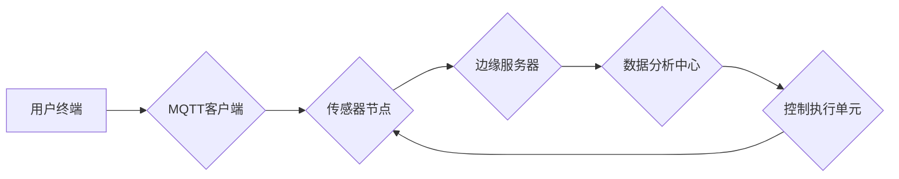

# 基于MQTT协议和RESTful API的室内噪音监控与控制系统

作者：禅与计算机程序设计艺术 / Zen and the Art of Computer Programming

## 关键词：MQTT协议，RESTful API，室内噪音监控，控制系统，物联网，边缘计算，智能建筑

## 1. 背景介绍
### 1.1 问题的由来

随着城市化进程的加速，人们对居住和工作环境的要求越来越高。室内噪音污染已经成为影响人们身心健康的重要因素之一。为了改善居住和工作环境，实现室内噪音的有效监控与控制，成为了一个迫切需要解决的问题。

### 1.2 研究现状

目前，室内噪音监控与控制技术主要依赖于传感器、数据采集和传输、数据处理与分析、以及控制执行等方面。传统的室内噪音监控系统通常采用有线方式，如RS-485、CAN总线等，存在布线复杂、成本高、灵活性差等缺点。

近年来，随着物联网、边缘计算等技术的发展，基于无线传感网络的室内噪音监控与控制系统逐渐成为研究热点。MQTT协议作为一种轻量级的消息传输协议，因其低功耗、低延迟、可扩展等特点，在物联网领域得到了广泛应用。RESTful API作为Web服务的常用协议，可以实现不同系统之间的数据交互和业务协同。

### 1.3 研究意义

研究基于MQTT协议和RESTful API的室内噪音监控与控制系统，具有以下意义：

1. **降低系统成本**：采用无线传感网络和MQTT协议，可以降低布线成本，提高系统部署的灵活性。
2. **提高系统可靠性**：MQTT协议具有低延迟、高可靠性的特点，可以保证数据传输的实时性和准确性。
3. **实现智能化控制**：通过对噪音数据的实时分析，可以实现室内噪音的智能控制，提高居住和工作环境的舒适度。
4. **促进智能化建筑发展**：室内噪音监控与控制系统是智能化建筑的重要组成部分，有助于推动智能化建筑的发展。

### 1.4 本文结构

本文将围绕基于MQTT协议和RESTful API的室内噪音监控与控制系统展开，主要内容包括：

- 核心概念与联系
- 系统架构设计
- 噪音数据采集与传输
- 噪音数据处理与分析
- 室内噪音智能控制
- 系统部署与实施
- 应用案例
- 总结与展望

## 2. 核心概念与联系
### 2.1 MQTT协议

MQTT（Message Queuing Telemetry Transport）是一种轻量级的消息传输协议，适用于低功耗、低带宽、高延迟的物联网应用场景。其主要特点如下：

1. **发布/订阅模式**：客户端可以订阅主题，服务器将订阅的主题消息转发给订阅者。
2. **质量服务等级**：MQTT支持三种质量服务等级（QoS），分别对应消息传输的可靠性。
3. **连接状态**：客户端可以与服务器建立持久连接，即使客户端断开连接，服务器也会保留客户端的订阅信息。

### 2.2 RESTful API

RESTful API（Representational State Transfer）是一种基于HTTP协议的Web服务架构风格。其主要特点如下：

1. **无状态**：服务器不保存任何客户端状态信息，每次请求都是独立的。
2. **统一接口**：使用统一的接口和返回格式，方便客户端调用。
3. **数据格式**：支持多种数据格式，如JSON、XML等。

### 2.3 物联网

物联网（Internet of Things，IoT）是指通过传感器、网络、云计算等技术，将各种物理设备连接起来，实现智能感知、识别、控制和管理的网络。物联网包括感知层、网络层和应用层。

## 3. 系统架构设计
### 3.1 系统架构概述

基于MQTT协议和RESTful API的室内噪音监控与控制系统架构如图1所示。



系统由以下模块组成：

1. **用户终端**：用户可以通过手机APP、网页等方式访问系统。
2. **MQTT客户端**：负责与传感器节点进行数据交互。
3. **传感器节点**：负责采集室内噪音数据，并通过MQTT协议将数据发送到边缘服务器。
4. **边缘服务器**：负责接收传感器节点发送的噪音数据，并进行初步处理。
5. **数据分析中心**：负责对噪音数据进行深度分析，并生成控制策略。
6. **控制执行单元**：负责根据控制策略执行控制命令，例如打开或关闭门窗、调节空调等。

### 3.2 系统架构设计要点

1. **模块化设计**：系统采用模块化设计，便于扩展和维护。
2. **分布式架构**：系统采用分布式架构，提高系统的可靠性和可扩展性。
3. **边缘计算**：在边缘服务器上进行初步数据处理，减轻数据分析中心的数据处理压力。
4. **安全设计**：采用数据加密、身份认证等安全措施，保证数据传输的安全性。

## 4. 噪音数据采集与传输
### 4.1 噪音数据采集

室内噪音数据采集主要通过噪音传感器实现。噪音传感器将声波信号转换为电信号，并通过模拟数字转换器（ADC）转换为数字信号，最终发送到控制器。

### 4.2 噪音数据传输

噪音传感器采集到的数据通过MQTT协议传输到边缘服务器。MQTT客户端负责将采集到的数据封装成MQTT消息，并发送到服务器。

### 4.3 MQTT消息格式

MQTT消息格式如下：

```json
{
  "topic": "sensor/data",
  "payload": {
    "sensor_id": "001",
    "timestamp": "2021-09-01T12:34:56Z",
    "noise_level": "60"
  }
}
```

其中，`topic`表示消息主题，`payload`表示消息负载，包括传感器ID、时间戳和噪音级别等。

## 5. 噪音数据处理与分析
### 5.1 噪音数据处理

边缘服务器接收到MQTT消息后，对数据进行解析、去噪等处理，并将处理后的数据发送到数据分析中心。

### 5.2 噪音数据分析

数据分析中心对噪音数据进行深度分析，包括：

1. **噪音水平统计**：计算噪音水平的平均值、最大值、最小值等统计指标。
2. **噪音变化趋势分析**：分析噪音水平的时序变化趋势。
3. **噪音源识别**：识别噪音源，如交通、施工、设备运行等。
4. **噪音事件检测**：检测噪音事件，如噪音峰值、噪音持续时间等。

### 5.3 噪音控制策略生成

根据噪音数据分析结果，生成噪音控制策略，例如：

1. **自动调节门窗**：当噪音水平超过设定阈值时，自动关闭门窗。
2. **调节空调**：当噪音水平超过设定阈值时，自动调节空调，降低室内噪音。
3. **发送提醒**：当噪音水平超过设定阈值时，向用户发送提醒信息。

## 6. 室内噪音智能控制
### 6.1 控制执行单元

控制执行单元负责根据噪音控制策略执行控制命令。控制执行单元可以是智能空调、智能门窗、智能灯光等设备。

### 6.2 控制策略执行

控制执行单元接收到控制命令后，根据控制命令执行相应的操作，例如：

1. **自动关闭门窗**：当噪音水平超过设定阈值时，自动关闭门窗。
2. **调节空调**：当噪音水平超过设定阈值时，自动调节空调，降低室内噪音。
3. **调节灯光**：根据噪音水平调整灯光亮度。

## 7. 系统部署与实施
### 7.1 系统硬件设备

系统硬件设备包括：

1. **噪音传感器**：用于采集室内噪音数据。
2. **MQTT客户端**：负责与传感器节点进行数据交互。
3. **边缘服务器**：负责接收传感器节点发送的噪音数据，并进行初步处理。
4. **数据分析中心**：负责对噪音数据进行深度分析，并生成控制策略。
5. **控制执行单元**：负责根据控制策略执行控制命令。

### 7.2 系统软件平台

系统软件平台包括：

1. **MQTT服务器**：负责处理MQTT消息。
2. **边缘计算平台**：负责边缘数据处理和分析。
3. **数据分析平台**：负责噪音数据深度分析。
4. **控制执行平台**：负责控制命令执行。

### 7.3 系统部署步骤

1. **硬件设备安装**：将噪音传感器、MQTT客户端、边缘服务器、数据分析中心、控制执行单元等硬件设备安装到指定位置。
2. **软件平台部署**：在边缘服务器、数据分析中心、控制执行平台等设备上部署相应的软件平台。
3. **系统配置**：配置MQTT服务器、边缘计算平台、数据分析平台、控制执行平台等，实现数据采集、传输、处理、分析和控制。
4. **系统测试**：对系统进行测试，确保系统功能正常。

## 8. 应用案例
### 8.1 案例一：智能家居

在某智能家居项目中，基于MQTT协议和RESTful API的室内噪音监控与控制系统应用于住宅小区。系统可以实时监测室内噪音水平，并根据噪音水平自动调节空调、门窗等设备，提高居住环境的舒适度。

### 8.2 案例二：办公环境

在某办公楼中，基于MQTT协议和RESTful API的室内噪音监控与控制系统应用于会议室。系统可以实时监测会议室的噪音水平，并根据噪音水平自动调节灯光、空调等设备，提高会议效率。

## 9. 总结：未来发展趋势与挑战
### 9.1 研究成果总结

本文介绍了基于MQTT协议和RESTful API的室内噪音监控与控制系统，包括系统架构、数据采集与传输、数据处理与分析、智能控制等方面。通过实际案例展示了系统的应用效果。

### 9.2 未来发展趋势

1. **传感器技术**：随着传感器技术的不断发展，噪音传感器的精度和可靠性将进一步提高。
2. **边缘计算**：边缘计算将进一步发展，边缘服务器将承担更多数据处理和分析任务，减轻数据分析中心的压力。
3. **人工智能**：人工智能技术将应用于噪音数据分析，实现更精准的噪音源识别、事件检测和控制策略生成。
4. **5G技术**：5G技术将进一步提高数据传输速度和可靠性，为系统应用提供更好的网络环境。

### 9.3 面临的挑战

1. **数据安全**：噪音数据属于敏感数据，需要采取有效措施保证数据传输和存储的安全性。
2. **隐私保护**：需要关注噪音数据隐私保护，防止用户隐私泄露。
3. **设备能耗**：噪音传感器等设备需要考虑能耗问题，降低系统运行成本。

### 9.4 研究展望

未来，基于MQTT协议和RESTful API的室内噪音监控与控制系统将在以下方面取得进一步发展：

1. **多源异构数据融合**：将噪音数据与其他数据（如温度、湿度、光照等）进行融合，实现更全面的室内环境监测。
2. **个性化控制**：根据用户的喜好和需求，实现个性化的噪音控制。
3. **跨领域应用**：将室内噪音监控与控制系统应用于更多领域，如教育、医疗、工业等。

通过不断技术创新和应用实践，基于MQTT协议和RESTful API的室内噪音监控与控制系统将为人们创造更舒适、健康的居住和工作环境。

## 附录：常见问题与解答

**Q1：如何保证MQTT消息传输的安全性？**

A：可以使用TLS/SSL等加密技术对MQTT消息进行加密传输，保证数据传输的安全性。

**Q2：如何处理噪音数据的隐私问题？**

A：可以对噪音数据进行脱敏处理，例如将噪音值进行模糊化处理，防止用户隐私泄露。

**Q3：如何降低噪音传感器的能耗？**

A：可以选择低功耗的噪音传感器，并采用节能模式，降低系统运行成本。

**Q4：如何提高噪音数据的分析精度？**

A：可以使用机器学习等技术对噪音数据进行深度分析，提高噪音源识别、事件检测和控制策略生成的精度。

**Q5：如何保证系统可靠性？**

A：可以通过冗余设计、故障转移等技术保证系统可靠性。

作者：禅与计算机程序设计艺术 / Zen and the Art of Computer Programming