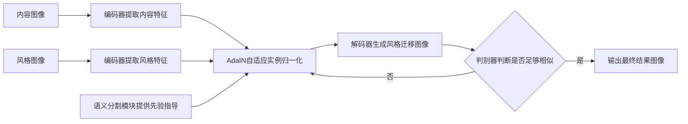

# 基于生成对抗网络的图像高级别语义风格迁移技术

关键词：生成对抗网络、图像风格迁移、语义表示、深度学习、计算机视觉

## 1. 背景介绍
### 1.1 问题的由来
在计算机视觉领域,图像风格迁移一直是一个充满挑战和魅力的研究方向。传统的图像风格迁移方法主要基于低级别的视觉特征(如纹理、颜色等)进行迁移,难以捕捉图像的高级别语义内容。如何实现既保留内容图像的语义信息,又能迁移风格图像的艺术风格,是一个亟待解决的问题。

### 1.2 研究现状
近年来,随着深度学习的蓬勃发展,特别是生成对抗网络(GAN)的出现,为图像风格迁移研究注入了新的活力。Gatys等人率先提出了一种基于卷积神经网络(CNN)的图像风格迁移方法,通过优化内容损失和风格损失来生成风格迁移图像。此后,一系列改进方法不断涌现,如引入语义分割、注意力机制等,以提升风格迁移的视觉质量。然而,现有方法仍存在一些局限性,如计算效率低、泛化能力不足等。

### 1.3 研究意义
图像风格迁移技术在很多领域都有广泛应用,如艺术创作、游戏设计、虚拟现实等。研究高质量、高效率的图像风格迁移算法,对于丰富人们的视觉体验、促进文化交流、带动相关产业发展都具有重要意义。同时,探索图像风格迁移的内在机理,有助于加深对人类视觉认知的理解,推动人工智能的发展。

### 1.4 本文结构
本文将围绕基于生成对抗网络的图像高级别语义风格迁移技术展开详细论述。第2部分介绍相关的核心概念及其联系;第3部分重点阐述所提出算法的原理和步骤;第4部分从数学角度对算法的关键模型和公式进行推导和分析;第5部分通过代码实例和结果演示来验证算法的有效性;第6部分讨论算法的实际应用场景;第7部分推荐一些相关的学习资源和工具;第8部分对全文工作进行总结并展望未来研究方向;第9部分列举一些常见问题解答。

## 2. 核心概念与联系
在讨论图像风格迁移算法之前,有必要先明确几个核心概念:

- 图像风格迁移:是指将参考图像(风格图像)的风格迁移到目标图像(内容图像)上,生成一幅融合了内容图像主体和风格图像艺术风格的新图像的过程。
- 生成对抗网络(GAN):由Goodfellow等人提出,包含一个生成器网络和一个判别器网络,两个网络相互博弈优化,从随机噪声生成接近真实数据分布的样本。 
- 卷积神经网络(CNN):一种层次化的深度神经网络结构,通过局部连接和权值共享,能够高效地提取图像特征。CNN已成为计算机视觉领域的主流模型。
- 语义分割:将图像划分为不同语义类别(如天空、建筑、植被等)的像素级标注任务。语义分割能够刻画图像的内容布局。
- 注意力机制:通过引入权重系数,动态调整网络不同区域或不同特征通道的重要程度,使网络聚焦于关键信息。

这些概念之间有着紧密的联系。**基于GAN的图像风格迁移方法本质是构建一个图像到图像的映射模型,其生成器网络采用编码器-解码器结构,利用CNN提取图像内容和风格特征,再通过注意力机制等手段对特征进行选择组合,最后解码生成风格迁移图像。判别器网络则用于判断生成图像与风格图像在风格上的相似程度。同时,语义分割信息可作为先验引导风格迁移过程,以更好地保持图像内容的语义结构。**

下面以一幅示意图直观展示本文算法的核心流程:

## 3. 核心算法原理 & 具体操作步骤
### 3.1 算法原理概述
本文提出的图像风格迁移算法基于生成对抗网络框架,由风格迁移网络和判别器网络组成。其中,风格迁移网络采用编码器-解码器结构,分别从内容图像和风格图像中提取特征,然后通过自适应实例归一化(AdaIN)将内容特征的均值和方差对齐到风格特征,再经过解码器重建出融合二者特点的风格迁移图像。同时,语义分割模块提供像素级的类别信息,指导特征融合过程更好地保持语义一致性。判别器网络则用于度量生成图像与风格图像在风格上的分布差异,引导生成器不断改进生成效果。通过生成器和判别器的对抗训练,最终得到高质量的风格迁移结果。

### 3.2 算法步骤详解
1. 风格迁移网络结构设计:
   - 编码器:使用预训练的VGG19网络,分别提取内容图像和风格图像在不同卷积层的特征图。
   - 自适应实例归一化(AdaIN):将内容特征的均值和方差对齐到风格特征,实现风格迁移。
   - 解码器:镜像VGG19的后半部分,将AdaIN后的特征逐步上采样恢复到原始分辨率,生成风格迁移图像。

2. 语义分割模块:
   - 采用预训练的语义分割网络(如DeepLab),获取内容图像和风格图像的语义标签图。
   - 将语义标签作为先验信息,引入AdaIN特征融合过程中,保证语义对齐。

3. 判别器网络:
   - 采用多尺度鉴别器,分别在不同尺度下判断生成图像与风格图像的风格相似程度。
   - 使用LSGAN损失替代原始GAN的交叉熵损失,提升训练稳定性。

4. 损失函数设计:
   - 内容损失:衡量生成图像与内容图像在VGG19特征空间的L2距离。
   - 风格损失:衡量生成图像与风格图像的Gram矩阵差异。
   - 全变分正则化损失:鼓励生成图像的空间平滑性。 
   - 判别器损失:衡量判别器网络的二分类误差。

5. 训练过程:
   - 预训练阶段:在大规模图像数据集上预训练VGG19和语义分割网络。
   - 对抗训练阶段:交替优化风格迁移网络和判别器网络,最小化总体损失函数。

6. 推理生成:
   - 给定任意内容图像和风格图像,用训练好的风格迁移网络生成对应的风格迁移图像。

### 3.3 算法优缺点
优点:
- 引入语义分割信息作为先验,更好地保持图像内容的语义结构。
- 采用自适应实例归一化,实现了内容和风格在不同尺度下的灵活融合。
- 端到端的生成对抗训练,合成图像质量高,风格迁移效果逼真自然。

缺点:  
- 计算开销大,推理速度慢,难以实时应用。
- 要求预先准备大量风格图像进行训练,泛化能力有限。
- 对抽象画等非真实感风格的迁移效果欠佳。

### 3.4 算法应用领域
- 艺术创作:自动生成各种风格的艺术图像,辅助设计创意。
- 游戏渲染:实时将游戏场景渲染成特定艺术风格,提升视觉体验。
- 虚拟现实:对虚拟场景进行风格化处理,营造沉浸式效果。
- 图像编辑:一键实现图像的风格转换,方便用户进行后期处理。

## 4. 数学模型和公式 & 详细讲解 & 举例说明
### 4.1 数学模型构建
设内容图像为 $I_c$,风格图像为 $I_s$,生成的风格迁移图像为 $I_g$。风格迁移网络 $f_\theta$ 将 $I_c$ 和 $I_s$ 映射为 $I_g$,其中 $\theta$ 为网络参数:

$$I_g=f_\theta(I_c,I_s)$$

判别器网络 $D_\phi$ 用于判断 $I_g$ 与 $I_s$ 在风格上的相似程度,其中 $\phi$ 为判别器参数。

目标是优化如下的对抗损失函数:

$$\min_\theta\max_\phi \mathcal{L}_{adv}(I_g,I_s)=\mathbb{E}_{I_s}[\log D_\phi(I_s)]+\mathbb{E}_{I_c,I_s}[\log (1-D_\phi(f_\theta(I_c,I_s)))]$$

同时,考虑内容损失、风格损失和全变分正则化损失:

$$\mathcal{L}_{content}(I_c,I_g)=\frac{1}{C_jH_jW_j}\sum_{i=1}^{C_j}\sum_{h=1}^{H_j}\sum_{w=1}^{W_j}(\phi_j(I_c)_{i,h,w}-\phi_j(I_g)_{i,h,w})^2$$

$$\mathcal{L}_{style}(I_s,I_g)=\sum_{j=1}^J\frac{1}{C_j^2}\sum_{i=1}^{C_j}\sum_{k=1}^{C_j}(G_j(I_s)_{i,k}-G_j(I_g)_{i,k})^2$$

$$\mathcal{L}_{tv}(I_g)=\sum_{i,j}(|I_g^{i+1,j}-I_g^{i,j}|+|I_g^{i,j+1}-I_g^{i,j}|)$$

其中,$\phi_j$表示VGG19第 $j$ 层特征图,$C_j$、$H_j$、$W_j$分别为该层特征图的通道数、高度和宽度;$G_j$为第 $j$ 层特征图的Gram矩阵。

总的损失函数为:

$$\mathcal{L}_{total}=\lambda_{adv}\mathcal{L}_{adv}+\lambda_c\mathcal{L}_{content}+\lambda_s\mathcal{L}_{style}+\lambda_{tv}\mathcal{L}_{tv}$$

其中,$\lambda_{adv}$、$\lambda_c$、$\lambda_s$、$\lambda_{tv}$为平衡不同损失项的权重系数。

### 4.2 公式推导过程
以内容损失 $\mathcal{L}_{content}$ 的推导为例:

内容损失用于衡量生成图像 $I_g$ 与内容图像 $I_c$ 在VGG19特征空间的差异。直观上,我们希望 $I_g$ 和 $I_c$ 在一些中间卷积层的特征表示尽可能接近。

设在第 $j$ 层VGG19卷积层,提取到的 $I_c$ 和 $I_g$ 特征分别为 $\phi_j(I_c)$ 和 $\phi_j(I_g)$,则二者的均方误差(MSE)损失可表示为:

$$\mathcal{L}_{content}^j(I_c,I_g)=\frac{1}{C_jH_jW_j}\sum_{i=1}^{C_j}\sum_{h=1}^{H_j}\sum_{w=1}^{W_j}(\phi_j(I_c)_{i,h,w}-\phi_j(I_g)_{i,h,w})^2$$

其中,下标 $i$、$h$、$w$ 分别表示特征图的通道、高度、宽度维度,$C_j$、$H_j$、$W_j$为相应维度的大小。除以 $C_jH_jW_j$ 是为了对不同层特征图的损失进