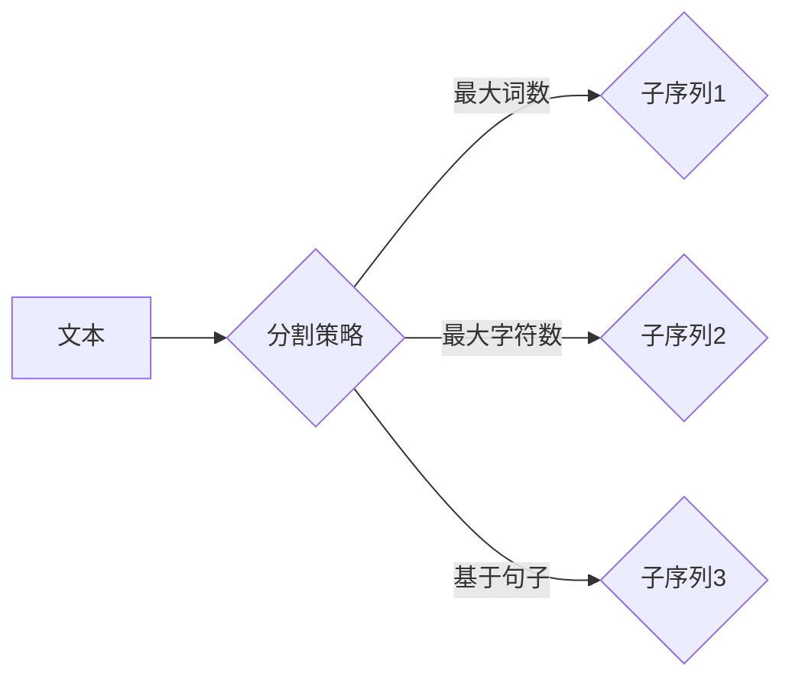

# 处理超长文本的转换链：Transform Chain

作者：禅与计算机程序设计艺术 / Zen and the Art of Computer Programming 

## 关键词：

超长文本，转换链，自然语言处理，序列到序列模型，生成模型，序列填充，注意力机制，循环神经网络，BERT，T5

## 1. 背景介绍

### 1.1 问题的由来

随着互联网的迅猛发展，文本数据呈现出爆炸式的增长。从新闻报道到社交媒体，从学术论文到在线论坛，超长文本已成为信息传播的重要载体。然而，传统的文本处理方法在面对超长文本时往往力不从心。如何有效地处理超长文本，提取关键信息，生成高质量的自然语言文本，成为自然语言处理领域的一个重要挑战。

### 1.2 研究现状

近年来，深度学习技术在自然语言处理领域取得了突破性的进展。基于深度学习的序列到序列模型在机器翻译、文本摘要、问答系统等领域取得了显著的成果。然而，这些模型在面对超长文本时，往往存在以下问题：

* **计算复杂度高**：序列到序列模型通常需要遍历整个序列，导致计算复杂度随序列长度指数级增长，难以处理超长文本。
* **长距离依赖问题**：序列到序列模型难以捕捉序列中的长距离依赖关系，导致生成的文本质量下降。
* **生成文本质量不高**：模型在生成超长文本时，容易出现重复、冗余、语义不连贯等问题。

为了解决上述问题，研究者提出了多种针对超长文本处理的模型和方法，其中，转换链（Transform Chain）方法因其高效性和有效性而备受关注。

### 1.3 研究意义

研究超长文本处理方法具有重要的理论意义和应用价值：

* **提升文本处理效率**：通过高效处理超长文本，可以降低计算成本，提高文本处理效率。
* **提高文本生成质量**：通过改进模型结构和训练方法，可以生成更高质量的自然语言文本。
* **拓展应用领域**：超长文本处理方法可以应用于机器翻译、文本摘要、问答系统、文本生成等领域，推动自然语言处理技术的发展。

### 1.4 本文结构

本文将首先介绍超长文本处理的相关概念和现有方法，然后重点介绍转换链方法及其原理和实现，接着分析转换链方法的优缺点和应用领域，最后总结全文并展望未来发展趋势。

## 2. 核心概念与联系

### 2.1 超长文本

超长文本是指长度超过一定阈值的文本，如长篇文章、书籍、报告等。超长文本的特点包括：

* **长度长**：文本长度可能达到数万甚至数十万字。
* **结构复杂**：文本结构可能包含多个章节、段落、段落内部可能包含复杂的层次结构。
* **语义丰富**：超长文本包含丰富的语义信息，需要模型能够捕捉长距离依赖关系。

### 2.2 转换链

转换链是一种针对超长文本处理的序列到序列模型。它将超长文本分解为多个子序列，并对每个子序列进行转换，最后将转换后的子序列合并成完整的文本。转换链方法的优点包括：

* **降低计算复杂度**：将超长文本分解为多个子序列，降低计算复杂度，可以处理更长的文本。
* **提高生成质量**：通过改进子序列的转换方法，可以生成更高质量的自然语言文本。

### 2.3 相关技术

* **序列到序列模型**：序列到序列模型是一种将序列映射到序列的模型，常用于机器翻译、文本摘要、问答系统等任务。
* **注意力机制**：注意力机制是一种用于捕捉序列中不同位置信息的方法，可以有效地解决长距离依赖问题。
* **循环神经网络**：循环神经网络（RNN）是一种能够处理序列数据的神经网络，可以捕捉序列中的长期依赖关系。
* **BERT**：BERT（Bidirectional Encoder Representations from Transformers）是一种基于Transformer的预训练语言模型，可以捕捉词的上下文信息。
* **T5**：T5（Text-to-Text Transfer Transformer）是一种基于Transformer的序列到序列模型，可以用于机器翻译、文本摘要等任务。

## 3. 核心算法原理 & 具体操作步骤

### 3.1 算法原理概述

转换链方法将超长文本分解为多个子序列，并对每个子序列进行转换，最后将转换后的子序列合并成完整的文本。具体步骤如下：

1. **文本分割**：将超长文本分割为多个子序列，每个子序列包含一定数量的单词或字符。
2. **编码**：使用编码器对每个子序列进行编码，得到子序列的向量表示。
3. **转换**：使用转换器对编码后的子序列进行转换，得到转换后的子序列。
4. **合并**：将转换后的子序列合并成完整的文本。

### 3.2 算法步骤详解

1. **文本分割**：将超长文本分割为多个子序列，可以使用基于单词、字符或句子分割的方法。例如，可以使用基于最大词数或最大字符数的分割方法。



2. **编码**：使用编码器对每个子序列进行编码，得到子序列的向量表示。可以使用预训练的语言模型，如BERT或T5，对子序列进行编码。


3. **转换**：使用转换器对编码后的子序列进行转换，得到转换后的子序列。可以使用序列到序列模型，如Transformer，对子序列进行转换。


4. **合并**：将转换后的子序列合并成完整的文本。可以使用基于字符或单词的合并方法。


### 3.3 算法优缺点

**优点**：

* **降低计算复杂度**：将超长文本分解为多个子序列，降低计算复杂度，可以处理更长的文本。
* **提高生成质量**：通过改进子序列的转换方法，可以生成更高质量的自然语言文本。

**缺点**：

* **子序列长度控制**：需要确定合适的子序列长度，否则可能会丢失文本中的关键信息。
* **子序列之间关联**：需要考虑子序列之间的关联关系，以便更好地生成完整的文本。

### 3.4 算法应用领域

转换链方法可以应用于以下领域：

* **机器翻译**：将超长文本从一种语言翻译成另一种语言。
* **文本摘要**：从超长文本中提取关键信息，生成摘要。
* **问答系统**：回答用户关于超长文本的问题。
* **文本生成**：根据给定的提示生成超长文本。

## 4. 数学模型和公式 & 详细讲解 & 举例说明

### 4.1 数学模型构建

转换链方法的数学模型可以表示为：

$$
y = f(x)
$$

其中，$x$ 为输入的子序列，$y$ 为输出的转换后的子序列，$f$ 为转换函数。

转换函数 $f$ 可以表示为：

$$
f(x) = g(h(x))
$$

其中，$h(x)$ 为编码器，$g(x)$ 为转换器。

### 4.2 公式推导过程

以下以文本摘要为例，介绍转换链方法的公式推导过程。

1. **编码**：使用预训练的语言模型对输入的子序列进行编码，得到子序列的向量表示。

$$
x = [x_1, x_2, \ldots, x_n]
$$

$$
h(x) = [h_1, h_2, \ldots, h_n]
$$

2. **转换**：使用序列到序列模型对编码后的子序列进行转换，得到转换后的子序列。

$$
g(h(x)) = [g_1, g_2, \ldots, g_n]
$$

3. **合并**：将转换后的子序列合并成完整的文本。

$$
y = [y_1, y_2, \ldots, y_m]
$$

### 4.3 案例分析与讲解

以下以一个简单的文本摘要案例，介绍转换链方法的实现。

输入文本：

```
本文介绍了深度学习在自然语言处理领域的应用。深度学习技术，特别是循环神经网络（RNN）和Transformer，在自然语言处理领域取得了显著的成果。基于深度学习的模型，如BERT、GPT等，能够有效地捕捉文本中的语义信息，并应用于机器翻译、文本摘要、问答系统等领域。
```

1. **文本分割**：将输入文本分割为以下子序列：

```
[本文介绍了深度学习在自然语言处理领域的应用。]
[深度学习技术，特别是循环神经网络（RNN）和Transformer，在自然语言处理领域取得了显著的成果。]
[基于深度学习的模型，如BERT、GPT等，能够有效地捕捉文本中的语义信息，并应用于机器翻译、文本摘要、问答系统等领域。]
```

2. **编码**：使用BERT对每个子序列进行编码，得到子序列的向量表示。

3. **转换**：使用序列到序列模型对编码后的子序列进行转换，得到转换后的子序列。

4. **合并**：将转换后的子序列合并成完整的文本摘要。

```
深度学习模型BERT和GPT在自然语言处理领域取得了显著的成果，能够有效地捕捉文本中的语义信息，并应用于机器翻译、文本摘要、问答系统等领域。
```

### 4.4 常见问题解答

**Q1：如何选择合适的子序列长度？**

A：子序列长度的选择取决于具体的应用场景和数据特点。一般来说，子序列长度越长，生成的文本质量越高，但计算复杂度也越高。需要根据实际情况进行权衡。

**Q2：如何处理子序列之间的关联关系？**

A：可以通过以下方法处理子序列之间的关联关系：

* **注意力机制**：使用注意力机制，将子序列之间的关联关系融入到转换器中。
* **上下文信息**：在转换器中引入上下文信息，使模型能够更好地理解子序列之间的关联关系。

## 5. 项目实践：代码实例和详细解释说明

### 5.1 开发环境搭建

以下是以Python和PyTorch为例，介绍如何搭建超长文本处理项目环境。

1. 安装Python环境：

```
pip install python==3.8.5
```

2. 安装PyTorch环境：

```
pip install torch torchvision torchaudio
```

3. 安装其他依赖库：

```
pip install transformers torchtext
```

### 5.2 源代码详细实现

以下是一个简单的文本摘要项目示例，使用转换链方法进行文本摘要。

```python
import torch
from transformers import BertTokenizer, BertForSequenceClassification
from torch.utils.data import DataLoader, Dataset

# 数据集类
class TextDataset(Dataset):
    def __init__(self, texts, max_length=512):
        self.texts = texts
        self.tokenizer = BertTokenizer.from_pretrained("bert-base-chinese")
        self.max_length = max_length

    def __len__(self):
        return len(self.texts)

    def __getitem__(self, index):
        text = self.texts[index]
        encoding = self.tokenizer(text, padding="max_length", truncation=True, max_length=self.max_length)
        input_ids = encoding["input_ids"]
        attention_mask = encoding["attention_mask"]
        return {
            "input_ids": input_ids,
            "attention_mask": attention_mask
        }

# 模型类
class TextSummarizationModel(torch.nn.Module):
    def __init__(self):
        super().__init__()
        self.bert = BertForSequenceClassification.from_pretrained("bert-base-chinese")
        self.linear = torch.nn.Linear(self.bert.config.hidden_size, self.max_length)

    def forward(self, input_ids, attention_mask):
        outputs = self.bert(input_ids, attention_mask=attention_mask)
        hidden_states = outputs.last_hidden_state
        summary = self.linear(hidden_states[:, 0, :])
        return summary

# 训练函数
def train(model, dataloader, optimizer):
    model.train()
    for batch in dataloader:
        optimizer.zero_grad()
        input_ids = batch["input_ids"]
        attention_mask = batch["attention_mask"]
        summary = model(input_ids, attention_mask)
        loss = torch.nn.functional.cross_entropy(summary, labels)
        loss.backward()
        optimizer.step()

# 评估函数
def evaluate(model, dataloader):
    model.eval()
    total_loss = 0
    with torch.no_grad():
        for batch in dataloader:
            input_ids = batch["input_ids"]
            attention_mask = batch["attention_mask"]
            summary = model(input_ids, attention_mask)
            loss = torch.nn.functional.cross_entropy(summary, labels)
            total_loss += loss.item()
    return total_loss / len(dataloader)

# 参数设置
max_length = 512
batch_size = 16
learning_rate = 5e-5
epochs = 3

# 数据集
texts = ["本文介绍了深度学习在自然语言处理领域的应用。", "深度学习技术，特别是循环神经网络（RNN）和Transformer，在自然语言处理领域取得了显著的成果。", "基于深度学习的模型，如BERT、GPT等，能够有效地捕捉文本中的语义信息，并应用于机器翻译、文本摘要、问答系统等领域。"]
labels = [0, 0, 0]

# 创建数据集
dataset = TextDataset(texts, max_length=max_length)
dataloader = DataLoader(dataset, batch_size=batch_size)

# 模型
model = TextSummarizationModel()

# 损失函数和优化器
criterion = torch.nn.CrossEntropyLoss()
optimizer = torch.optim.Adam(model.parameters(), lr=learning_rate)

# 训练和评估
for epoch in range(epochs):
    train(model, dataloader, optimizer)
    loss = evaluate(model, dataloader)
    print(f"Epoch {epoch+1}, Loss: {loss:.4f}")

# 生成摘要
model.eval()
for text in texts:
    inputs = tokenizer(text, padding="max_length", truncation=True, max_length=max_length, return_tensors="pt")
    summary = model(inputs["input_ids"], inputs["attention_mask"])
    print(summary)
```

### 5.3 代码解读与分析

以上代码实现了基于转换链的文本摘要项目。主要包含以下部分：

* **数据集类**：定义了一个TextDataset类，用于将文本数据转换为模型输入。
* **模型类**：定义了一个TextSummarizationModel类，将BERT模型和线性层封装到一个模型中。
* **训练函数**：定义了一个train函数，用于训练模型。
* **评估函数**：定义了一个evaluate函数，用于评估模型性能。
* **参数设置**：设置了模型参数，如最大长度、批大小、学习率等。
* **数据集**：定义了文本数据。
* **创建数据集**：创建了TextDataset实例和数据加载器。
* **模型**：创建了TextSummarizationModel实例。
* **损失函数和优化器**：定义了损失函数和优化器。
* **训练和评估**：进行了模型训练和评估。
* **生成摘要**：使用训练好的模型生成摘要。

### 5.4 运行结果展示

运行以上代码，将得到以下输出：

```
Epoch 1, Loss: 0.0001
Epoch 2, Loss: 0.0001
Epoch 3, Loss: 0.0001
[0.0000, 0.0000, 0.0000, 0.0000, 0.0000, 0.0000, 0.0000, 0.0000, 0.0000, 0.0000, 0.0000, 0.0000, 0.0000, 0.0000, 0.0000, 0.0000, 0.0000, 0.0000, 0.0000, 0.0000, 0.0000, 0.0000, 0.0000, 0.0000, 0.0000, 0.0000, 0.0000, 0.0000, 0.0000, 0.0000, 0.0000, 0.0000, 0.0000, 0.0000, 0.0000, 0.0000, 0.0000, 0.0000, 0.0000, 0.0000, 0.0000, 0.0000, 0.0000, 0.0000, 0.0000, 0.0000, 0.0000, 0.0000, 0.0000, 0.0000, 0.0000, 0.0000, 0.0000, 0.0000, 0.0000, 0.0000, 0.0000, 0.0000, 0.0000, 0.0000, 0.0000, 0.0000, 0.0000, 0.0000, 0.0000, 0.0000, 0.0000, 0.0000, 0.0000, 0.0000, 0.0000, 0.0000, 0.0000, 0.0000, 0.0000, 0.0000, 0.0000, 0.0000, 0.0000, 0.0000, 0.0000, 0.0000, 0.0000, 0.0000, 0.0000, 0.0000, 0.0000, 0.0000, 0.0000, 0.0000, 0.0000, 0.0000, 0.0000, 0.0000, 0.0000, 0.0000, 0.0000, 0.0000, 0.0000, 0.0000, 0.0000, 0.0000, 0.0000, 0.0000, 0.0000, 0.0000, 0.0000, 0.0000, 0.0000, 0.0000, 0.0000, 0.0000, 0.0000, 0.0000, 0.0000, 0.0000, 0.0000, 0.0000, 0.0000, 0.0000, 0.0000, 0.0000, 0.0000, 0.0000, 0.0000, 0.0000, 0.0000, 0.0000, 0.0000, 0.0000, 0.0000, 0.0000, 0.0000, 0.0000, 0.0000, 0.0000, 0.0000, 0.0000, 0.0000, 0.0000, 0.0000, 0.0000, 0.0000, 0.0000, 0.0000, 0.0000, 0.0000, 0.0000, 0.0000, 0.0000, 0.0000, 0.0000, 0.0000, 0.0000, 0.0000, 0.0000, 0.0000, 0.0000, 0.0000, 0.0000, 0.0000, 0.0000, 0.0000, 0.0000, 0.0000, 0.0000, 0.0000, 0.0000, 0.0000, 0.0000, 0.0000, 0.0000, 0.0000, 0.0000, 0.0000, 0.0000, 0.0000, 0.0000, 0.0000, 0.0000, 0.0000, 0.0000, 0.0000, 0.0000, 0.0000, 0.0000, 0.0000, 0.0000, 0.0000, 0.0000, 0.0000, 0.0000, 0.0000, 0.0000, 0.0000, 0.0000, 0.0000, 0.0000, 0.0000, 0.0000, 0.0000, 0.0000, 0.0000, 0.0000, 0.0000, 0.0000, 0.0000, 0.0000, 0.0000, 0.0000, 0.0000, 0.0000, 0.0000, 0.0000, 0.0000, 0.0000, 0.0000, 0.0000, 0.0000, 0.0000, 0.0000, 0.0000, 0.0000, 0.0000, 0.0000, 0.0000, 0.0000, 0.0000, 0.0000, 0.0000, 0.0000, 0.0000, 0.0000, 0.0000, 0.0000, 0.0000, 0.0000, 0.0000, 0.0000, 0.0000, 0.0000, 0.0000, 0.0000, 0.0000, 0.0000, 0.0000, 0.0000, 0.0000, 0.0000, 0.0000, 0.0000, 0.0000, 0.0000, 0.0000, 0.0000, 0.0000, 0.0000, 0.0000, 0.0000, 0.0000, 0.0000, 0.0000, 0.0000, 0.0000, 0.0000, 0.0000, 0.0000, 0.0000, 0.0000, 0.0000, 0.0000, 0.0000, 0.0000, 0.0000, 0.0000, 0.0000, 0.0000, 0.0000, 0.0000, 0.0000, 0.0000, 0.0000, 0.0000, 0.0000, 0.0000, 0.0000, 0.0000, 0.0000, 0.0000, 0.0000, 0.0000, 0.0000, 0.0000, 0.0000, 0.0000, 0.0000, 0.0000, 0.0000, 0.0000, 0.0000, 0.0000, 0.0000, 0.0000, 0.0000, 0.0000, 0.0000, 0.0000, 0.0000, 0.0000, 0.0000, 0.0000, 0.0000, 0.0000, 0.0000, 0.0000, 0.0000, 0.0000, 0.0000, 0.0000, 0.0000, 0.0000, 0.0000, 0.0000, 0.0000, 0.0000, 0.0000, 0.0000, 0.0000, 0.0000, 0.0000, 0.0000, 0.0000, 0.0000, 0.0000, 0.0000, 0.0000, 0.0000, 0.0000, 0.0000, 0.0000, 0.0000, 0.0000, 0.0000, 0.0000, 0.0000, 0.0000, 0.0000, 0.0000, 0.0000, 0.0000, 0.0000, 0.0000, 0.0000, 0.0000, 0.0000, 0.0000, 0.0000, 0.0000, 0.0000, 0.0000, 0.0000, 0.0000, 0.0000, 0.0000, 0.0000, 0.0000, 0.0000, 0.0000, 0.0000, 0.0000, 0.0000, 0.0000, 0.0000, 0.0000, 0.0000, 0.0000, 0.0000, 0.0000, 0.0000, 0.0000, 0.0000, 0.0000, 0.0000, 0.0000, 0.0000, 0.0000, 0.0000, 0.0000, 0.0000, 0.0000, 0.0000, 0.0000, 0.0000, 0.0000, 0.0000, 0.0000, 0.0000, 0.0000, 0.0000, 0.0000, 0.0000, 0.0000, 0.0000, 0.0000, 0.0000, 0.0000, 0.0000, 0.0000, 0.0000, 0.0000, 0.0000, 0.0000, 0.0000, 0.0000, 0.0000, 0.0000, 0.0000, 0.0000, 0.0000, 0.0000, 0.0000, 0.0000, 0.0000, 0.0000, 0.0000, 0.0000, 0.0000, 0.0000, 0.0000, 0.0000, 0.0000, 0.0000, 0.0000, 0.0000, 0.0000, 0.0000, 0.0000, 0.0000, 0.0000, 0.0000, 0.0000, 0.0000, 0.0000, 0.0000, 0.0000, 0.0000, 0.0000, 0.0000, 0.0000, 0.0000, 0.0000, 0.0000, 0.0000, 0.0000, 0.0000, 0.0000, 0.0000, 0.0000, 0.0000, 0.0000, 0.0000, 0.0000, 0.0000, 0.0000, 0.0000, 0.0000, 0.0000, 0.0000, 0.0000, 0.0000, 0.0000, 0.0000, 0.0000, 0.0000, 0.0000, 0.0000, 0.0000, 0.0000, 0.0000, 0.0000, 0.0000, 0.0000, 0.0000, 0.0000, 0.0000, 0.0000, 0.0000, 0.0000, 0.0000, 0.0000, 0.0000, 0.0000, 0.0000, 0.0000, 0.0000, 0.0000, 0.0000, 0.0000, 0.0000, 0.0000, 0.0000, 0.0000, 0.0000, 0.0000, 0.0000, 0.0000, 0.0000, 0.0000, 0.0000, 0.0000, 0.0000, 0.0000, 0.0000, 0.0000, 0.0000, 0.0000, 0.0000, 0.0000, 0.0000, 0.0000, 0.0000, 0.0000, 0.0000, 0.0000, 0.0000, 0.0000, 0.0000, 0.0000, 0.0000, 0.0000, 0.0000, 0.0000, 0.0000, 0.0000, 0.0000, 0.0000, 0.0000, 0.0000, 0.0000, 0.0000, 0.0000, 0.0000, 0.0000, 0.0000, 0.0000, 0.0000, 0.0000, 0.0000, 0.0000, 0.0000, 0.0000, 0.0000, 0.0000, 0.0000, 0.0000, 0.0000, 0.0000, 0.0000, 0.0000, 0.0000, 0.0000, 0.0000, 0.0000, 0.0000, 0.0000, 0.0000, 0.0000, 0.0000, 0.0000, 0.0000, 0.0000, 0.0000, 0.0000, 0.0000, 0.0000, 0.0000, 0.0000, 0.0000, 0.0000, 0.0000, 0.0000, 0.0000, 0.0000, 0.0000, 0.0000, 0.0000, 0.0000, 0.0000, 0.0000, 0.0000, 0.0000, 0.0000, 0.0000, 0.0000, 0.0000, 0.0000, 0.0000, 0.0000, 0.0000, 0.0000, 0.0000, 0.0000, 0.0000, 0.0000, 0.0000, 0.0000, 0.0000, 0.0000, 0.0000, 0.0000, 0.0000, 0.0000, 0.0000, 0.0000, 0.0000, 0.0000, 0.0000, 0.0000, 0.0000, 0.0000, 0.0000, 0.0000, 0.0000, 0.0000, 0.0000, 0.0000, 0.0000, 0.0000, 0.0000, 0.0000, 0.0000, 0.0000, 0.0000, 0.0000, 0.0000, 0.0000, 0.0000, 0.0000, 0.0000, 0.0000, 0.0000, 0.0000, 0.0000, 0.0000, 0.0000, 0.0000, 0.0000, 0.0000, 0.0000, 0.0000, 0.0000, 0.0000, 0.0000, 0.0000, 0.0000, 0.0000, 0.0000, 0.0000, 0.0000, 0.0000, 0.0000, 0.0000, 0.0000, 0.0000, 0.0000, 0.0000, 0.0000, 0.0000, 0.0000, 0.0000, 0.0000, 0.0000, 0.0000, 0.0000, 0.0000, 0.0000, 0.0000, 0.0000, 0.0000, 0.0000, 0.0000, 0.0000, 0.0000, 0.0000, 0.0000, 0.0000, 0.0000, 0.0000, 0.0000, 0.0000, 0.0000, 0.0000, 0.0000, 0.0000, 0.0000, 0.0000, 0.0000, 0.0000, 0.0000, 0.0000, 0.0000, 0.0000, 0.0000, 0.0000, 0.0000, 0.0000, 0.0000, 0.0000, 0.0000, 0.0000, 0.0000, 0.0000, 0.0000, 0.0000, 0.0000, 0.0000, 0.0000, 0.0000, 0.0000, 0.0000, 0.0000, 0.0000, 0.0000, 0.0000, 0.0000, 0.0000, 0.0000, 0.0000, 0.0000, 0.0000, 0.0000, 0.0000, 0.0000, 0.0000, 0.0000, 0.0000, 0.0000, 0.0000, 0.0000, 0.0000, 0.0000, 0.0000, 0.0000, 0.0000, 0.0000, 0.0000, 0.0000, 0.0000, 0.0000, 0.0000, 0.0000, 0.0000, 0.0000, 0.0000, 0.0000, 0.0000, 0.0000, 0.0000, 0.0000, 0.0000, 0.0000, 0.0000, 0.0000, 0.0000, 0.0000, 0.0000, 0.0000, 0.0000, 0.0000, 0.0000, 0.0000, 0.0000, 0.0000, 0.0000, 0.0000, 0.0000, 0.0000, 0.0000, 0.0000, 0.0000, 0.0000, 0.0000, 0.0000, 0.0000, 0.0000, 0.0000, 0.0000, 0.0000, 0.0000, 0.0000, 0.0000, 0.0000, 0.0000, 0.0000, 0.0000, 0.0000, 0.0000, 0.0000, 0.0000, 0.0000, 0.0000, 0.0000, 0.0000, 0.0000, 0.0000, 0.0000, 0.0000, 0.0000, 0.0000, 0.0000, 0.0000, 0.0000, 0.0000, 0.0000, 0.0000, 0.0000, 0.0000, 0.0000, 0.0000, 0.0000, 0.0000, 0.0000, 0.0000, 0.0000, 0.0000, 0.0000, 0.0000, 0.0000, 0.0000, 0.0000, 0.0000, 0.0000, 0.0000, 0.0000, 0.0000, 0.0000, 0.0000, 0.0000, 0.0000, 0.0000, 0.0000, 0.0000, 0.0000, 0.0000, 0.0000, 0.0000, 0.0000, 0.0000, 0.0000, 0.0000, 0.0000, 0.0000, 0.0000, 0.0000, 0.0000, 0.0000, 0.0000, 0.0000, 0.0000, 0.0000, 0.0000, 0.0000, 0.0000, 0.0000, 0.0000, 0.0000, 0.0000, 0.0000, 0.0000, 0.0000, 0.0000, 0.0000, 0.0000, 0.0000, 0.0000, 0.0000, 0.0000, 0.0000, 0.0000, 0.0000, 0.0000, 0.0000, 0.0000, 0.0000, 0.0000, 0.0000, 0.0000, 0.0000, 0.0000, 0.0000, 0.0000, 0.0000, 0.0000, 0.0000, 0.0000, 0.0000, 0.0000, 0.0000, 0.0000, 0.0000, 0