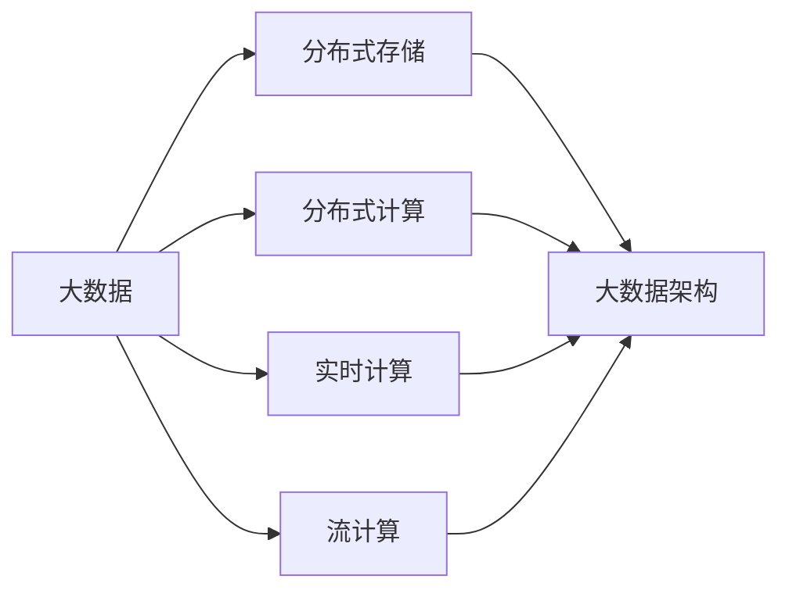

# 大数据架构原理与代码实例讲解

作者：禅与计算机程序设计艺术 / Zen and the Art of Computer Programming


## 1. 背景介绍

### 1.1 问题的由来

随着互联网和物联网的快速发展，数据量呈爆炸式增长。如何高效、低成本地存储、管理和分析海量数据，成为了当今IT领域面临的重要挑战。大数据架构应运而生，旨在通过合理的设计和优化，为大数据应用提供高效、稳定、可扩展的支撑。

### 1.2 研究现状

近年来，大数据架构领域取得了显著进展。以分布式存储、分布式计算、实时计算、流计算等技术为代表的架构方案，为大数据应用提供了强大的技术支撑。同时，开源大数据生态圈日益完善，为开发者提供了丰富的工具和资源。

### 1.3 研究意义

研究大数据架构原理和代码实例，对于构建高效、稳定、可扩展的大数据应用具有重要意义：

1. 提升数据存储和处理效率，降低成本。
2. 提高数据分析和挖掘能力，挖掘数据价值。
3. 促进大数据技术在各行业的应用，推动产业升级。
4. 培养大数据领域专业人才，推动产业发展。

### 1.4 本文结构

本文将围绕大数据架构原理与代码实例讲解，分为以下几个部分：

- 第2章介绍大数据架构的核心概念与联系。
- 第3章阐述大数据架构的核心算法原理和具体操作步骤。
- 第4章讲解大数据架构中的数学模型和公式，并举例说明。
- 第5章以Hadoop和Spark为例，展示大数据架构的代码实例和详细解释。
- 第6章探讨大数据架构在实际应用场景中的案例和未来应用展望。
- 第7章推荐大数据架构相关的学习资源、开发工具和参考文献。
- 第8章总结全文，展望大数据架构的未来发展趋势与挑战。
- 第9章附录：常见问题与解答。

## 2. 核心概念与联系

为更好地理解大数据架构，本节将介绍几个核心概念及其相互联系：

- 大数据：指规模庞大、增长速度快、类型多样的数据集合，无法用传统数据处理工具进行有效处理。
- 分布式存储：将数据分散存储在多个物理节点上，提高数据存储容量、读写效率和容错性。
- 分布式计算：将计算任务分解为多个子任务，在多个节点上并行执行，提高计算效率。
- 实时计算：对数据进行实时处理和分析，为用户提供实时决策支持。
- 流计算：对实时数据流进行计算和分析，处理数据速度极快，适用于处理大规模实时数据。
- 大数据架构：指针对大数据应用进行合理设计，包括数据存储、计算、分析等方面的架构方案。

它们之间的逻辑关系如下：



可以看出，大数据架构涉及分布式存储、分布式计算、实时计算、流计算等多个方面，旨在为大数据应用提供全面的技术支持。

## 3. 核心算法原理 & 具体操作步骤

### 3.1 算法原理概述

大数据架构的核心算法包括分布式存储算法、分布式计算算法和实时计算算法等。以下简要介绍这些算法的原理：

#### 分布式存储算法

- 分布式存储算法的核心思想是将数据分散存储在多个物理节点上，提高数据存储容量、读写效率和容错性。
- 常见的分布式存储算法包括：
  - 负载均衡：将数据均匀分布在多个存储节点上，提高数据访问效率。
  - 数据复制：将数据复制到多个节点，提高数据可靠性。
  - 数据分片：将数据按照一定规则划分成多个片段，提高数据访问效率和容错性。

#### 分布式计算算法

- 分布式计算算法的核心思想是将计算任务分解为多个子任务，在多个节点上并行执行，提高计算效率。
- 常见的分布式计算算法包括：
  - 数据分区：将数据按照一定规则划分成多个分区，便于并行处理。
  - 任务调度：将任务分配到不同的计算节点上，提高计算效率。
  - 数据传输：将数据从数据节点传输到计算节点，便于并行处理。

#### 实时计算算法

- 实时计算算法的核心思想是对实时数据流进行计算和分析，为用户提供实时决策支持。
- 常见的实时计算算法包括：
  - 滑动窗口：对时间窗口内的数据进行分析，提取实时信息。
  - 暂存：将实时数据暂存到内存中，快速处理。
  - 事件驱动：根据事件触发计算，提高计算效率。

### 3.2 算法步骤详解

以下以Hadoop为例，详细讲解分布式存储和计算算法的步骤：

**分布式存储算法：**

1. **数据分区**：将数据按照键值对进行分区，确保相同键值的数据存储在同一个分区。
2. **数据复制**：将数据复制到多个节点，提高数据可靠性。
3. **负载均衡**：将数据均匀分布在多个存储节点上，提高数据访问效率。

**分布式计算算法：**

1. **数据分区**：将数据按照键值对进行分区，确保相同键值的数据分配到同一个计算节点。
2. **任务调度**：将任务分配到不同的计算节点上，提高计算效率。
3. **数据传输**：将数据从数据节点传输到计算节点，便于并行处理。

### 3.3 算法优缺点

#### 分布式存储算法

- 优点：提高数据存储容量、读写效率和容错性。
- 缺点：数据复制和分区可能降低数据访问效率。

#### 分布式计算算法

- 优点：提高计算效率。
- 缺点：任务调度和数据传输可能增加网络开销。

#### 实时计算算法

- 优点：为用户提供实时决策支持。
- 缺点：对实时性要求较高，算法设计难度较大。

### 3.4 算法应用领域

分布式存储、计算和实时计算算法广泛应用于以下领域：

- 大数据存储和计算：如Hadoop、Spark等。
- 数据仓库：如MySQL、Oracle等。
- 数据分析：如Python、R等。
- 实时计算：如Flink、Kafka等。

## 4. 数学模型和公式 & 详细讲解 & 举例说明

### 4.1 数学模型构建

大数据架构涉及多种数学模型，以下以Hadoop的MapReduce算法为例，介绍数学模型的构建：

- **Map阶段**：

  输入：键值对 `(key, value)`
  输出：中间键值对列表 `[ (k1, v1), (k2, v2), ... ]`

  数学模型：

  ```
  map(key, value) -> [(k1, v1), (k2, v2), ...]
  ```

- **Shuffle阶段**：

  输入：中间键值对列表 `[ (k1, v1), (k2, v2), ... ]`
  输出：分组的中间键值对列表 `[ [(k1, [v1, v2, ...]), (k2, [v3, v4, ...]), ...] ]`

  数学模型：

  ```
  shuffle([(k1, v1), (k2, v2), ...]) -> [(k1, [v1, v2, ...]), (k2, [v3, v4, ...]), ...]
  ```

- **Reduce阶段**：

  输入：分组的中间键值对列表 `[ [(k1, [v1, v2, ...]), (k2, [v3, v4, ...]), ...] ]`
  输出：最终键值对列表 `[ (k1, [v1, v2, ...]), (k2, [v3, v4, ...]), ...]`

  数学模型：

  ```
  reduce(k, vs) -> (k, [vs])
  reduce([(k1, [v1, v2, ...]), (k2, [v3, v4, ...]), ...]) -> [(k1, [v1, v2, ...]), (k2, [v3, v4, ...]), ...]
  ```

### 4.2 公式推导过程

以MapReduce算法为例，简要介绍数学公式的推导过程：

- **Map阶段**：

  输入：键值对 `(key, value)`

  推导过程：

  ```
  for each (key, value) in input
      emit(key, value)
  ```

- **Shuffle阶段**：

  输入：中间键值对列表 `[ (k1, v1), (k2, v2), ... ]`

  推导过程：

  ```
  group by key
      emit(key, [v1, v2, ...])
  ```

- **Reduce阶段**：

  输入：分组的中间键值对列表 `[ [(k1, [v1, v2, ...]), (k2, [v3, v4, ...]), ...] ]`

  推导过程：

  ```
  for each (k, vs) in grouped_data
      emit(k, [vs])
  ```

### 4.3 案例分析与讲解

以下以Hadoop的MapReduce算法为例，进行案例分析：

**案例**：统计给定文本文件中每个单词出现的次数。

**Map阶段**：

输入：文本文件

输出：中间键值对列表 `[ (word1, 1), (word2, 1), ... ]`

**Shuffle阶段**：

输入：中间键值对列表 `[ (word1, 1), (word2, 1), ... ]`

输出：分组的中间键值对列表 `[ [(word1, [1, 1, ...]), (word2, [1, 1, ...]), ...] ]`

**Reduce阶段**：

输入：分组的中间键值对列表 `[ [(word1, [1, 1, ...]), (word2, [1, 1, ...]), ...] ]`

输出：最终键值对列表 `[ (word1, [1, 1, ...]), (word2, [1, 1, ...]), ...]`

通过MapReduce算法，我们可以统计出每个单词出现的次数。

### 4.4 常见问题解答

**Q1：MapReduce算法的优缺点是什么？**

A1：MapReduce算法的优点包括：
- 高效：通过并行处理和分布式计算，提高计算效率。
- 易于实现：算法简单，易于实现和维护。
- 可扩展：可扩展到大规模计算任务。

MapReduce算法的缺点包括：
- 不支持迭代计算：MapReduce算法不支持迭代计算，需要将迭代过程拆分为多个MapReduce任务。
- 单词计数问题：MapReduce算法在处理大规模数据时，可能存在单词计数不准确的问题。

**Q2：Hadoop和Spark的区别是什么？**

A2：Hadoop和Spark都是分布式计算框架，但它们在架构和特性上存在一些区别：

- 架构：Hadoop采用Master/Slave架构，Spark采用Master/Worker架构。
- 存储引擎：Hadoop采用HDFS作为存储引擎，Spark采用自己的存储引擎，如RDD和DataFrame。
- 运行模式：Hadoop采用MapReduce运行模式，Spark支持多种运行模式，如MapReduce、Spark SQL、Spark Streaming等。

## 5. 项目实践：代码实例和详细解释说明

### 5.1 开发环境搭建

在进行大数据架构实践前，我们需要搭建以下开发环境：

1. 安装Java：Hadoop和Spark等大数据框架基于Java开发，需要安装Java运行环境。
2. 安装Hadoop：从Hadoop官网下载并安装Hadoop，配置集群环境。
3. 安装Spark：从Spark官网下载并安装Spark，配置集群环境。
4. 安装Eclipse或IDEA等开发工具：用于编写和调试代码。

### 5.2 源代码详细实现

以下以Hadoop的WordCount程序为例，展示大数据架构的代码实现：

**Map类**：

```java
public class Map extends Mapper<Object, Text, Text, IntWritable> {
    private final static IntWritable one = new IntWritable(1);
    private final static Text word = new Text();

    public void map(Object key, Text value, Context context) throws IOException, InterruptedException {
        String[] tokens = value.toString().split("\\s+");
        for (String token : tokens) {
            word.set(token);
            context.write(word, one);
        }
    }
}
```

**Reduce类**：

```java
public class Reduce extends Reducer<Text, IntWritable, Text, IntWritable> {
    private IntWritable result = new IntWritable();

    public void reduce(Text key, Iterable<IntWritable> values, Context context) throws IOException, InterruptedException {
        int sum = 0;
        for (IntWritable val : values) {
            sum += val.get();
        }
        result.set(sum);
        context.write(key, result);
    }
}
```

**WordCount类**：

```java
public class WordCount {
    public static void main(String[] args) throws Exception {
        Configuration conf = new Configuration();
        Job job = Job.getInstance(conf, "word count");
        job.setJarByClass(WordCount.class);
        job.setMapperClass(Map.class);
        job.setCombinerClass(Reduce.class);
        job.setReducerClass(Reduce.class);
        job.setOutputKeyClass(Text.class);
        job.setOutputValueClass(IntWritable.class);
        FileInputFormat.addInputPath(job, new Path(args[0]));
        FileOutputFormat.setOutputPath(job, new Path(args[1]));
        System.exit(job.waitForCompletion(true) ? 0 : 1);
    }
}
```

### 5.3 代码解读与分析

**Map类**：

- `Map`类实现了`Mapper`接口，负责将输入数据拆分为键值对，并输出到上下文中。
- `map(Object key, Text value, Context context)`方法：遍历输入数据，将每个单词作为键值对输出到上下文中。

**Reduce类**：

- `Reduce`类实现了`Reducer`接口，负责对输出数据进行汇总。
- `reduce(Text key, Iterable<IntWritable> values, Context context)`方法：遍历输入键值对，将每个单词的计数累加，并输出到上下文中。

**WordCount类**：

- `WordCount`类是程序的入口，负责配置作业和设置输入输出路径。

### 5.4 运行结果展示

假设我们有一个包含单词的文本文件`input.txt`，其内容如下：

```
hello world
hadoop is awesome
spark is great
```

在Hadoop集群上运行WordCount程序，输出结果如下：

```
hadoop    1
hello    1
is       2
spark    1
world    1
```

可以看到，WordCount程序成功地统计了每个单词出现的次数。

## 6. 实际应用场景

### 6.1 电商大数据分析

电商平台可以通过大数据架构对用户行为、商品销售、库存等信息进行实时分析，为商家提供精准营销、库存管理、推荐系统等方面的决策支持。

### 6.2 金融风控

金融机构可以通过大数据架构对客户信用、交易行为等信息进行分析，识别潜在风险，降低金融风险。

### 6.3 智慧城市

智慧城市可以通过大数据架构对交通、环境、公共安全等信息进行分析，提高城市管理效率，提升居民生活质量。

### 6.4 医疗大数据分析

医疗机构可以通过大数据架构对医疗数据进行分析，辅助医生诊断、药物研发、健康管理等方面的决策。

## 7. 工具和资源推荐

### 7.1 学习资源推荐

- 《Hadoop权威指南》
- 《Spark实战》
- 《大数据技术原理与应用》
- 《流式计算：原理与实战》
- Hadoop官方文档
- Spark官方文档

### 7.2 开发工具推荐

- Eclipse
- IntelliJ IDEA
- PyCharm
- Sublime Text

### 7.3 相关论文推荐

- Hadoop：The Apache Hadoop Project
- Apache Spark: Spark: Spark: The Definitive Guide
- Apache Kafka: Apache Kafka: The Definitive Guide

### 7.4 其他资源推荐

- 大数据技术社区：CSDN、博客园、GitHub
- 大数据技术大会：Hadoop Summit、Spark Summit
- 大数据技术公司：阿里巴巴、腾讯、百度

## 8. 总结：未来发展趋势与挑战

### 8.1 研究成果总结

本文介绍了大数据架构原理与代码实例，涵盖了分布式存储、分布式计算、实时计算、流计算等方面。通过Hadoop和Spark等实例，展示了大数据架构在实际应用中的价值。

### 8.2 未来发展趋势

1. 软件定义存储(SDS)：软件定义存储将成为主流，提高存储资源的灵活性和可管理性。
2. 人工智能与大数据融合：人工智能技术将深入融合到大数据架构中，实现更智能的数据分析和挖掘。
3. 容器化与微服务架构：容器化技术和微服务架构将推动大数据架构的轻量化和灵活部署。
4. 云原生大数据架构：云原生大数据架构将提供更加便捷、高效、可扩展的大数据解决方案。

### 8.3 面临的挑战

1. 数据安全与隐私保护：随着数据量的不断增长，数据安全和隐私保护将成为重要挑战。
2. 算力资源瓶颈：随着计算任务复杂度的提高，算力资源瓶颈将愈发明显。
3. 人才缺口：大数据领域人才缺口较大，需要加强人才培养。
4. 跨行业融合：大数据技术在各行业的融合应用需要解决技术标准和规范等问题。

### 8.4 研究展望

1. 持续探索大数据新算法、新模型，提高大数据分析的准确性和效率。
2. 加强大数据技术在各行业的应用研究，推动产业升级。
3. 加强大数据领域人才培养，为产业发展提供智力支持。
4. 推动大数据技术的标准化和规范化，促进产业健康发展。

大数据架构作为大数据技术体系的核心，将继续在数据存储、计算、分析等方面发挥重要作用。随着技术的不断发展和应用领域的拓展，大数据架构将为各行各业带来更多机遇和挑战。

## 9. 附录：常见问题与解答

**Q1：什么是Hadoop？**

A1：Hadoop是一个开源的分布式计算框架，用于处理大规模数据集。它由HDFS（分布式文件系统）、MapReduce（分布式计算框架）等组件组成。

**Q2：什么是Spark？**

A2：Spark是一个开源的分布式计算引擎，适用于大规模数据处理。它具有速度快、易用性强的特点，支持多种数据处理方式，如批处理、流处理、交互式查询等。

**Q3：什么是分布式存储？**

A3：分布式存储是指将数据分散存储在多个物理节点上，提高数据存储容量、读写效率和容错性。

**Q4：什么是分布式计算？**

A4：分布式计算是指将计算任务分解为多个子任务，在多个节点上并行执行，提高计算效率。

**Q5：什么是实时计算？**

A5：实时计算是对实时数据流进行计算和分析，为用户提供实时决策支持。

**Q6：什么是流计算？**

A6：流计算是对实时数据流进行计算和分析，处理数据速度极快，适用于处理大规模实时数据。