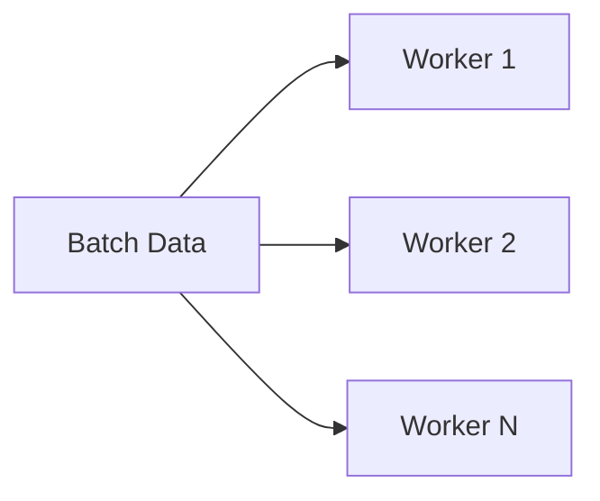
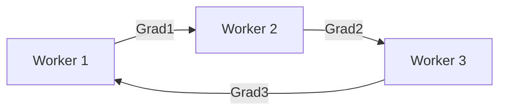

# 大语言模型原理与工程实践：数据并行

关键词：大语言模型、数据并行、分布式训练、模型并行、流水线并行、梯度累积、零冗余优化、AllReduce

## 1. 背景介绍
### 1.1 问题的由来
随着深度学习的飞速发展,大规模语言模型在自然语言处理领域取得了巨大突破。然而,训练这些模型需要海量的数据和计算资源,单机已无法满足。为了加速训练过程,提高模型性能,急需探索高效的分布式训练方法。
### 1.2 研究现状 
目前,主流的分布式训练范式包括数据并行、模型并行和流水线并行。其中,数据并行由于实现简单、通用性强,已成为大规模训练的首选。谷歌的BERT、OpenAI的GPT-3等里程碑式的语言模型均采用了数据并行。但在实践中,也面临着诸多挑战,如通信开销大、负载不均衡等。
### 1.3 研究意义
深入研究数据并行的原理和优化技术,对于推动大语言模型的发展具有重要意义。一方面,可以突破算力瓶颈,训练更大规模、更强能力的模型；另一方面,可以提升训练效率,加速模型落地应用。同时,相关技术也可以扩展到其他AI领域。
### 1.4 本文结构
本文将全面阐述数据并行的原理和实践。第2部分介绍核心概念；第3部分讲解并行化算法；第4部分建立数学模型,推导公式；第5部分通过代码实例演示实现细节；第6部分分析应用场景；第7部分推荐相关工具和资源；第8部分总结全文,展望未来。

## 2. 核心概念与联系
数据并行的本质是将训练数据分割到多个设备,各自计算梯度,再汇总更新模型。核心概念包括：

- 数据切分(Data Partitioning):按照Batch维度将数据分片,分配到不同Worker
- 局部梯度计算(Local Gradient Computation):每个Worker基于自己的数据切片,计算局部梯度  
- 梯度聚合(Gradient Aggregation):采用AllReduce等通信原语,将各Worker的梯度求和,得到完整梯度
- 参数更新(Parameter Update):用聚合后的梯度更新模型参数,所有Worker保持同步

这些步骤的高效执行,还需要考虑Batch大小、学习率调整、优化器选择等因素。此外,数据并行与模型并行、流水线并行也可以互补结合,进一步提升性能。

## 3. 核心算法原理 & 具体操作步骤
### 3.1 算法原理概述
数据并行的核心是将梯度计算和同步过程并行化。假设有N个Worker,训练集大小为M,Batch大小为B,模型参数量为P。每轮迭代的主要步骤如下:

1. 数据切分:将大小为B的Batch平均分配给N个Worker,每个分片大小为B/N
2. 前向&反向:每个Worker以自己的分片为输入,执行前向传播和反向传播,计算局部梯度
3. 梯度聚合:N个Worker通过AllReduce进行梯度规约,将N个局部梯度累加求平均,得到完整梯度
4. 参数更新:每个Worker用聚合后的梯度更新模型参数,保持同步一致

经过M/B轮迭代,即可完成一个Epoch的训练。理想情况下,N个Worker可以将训练时间缩短到1/N。但在实践中,还需要考虑通信开销、负载均衡等因素。
### 3.2 算法步骤详解
接下来,我们详细分析每个步骤:

**Step1:数据切分**

将每个Batch的数据尽量均匀地划分到N个Worker。一般采用Round-Robin方式,即依次分配数据,如下图所示:

需要注意的是,过小的Batch会影响计算效率,过大则可能引起内存溢出。需要根据具体情况调整。

**Step2:前向&反向**

每个Worker以切片后的数据为输入,执行前向传播,计算损失函数:
$$z_i=f(x_i,w),\quad \ell_i=\mathcal{L}(z_i,y_i)$$

然后通过反向传播计算局部梯度:
$$\nabla_{w}\ell_i=\frac{\partial \ell_i}{\partial w}$$

这一步是计算密集型,主要消耗在数据读取和算子计算上。不同Worker间可以并行执行,无需通信。

**Step3:梯度聚合**

局部梯度计算完成后,N个Worker需要协同通信,对梯度进行聚合,得到完整梯度:

$$\nabla_{w}\ell=\frac{1}{N}\sum_{i=1}^N \nabla_{w}\ell_i$$

常用的通信原语是Ring AllReduce。即Worker构成一个逻辑环,每次传递一部分梯度,经过N-1轮,每个Worker最终都能得到完整梯度,如下图:

AllReduce的优点是带宽利用率高,适合大规模集群。但也有一定的启动延迟。

**Step4:参数更新**

最后,每个Worker用聚合后的完整梯度,根据优化器规则更新模型参数:

$$w\leftarrow w-\eta \nabla_{w}\ell$$

其中$\eta$为学习率。更新后的模型参数在所有Worker间同步,为下一轮迭代做准备。

### 3.3 算法优缺点
数据并行的优点包括:

- 实现简单:只需将数据切分,对梯度做AllReduce即可,无需修改模型结构
- 通用性强:适用于绝大部分模型,对数据类型没有限制
- 扩展性好:可以方便地增加机器数量,加速训练过程

但它也存在一些缺点:

- 通信开销大:梯度同步是集体通信,延迟高,带宽易成为瓶颈
- 负载不均衡:数据切片不均匀、迭代间同步屏障等,都会导致设备利用率降低
- 适用规模有限:Batch太小时,计算开销小,通信开销主导,加机器反而会变慢

因此,还需要在实践中优化。

### 3.4 算法应用领域
数据并行在以下领域得到了广泛应用:

- 大规模语言模型:如BERT、GPT、T5等,动辄上亿参数,必须采用分布式训练
- 图像分类:ResNet、EfficientNet等模型常用数据并行加速训练
- 语音识别:如DeepSpeech、Wav2Letter等,需要处理大量语音数据
- 推荐系统:如DLRM、DeepFM等,训练数据动辄上TB,单机难以支撑

可以说,数据并行已成为业界训练大模型的标配。未来还会有更多的场景受益于它。

## 4. 数学模型和公式 & 详细讲解 & 举例说明
### 4.1 数学模型构建
为了形式化描述数据并行,我们构建如下数学模型:

- 训练集$\mathcal{D}=\{(x_i,y_i)\}_{i=1}^M$,共M个样本
- 模型函数$f(x,w)$,参数为w
- 损失函数$\mathcal{L}(z,y)$,衡量预测$z$与真实$y$间的差异
- 优化目标$\min_w \frac{1}{M}\sum_{i=1}^M \mathcal{L}(f(x_i,w),y_i)$,最小化损失函数期望
- N个Worker,编号为$\{1,2,...,N\}$
- 第$n$个Worker分配到的数据子集为$\mathcal{D}_n$,大小为$M_n=|\mathcal{D}_n|$

在理想情况下,各Worker处理的数据量相等,即$M_n=M/N$。但在实践中,往往很难做到完全均衡。

### 4.2 公式推导过程
基于上述模型,我们推导数据并行的核心公式。

首先,将全局损失函数拆解为各Worker的局部损失之和:

$$\begin{aligned}
\frac{1}{M}\sum_{i=1}^M \mathcal{L}(f(x_i,w),y_i) &= \frac{1}{M}\sum_{n=1}^N \sum_{i\in \mathcal{D}_n} \mathcal{L}(f(x_i,w),y_i) \\
&= \sum_{n=1}^N \frac{M_n}{M} \cdot \frac{1}{M_n} \sum_{i\in \mathcal{D}_n} \mathcal{L}(f(x_i,w),y_i) \\
&= \sum_{n=1}^N \frac{M_n}{M} \cdot \ell_n(w)
\end{aligned}$$

其中$\ell_n(w)$为第$n$个Worker的局部损失函数。可见,全局损失由各Worker的局部损失加权平均得到。

对上式求梯度,得到:

$$\nabla_w \ell(w) = \sum_{n=1}^N \frac{M_n}{M} \cdot \nabla_w \ell_n(w)$$

即全局梯度是局部梯度的加权平均。当各Worker数据量相等时,即$M_n=M/N$,公式简化为:

$$\nabla_w \ell(w) = \frac{1}{N} \sum_{n=1}^N \nabla_w \ell_n(w)$$

这就是数据并行的梯度聚合公式。可见,Worker只需将局部梯度做AllReduce求平均,即可得到完整梯度,进而更新参数。

### 4.3 案例分析与讲解
下面我们用一个简单例子来说明数据并行的计算过程。

假设有4个样本$\{(x_1,y_1),(x_2,y_2),(x_3,y_3),(x_4,y_4)\}$,2个Worker。模型函数为$f(x,w)=wx$,损失函数为$\mathcal{L}(z,y)=(z-y)^2$。初始参数$w=1$,学习率$\eta=0.1$。

首先做数据切分,Worker1分到$\{(x_1,y_1),(x_2,y_2)\}$,Worker2分到$\{(x_3,y_3),(x_4,y_4)\}$。

在第1轮迭代中:

- Worker1前向传播,计算$z_1=wx_1=1\times 1=1$,$z_2=wx_2=1\times 2=2$,损失$\ell_1=(z_1-y_1)^2+(z_2-y_2)^2=(1-2)^2+(2-4)^2=5$
- Worker1反向传播,计算局部梯度$\nabla_w \ell_1 = 2(z_1-y_1)x_1+2(z_2-y_2)x_2=2(1-2)\times1+2(2-4)\times2=-10$
- Worker2前向传播,计算$z_3=wx_3=1\times 3=3$,$z_4=wx_4=1\times 4=4$,损失$\ell_2=(z_3-y_3)^2+(z_4-y_4)^2=13$
- Worker2反向传播,计算局部梯度$\nabla_w \ell_2=-14$
- Worker1和Worker2通过AllReduce聚合梯度,得到完整梯度$\nabla_w \ell = \frac{1}{2}(\nabla_w \ell_1+\nabla_w \ell_2)=-12$
- 两个Worker用完整梯度更新参数$w=w-\eta \nabla_w \ell=1-0.1\times(-12)=2.2$

在第2轮迭代中,重复上述过程,直至收敛。可以看到,虽然两个Worker分别处理不同的数据,但通过梯度聚合,最终能达成共识,得到一致的模型。

### 4.4 常见问题解答
针对数据并行,常见的一些问题如下:

**Q:数据切分是否需要shuffle?**

A:shuffle能打乱数据分布,使各Worker获得独立同分布的样本,有助于提升模型泛化性。但频繁shuffle会引入额外开销,需要权衡。

**Q:Batch大小如何选择?**

A:Batch太小会频繁触发通信,效率低;太大则可能引起内存溢出。一般选择能充分利用设备算力的最大值。此外,还