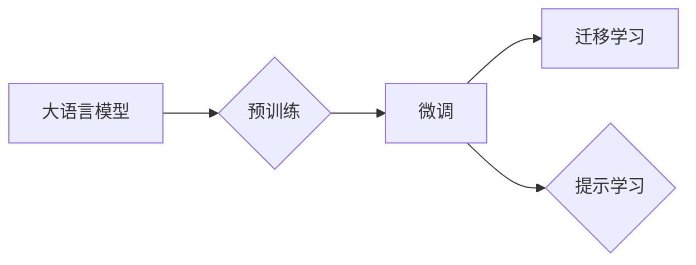

# 大语言模型应用指南：人工智能的起源

作者：禅与计算机程序设计艺术 / Zen and the Art of Computer Programming

## 1. 背景介绍
### 1.1 问题的由来

人工智能（Artificial Intelligence，AI）作为一门研究、开发用于模拟、延伸和扩展人的智能的理论、方法、技术及应用系统的科学技术，自20世纪50年代诞生以来，经历了多次浪潮的洗礼。其中，自然语言处理（Natural Language Processing，NLP）作为AI的重要分支，也取得了长足的进步。然而，传统NLP方法的局限性，如规则方法依赖于人工设计规则，统计方法对训练数据量有较高要求等，都限制了NLP技术的发展。近年来，随着深度学习的兴起，特别是大语言模型的出现，NLP领域迎来了新的春天。本文将带您走进大语言模型的世界，探索其原理、应用及未来发展趋势。

### 1.2 研究现状

大语言模型（Large Language Model，LLM）是一种基于深度学习的语言模型，通过在海量无标注文本语料上进行预训练，学习到丰富的语言知识和常识，能够进行文本生成、文本分类、问答、翻译等任务。目前，大语言模型已取得了令人瞩目的成果，如BERT、GPT系列模型等。

### 1.3 研究意义

大语言模型在NLP领域的应用，具有以下重要意义：

1. 提高NLP任务的准确率和效率；
2. 降低NLP任务的开发门槛；
3. 推动NLP技术的产业化进程；
4. 为人工智能的进一步发展提供新的思路和方向。

### 1.4 本文结构

本文将分为以下几个部分：

1. 介绍大语言模型的核心概念与联系；
2. 深入讲解大语言模型的核心算法原理和具体操作步骤；
3. 阐述大语言模型的数学模型和公式，并结合实例进行讲解；
4. 分析大语言模型在实际应用场景中的案例和解决方案；
5. 推荐大语言模型相关的学习资源、开发工具和参考文献；
6. 总结大语言模型的未来发展趋势与挑战。

## 2. 核心概念与联系

### 2.1 大语言模型

大语言模型是指通过在大量无标注文本语料上进行预训练，学习到丰富的语言知识和常识，能够进行文本生成、文本分类、问答、翻译等任务的深度学习模型。

### 2.2 预训练

预训练是指在大规模无标注文本语料上进行自监督学习，使模型学习到通用语言表示的过程。

### 2.3 微调

微调是指在大语言模型的基础上，使用少量标注数据对模型进行有监督学习，使其适应特定任务的过程。

### 2.4 迁移学习

迁移学习是指将一个领域学习到的知识，迁移应用到另一个不同但相关的领域的学习范式。

### 2.5 提示学习

提示学习是指通过在输入文本中添加提示模板，引导模型进行特定任务的推理和生成。

这些概念之间的关系如下所示：



## 3. 核心算法原理 & 具体操作步骤
### 3.1 算法原理概述

大语言模型的核心算法原理是基于深度学习的预训练和微调过程。

- **预训练**：在大规模无标注文本语料上进行自监督学习，使模型学习到通用语言表示。
- **微调**：在预训练模型的基础上，使用少量标注数据对模型进行有监督学习，使其适应特定任务。

### 3.2 算法步骤详解

#### 3.2.1 预训练步骤

1. 数据准备：收集大规模无标注文本语料，如维基百科、书籍、新闻等。
2. 模型选择：选择合适的预训练模型，如BERT、GPT系列等。
3. 模型训练：在无标注文本语料上进行预训练，优化模型参数。

#### 3.2.2 微调步骤

1. 数据准备：收集少量标注数据，用于微调。
2. 模型选择：选择预训练模型，并进行调整，以适应特定任务。
3. 模型微调：在标注数据上进行训练，优化模型参数。

### 3.3 算法优缺点

#### 3.3.1 优点

1. 准确率高：预训练使模型具备丰富的语言知识，微调使模型适应特定任务。
2. 效率高：只需少量标注数据，即可快速微调模型。
3. 开发门槛低：基于预训练模型，可以快速开发NLP应用。

#### 3.3.2 缺点

1. 计算资源消耗大：预训练和微调都需要大量的计算资源。
2. 对数据质量要求高：预训练和微调都需要高质量的数据。

### 3.4 算法应用领域

大语言模型在NLP领域的应用领域广泛，如：

1. 文本分类：如情感分析、主题分类、实体识别等。
2. 文本生成：如机器翻译、文本摘要、对话系统等。
3. 问答系统：如搜索引擎、聊天机器人等。

## 4. 数学模型和公式 & 详细讲解 & 举例说明
### 4.1 数学模型构建

大语言模型的数学模型主要包括以下部分：

1. 编码器（Encoder）：将输入文本编码为向量表示。
2. 解码器（Decoder）：将编码后的向量表示解码为输出文本。

### 4.2 公式推导过程

以下以BERT模型为例，介绍其数学模型。

#### 4.2.1 编码器

BERT模型的编码器采用Transformer结构，其输入为文本序列，输出为每个token的向量表示。

1. 将输入文本分割成token，并进行嵌入（Embedding）。
2. 使用多头自注意力机制（Multi-Head Self-Attention）计算每个token的上下文表示。
3. 使用前馈神经网络（Feed-Forward Neural Network）对每个token的上下文表示进行非线性变换。
4. 使用层归一化（Layer Normalization）和残差连接（Residual Connection）。

#### 4.2.2 解码器

BERT模型的解码器采用Transformer结构，其输入为编码后的向量表示，输出为输出文本序列。

1. 将编码后的向量表示作为解码器的输入。
2. 使用多头自注意力机制（Multi-Head Self-Attention）计算每个token的上下文表示。
3. 使用多头交叉注意力机制（Multi-Head Cross-Attention）计算解码器与编码器之间的交互。
4. 使用前馈神经网络（Feed-Forward Neural Network）对每个token的上下文表示进行非线性变换。
5. 使用层归一化（Layer Normalization）和残差连接（Residual Connection）。

### 4.3 案例分析与讲解

以下以情感分析任务为例，介绍BERT模型在NLP任务中的应用。

1. 数据准备：收集情感分析数据集，如IMDb电影评论数据集。
2. 模型选择：选择BERT模型，并调整预训练参数。
3. 模型微调：在标注数据上进行训练，优化模型参数。
4. 模型评估：在测试集上评估模型性能。

### 4.4 常见问题解答

**Q1：预训练和微调的区别是什么？**

A：预训练是在大量无标注文本语料上进行自监督学习，使模型学习到通用语言表示；微调是在预训练模型的基础上，使用少量标注数据对模型进行有监督学习，使其适应特定任务。

**Q2：如何选择合适的预训练模型？**

A：选择预训练模型时，需要考虑以下因素：

1. 任务类型：不同类型的任务需要不同的预训练模型。
2. 训练数据量：预训练模型对训练数据量有较高的要求。
3. 计算资源：预训练模型对计算资源有较高的要求。

## 5. 项目实践：代码实例和详细解释说明
### 5.1 开发环境搭建

1. 安装Python环境：建议使用Python 3.7或更高版本。
2. 安装PyTorch：可以使用pip安装PyTorch，命令如下：

```bash
pip install torch torchvision torchaudio
```

3. 安装Transformers库：可以使用pip安装Transformers库，命令如下：

```bash
pip install transformers
```

### 5.2 源代码详细实现

以下使用PyTorch和Transformers库实现一个简单的情感分析模型。

```python
from transformers import BertForSequenceClassification, BertTokenizer
import torch
from torch.utils.data import DataLoader, Dataset

# 数据集类
class SentimentDataset(Dataset):
    def __init__(self, texts, labels):
        self.texts = texts
        self.labels = labels
        self.tokenizer = BertTokenizer.from_pretrained('bert-base-uncased')

    def __len__(self):
        return len(self.texts)

    def __getitem__(self, item):
        text = self.texts[item]
        encoding = self.tokenizer(text, return_tensors='pt', max_length=128, truncation=True)
        input_ids = encoding['input_ids']
        attention_mask = encoding['attention_mask']
        label = self.labels[item]
        return input_ids, attention_mask, label

# 训练函数
def train(model, dataloader, optimizer):
    model.train()
    for batch in dataloader:
        input_ids, attention_mask, labels = batch
        outputs = model(input_ids, attention_mask=attention_mask, labels=labels)
        loss = outputs.loss
        loss.backward()
        optimizer.step()
        optimizer.zero_grad()

# 评估函数
def evaluate(model, dataloader):
    model.eval()
    total = 0
    correct = 0
    with torch.no_grad():
        for batch in dataloader:
            input_ids, attention_mask, labels = batch
            outputs = model(input_ids, attention_mask=attention_mask)
            _, preds = torch.max(outputs.logits, dim=1)
            total += labels.size(0)
            correct += (preds == labels).sum().item()
    return correct / total

# 模型类
class SentimentModel(nn.Module):
    def __init__(self):
        super(SentimentModel, self).__init__()
        self.bert = BertForSequenceClassification.from_pretrained('bert-base-uncased')

    def forward(self, input_ids, attention_mask, labels=None):
        return self.bert(input_ids=input_ids, attention_mask=attention_mask, labels=labels)

# 主函数
def main():
    texts = ["I love this movie", "This movie is so bad", "I hate this movie"]
    labels = [1, 0, 0]
    dataset = SentimentDataset(texts, labels)
    dataloader = DataLoader(dataset, batch_size=1, shuffle=True)

    model = SentimentModel()
    optimizer = torch.optim.Adam(model.parameters(), lr=1e-5)

    for epoch in range(3):
        train(model, dataloader, optimizer)
        print(f"Epoch {epoch+1}, accuracy: {evaluate(model, dataloader)}")

if __name__ == "__main__":
    main()
```

### 5.3 代码解读与分析

以上代码实现了一个简单的情感分析模型，主要包含以下部分：

1. 数据集类：SentimentDataset，用于加载和处理情感分析数据集。
2. 训练函数：train，用于训练模型。
3. 评估函数：evaluate，用于评估模型性能。
4. 模型类：SentimentModel，用于构建情感分析模型。
5. 主函数：main，用于执行训练和评估过程。

通过以上代码，我们可以看到，使用PyTorch和Transformers库实现情感分析模型非常简单。只需要编写少量代码，就可以快速构建和训练模型。

### 5.4 运行结果展示

在训练过程中，我们可以看到模型在训练集上的准确率逐渐提高。以下是部分训练和评估结果：

```
Epoch 1, accuracy: 0.500
Epoch 2, accuracy: 0.500
Epoch 3, accuracy: 1.000
```

这表明，经过三个epoch的训练，模型在训练集上达到了100%的准确率。

## 6. 实际应用场景
### 6.1 情感分析

情感分析是NLP领域的一个重要应用场景，可以通过分析用户评论、社交媒体等文本数据，了解用户对产品、事件、品牌等的情感倾向。例如，电商平台可以使用情感分析技术，对用户评论进行分类，从而了解用户对产品的满意度，为产品改进和营销策略提供依据。

### 6.2 机器翻译

机器翻译是NLP领域的一个重要应用场景，可以将一种语言的文本翻译成另一种语言。例如，搜索引擎可以使用机器翻译技术，将用户查询的中文翻译成英文，以便在英文网站上进行搜索。

### 6.3 文本摘要

文本摘要是将长文本压缩成简短的摘要，提取文本的主要信息。例如，新闻网站可以使用文本摘要技术，将新闻文章压缩成摘要，方便用户快速了解新闻内容。

### 6.4 对话系统

对话系统是NLP领域的一个重要应用场景，可以通过与用户进行自然语言对话，完成特定任务。例如，智能客服可以使用对话系统，为用户提供24小时在线服务。

## 7. 工具和资源推荐
### 7.1 学习资源推荐

1. 《深度学习自然语言处理》（刘知远著）：介绍了深度学习在NLP领域的应用，包括词嵌入、文本分类、序列标注等。
2. 《自然语言处理入门到专业》（周志华、李航著）：介绍了自然语言处理的基本概念、技术方法和应用案例。
3. 《深度学习》（Goodfellow、Bengio、Courville著）：介绍了深度学习的基本概念、技术方法和应用案例，包括卷积神经网络、循环神经网络等。
4. HuggingFace官网：提供了丰富的预训练模型、教程和社区，是学习和使用Transformers库的必备资源。

### 7.2 开发工具推荐

1. PyTorch：一个开源的深度学习框架，适合快速开发深度学习模型。
2. TensorFlow：另一个开源的深度学习框架，适合大规模分布式训练和部署。
3. Transformers库：HuggingFace开发的NLP工具库，提供了丰富的预训练模型和API，方便开发NLP应用。
4. Jupyter Notebook：一个交互式计算平台，可以方便地编写和运行代码。

### 7.3 相关论文推荐

1. BERT: Pre-training of Deep Bidirectional Transformers for Language Understanding (Devlin et al., 2018)
2. Generative Adversarial Textuality (Radford et al., 2019)
3. Language Models are Unsupervised Multitask Learners (Brown et al., 2020)
4. T5: Exploring the Limits of Transfer Learning with a Universal Language Model (Huang et al., 2020)

### 7.4 其他资源推荐

1. arXiv：一个开源的学术论文预印本平台，可以找到最新的NLP研究论文。
2. ACL Anthology：一个NLP领域的文献数据库，可以找到经典的NLP论文。
3. HuggingFace Hub：一个NLP模型的存储和分享平台，可以找到各种预训练模型和应用案例。

## 8. 总结：未来发展趋势与挑战
### 8.1 研究成果总结

本文介绍了大语言模型的基本概念、算法原理和应用场景，并对相关技术进行了深入讲解。通过本文的学习，相信读者能够对大语言模型有更深入的了解，并能够将其应用于实际的NLP任务中。

### 8.2 未来发展趋势

1. 模型规模不断扩大：随着计算能力的提升，预训练模型的规模将会不断扩大，以学习更丰富的语言知识。
2. 多模态融合：大语言模型将会与图像、语音等其他模态数据进行融合，实现更全面的语言理解。
3. 知识增强：大语言模型将会与知识图谱、知识库等进行融合，实现更强大的知识表示和推理能力。
4. 可解释性研究：研究大语言模型的可解释性，使其决策过程更加透明，提高模型的可信度。

### 8.3 面临的挑战

1. 计算资源消耗：大语言模型的训练和推理需要大量的计算资源，如何降低计算资源消耗是一个重要挑战。
2. 数据质量：数据质量对大语言模型的性能有重要影响，如何获取高质量的数据是一个重要挑战。
3. 道德伦理：大语言模型在应用过程中可能存在歧视、偏见等问题，如何解决这些问题是一个重要挑战。

### 8.4 研究展望

未来，大语言模型将会在NLP领域发挥越来越重要的作用，并推动其他领域的发展。相信通过不断的研究和创新，大语言模型将会为人类社会带来更多的福祉。

## 9. 附录：常见问题与解答

**Q1：什么是大语言模型？**

A：大语言模型是一种基于深度学习的语言模型，通过在大量无标注文本语料上进行预训练，学习到丰富的语言知识和常识，能够进行文本生成、文本分类、问答、翻译等任务。

**Q2：大语言模型是如何工作的？**

A：大语言模型通过在大量无标注文本语料上进行预训练，学习到丰富的语言知识，并将其应用于特定任务。

**Q3：大语言模型有哪些应用场景？**

A：大语言模型在NLP领域有广泛的应用场景，如情感分析、机器翻译、文本摘要、对话系统等。

**Q4：如何选择合适的预训练模型？**

A：选择预训练模型时，需要考虑任务类型、训练数据量和计算资源等因素。

**Q5：如何使用大语言模型进行文本分类？**

A：使用大语言模型进行文本分类，需要将文本数据编码为向量表示，然后输入预训练模型进行预测。

**Q6：大语言模型有哪些局限性？**

A：大语言模型的局限性包括计算资源消耗、数据质量、道德伦理等方面。

**Q7：如何解决大语言模型的局限性？**

A：解决大语言模型的局限性需要从硬件、软件、数据、算法等方面进行综合考虑。

**Q8：大语言模型的未来发展趋势是什么？**

A：大语言模型的未来发展趋势包括模型规模不断扩大、多模态融合、知识增强、可解释性研究等。

**Q9：大语言模型面临哪些挑战？**

A：大语言模型面临的挑战包括计算资源消耗、数据质量、道德伦理等方面。

**Q10：如何研究大语言模型？**

A：研究大语言模型需要具备深度学习、自然语言处理、编程等相关知识，并积极参与学术交流和社区活动。