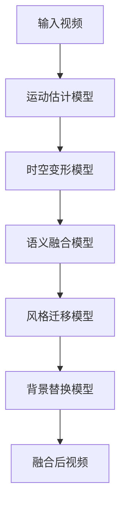

# 实战案例：使用模型管道进行视频融合任务

## 1. 背景介绍

### 1.1 问题的由来

在当今数字媒体时代，视频内容的创作和编辑已经成为许多行业的核心需求。然而,传统的视频编辑过程通常是手动操作,费时费力,需要专业人员的参与。随着人工智能和深度学习技术的不断发展,自动化视频编辑已成为可能。视频融合是其中一个重要的任务,旨在将多个视频片段无缝地结合在一起,创建一个连贯、流畅的视频序列。

### 1.2 研究现状 

早期的视频融合方法主要基于手工特征和传统计算机视觉算法,效果有限且缺乏鲁棒性。近年来,benefiting from深度学习在计算机视觉领域的突破性进展,基于深度神经网络的视频融合方法展现出了令人鼓舞的性能。研究人员提出了多种有效的模型,如生成对抗网络(GANs)、循环神经网络(RNNs)和变分自编码器(VAEs),用于视频融合任务。然而,这些模型通常专注于特定的融合子任务,如运动传递、时空一致性等,缺乏端到端的解决方案。

### 1.3 研究意义

视频融合技术在多个领域具有广泛的应用前景,例如电影特技、增强现实(AR)、虚拟现实(VR)等。通过自动化视频融合,可以大幅提高内容创作效率,降低制作成本。此外,视频融合也可用于视频压缩、修复和增强等任务。本文旨在介绍一种基于模型管道的端到端视频融合解决方案,综合利用多个深度学习模型的优势,实现高质量的视频融合效果。

### 1.4 本文结构

本文首先介绍视频融合任务的核心概念和挑战,然后详细阐述所提出的基于模型管道的视频融合方法的原理和具体实现步骤。接下来,我们将深入探讨该方法所采用的数学模型和公式,并通过案例分析加以说明。之后,我们将分享一个实际项目的代码实现细节和运行结果。最后,我们将讨论该方法在实际应用场景中的潜力,并推荐相关的工具和资源。

## 2. 核心概念与联系

视频融合是一个复杂的任务,涉及多个核心概念和挑战,包括:

1. **运动传递(Motion Transfer)**: 将一个视频中的运动传递到另一个视频,确保融合后的视频具有自然流畅的运动。
2. **时空一致性(Temporal-Spatial Consistency)**: 保持融合视频在时间和空间上的一致性,避免出现视觉上的不连续或失真。
3. **语义理解(Semantic Understanding)**: 对视频内容进行语义理解,以便进行有意义的融合,如人物动作、场景等。
4. **风格迁移(Style Transfer)**: 将一个视频的风格(如颜色、纹理等)迁移到另一个视频,实现风格融合。
5. **背景替换(Background Replacement)**: 将一个视频中的背景替换为另一个视频的背景,常用于特效制作。

这些核心概念相互关联且存在inherent的trade-off。例如,保持时空一致性可能会影响运动传递的自然度;语义理解有助于更好地控制融合过程,但增加了计算复杂度。因此,一个有效的视频融合解决方案需要权衡和平衡这些因素。

## 3. 核心算法原理 & 具体操作步骤

### 3.1 算法原理概述

为了实现高质量的视频融合,我们提出了一种基于模型管道(Model Pipeline)的方法。该方法将多个深度学习模型按特定顺序级联,每个模型专注于解决视频融合任务中的一个或多个核心挑战。通过有效地组合这些模型,我们可以获得满意的融合结果。

该算法的总体流程如下所示:

1. **运动估计模型(Motion Estimation Model)**: 使用卷积神经网络从输入视频中估计出运动场(Motion Field),捕获视频中的运动信息。
2. **时空变形模型(Temporal-Spatial Deformation Model)**: 基于估计的运动场,对输入视频进行时空变形,实现运动传递和时空一致性。
3. **语义融合模型(Semantic Fusion Model)**: 利用语义分割等技术,对视频进行语义理解,并基于语义信息进行有意义的融合。
4. **风格迁移模型(Style Transfer Model)**: 将一个视频的风格(如颜色、纹理等)迁移到另一个视频,实现风格融合。
5. **背景替换模型(Background Replacement Model)**: 根据需要,将视频中的背景替换为另一个视频的背景。

通过上述模型的级联,我们可以实现端到端的视频融合,同时兼顾运动传递、时空一致性、语义理解、风格迁移和背景替换等多个方面。

### 3.2 算法步骤详解

1. **运动估计模型**

   运动估计模型的目标是从输入视频中估计出精确的运动场(Motion Field)。我们采用基于PyTorch的卷积神经网络模型PWC-Net,该模型在多个基准测试中表现出色。

   给定一个输入视频序列$\{I_t\}_{t=1}^T$,我们将其馈送到PWC-Net中。该模型通过编码器-解码器结构和金字塔处理,在不同尺度下估计出相邻帧之间的光流场$\{F_t\}_{t=1}^{T-1}$,其中$F_t$表示从第t帧到第t+1帧的光流。通过对光流场进行积分,我们可以获得完整的运动场$M$,描述了整个视频序列中每个像素的运动轨迹。

2. **时空变形模型**

   获得运动场$M$后,我们使用时空变形模型对输入视频进行变形,实现运动传递和时空一致性。我们采用基于PyTorch的RIFE模型,该模型可以通过插值的方式生成中间帧,从而产生更流畅的视频序列。

   具体地,给定输入视频$\{I_t\}_{t=1}^T$和运动场$M$,RIFE模型将生成一个新的视频序列$\{I'_t\}_{t=1}^{T'}$,其中$T' > T$。对于每个新的时间步$t'$,模型根据运动场$M$对相邻的输入帧进行时空变形和融合,生成新的帧$I'_{t'}$。通过这种方式,我们可以获得一个运动更加流畅、时空一致性更好的视频序列。

3. **语义融合模型**

   为了实现有意义的视频融合,我们需要对视频内容进行语义理解。我们采用基于PyTorch的DeepLabV3+模型进行语义分割,将视频中的像素分配到不同的语义类别(如人物、背景、物体等)。

   具体地,给定变形后的视频序列$\{I'_t\}_{t=1}^{T'}$,我们将其馈送到DeepLabV3+模型中。该模型将为每一帧生成一个语义分割掩码$\{S_t\}_{t=1}^{T'}$,其中每个像素被赋予一个语义类别标签。

   基于语义分割结果,我们可以对视频进行有意义的融合。例如,我们可以只融合人物部分,而保留原始背景;或者只融合特定的物体类别。这种基于语义的融合方式可以提高融合质量,避免出现视觉上的不协调。

4. **风格迁移模型**

   为了实现视频风格的融合,我们采用基于PyTorch的循环生成对抗网络(Recurrent Generative Adversarial Network,

 RGANs)模型。该模型可以将一个视频的风格(如颜色、纹理等)迁移到另一个视频,同时保留原始视频的内容和运动。

   具体地,给定语义融合后的视频序列$\{I'_t\}_{t=1}^{T'}$和一个风格参考视频$\{S_t\}_{t=1}^{T''}$,RGANs模型将生成一个新的视频序列$\{I''_t\}_{t=1}^{T'''}$,其中每一帧$I''_t$的风格接近于参考视频,但内容和运动保留了原始视频的特征。

   RGANs模型由一个生成器网络和一个判别器网络组成。生成器网络将原始视频帧和风格参考帧作为输入,并生成风格迁移后的帧。判别器网络则试图区分生成的帧和真实帧,迫使生成器网络生成更加逼真的结果。通过对抗训练,RGANs模型可以实现高质量的视频风格迁移。

5. **背景替换模型**

   在某些情况下,我们需要将视频中的背景替换为另一个视频的背景,例如在特效制作中。我们采用基于PyTorch的DeepImageMatting模型来实现这一功能。

   具体地,给定风格迁移后的视频序列$\{I''_t\}_{t=1}^{T'''}$和一个背景参考视频$\{B_t\}_{t=1}^{T''''}$,DeepImageMatting模型将生成一个新的视频序列$\{I'''_t\}_{t=1}^{T'''''}$,其中每一帧$I'''_t$的前景来自$I''_t$,而背景来自$B_t$。

   DeepImageMatting模型采用编码器-解码器结构,输入为原始帧和背景帧,输出为前景掩码和融合后的帧。通过对前景和背景进行精细的分割和融合,该模型可以实现高质量的背景替换效果。

通过上述五个模型的级联,我们实现了端到端的视频融合流程,涵盖了运动传递、时空一致性、语义理解、风格迁移和背景替换等多个核心挑战。最终输出的视频序列$\{I'''_t\}_{t=1}^{T'''''}$即为融合后的结果。

### 3.3 算法优缺点

**优点:**

1. **端到端解决方案**: 通过模型管道的设计,我们提供了一种端到端的视频融合解决方案,无需人工干预即可实现高质量的融合效果。

2. **模块化设计**: 每个模型专注于解决视频融合任务中的一个或多个核心挑战,模块化的设计使得系统具有良好的可扩展性和可维护性。

3. **融合多种技术**: 该方法融合了多种深度学习技术,如卷积神经网络、循环神经网络、生成对抗网络等,充分利用了不同模型的优势。

4. **高质量融合效果**: 通过有效地组合多个模型,我们可以实现高质量的视频融合,兼顾运动传递、时空一致性、语义理解、风格迁移和背景替换等多个方面。

**缺点:**

1. **计算复杂度高**: 由于需要级联多个深度学习模型,该方法的计算复杂度较高,对硬件资源的要求也较为苛刻。

2. **训练数据需求大**: 为了获得良好的融合效果,每个模型都需要大量的高质量训练数据,这对数据采集和标注带来了挑战。

3. **模型参数调整困难**:由于模型管道中存在多个模型,调整每个模型的参数以获得最佳融合效果是一个复杂的过程,需要大量的试验和调优。

4. **可解释性较差**: 由于深度学习模型的黑箱性质,该方法的可解释性较差,难以完全解释融合结果的形成过程和原因。

### 3.4 算法应用领域

基于模型管道的视频融合算法具有广泛的应用前景,包括但不限于:

1. **电影特技制作**: 在电影制作中,视频融合技术可用于创建逼真的特效场景,如将真人演员无缝融合到虚拟环境中。

2. **增强现实(AR)和虚拟现实(VR)**: 通过视频融合,可