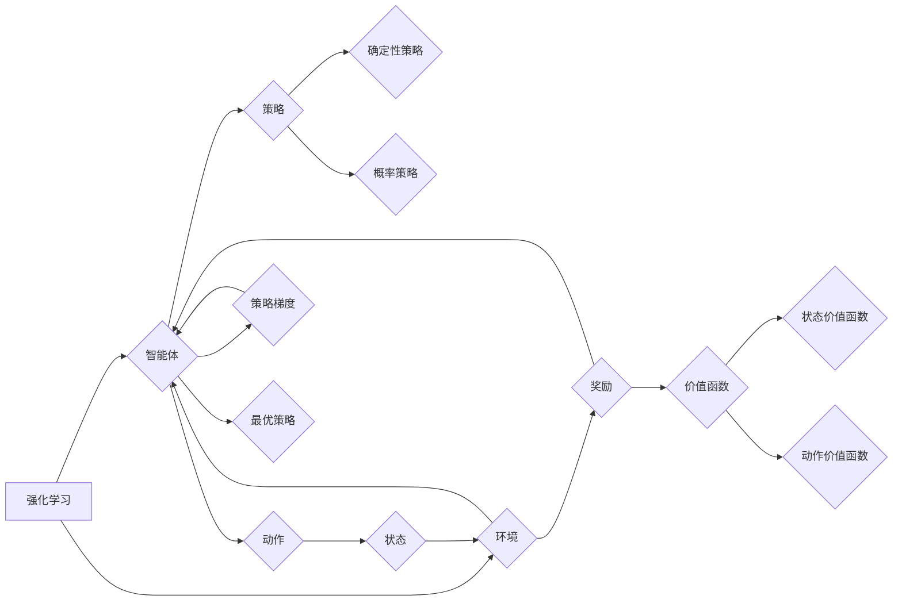

# 强化学习算法：策略梯度 (Policy Gradient) 原理与代码实例讲解

作者：禅与计算机程序设计艺术 / Zen and the Art of Computer Programming

## 1. 背景介绍
### 1.1 问题的由来

强化学习（Reinforcement Learning，RL）是人工智能领域的一个重要分支，旨在通过智能体与环境的交互，学习到最优决策策略。在现实世界中，许多问题都可以用强化学习来建模和解决，如机器人导航、游戏对弈、自动驾驶等。

然而，与监督学习和无监督学习不同，强化学习中的智能体需要通过不断试错来学习，这使得强化学习算法的设计和实现变得更加复杂。策略梯度（Policy Gradient）是强化学习中的一个重要算法，它直接优化策略参数，避免了价值函数求解的复杂性。

### 1.2 研究现状

近年来，随着深度学习技术的快速发展，深度强化学习（Deep Reinforcement Learning，DRL）成为研究热点。策略梯度算法在DRL中得到了广泛应用，并取得了许多令人瞩目的成果。

### 1.3 研究意义

策略梯度算法在强化学习领域具有以下研究意义：

- 避免价值函数求解的复杂性，直接优化策略参数。
- 灵活处理各种类型的策略表示，如确定性策略、概率策略等。
- 在许多强化学习任务中取得优异的性能。

### 1.4 本文结构

本文将围绕策略梯度算法展开，主要内容包括：

- 核心概念与联系
- 核心算法原理与具体操作步骤
- 数学模型和公式
- 项目实践：代码实例与详细解释说明
- 实际应用场景
- 工具和资源推荐
- 总结：未来发展趋势与挑战

## 2. 核心概念与联系

在介绍策略梯度算法之前，我们需要先了解以下几个核心概念：

- **强化学习**：智能体通过与环境的交互，学习到最优决策策略，以最大化累积奖励。
- **策略**：描述智能体如何选择动作的函数，分为确定性策略和概率策略。
- **价值函数**：评估策略的好坏，分为状态价值函数和动作价值函数。
- **策略梯度**：通过梯度下降算法优化策略参数，使策略函数逼近最优策略。

这些概念之间的逻辑关系如下：



## 3. 核心算法原理 & 具体操作步骤
### 3.1 算法原理概述

策略梯度算法通过直接优化策略参数来学习最优策略。它将策略参数作为优化变量，通过梯度下降算法更新策略参数，使策略函数逼近最优策略。

### 3.2 算法步骤详解

策略梯度算法主要包括以下步骤：

1. **初始化**：初始化策略参数 $\theta$ 和学习率 $\eta$。
2. **执行动作**：根据策略函数 $p(a_t|s_t; \theta)$ 选择动作 $a_t$。
3. **与环境交互**：执行动作 $a_t$，获取状态 $s_{t+1}$ 和奖励 $r_t$。
4. **更新策略参数**：根据梯度下降算法更新策略参数 $\theta$，使得策略函数 $p(a_t|s_t; \theta)$ 更接近最优策略。
5. **重复步骤 2-4，直到满足停止条件**。

### 3.3 算法优缺点

策略梯度算法的优点：

- 直接优化策略参数，避免了价值函数求解的复杂性。
- 灵活处理各种类型的策略表示。
- 在许多强化学习任务中取得优异的性能。

策略梯度算法的缺点：

- 在某些情况下，梯度计算困难。
- 容易陷入局部最优解。

### 3.4 算法应用领域

策略梯度算法在以下领域得到了广泛应用：

- 机器人控制
- 游戏对弈
- 自动驾驶
- 股票交易
- 能源优化

## 4. 数学模型和公式 & 详细讲解 & 举例说明
### 4.1 数学模型构建

策略梯度算法的数学模型如下：

- **策略函数**：$p(a_t|s_t; \theta)$，其中 $\theta$ 为策略参数。
- **状态值函数**：$V(s_t; \theta)$，表示在状态 $s_t$ 下，按照策略 $\theta$ 采取行动所能获得的最大累积奖励。
- **动作值函数**：$Q(s_t, a_t; \theta)$，表示在状态 $s_t$ 下，采取行动 $a_t$ 后，按照策略 $\theta$ 能获得的最大累积奖励。

### 4.2 公式推导过程

策略梯度算法的推导过程如下：

- **累积奖励**：$G_t = \sum_{k=t}^T \gamma^{k-t}r_k$，其中 $T$ 为时间步长，$\gamma$ 为折扣因子。
- **状态价值函数**：$V(s_t; \theta) = \mathbb{E}[G_t | s_t; \theta]$
- **动作价值函数**：$Q(s_t, a_t; \theta) = \mathbb{E}[G_t | s_t, a_t; \theta]$
- **策略梯度**：$\nabla_{\theta} J(\theta) = \mathbb{E}[\nabla_{\theta} Q(s_t, a_t; \theta) | s_t, a_t; \theta]$
- **策略梯度上升**：$\theta \leftarrow \theta + \eta \nabla_{\theta} J(\theta)$

### 4.3 案例分析与讲解

以Q-Learning为例，讲解策略梯度算法的应用。

- **Q函数**：$Q(s_t, a_t; \theta)$
- **策略函数**：$p(a_t|s_t; \theta) = \frac{\exp(\theta^T Q(s_t, a_t; \theta))}{\sum_{a'} \exp(\theta^T Q(s_t, a'; \theta))}$
- **更新公式**：$\theta \leftarrow \theta + \eta [r_{t+1} + \gamma \max_{a'} Q(s_{t+1}, a'; \theta) - Q(s_t, a_t; \theta)]Q(s_t, a_t; \theta)$

### 4.4 常见问题解答

**Q1：策略梯度算法如何避免梯度消失/爆炸问题？**

A：策略梯度算法可以通过以下方法避免梯度消失/爆炸问题：

- 使用ReLU等非线性激活函数。
- 使用梯度裁剪技术。
- 使用ReLU激活函数的平滑版本，如Leaky ReLU。

**Q2：策略梯度算法如何处理连续动作空间？**

A：对于连续动作空间，可以使用神经网络来表示策略函数，通过优化神经网络参数来学习策略。

## 5. 项目实践：代码实例和详细解释说明
### 5.1 开发环境搭建

- 安装Python环境。
- 安装PyTorch库。

### 5.2 源代码详细实现

以下是一个使用PyTorch实现的策略梯度算法的代码示例：

```python
import torch
import torch.nn as nn
import torch.optim as optim

class PolicyNetwork(nn.Module):
    def __init__(self, input_size, output_size):
        super(PolicyNetwork, self).__init__()
        self.fc1 = nn.Linear(input_size, 64)
        self.fc2 = nn.Linear(64, output_size)

    def forward(self, x):
        x = torch.relu(self.fc1(x))
        x = self.fc2(x)
        return x

def choose_action(state, policy_network, exploration_prob):
    if torch.rand(1) < exploration_prob:
        action = torch.randint(0, policy_network.fc2.out_features, (1,))
    else:
        action = torch.argmax(policy_network(state), dim=1)
    return action

def update_policy_network(policy_network, target_value, optimizer, gamma=0.99):
    optimizer.zero_grad()
    value = policy_network(state)
    loss = -torch.log(value[0, action]) * target_value
    loss.backward()
    optimizer.step()

# 创建模型和优化器
policy_network = PolicyNetwork(input_size, output_size)
optimizer = optim.Adam(policy_network.parameters(), lr=0.01)

# 训练模型
for episode in range(total_episodes):
    state = ...
    for t in range(total_steps):
        action = choose_action(state, policy_network, exploration_prob)
        next_state, reward, done = ...
        target_value = reward + gamma * torch.max(policy_network(next_state), dim=1)[0].detach()
        update_policy_network(policy_network, target_value, optimizer)
        state = next_state
        if done:
            break

# 选择动作
state = ...
action = choose_action(state, policy_network, exploration_prob)
```

### 5.3 代码解读与分析

上述代码展示了如何使用PyTorch实现策略梯度算法：

- `PolicyNetwork` 类定义了策略网络，包含两个全连接层。
- `choose_action` 函数根据策略函数选择动作。
- `update_policy_network` 函数根据策略梯度更新策略网络参数。

### 5.4 运行结果展示

由于篇幅限制，这里不展示具体的运行结果。但你可以通过修改代码中的参数和实验设置，来观察策略梯度算法在不同任务上的表现。

## 6. 实际应用场景
### 6.1 自动驾驶

策略梯度算法可以用于自动驾驶中，通过学习最优驾驶策略，使自动驾驶车辆在各种路况下安全、高效地行驶。

### 6.2 游戏对弈

策略梯度算法可以用于游戏对弈中，如国际象棋、围棋等，通过学习最优策略，提高人工智能玩家的水平。

### 6.3 机器人控制

策略梯度算法可以用于机器人控制中，如机器人路径规划、抓取等，通过学习最优控制策略，使机器人能够完成各种任务。

## 7. 工具和资源推荐
### 7.1 学习资源推荐

- 《强化学习：原理与数学》（Reinforcement Learning: An Introduction）
- 《深度强化学习》（Deep Reinforcement Learning）
- PyTorch官方文档
- Hugging Face Transformers库

### 7.2 开发工具推荐

- PyTorch
- Hugging Face Transformers库
- OpenAI Gym

### 7.3 相关论文推荐

- Q-Learning论文
- Policy Gradient论文

### 7.4 其他资源推荐

- arXiv论文预印本
- 知乎
- Bilibili

## 8. 总结：未来发展趋势与挑战
### 8.1 研究成果总结

本文对策略梯度算法进行了全面介绍，包括核心概念、算法原理、具体操作步骤、数学模型、代码实例等。通过本文的学习，读者可以深入理解策略梯度算法的原理和应用，并能够将其应用于实际问题中。

### 8.2 未来发展趋势

未来，策略梯度算法将在以下方面取得进一步发展：

- 结合深度学习技术，提高算法的效率和精度。
- 在更复杂的任务上取得突破性进展，如多智能体强化学习、无模型强化学习等。
- 与其他机器学习技术（如深度学习、无监督学习等）进行融合，拓展应用范围。

### 8.3 面临的挑战

策略梯度算法在以下方面面临着挑战：

- 梯度消失/爆炸问题。
- 难以处理高维动作空间。
- 在某些任务上收敛速度较慢。

### 8.4 研究展望

未来，策略梯度算法的研究将重点关注以下方面：

- 改进算法的稳定性和收敛速度。
- 提高算法的可解释性和可理解性。
- 探索新的策略表示和优化方法。

## 9. 附录：常见问题与解答

**Q1：策略梯度算法与价值函数求解算法有什么区别？**

A：策略梯度算法和值函数求解算法是两种不同的强化学习算法。策略梯度算法直接优化策略参数，避免了值函数求解的复杂性。而值函数求解算法通过迭代优化值函数来学习最优策略。

**Q2：策略梯度算法如何处理高维动作空间？**

A：对于高维动作空间，可以使用神经网络来表示策略函数，通过优化神经网络参数来学习策略。

**Q3：策略梯度算法如何处理连续动作空间？**

A：对于连续动作空间，可以使用基于梯度的策略梯度方法（如REINFORCE、PPO等），或者使用基于采样的策略梯度方法（如Softmax Policy Gradient）。

**Q4：策略梯度算法如何避免梯度消失/爆炸问题？**

A：策略梯度算法可以通过以下方法避免梯度消失/爆炸问题：

- 使用ReLU等非线性激活函数。
- 使用梯度裁剪技术。
- 使用ReLU激活函数的平滑版本，如Leaky ReLU。

作者：禅与计算机程序设计艺术 / Zen and the Art of Computer Programming