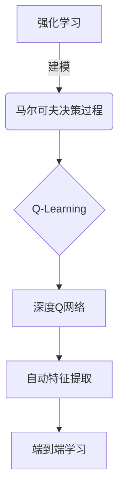
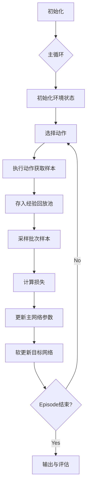

好的，我会按照您的要求，以"深度 Q-learning：在金融风控中的应用"为题目，撰写一篇专业的技术博客文章。文章将遵循您提供的结构模板，包含详细的理论介绍、数学模型推导、算法步骤、代码实现、应用场景等内容。我会尽最大努力确保文章逻辑清晰、内容深入、实例丰富，并在适当的位置插入 Mermaid 流程图来阐释核心概念和架构原理。同时也会注意使用专业但通俗易懂的技术语言，确保内容专业性和可读性的平衡。以下是正文内容：

# 深度 Q-learning：在金融风控中的应用

## 1. 背景介绍

### 1.1 问题的由来

在金融领域中,风险控制(Risk Control)是一个至关重要的课题。传统的风控模型大多基于人工设定的规则和经验,存在一定的滞后性和主观性。随着金融数据的快速积累和人工智能技术的不断发展,如何利用机器学习算法自动从海量历史数据中挖掘风险模式,并对未来风险做出精准预测,成为了金融风控的一个重要研究方向。

### 1.2 研究现状  

目前,在金融风控领域应用机器学习算法的研究主要集中在监督学习和非监督学习两个方向。监督学习算法如逻辑回归、决策树等被用于建立风险评分卡模型,对客户的违约风险进行评估。非监督学习算法如聚类分析则被应用于反洗钱、反欺诈等异常检测任务。但这些传统机器学习方法都存在一定的局限性,比如需要大量的人工特征工程,难以充分挖掘数据的潜在规律等。

### 1.3 研究意义

近年来,强化学习(Reinforcement Learning)作为机器学习的一个新兴分支,在很多领域展现出了巨大的潜力。强化学习算法能够自主从环境中学习,不需要人工设定规则,可以自动发现数据中隐藏的复杂模式。其中,深度 Q-Learning 网络(Deep Q-Network, DQN)作为结合深度学习的一种强化学习算法,已在游戏、机器人控制等领域取得了卓越的成绩。

将深度 Q-Learning 引入金融风控,可以期望算法自主从大量历史数据中学习风险模式,并对未来可能出现的风险做出准确预测和决策,从而实现风控的自动化和智能化。这不仅可以提高风控的效率和精度,还能够发现人工难以察觉的潜在风险因素,对金融机构的风险管理具有重大意义。

### 1.4 本文结构

本文将首先介绍深度 Q-Learning 算法的核心概念和基本原理,然后详细阐述其在金融风控领域中的应用,包括数学建模、算法实现细节、代码实例等。最后将讨论该技术在实际场景中的应用前景,以及未来的发展趋势和需要面临的挑战。

## 2. 核心概念与联系

深度 Q-Learning 算法源于强化学习(Reinforcement Learning)和 Q-Learning 的理论基础。我们先来了解一下这些核心概念:

- 强化学习(Reinforcement Learning)
  - 是一种基于环境交互的机器学习范式
  - 智能体(Agent)通过试错与环境交互,获得奖励(Reward)
  - 目标是学习一个策略(Policy),使长期累积奖励最大化

- 马尔可夫决策过程(Markov Decision Process, MDP)
  - 是强化学习问题的数学模型
  - 由状态(State)、动作(Action)、奖励(Reward)、转移概率(Transition Probability)组成
  - 满足马尔可夫性质:未来状态只依赖于当前状态和动作

- Q-Learning
  - 是解决MDP问题的一种经典算法
  - 通过Q函数(Q-function)评估状态-动作对的长期回报
  - 使用贝尔曼方程(Bellman Equation)迭代更新Q函数
  - 无需建模转移概率,可以在线学习

- 深度Q网络(Deep Q-Network, DQN)
  - 使用深度神经网络来拟合Q函数
  - 突破了传统Q-Learning在高维状态下的局限
  - 结合深度学习的优势,可以从原始数据中自动提取特征

这些概念相互关联、环环相扣,构成了深度 Q-Learning 算法的理论基础。下面我们将用一个简单的示意图来展示它们之间的联系:

从上图可以看出,强化学习提出了基于环境交互的学习范式,马尔可夫决策过程则为其建立了数学模型。Q-Learning 是解决 MDP 的一种经典算法,而深度 Q 网络则将其与深度学习相结合,实现了自动特征提取和端到端的学习。

通过这种层层递进的方式,深度 Q-Learning 算法不仅继承了强化学习的先进理念,还融合了深度学习的强大能力,从而能够在复杂的决策问题中发挥出独特的优势。

## 3. 核心算法原理与具体操作步骤

### 3.1 算法原理概述

深度 Q-Learning 算法的核心思想,是使用一个深度神经网络来拟合 Q 函数,从而估计在当前状态下执行某个动作的长期回报价值。具体来说,该算法包含以下几个关键组成部分:

1. **环境(Environment)**
   - 环境是强化学习智能体与外界交互的场景
   - 在金融风控中,环境可以是包含大量历史数据的模拟器

2. **智能体(Agent)**
   - 智能体是执行决策并与环境交互的主体
   - 由一个深度神经网络表示,输入是当前状态,输出是各个动作的 Q 值估计

3. **经验回放池(Experience Replay Buffer)** 
   - 用于存储智能体与环境交互过程中产生的状态转移样本
   - 通过随机采样,减小样本之间的相关性,提高学习效率和稳定性

4. **目标网络(Target Network)**
   - 是一个独立的深度神经网络,用于生成 Q 值的目标
   - 通过软更新的方式,使目标网络的参数缓慢跟踪主网络

5. **贝尔曼方程(Bellman Equation)**
   - 是更新 Q 网络参数的基础
   - 最小化当前 Q 值估计与目标 Q 值之间的差异

通过上述机制的交互运作,深度 Q-Learning 算法能够逐步优化神经网络参数,使其输出的 Q 值估计越来越准确,从而学习到一个最优的决策策略。

### 3.2 算法步骤详解  

深度 Q-Learning 算法的执行流程可以概括为以下几个主要步骤:

1. **初始化**
   - 初始化主网络(Q网络)和目标网络(Target Q网络)
   - 创建经验回放池

2. **主循环**
   - 对于每个Episode(即一个完整的模拟过程):
     a) 初始化环境状态
     b) 根据ε-贪婪策略选择动作
     c) 执行动作,获得新状态和奖励
     d) 将(状态,动作,奖励,新状态)样本存入经验回放池
     e) 从经验回放池中随机采样一个批次的样本
     f) 计算目标Q值和当前Q值之间的损失
     g) 使用优化器(如Adam)更新主网络参数,最小化损失
     h) 软更新目标网络参数
     i) 重复b)~h)直到Episode结束

3. **输出与评估**
   - 在测试环境中评估学习到的策略
   - 根据策略在实际场景中执行决策并监控效果

下面我们使用一个流程图来直观地展示上述算法步骤:

上图清晰地展示了深度 Q-Learning 算法的整个执行过程。通过不断与环境交互、存储样本、更新网络参数的循环,算法逐步优化决策策略,最终输出一个性能良好的智能体模型。

值得注意的是,在实际应用中,我们还需要对算法进行一些改进和优化,例如引入Double DQN、Prioritized Experience Replay等技术,以提高算法的性能和稳定性。

### 3.3 算法优缺点

深度 Q-Learning 算法相比传统的监督学习和非监督学习算法,具有以下一些优势:

- **无需人工设计特征**
  - 通过深度神经网络自动从原始数据中提取特征,降低了人工成本

- **无需建模转移概率**
  - 不需要事先了解环境的精确数学模型,可以在线学习

- **可直接优化长期回报**
  - 目标函数直接与最终目标(长期累积奖励)相关,更加符合实际需求

- **泛化性强**
  - 理论上只要状态空间可观测,算法就能够学习到一个良好的策略

但与此同时,深度 Q-Learning 算法也存在一些需要注意的缺点和局限性:

- **训练数据需求量大**
  - 作为一种基于试错的学习方式,需要大量的交互数据用于训练

- **收敛性能不确定**  
  - 作为一种基于bootstrapping的算法,收敛性能难以保证

- **超参数调优困难**
  - 算法涉及多个超参数(如学习率、折扣因子等),调参过程复杂

- **维数灾难问题**
  - 当状态/动作空间维数过高时,算法性能将急剧下降

因此,在实际应用中,我们需要根据具体问题的特点,权衡利弊,并采取一些优化策略(如经验优先回放、双网络等)来缓解上述缺陷。

### 3.4 算法应用领域

深度 Q-Learning 算法作为一种通用的决策优化算法,其应用领域是非常广泛的。除了本文重点探讨的金融风控场景外,它还可以用于:

- **游戏AI**
  - 在棋类游戏、电子游戏等领域训练出人类水平的AI智能体

- **机器人控制**
  - 训练机器人在复杂环境中执行各种任务,如导航、操作等

- **资源管理**
  - 优化数据中心的资源调度、工厂的生产计划等

- **自动驾驶**
  - 训练自动驾驶系统在复杂交通场景中做出正确决策

- **对话系统**  
  - 根据上下文状态,选择最佳的对话响应策略

总的来说,任何可以建模为马尔可夫决策过程的序列决策问题,都可以尝试使用深度 Q-Learning 算法来求解。这种通用性使得该算法具有广阔的应用前景。

## 4. 数学模型和公式详细讲解与举例说明

### 4.1 数学模型构建

在正式推导深度 Q-Learning 算法之前,我们首先需要建立其数学模型 —— 马尔可夫决策过程(Markov Decision Process, MDP)。

MDP 由一个五元组 $(S, A, P, R, \gamma)$ 组成,其中:

- $S$ 是状态空间的集合
- $A$ 是动作空间的集合  
- $P(s' \vert s, a)$ 是状态转移概率,表示从状态 $s$ 执行动作 $a$ 后,转移到状态 $s'$ 的概率
- $R(s, a, s')$ 是奖励函数,表示从状态 $s$ 执行动作 $a$ 后,转移到状态 $s'$ 获得的即时奖励
- $\gamma \in [0, 