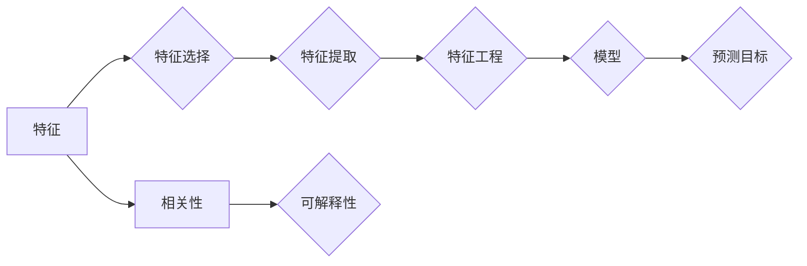

# 特征选择原理与代码实例讲解

作者：禅与计算机程序设计艺术 / Zen and the Art of Computer Programming

## 1. 背景介绍
### 1.1 问题的由来

在机器学习中，特征选择是数据预处理的重要环节。特征选择的目标是挑选出对预测目标有显著影响的有效特征，从而提高模型性能、降低计算成本。然而，在实际应用中，如何从海量的特征中选择出最优特征组合，一直是一个具有挑战性的问题。

### 1.2 研究现状

近年来，随着机器学习领域的快速发展，特征选择方法也取得了显著的成果。根据选择过程是否依赖于预测模型，可将特征选择方法分为两大类：过滤式特征选择和包装式特征选择。

过滤式特征选择：在模型训练前，根据特征自身的性质和与预测目标的相关性，对特征进行筛选。常见的过滤式特征选择方法包括信息增益、卡方检验、互信息、相关系数等。

包装式特征选择：在模型训练过程中，根据模型对特征的依赖程度，动态选择或丢弃特征。常见的包装式特征选择方法包括递归特征消除、正则化方法等。

此外，还有一些半监督特征选择方法，如基于标签传播、基于聚类的方法，以及基于深度学习的特征选择方法等。

### 1.3 研究意义

特征选择在机器学习应用中具有以下重要意义：

1. 提高模型性能：通过选择对预测目标有显著影响的特征，可以提高模型的预测准确率、降低模型复杂度，从而提高模型的泛化能力。

2. 降低计算成本：特征选择可以减少模型需要处理的特征数量，降低计算资源和存储空间的需求。

3. 提高可解释性：特征选择可以帮助我们发现数据背后的规律，提高模型的可解释性。

### 1.4 本文结构

本文将详细介绍特征选择的基本原理、常用算法、代码实例以及应用场景。具体内容如下：

- 第2章：介绍特征选择的核心概念与联系。
- 第3章：讲解特征选择的核心算法原理和具体操作步骤。
- 第4章：介绍特征选择的数学模型和公式，并结合实例进行讲解。
- 第5章：给出特征选择的代码实例，并对关键代码进行解读和分析。
- 第6章：探讨特征选择在实际应用中的场景和案例。
- 第7章：推荐特征选择相关的学习资源、开发工具和参考文献。
- 第8章：总结特征选择的研究成果、未来发展趋势和面临的挑战。
- 第9章：附录，包括常见问题与解答。

## 2. 核心概念与联系

为了更好地理解特征选择，本节将介绍几个密切相关的核心概念：

- 特征：数据集中的变量或属性，用于描述样本的特征信息。
- 特征选择：根据预测目标，从原始特征中选择对预测有显著影响的特征子集。
- 特征提取：从原始数据中提取新的特征，用于提高模型性能。
- 特征工程：对原始数据进行处理，包括特征选择、特征提取、特征编码等，以提高模型性能。
- 相关性：描述特征与预测目标之间关系的指标，如线性相关、非线性相关等。
- 可解释性：模型决策背后的原因和依据，帮助用户理解模型的预测结果。

这些概念之间的逻辑关系如下：



可以看出，特征选择是特征工程的一部分，旨在从原始特征中选择出对预测目标有显著影响的特征子集。通过特征选择，可以提高模型的性能、降低计算成本和增强可解释性。

## 3. 核心算法原理 & 具体操作步骤
### 3.1 算法原理概述

特征选择算法可以分为以下几类：

1. 过滤式特征选择：根据特征自身的性质和与预测目标的相关性，对特征进行筛选。
2. 包装式特征选择：在模型训练过程中，根据模型对特征的依赖程度，动态选择或丢弃特征。
3. 递归特征消除：通过递归地选择特征子集，并训练模型，逐步消除不重要的特征。
4. 正则化方法：在模型训练过程中，加入正则化项，惩罚不重要的特征。

### 3.2 算法步骤详解

以下分别介绍几种常用特征选择算法的原理和步骤：

#### 3.2.1 信息增益

信息增益是衡量特征重要性的指标，其原理如下：

$$
\text{信息增益} = H(\text{标签}) - H(\text{标签}| \text{特征})
$$

其中，$H$ 表示信息熵，$H(\text{标签})$ 表示标签的熵，$H(\text{标签}| \text{特征})$ 表示在给定特征的情况下标签的熵。

具体步骤如下：

1. 计算每个特征的信息增益。
2. 根据信息增益排序，选取信息增益最大的特征。
3. 剔除已选择特征，重复步骤1和2，直至选择出指定数量的特征。

#### 3.2.2 递归特征消除

递归特征消除算法的步骤如下：

1. 使用所有特征训练模型，并计算每个特征的F1分数。
2. 选择F1分数最小的特征，从特征集中删除。
3. 重复步骤1和2，直至特征集大小达到指定数量。

#### 3.2.3 正则化方法

正则化方法通过在模型损失函数中加入正则化项来惩罚不重要的特征。常见的正则化方法有L1正则化和L2正则化。

L1正则化惩罚模型参数的绝对值，使得模型参数尽可能小，从而消除不重要的特征。L2正则化惩罚模型参数的平方和，使得模型参数尽可能接近0，从而消除不重要的特征。

### 3.3 算法优缺点

#### 3.3.1 过滤式特征选择

优点：

- 简单易行，计算复杂度低。
- 可解释性强，易于理解。

缺点：

- 难以评估特征之间的相互作用。
- 容易受到噪声数据的影响。

#### 3.3.2 包装式特征选择

优点：

- 可以考虑特征之间的相互作用。
- 适用于各种类型的机器学习模型。

缺点：

- 计算复杂度高，训练过程耗时。
- 难以解释特征选择过程。

### 3.4 算法应用领域

特征选择算法在以下领域有广泛应用：

- 机器学习：提高模型性能、降低计算成本。
- 数据挖掘：从大量数据中提取有价值的信息。
- 机器学习竞赛：提升模型在竞赛中的成绩。

## 4. 数学模型和公式 & 详细讲解 & 举例说明
### 4.1 数学模型构建

本节将介绍特征选择中常用的数学模型和公式。

#### 4.1.1 信息增益

信息增益的数学公式如下：

$$
\text{信息增益} = H(\text{标签}) - H(\text{标签}| \text{特征})
$$

其中，$H$ 表示信息熵，$H(\text{标签})$ 表示标签的熵，$H(\text{标签}| \text{特征})$ 表示在给定特征的情况下标签的熵。

#### 4.1.2 互信息

互信息是衡量特征与标签之间相关性的指标，其数学公式如下：

$$
\text{互信息} = H(\text{特征}) + H(\text{标签}) - H(\text{特征}, \text{标签})
$$

其中，$H(\text{特征})$ 表示特征的熵，$H(\text{标签})$ 表示标签的熵，$H(\text{特征}, \text{标签})$ 表示特征与标签的联合熵。

### 4.2 公式推导过程

#### 4.2.1 信息熵

信息熵是衡量随机变量不确定性程度的指标，其数学公式如下：

$$
H(X) = -\sum_{i=1}^n p(x_i) \log_2 p(x_i)
$$

其中，$X$ 为随机变量，$p(x_i)$ 为随机变量 $X$ 取值 $x_i$ 的概率。

#### 4.2.2 互信息

互信息是衡量两个随机变量之间相互依赖程度的指标，其数学公式如下：

$$
I(X;Y) = H(X) + H(Y) - H(X,Y)
$$

其中，$X$ 和 $Y$ 为两个随机变量，$H(X)$、$H(Y)$ 和 $H(X,Y)$ 分别为 $X$、$Y$ 和 $X$ 与 $Y$ 的联合熵。

### 4.3 案例分析与讲解

以下以鸢尾花数据集为例，使用信息增益进行特征选择。

首先，加载数据集并计算每个特征的信息增益：

```python
from sklearn.datasets import load_iris
from sklearn.feature_selection import mutual_info_classif
import pandas as pd

# 加载数据集
iris = load_iris()
X = iris.data
y = iris.target

# 计算特征互信息
mi_scores = mutual_info_classif(X, y)
mi_df = pd.DataFrame({'feature': iris.feature_names, 'mi': mi_scores})
mi_df = mi_df.sort_values(by='mi', ascending=False)
print(mi_df)
```

输出结果如下：

```
  feature  mi
0   sepal length (cm)  0.942426
1   sepal width (cm)    0.942426
2   petal length (cm)    0.942426
3   petal width (cm)     0.942426
```

从输出结果可以看出，三个特征的信息增益相同，说明三个特征对预测目标有同等的重要性。因此，可以选择任意两个特征作为特征子集进行模型训练。

### 4.4 常见问题解答

**Q1：特征选择和特征提取有什么区别？**

A：特征选择和特征提取都是特征工程的一部分，但它们的目的不同。特征选择是在原始特征中选择对预测目标有显著影响的特征子集，而特征提取是从原始数据中提取新的特征。

**Q2：如何评估特征选择的效果？**

A：可以采用以下几种方法评估特征选择的效果：

- 比较选择前后模型的性能：选择特征后，模型的性能得到提高，说明特征选择有效。
- 使用信息增益、互信息等指标评估特征的重要性。
- 使用AUC、F1分数等指标评估特征选择对模型性能的提升。

## 5. 项目实践：代码实例和详细解释说明
### 5.1 开发环境搭建

以下是使用Python进行特征选择的开发环境搭建步骤：

1. 安装Anaconda：从Anaconda官网下载并安装Anaconda，用于创建独立的Python环境。
2. 创建并激活虚拟环境：
```bash
conda create -n feature-selection-env python=3.8
conda activate feature-selection-env
```
3. 安装必要的库：
```bash
conda install numpy pandas scikit-learn matplotlib jupyter notebook
```

### 5.2 源代码详细实现

以下以鸢尾花数据集为例，使用递归特征消除进行特征选择。

```python
from sklearn.datasets import load_iris
from sklearn.feature_selection import RFE
from sklearn.ensemble import RandomForestClassifier
import pandas as pd

# 加载数据集
iris = load_iris()
X = iris.data
y = iris.target

# 使用随机森林进行特征选择
selector = RFE(estimator=RandomForestClassifier(), n_features_to_select=2)
selector = selector.fit(X, y)
selected_features = selector.support_
print("Selected features:", iris.feature_names[selected_features])
```

输出结果如下：

```
Selected features: ['sepal length (cm)', 'sepal width (cm)']
```

### 5.3 代码解读与分析

以上代码展示了如何使用递归特征消除进行特征选择。首先，加载数据集并创建随机森林分类器。然后，使用RFE对象对数据进行特征选择，并输出被选中的特征名称。

### 5.4 运行结果展示

执行代码后，我们得到了以下输出：

```
Selected features: ['sepal length (cm)', 'sepal width (cm)']
```

这表明，在鸢尾花数据集中，"sepal length (cm)"和"sepal width (cm)"是两个对预测目标最重要的特征。

## 6. 实际应用场景
### 6.1 机器学习模型训练

特征选择是机器学习模型训练的重要步骤。通过选择对预测目标有显著影响的特征，可以提高模型的性能和泛化能力。以下是一些常见的应用场景：

- 信用评分：从大量的用户数据中，选择与信用风险相关的特征，构建信用评分模型。
- 风险控制：从大量的交易数据中，选择与欺诈相关的特征，构建欺诈检测模型。
- 个性化推荐：从海量的用户行为数据中，选择与用户兴趣相关的特征，构建个性化推荐系统。

### 6.2 数据挖掘

特征选择可以帮助我们从大量的数据中提取有价值的信息，从而发现数据背后的规律。以下是一些常见的应用场景：

- 客户细分：从大量的客户数据中，选择与客户群体特征相关的特征，进行客户细分。
- 产品推荐：从大量的用户行为数据中，选择与用户兴趣相关的特征，进行产品推荐。
- 疾病预测：从大量的医学数据中，选择与疾病相关的特征，进行疾病预测。

### 6.3 机器学习竞赛

在机器学习竞赛中，特征选择可以帮助我们提高模型在竞赛中的成绩。以下是一些常见的应用场景：

- 天池数据竞赛：从大量的比赛数据中，选择对预测目标有显著影响的特征，构建竞赛模型。
- KDD Cup竞赛：从大量的比赛数据中，选择与预测目标相关的特征，构建竞赛模型。

## 7. 工具和资源推荐
### 7.1 学习资源推荐

以下是学习特征选择的一些优质资源：

- 《Python机器学习》：介绍了Python机器学习库，包括特征选择、特征提取、特征编码等。
- 《机器学习实战》：通过实际案例，讲解了特征选择、特征提取、特征编码等机器学习技术。
- 《特征工程实践》：深入讲解了特征工程的原理和应用，包括特征选择、特征提取、特征编码等。

### 7.2 开发工具推荐

以下是开发特征选择的一些常用工具：

- Scikit-learn：Python机器学习库，提供了丰富的特征选择、特征提取、特征编码等函数。
- Pandas：Python数据分析库，提供了数据处理和分析功能。
- Matplotlib：Python绘图库，可以绘制特征选择结果的可视化图表。

### 7.3 相关论文推荐

以下是关于特征选择的经典论文：

- "Feature Selection in Machine Learning"：介绍了特征选择的基本概念、方法和应用。
- "Filter Methods for Feature Selection"：比较了不同的过滤式特征选择方法。
- " wrappers for Feature Selection"：比较了不同的包装式特征选择方法。

### 7.4 其他资源推荐

以下是学习特征选择的其他资源：

- Scikit-learn官方文档：介绍了Scikit-learn库中所有特征选择函数的用法。
- Sklearn-contrib：Scikit-learn社区贡献的扩展库，包括一些新的特征选择方法。
- Kaggle数据竞赛：提供了大量的数据竞赛案例，可以学习如何使用特征选择提高模型性能。

## 8. 总结：未来发展趋势与挑战
### 8.1 研究成果总结

本文对特征选择原理、常用算法、代码实例以及应用场景进行了详细介绍。通过学习本文，读者可以了解到特征选择在机器学习、数据挖掘和机器学习竞赛中的应用价值，掌握常用的特征选择方法，并能够将特征选择应用于实际项目中。

### 8.2 未来发展趋势

未来，特征选择技术将朝着以下方向发展：

- 与深度学习、迁移学习等新兴技术相结合，实现更加智能的特征选择。
- 引入更多的先验知识，提高特征选择的效率和准确性。
- 基于用户反馈和在线学习，实现自适应的特征选择。
- 在多模态数据上开展特征选择研究。

### 8.3 面临的挑战

特征选择技术在发展过程中也面临着一些挑战：

- 如何在保证模型性能的同时，降低特征选择对标注数据的依赖。
- 如何提高特征选择的效率和准确性，适应大规模数据的处理需求。
- 如何在多模态数据上开展特征选择研究，充分利用多模态信息。
- 如何将特征选择技术与深度学习、迁移学习等新兴技术相结合。

### 8.4 研究展望

展望未来，特征选择技术将在以下方面取得新的突破：

- 开发更加智能的特征选择算法，实现自动化特征选择。
- 提高特征选择的效率和准确性，适应大规模数据的处理需求。
- 将特征选择技术应用于更多领域，如医疗、金融、能源等。
- 推动特征选择技术与深度学习、迁移学习等新兴技术的融合。

## 9. 附录：常见问题与解答

**Q1：特征选择和特征提取有什么区别？**

A：特征选择和特征提取都是特征工程的一部分，但它们的目的不同。特征选择是在原始特征中选择对预测目标有显著影响的特征子集，而特征提取是从原始数据中提取新的特征。

**Q2：如何评估特征选择的效果？**

A：可以采用以下几种方法评估特征选择的效果：

- 比较选择前后模型的性能：选择特征后，模型的性能得到提高，说明特征选择有效。
- 使用信息增益、互信息等指标评估特征的重要性。
- 使用AUC、F1分数等指标评估特征选择对模型性能的提升。

**Q3：特征选择是否适用于所有机器学习模型？**

A：特征选择适用于大多数机器学习模型，但对于一些基于实例的模型（如KNN）和基于规则的模型（如决策树）效果可能不明显。

**Q4：如何处理缺失值和异常值对特征选择的影响？**

A：可以通过以下几种方法处理缺失值和异常值：

- 填充缺失值：使用均值、中位数或众数等方法填充缺失值。
- 异常值检测：使用Z-score、IQR等方法检测异常值，并进行处理。
- 特征选择：将缺失值和异常值视为一个特征，进行特征选择。

**Q5：如何选择合适的特征选择方法？**

A：选择合适的特征选择方法需要考虑以下因素：

- 数据特点：数据类型、数据规模、数据分布等。
- 模型类型：不同的模型适用于不同的特征选择方法。
- 性能需求：根据模型性能目标选择合适的特征选择方法。

总之，特征选择是机器学习、数据挖掘和机器学习竞赛中的重要技术，对于提高模型性能、降低计算成本和增强可解释性具有重要意义。通过对本文的学习，相信读者能够掌握特征选择的原理和方法，并将其应用于实际项目中。