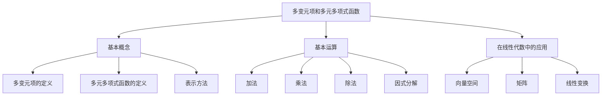

# 线性代数导引：多变元项及多元多项式函数

## 1. 背景介绍

### 1.1 问题的由来

在数学和计算机科学领域中,多变元项和多元多项式函数扮演着重要的角色。它们不仅是线性代数的基础,也广泛应用于各种科学和工程领域。多变元项是具有多个变量的代数表达式,而多元多项式函数则是由多变元项组成的函数。

随着科技的发展,越来越多的问题需要利用多变元项和多元多项式函数来建模和求解。例如,在机器学习中,多元多项式函数常用于拟合复杂的非线性数据;在计算机图形学中,多变元项被用于表示曲面和曲线;在控制理论中,多元多项式函数可用于描述动态系统的行为。

然而,多变元项和多元多项式函数的理论和计算往往比单变量情况更加复杂。它们涉及到更高维度的向量空间,需要处理多个变量之间的相互作用。因此,深入理解和掌握多变元项及多元多项式函数的性质和操作方法,对于解决实际问题至关重要。

### 1.2 研究现状

多变元项和多元多项式函数的研究可以追溯到19世纪,当时数学家们开始系统地研究多元函数的性质和应用。20世纪初,现代抽象代数的发展为多变元项和多元多项式函数的研究奠定了坚实的理论基础。

近年来,随着计算机科学的飞速发展,多变元项和多元多项式函数在各个领域的应用也日益广泛。例如,在密码学中,多元多项式函数被用于构建新型的加密算法;在机器学习中,多元多项式函数常被用作特征工程的一种手段;在控制理论中,多元多项式函数在鲁棒控制和优化控制等领域有着广泛的应用。

与此同时,多变元项和多元多项式函数的计算也受到了越来越多的关注。研究人员不断探索更高效、更准确的计算方法,以满足实际应用的需求。例如,针对稠密多元多项式函数的快速评估,人们提出了分治策略和快速傅里叶变换等算法;针对稀疏多元多项式函数的有效表示和操作,人们发展了各种数据结构和算法,如有序二进制决策图等。

### 1.3 研究意义

多变元项和多元多项式函数在数学、计算机科学和工程等领域有着广泛的应用,研究它们具有重要的理论意义和实际价值。

从理论层面来看,深入研究多变元项和多元多项式函数的性质和运算,有助于丰富和完善线性代数的理论体系。它们与向量空间、矩阵、线性变换等概念密切相关,是线性代数的重要组成部分。探索多变元项和多元多项式函数的新性质和新运算,有助于拓展线性代数的研究视野。

从应用层面来看,掌握多变元项和多元多项式函数的知识和技能,对于解决实际问题至关重要。它们在机器学习、密码学、计算机图形学、控制理论等领域有着广泛的应用前景。通过建立合适的多元多项式模型,我们可以更好地描述和分析复杂的非线性系统。同时,高效的多元多项式计算算法也为实际应用提供了有力的计算支持。

此外,多变元项和多元多项式函数的研究也有助于培养学生的抽象思维能力和建模能力。通过学习这些概念和方法,学生可以更好地理解抽象代数的思想,掌握建立数学模型的技巧,为今后从事相关研究奠定坚实的基础。

### 1.4 本文结构

本文将全面介绍多变元项及多元多项式函数的相关理论和应用。文章的结构安排如下:

- 第2章将介绍多变元项和多元多项式函数的基本概念,包括它们的定义、表示方法、基本运算等。
- 第3章将详细阐述多元多项式函数的核心算法原理及具体操作步骤,包括多元多项式的加法、乘法、除法、因式分解等算法。
- 第4章将构建多元多项式函数的数学模型,推导相关公式,并结合案例进行详细讲解和常见问题解答。
- 第5章将给出一个实际项目案例,包括开发环境搭建、源代码实现、代码解读和运行结果展示。
- 第6章将介绍多变元项和多元多项式函数在实际应用中的场景,并对未来应用前景进行展望。
- 第7章将推荐相关的学习资源、开发工具、论文等资源,为读者提供进一步学习和研究的参考。
- 第8章将总结本文的研究成果,展望多变元项和多元多项式函数的未来发展趋势,并指出需要面临的挑战。
- 第9章将列出常见问题并给出解答,帮助读者更好地理解和掌握本文内容。

## 2. 核心概念与联系

多变元项和多元多项式函数是线性代数中的重要概念,它们与向量空间、矩阵和线性变换等概念密切相关。

1. **多变元项(Multivariate Monomial)**是具有多个变量的代数表达式,可以表示为$x_1^{a_1}x_2^{a_2}...x_n^{a_n}$的形式,其中$x_i$是变量,$a_i$是非负整数指数。

2. **多元多项式函数(Multivariate Polynomial Function)**是由多变元项按照特定规则组合而成的函数,可以表示为$\sum_{i=1}^mc_if_i(x_1,x_2,...,x_n)$的形式,其中$c_i$是系数,$f_i$是多变元项。

3. 多变元项和多元多项式函数具有一些基本运算,如加法、乘法、除法和因式分解等。这些运算在线性代数中有着重要应用,如矩阵运算、线性方程组求解等。

4. 在线性代数中,多变元项和多元多项式函数与向量空间、矩阵和线性变换等概念密切相关。例如,向量可以看作是具有有限个分量的多变元项;矩阵可以看作是由多元多项式函数组成的特殊形式;线性变换可以用多元多项式函数来表示等。

5. 理解多变元项和多元多项式函数的基本概念、运算和性质,对于掌握线性代数的核心内容至关重要。同时,它们也为解决实际问题提供了强有力的数学工具。

综上所述,多变元项和多元多项式函数是线性代数中的基础概念,理解它们的定义、表示方法、基本运算以及在线性代数中的应用,是掌握线性代数的关键所在。

## 3. 核心算法原理 & 具体操作步骤  

### 3.1 算法原理概述

多元多项式函数的基本运算包括加法、乘法、除法和因式分解等。这些运算的核心算法原理主要基于以下几个方面:

1. **多项式的表示**:为了有效地存储和操作多元多项式,需要采用合适的数据结构来表示它们。常用的表示方法包括密集表示(系数数组)和稀疏表示(链表、有序二进制决策图等)。不同的表示方法在空间复杂度、时间复杂度和适用场景上各有优缺点。

2. **系数环的运算**:多元多项式函数的系数通常来自某个代数结构(如有理数、复数或有限域等),因此需要定义和实现这些代数结构上的基本运算,如加法、乘法、除法和取模等。这些运算将作为多元多项式算法的基础。

3. **多项式的度数和阶**:多项式的度数和阶是描述其复杂程度的重要指标。许多多项式算法的时间复杂度与多项式的度数和阶密切相关,因此需要对它们进行有效的计算和控制。

4. **多项式的系数比较和规范化**:在多项式运算过程中,经常需要比较和规范化多项式的系数,以消除冗余项并简化计算。这通常涉及到系数环上的等价关系和规范化方法。

5. **递推关系和分治策略**:许多多项式算法可以通过建立递推关系或采用分治策略来设计和优化。例如,多项式乘法可以使用卷积和剩余同余等递推关系,多项式因式分解可以使用平方剩余和亨斯尔引理等分治策略。

6. **快速算法和有限域上的优化**:对于一些特殊情况,如有限域上的多项式运算,可以设计快速傅里叶变换等快速算法来加速计算。同时,有限域上的多项式也具有一些特殊性质,可以用于算法优化。

总的来说,多元多项式函数算法的核心原理涉及多项式的表示、系数环运算、度数和阶控制、系数比较和规范化、递推关系和分治策略等多个方面。掌握这些原理对于设计高效的多项式算法至关重要。

### 3.2 算法步骤详解

#### 3.2.1 多元多项式加法

加法是多元多项式的基本运算之一。给定两个多元多项式$f(x_1,x_2,...,x_n)$和$g(x_1,x_2,...,x_n)$,它们的和$h(x_1,x_2,...,x_n)=f(x_1,x_2,...,x_n)+g(x_1,x_2,...,x_n)$可以按照如下步骤计算:

1. 表示多元多项式$f$和$g$,可以采用密集表示(系数数组)或稀疏表示(链表、有序二进制决策图等)。
2. 遍历$f$和$g$中的每一项,按照如下规则进行系数相加:
   - 如果$f$和$g$中存在相同的项(即具有相同的变量和指数),则将它们的系数相加作为新项的系数。
   - 如果$f$或$g$中存在另一方没有的项,则将该项的系数直接作为新项的系数。
3. 将所有新项组合成结果多元多项式$h$。

加法算法的时间复杂度取决于多项式的表示方法和项数。对于密集表示,时间复杂度为$O(n)$,其中$n$是项数;对于稀疏表示,时间复杂度为$O(m\log m)$,其中$m$是非零项数。

#### 3.2.2 多元多项式乘法

乘法是多元多项式的另一个基本运算。给定两个多元多项式$f(x_1,x_2,...,x_n)$和$g(x_1,x_2,...,x_n)$,它们的积$h(x_1,x_2,...,x_n)=f(x_1,x_2,...,x_n)\cdot g(x_1,x_2,...,x_n)$可以按照如下步骤计算:

1. 表示多元多项式$f$和$g$,可以采用密集表示或稀疏表示。
2. 遍历$f$和$g$中的每一项,按照如下规则进行项的乘积计算:
   - 对于$f$中的每一项$a_ix_1^{a_{i1}}x_2^{a_{i2}}...x_n^{a_{in}}$和$g$中的每一项$b_jx_1^{b_{j1}}x_2^{b_{j2}}...x_n^{b_{jn}}$,计算它们的乘积项$(a_ib_j)x_1^{a_{i1}+b_{j1}}x_2^{a_{i2}+b_{j2}}...x_n^{a_{in}+b_{jn}}$。
   - 将所有乘积项的系数相加,作为结果多元多项式$h$中对应项的系数。
3. 对结果多元多项式$