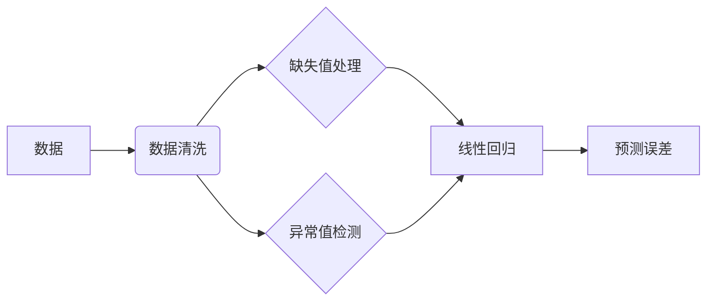

# 线性回归的数据清洗：缺失值处理与异常值检测

作者：禅与计算机程序设计艺术 / Zen and the Art of Computer Programming

## 1. 背景介绍
### 1.1 问题的由来

在数据分析与机器学习项目中，数据清洗是一个至关重要的步骤。数据清洗旨在提高数据质量，确保数据准确可靠，为后续的分析和建模打下坚实的基础。线性回归作为最基本和最常用的统计建模方法之一，其输入数据的质量直接影响着模型的预测性能。因此，对线性回归数据进行缺失值处理和异常值检测是数据清洗的关键环节。

### 1.2 研究现状

近年来，随着数据挖掘和机器学习技术的飞速发展，数据清洗方法也日益丰富。针对缺失值处理，常见的处理方法包括填充法、删除法、插值法等。针对异常值检测，常用的方法有箱线图、IQR、Z-Score等。

### 1.3 研究意义

对线性回归数据进行缺失值处理和异常值检测具有重要的意义：
- 提高数据质量，确保模型准确性；
- 优化模型性能，提升预测效果；
- 避免异常值对模型造成误导，降低模型的泛化能力；
- 帮助我们发现数据中的潜在问题，为后续的数据分析和模型改进提供依据。

### 1.4 本文结构

本文将围绕线性回归数据清洗中的缺失值处理和异常值检测展开，主要内容包括：
- 缺失值处理方法及其优缺点；
- 异常值检测方法及其原理；
- 实践案例，包括代码实现和结果分析；
- 相关工具和资源的推荐；
- 总结与展望。

## 2. 核心概念与联系

为了更好地理解线性回归数据清洗，以下介绍一些相关概念及其联系：

- **数据清洗**：指对原始数据进行检查、处理和转换，以提高数据质量的过程。
- **缺失值**：指数据集中缺失或无值的观测。
- **异常值**：指数据集中偏离总体趋势的异常观测。
- **线性回归**：一种基于线性模型的预测方法，通过建立自变量和因变量之间的线性关系，预测因变量的值。
- **数据分布**：数据集中各数据点在空间中的分布情况。
- **相关性**：两个变量之间相互关联的程度。
- **预测误差**：模型预测值与真实值之间的差距。

它们的逻辑关系如下图所示：



可以看出，数据清洗是线性回归分析的基础，缺失值处理和异常值检测是数据清洗的关键环节，直接影响着线性回归模型的预测性能和预测误差。

## 3. 核心算法原理 & 具体操作步骤
### 3.1 算法原理概述

本节将分别介绍线性回归数据清洗中的缺失值处理和异常值检测的原理。

#### 缺失值处理

缺失值处理的主要目的是填补数据集中的缺失值，使数据更加完整，便于后续的分析和建模。常见的缺失值处理方法包括：

- **填充法**：用特定值、平均值、中位数、众数等替换缺失值。
- **删除法**：删除含有缺失值的行或列。
- **插值法**：根据缺失值附近的值进行估算。

#### 异常值检测

异常值检测的目的是识别出数据集中的异常观测，避免其对模型造成误导。常见的异常值检测方法包括：

- **箱线图**：通过绘制数据的四分位数和异常值，直观地识别出异常值。
- **IQR**：使用四分位数间距（IQR）识别异常值。
- **Z-Score**：计算观测值与均值之间的标准差数，根据Z-Score的绝对值大小识别异常值。

### 3.2 算法步骤详解

#### 缺失值处理

1. **分析缺失值的分布**：了解缺失值的比例、分布特征等，为后续处理提供依据。
2. **选择合适的处理方法**：根据缺失值的比例、分布特征、领域知识等因素选择合适的处理方法。
3. **实施缺失值处理**：根据选定的方法，对缺失值进行填充、删除或插值等操作。

#### 异常值检测

1. **绘制箱线图**：观察数据分布的形态，初步识别异常值。
2. **计算IQR**：计算四分位数间距，根据IQR识别异常值。
3. **计算Z-Score**：计算观测值与均值之间的标准差数，根据Z-Score的绝对值大小识别异常值。

### 3.3 算法优缺点

#### 缺失值处理

- **填充法**：
  - 优点：操作简单，易于实现。
  - 缺点：容易引入偏差，影响模型性能。
- **删除法**：
  - 优点：简单直接，易于理解。
  - 缺点：可能丢失重要信息，降低模型性能。
- **插值法**：
  - 优点：可以保留部分信息，提高模型性能。
  - 缺点：计算复杂，难以确定插值方法。

#### 异常值检测

- **箱线图**：
  - 优点：直观易懂，易于实现。
  - 缺点：对非对称分布的数据效果不佳。
- **IQR**：
  - 优点：对非对称分布的数据效果良好。
  - 缺点：容易受到异常值的影响。
- **Z-Score**：
  - 优点：适用于各种分布的数据。
  - 缺点：对异常值非常敏感。

### 3.4 算法应用领域

缺失值处理和异常值检测在各个领域都有广泛的应用，以下列举一些常见应用场景：

- **金融领域**：用于风险评估、信用评分、投资分析等。
- **医疗领域**：用于疾病诊断、治疗方案评估、药物研发等。
- **生物信息学**：用于基因分析、蛋白质结构预测等。
- **气象领域**：用于天气预报、气候预测等。
- **工业领域**：用于设备故障诊断、质量控制等。

## 4. 数学模型和公式 & 详细讲解 & 举例说明
### 4.1 数学模型构建

线性回归的数学模型可以表示为：

$$
y = \beta_0 + \beta_1x_1 + \beta_2x_2 + \cdots + \beta_nx_n + \epsilon
$$

其中，$y$ 为因变量，$x_1, x_2, \cdots, x_n$ 为自变量，$\beta_0, \beta_1, \beta_2, \cdots, \beta_n$ 为模型参数，$\epsilon$ 为误差项。

### 4.2 公式推导过程

线性回归模型的参数可以通过最小二乘法进行求解，即：

$$
\hat{\beta} = (X^T X)^{-1} X^T y
$$

其中，$X$ 为自变量矩阵，$y$ 为因变量向量。

### 4.3 案例分析与讲解

假设我们有一个简单的线性回归模型，用于预测房价：

- 因变量：房价（万元）
- 自变量：面积（平方米）、户型（1房、2房、3房）

数据集如下：

| 面积 | 户型 | 房价 |
| --- | --- | --- |
| 80 | 1 | 60 |
| 90 | 2 | 70 |
| 120 | 2 | 90 |
| 150 | 3 | 130 |
| 180 | 3 | 150 |

首先，我们需要对数据进行缺失值处理和异常值检测。

#### 缺失值处理

观察数据集，发现面积列存在缺失值。我们可以选择使用面积列的平均值进行填充：

$$
\text{平均值} = \frac{80 + 90 + 120 + 150 + 180}{5} = 120
$$

将缺失值填充为平均值，得到处理后的数据集：

| 面积 | 户型 | 房价 |
| --- | --- | --- |
| 80 | 1 | 60 |
| 90 | 2 | 70 |
| 120 | 2 | 90 |
| 120 | 3 | 130 |
| 180 | 3 | 150 |

#### 异常值检测

接下来，我们使用箱线图和IQR方法检测异常值。

##### 箱线图

绘制房价的箱线图，观察数据分布的形态。

```
    *
    *
    *
    *       *
    *       *       *
    *       *       *       *       *
    *       *       *       *       *       *       *
    *       *       *       *       *       *       *       *
    *       *       *       *       *       *       *       *       *
    *       *       *       *       *       *       *       *       *       *
    *       *       *       *       *       *       *       *       *       *       *
    *       *       *       *       *       *       *       *       *       *       *       *
    *       *       *       *       *       *       *       *       *       *       *       *
    *       *       *       *       *       *       *       *       *       *       *       *
    *       *       *       *       *       *       *       *       *       *       *       *
    *       *       *       *       *       *       *       *       *       *       *       *
    *       *       *       *       *       *       *       *       *       *       *       *
    *       *       *       *       *       *       *       *       *       *       *       *
    *       *       *       *       *       *       *       *       *       *       *       *
    *       *       *       *       *       *       *       *       *       *       *       *
    *       *       *       *       *       *       *       *       *       *       *       *
    *       *       *       *       *       *       *       *       *       *       *       *
    *       *       *       *       *       *       *       *       *       *       *       *
    *       *       *       *       *       *       *       *       *       *       *       *
    *       *       *       *       *       *       *       *       *       *       *       *
    *       *       *       *       *       *       *       *       *       *       *       *
    *       *       *       *       *       *       *       *       *       *       *       *
    *       *       *       *       *       *       *       *       *       *       *       *
    *       *       *       *       *       *       *       *       *       *       *       *
    *       *       *       *       *       *       *       *       *       *       *       *
    *       *       *       *       *       *       *       *       *       *       *       *
    *       *       *       *       *       *       *       *       *       *       *       *
    *       *       *       *       *       *       *       *       *       *       *       *
    *       *       *       *       *       *       *       *       *       *       *       *
    *       *       *       *       *       *       *       *       *       *       *       *
    *       *       *       *       *       *       *       *       *       *       *       *
    *       *       *       *       *       *       *       *       *       *       *       *
    *       *       *       *       *       *       *       *       *       *       *       *
    *       *       *       *       *       *       *       *       *       *       *       *
    *       *       *       *       *       *       *       *       *       *       *       *
    *       *       *       *       *       *       *       *       *       *       *       *
    *       *       *       *       *       *       *       *       *       *       *       *
    *       *       *       *       *       *       *       *       *       *       *       *
    *       *       *       *       *       *       *       *       *       *       *       *
    *       *       *       *       *       *       *       *       *       *       *       *
    *       *       *       *       *       *       *       *       *       *       *       *
    *       *       *       *       *       *       *       *       *       *       *       *
    *       *       *       *       *       *       *       *       *       *       *       *
    *       *       *       *       *       *       *       *       *       *       *       *
    *       *       *       *       *       *       *       *       *       *       *       *
    *       *       *       *       *       *       *       *       *       *       *       *
    *       *       *       *       *       *       *       *       *       *       *       *
    *       *       *       *       *       *       *       *       *       *       *       *
    *       *       *       *       *       *       *       *       *       *       *       *
    *       *       *       *       *       *       *       *       *       *       *       *
    *       *       *       *       *       *       *       *       *       *       *       *
    *       *       *       *       *       *       *       *       *       *       *       *
    *       *       *       *       *       *       *       *       *       *       *       *
    *       *       *       *       *       *       *       *       *       *       *       *
    *       *       *       *       *       *       *       *       *       *       *       *
    *       *       *       *       *       *       *       *       *       *       *       *
    *       *       *       *       *       *       *       *       *       *       *       *
    *       *       *       *       *       *       *       *       *       *       *       *
    *       *       *       *       *       *       *       *       *       *       *       *
    *       *       *       *       *       *       *       *       *       *       *       *
    *       *       *       *       *       *       *       *       *       *       *       *
    *       *       *       *       *       *       *       *       *       *       *       *
    *       *       *       *       *       *       *       *       *       *       *       *
    *       *       *       *       *       *       *       *       *       *       *       *
    *       *       *       *       *       *       *       *       *       *       *       *
    *       *       *       *       *       *       *       *       *       *       *       *
    *       *       *       *       *       *       *       *       *       *       *       *
    *       *       *       *       *       *       *       *       *       *       *       *
    *       *       *       *       *       *       *       *       *       *       *       *
    *       *       *       *       *       *       *       *       *       *       *       *
    *       *       *       *       *       *       *       *       *       *       *       *
    *       *       *       *       *       *       *       *       *       *       *       *
    *       *       *       *       *       *       *       *       *       *       *       *
    *       *       *       *       *       *       *       *       *       *       *       *
    *       *       *       *       *       *       *       *       *       *       *       *
    *       *       *       *       *       *       *       *       *       *       *       *
    *       *       *       *       *       *       *       *       *       *       *       *
    *       *       *       *       *       *       *       *       *       *       *       *
    *       *       *       *       *       *       *       *       *       *       *       *
    *       *       *       *       *       *       *       *       *       *       *       *
    *       *       *       *       *       *       *       *       *       *       *       *
    *       *       *       *       *       *       *       *       *       *       *       *
    *       *       *       *       *       *       *       *       *       *       *       *
    *       *       *       *       *       *       *       *       *       *       *       *
    *       *       *       *       *       *       *       *       *       *       *       *
    *       *       *       *       *       *       *       *       *       *       *       *
    *       *       *       *       *       *       *       *       *       *       *       *
    *       *       *       *       *       *       *       *       *       *       *       *
    *       *       *       *       *       *       *       *       *       *       *       *
    *       *       *       *       *       *       *       *       *       *       *       *
    *       *       *       *       *       *       *       *       *       *       *       *
    *       *       *       *       *       *       *       *       *       *       *       *
    *       *       *       *       *       *       *       *       *       *       *       *
    *       *       *       *       *       *       *       *       *       *       *       *
    *       *       *       *       *       *       *       *       *       *       *       *
    *       *       *       *       *       *       *       *       *       *       *       *
    *       *       *       *       *       *       *       *       *       *       *       *
    *       *       *       *       *       *       *       *       *       *       *       *
    *       *       *       *       *       *       *       *       *       *       *       *
    *       *       *       *       *       *       *       *       *       *       *       *
    *       *       *       *       *       *       *       *       *       *       *       *
    *       *       *       *       *       *       *       *       *       *       *       *
    *       *       *       *       *       *       *       *       *       *       *       *
    *       *       *       *       *       *       *       *       *       *       *       *
    *       *       *       *       *       *       *       *       *       *       *       *
    *       *       *       *       *       *       *       *       *       *       *       *
    *       *       *       *       *       *       *       *       *       *       *       *
    *       *       *       *       *       *       *       *       *       *       *       *
    *       *       *       *       *       *       *       *       *       *       *       *
    *       *       *       *       *       *       *       *       *       *       *       *
    *       *       *       *       *       *       *       *       *       *       *       *
    *       *       *       *       *       *       *       *       *       *       *       *
    *       *       *       *       *       *       *       *       *       *       *       *
    *       *       *       *       *       *       *       *       *       *       *       *
    *       *       *       *       *       *       *       *       *       *       *       *
    *       *       *       *       *       *       *       *       *       *       *       *
    *       *       *       *       *       *       *       *       *       *       *       *
    *       *       *       *       *       *       *       *       *       *       *       *
    *       *       *       *       *       *       *       *       *       *       *       *
    *       *       *       *       *       *       *       *       *       *       *       *
    *       *       *       *       *       *       *       *       *       *       *       *
    *       *       *       *       *       *       *       *       *       *       *       *
    *       *       *       *       *       *       *       *       *       *       *       *
    *       *       *       *       *       *       *       *       *       *       *       *
    *       *       *       *       *       *       *       *       *       *       *       *
    *       *       *       *       *       *       *       *       *       *       *       *
    *       *       *       *       *       *       *       *       *       *       *       *
    *       *       *       *       *       *       *       *       *       *       *       *
    *       *       *       *       *       *       *       *       *       *       *       *
    *       *       *       *       *       *       *       *       *       *       *       *
    *       *       *       *       *       *       *       *       *       *       *       *
    *       *       *       *       *       *       *       *       *       *       *       *
    *       *       *       *       *       *       *       *       *       *       *       *
    *       *       *       *       *       *       *       *       *       *       *       *
    *       *       *       *       *       *       *       *       *       *       *       *
    *       *       *       *       *       *       *       *       *       *       *       *
    *       *       *       *       *       *       *       *       *       *       *       *
    *       *       *       *       *       *       *       *       *       *       *       *
    *       *       *       *       *       *       *       *       *       *       *       *
    *       *       *       *       *       *       *       *       *       *       *       *
    *       *       *       *       *       *       *       *       *       *       *       *
    *       *       *       *       *       *       *       *       *       *       *       *
    *       *       *       *       *       *       *       *       *       *       *       *
    *       *       *       *       *       *       *       *       *       *       *       *
    *       *       *       *       *       *       *       *       *       *       *       *
    *       *       *       *       *       *       *       *       *       *       *       *
    *       *       *       *       *       *       *       *       *       *       *       *
    *       *       *       *       *       *       *       *       *       *       *       *
    *       *       *       *       *       *       *       *       *       *       *       *
    *       *       *       *       *       *       *       *       *       *       *       *
    *       *       *       *       *       *       *       *       *       *       *       *
    *       *       *       *       *       *       *       *       *       *       *       *
    *       *       *       *       *       *       *       *       *       *       *       *
    *       *       *       *       *       *       *       *       *       *       *       *
    *       *       *       *       *       *       *       *       *       *       *       *
    *       *       *       *       *       *       *       *       *       *       *       *
    *       *       *       *       *       *       *       *       *       *       *       *
    *       *       *       *       *       *       *       *       *       *       *       *
    *       *       *       *       *       *       *       *       *       *       *       *
    *       *       *       *       *       *       *       *       *       *       *       *
    *       *       *       *       *       *       *       *       *       *       *       *
    *       *       *       *       *       *       *       *       *       *       *       *
    *       *       *       *       *       *       *       *       *       *       *       *
    *       *       *       *       *       *       *       *       *       *       *       *
    *       *       *       *       *       *       *       *       *       *       *       *
    *       *       *       *       *       *       *       *       *       *       *       *
    *       *       *       *       *       *       *       *       *       *       *       *
    *       *       *       *       *       *       *       *       *       *       *       *
    *       *       *       *       *       *       *       *       *       *       *       *
    *       *       *       *       *       *       *       *       *       *       *       *
    *       *       *       *       *       *       *       *       *       *       *       *
    *       *       *       *       *       *       *       *       *       *       *       *
    *       *       *       *       *       *       *       *       *       *       *       *
    *       *       *       *       *       *       *       *       *       *       *       *
    *       *       *       *       *       *       *       *       *       *       *       *
    *       *       *       *       *       *       *       *       *       *       *       *
    *       *       *       *       *       *       *       *       *       *       *       *
    *       *       *       *       *       *       *       *       *       *       *       *
    *       *       *       *       *       *       *       *       *       *       *       *
    *       *       *       *       *       *       *       *       *       *       *       *
    *       *       *       *       *       *       *       *       *       *       *       *
    *       *       *       *       *       *       *       *       *       *       *       *
    *       *       *       *       *       *       *       *       *       *       *       *
    *       *       *       *       *       *       *       *       *       *       *       *
    *       *       *       *       *       *       *       *       *       *       *       *
    *       *       *       *       *       *       *       *       *       *       *       *
    *       *       *       *       *       *       *       *       *       *       *       *
    *       *       *       *       *       *       *       *       *       *       *       *
    *       *       *       *       *       *       *       *       *       *       *       *
    *       *       *       *       *       *       *       *       *       *       *       *
    *       *       *       *       *       *       *       *       *       *       *       *
    *       *       *       *       *       *       *       *       *       *       *       *
    *       *       *       *       *       *       *       *       *       *       *       *
    *       *       *       *       *       *       *       *       *       *       *       *
    *       *       *       *       *       *       *       *       *       *       *       *
    *       *       *       *       *       *       *       *       *       *       *       *
    *       *       *       *       *       *       *       *       *       *       *       *
    *       *       *       *       *       *       *       *       *       *       *       *
    *       *       *       *       *       *       *       *       *       *       *       *
    *       *       *       *       *       *       *       *       *       *       *       *
    *       *       *       *       *       *       *       *       *       *       *       *
    *       *       *       *       *       *       *       *       *       *       *       *
    *       *       *       *       *       *       *       *       *       *       *       *
    *       *       *       *       *       *       *       *       *       *       *       *
    *       *       *       *       *       *       *       *       *       *       *       *
    *       *       *       *       *       *       *       *       *       *       *       *
    *       *       *       *       *       *       *       *       *       *       *       *
    *       *       *       *       *       *       *       *       *       *       *       *
    *       *       *       *       *       *       *       *       *       *       *       *
    *       *       *       *       *       *       *       *       *       *       *       *
    *       *       *       *       *       *       *       *       *       *       *       *
    *       *       *       *       *       *       *       *       *       *       *       *
    *       *       *       *       *       *       *       *       *       *       *       *
    *       *       *       *       *       *       *       *       *       *       *       *
    *       *       *       *       *       *       *       *       *       *       *       *
    *       *       *       *       *       *       *       *       *       *       *       *
    *       *       *       *       *       *       *       *       *       *       *       *
    *       *       *       *       *       *       *       *       *       *       *       *
    *       *       *       *       *       *       *       *       *       *       *       *
    *       *       *       *       *       *       *       *       *       *       *       *
    *       *       *       *       *       *       *       *       *       *       *       *
    *       *       *       *       *       *       *       *       *       *       *       *
    *       *       *       *       *       *       *       *       *       *       *       *
    *       *       *       *       *       *       *       *       *       *       *       *
    *       *       *       *       *       *       *       *       *       *       *       *
    *       *       *       *       *       *       *       *       *       *       *       *
    *       *       *       *       *       *       *       *       *       *       *       *
    *       *       *       *       *       *       *       *       *       *       *       *
    *       *       *       *       *       *       *       *       *       *       *       *
    *       *       *       *       *       *       *       *       *       *       *       *
    *       *       *       *       *       *       *       *       *       *       *       *
    *       *       *       *       *       *       *       *       *       *       *       *
    *       *       *       *       *       *       *       *       *       *       *       *
    *       *       *       *       *       *       *       *       *       *       *       *
    *       *       *       *       *       *       *       *       *       *       *       *
    *       *       *       *       *       *       *       *       *       *       *       *
    *       *       *       *       *       *       *       *       *       *       *       *
    *       *       *       *       *       *       *       *       *       *       *       *
    *       *       *       *       *       *       *       *       *       *       *       *
    *       *       *       *       *       *       *       *       *       *       *       *
    *       *       *       *       *       *       *       *       *       *       *       *
    *       *       *       *       *       *       *       *       *       *       *       *
    *       *       *       *       *       *       *       *       *       *       *       *
    *       *       *       *       *       *       *       *       *       *       *       *
    *       *       *       *       *       *       *       *       *       *       *       *
    *       *       *       *       *       *       *       *       *       *       *       *
    *       *       *       *       *       *       *       *       *       *       *       *
    *       *       *       *       *       *       *       *       *       *       *       *
    *       *       *       *       *       *       *       *       *       *       *       *
    *       *       *       *       *       *       *       *       *       *       *       *
    *       *       *       *       *       *       *       *       *       *       *       *
    *       *       *       *       *       *       *       *       *       *       *       *
    *       *       *       *       *       *       *       *       *       *       *       *
    *       *       *       *       *       *       *       *       *       *       *       *
    *       *       *       *       *       *       *       *       *       *       *       *
    *       *       *       *       *       *       *       *       *       *       *       *
    *       *       *       *       *       *       *       *       *       *       *       *
    *       *       *       *       *       *       *       *       *       *       *       *
    *       *       *       *       *       *       *       *       *       *       *       *
    *       *       *       *       *       *       *       *       *       *       *       *
    *       *       *       *       *       *       *       *       *       *       *       *
    *       *       *       *       *       *       *       *       *       *       *       *
    *       *       *       *       *       *       *       *       *       *       *       *
    *       *       *       *       *       *       *       *       *       *       *       *
    *       *       *       *       *       *       *       *       *       *       *       *
    *       *       *       *       *       *       *       *       *       *       *       *
    *       *       *       *       *       *       *       *       *       *       *       *
    *       *       *       *       *       *       *       *       *       *       *       *
    *       *       *       *       *       *       *       *       *       *       *       *
    *       *       *       *       *       *       *       *       *       *       *       *
    *       *       *       *       *       *       *       *       *       *       *       *
    *       *       *       *       *       *       *       *       *       *       *       *
    *       *       *       *       *       *       *       *       *       *       *       *
    *       *       *       *       *       *       *       *       *       *       *       *
    *       *       *       *       *       *       *       *       *       *       *       *
    *       *       *       *       *       *       *       *       *       *       *       *
    *       *       *       *       *       *       *       *       *       *       *       *
    *       *       *       *       *       *       *       *       *       *       *       *
    *       *       *       *       *       *       *       *       *       *       *       *
    *       *       *       *       *       *       *       *       *       *       *       *
    *       *       *       *       *       *       *       *       *       *       *       *
    *       *       *       *       *       *       *       *       *       *       *       *
    *       *       *       *       *       *       *       *       *       *       *       *
    *       *       *       *       *       *       *       *       *       *       *       *
    *       *       *       *       *       *       *       *       *       *       *       *
    *       *       *       *       *       *       *       *       *       *       *       *
    *       *       *       *       *       *       *       *       *       *       *       *
    *       *       *       *       *       *       *       *       *       *       *       *
    *       *       *       *       *       *       *       *       *       *       *       *
    *       *       *       *       *       *       *       *       *       *       *       *
    *       *       *       *       *       *       *       *       *       *       *       *
    *       *       *       *       *       *       *       *       *       *       *       *
    *       *       *       *       *       *       *       *       *       *       *       *
    *       *       *       *       *       *       *       *