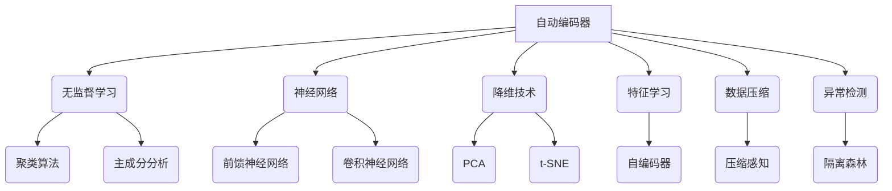

好的,我会严格遵守您提出的约束条件,以专业的技术语言写一篇关于自动编码器的深入博客文章。下面是正文内容:

# 自动编码器 (Autoencoder) 原理与代码实例讲解

## 1. 背景介绍

### 1.1 问题的由来

在机器学习和数据处理领域,通常会遇到高维数据的挑战。高维数据不仅增加了计算复杂度,还容易导致"维数灾难"等问题。为了有效地处理高维数据,需要一种能够学习数据内在低维表示的有效方法,从而降低数据的维度,提高学习的效率。自动编码器(Autoencoder)就是一种用于学习数据低维表示的无监督神经网络模型。

### 1.2 研究现状  

自动编码器最早可以追溯到上世纪80年代,是一种基于神经网络的无监督学习技术。近年来,随着深度学习的兴起,自动编码器得到了广泛的关注和应用。研究人员提出了多种改进的自动编码器变体,如稀疏自动编码器、变分自动编码器等,用于解决不同的问题。自动编码器已经在图像处理、异常检测、数据压缩等多个领域取得了卓越的成果。

### 1.3 研究意义

自动编码器具有以下重要意义:

1. **数据降维**: 自动编码器能够学习数据的紧凑低维表示,从而降低数据维度,简化后续的机器学习任务。
2. **特征学习**: 自动编码器可以自动从数据中学习出有意义的特征表示,而不需要人工设计特征。
3. **数据压缩**: 自动编码器可以将高维数据压缩成低维码,实现有损数据压缩。
4. **异常检测**: 通过重构误差,自动编码器能够检测出异常数据样本。

### 1.4 本文结构

本文将全面介绍自动编码器的原理、算法细节、数学模型以及实现代码。具体内容安排如下:

- 第2部分阐述自动编码器的核心概念及其与其他模型的联系。
- 第3部分详细解释自动编码器的算法原理和具体操作步骤。
- 第4部分推导自动编码器的数学模型,并举例说明。
- 第5部分提供自动编码器的代码实现,并逐步解释关键部分。
- 第6部分介绍自动编码器在实际应用中的场景。
- 第7部分推荐相关的学习资源、工具和论文。
- 第8部分总结自动编码器的发展趋势和面临的挑战。
- 第9部分列出常见问题及解答。

## 2. 核心概念与联系

自动编码器(Autoencoder)是一种无监督学习的神经网络模型,常用于降维、特征学习、数据压缩和异常检测等任务。它的核心思想是将输入数据先编码(Encoding)为低维表示,再将低维表示解码(Decoding)还原为原始数据。通过最小化输入数据与重构数据之间的差异,自动编码器能够学习到数据的紧凑表示。

自动编码器与其他一些技术存在密切联系:

- **无监督学习**: 自动编码器属于无监督学习范畴,与聚类算法、主成分分析等技术有一定关联。
- **神经网络**: 自动编码器本质上是一种特殊的前馈神经网络,也可以与卷积神经网络等结合使用。
- **降维技术**: 自动编码器能够将高维数据映射到低维空间,与PCA、t-SNE等经典降维方法有相似之处。
- **特征学习**: 自动编码器的编码器部分能够自动学习数据的特征表示,与自编码器等特征学习模型有关联。
- **数据压缩**: 自动编码器的编码过程实现了有损数据压缩,与压缩感知等压缩技术有一定联系。
- **异常检测**: 自动编码器可以利用重构误差检测异常数据,与隔离森林等异常检测算法有相似之处。

## 3. 核心算法原理与具体操作步骤

### 3.1 算法原理概述

自动编码器的基本原理是将输入数据先编码为低维表示,再将低维表示解码还原为原始数据。编码器(Encoder)将高维输入$\boldsymbol{x}$映射为低维码$\boldsymbol{z}$,解码器(Decoder)则将$\boldsymbol{z}$还原为与$\boldsymbol{x}$尽可能接近的输出$\boldsymbol{\hat{x}}$。编码器和解码器都是由神经网络实现的函数映射。

自动编码器的训练目标是最小化输入数据$\boldsymbol{x}$与重构数据$\boldsymbol{\hat{x}}$之间的重构误差,从而学习到能够很好地表示输入数据的低维码$\boldsymbol{z}$。常用的重构误差度量包括均方误差、交叉熵等。通过反向传播算法优化编码器和解码器的参数,自动编码器就能够逐步学习到输入数据的紧凑表示。

### 3.2 算法步骤详解  

自动编码器的训练过程可以概括为以下几个步骤:

1. **输入数据**: 输入一个或一批高维数据样本$\boldsymbol{x}$。
2. **编码(Encoding)**: 将输入$\boldsymbol{x}$通过编码器网络映射为低维码$\boldsymbol{z}$,即$\boldsymbol{z}=f(\boldsymbol{x};\boldsymbol{\theta}_e)$,其中$f$是编码器网络,由参数$\boldsymbol{\theta}_e$确定。
3. **解码(Decoding)**: 将低维码$\boldsymbol{z}$通过解码器网络映射为重构数据$\boldsymbol{\hat{x}}$,即$\boldsymbol{\hat{x}}=g(\boldsymbol{z};\boldsymbol{\theta}_d)$,其中$g$是解码器网络,由参数$\boldsymbol{\theta}_d$确定。
4. **计算重构误差**: 计算输入数据$\boldsymbol{x}$与重构数据$\boldsymbol{\hat{x}}$之间的重构误差$L(\boldsymbol{x},\boldsymbol{\hat{x}})$,常用的误差度量包括均方误差$\|\boldsymbol{x}-\boldsymbol{\hat{x}}\|_2^2$和交叉熵损失等。
5. **反向传播**: 通过反向传播算法计算编码器参数$\boldsymbol{\theta}_e$和解码器参数$\boldsymbol{\theta}_d$相对于重构误差的梯度。
6. **参数更新**: 根据梯度下降法则,更新编码器和解码器的参数,使得重构误差最小化。
7. **重复训练**: 重复上述步骤,对新的数据批次进行训练,直至模型收敛或达到指定的训练轮次。

通过上述过程,自动编码器能够逐步学习到能够很好地表示输入数据的低维码$\boldsymbol{z}$,从而实现数据降维、特征学习等目标。

### 3.3 算法优缺点

**优点**:

1. **无监督学习**: 自动编码器属于无监督学习,不需要大量标注数据,可以从原始数据中自动学习有用的特征表示。
2. **降维能力**: 自动编码器能够将高维数据映射到低维空间,从而降低数据维度,简化后续的机器学习任务。
3. **数据压缩**: 自动编码器的编码过程实现了有损数据压缩,可用于数据压缩和传输。
4. **异常检测**: 利用重构误差,自动编码器能够检测出异常数据样本。
5. **可解释性**: 通过可视化编码器学习到的特征,可以一定程度上解释自动编码器的内部工作机制。

**缺点**:

1. **缺乏理论保证**: 自动编码器的训练过程缺乏理论上的收敛性保证,需要仔细调参以获得良好的表现。
2. **容易过拟合**: 由于自动编码器的高度非线性,如果模型过于复杂或训练不当,很容易出现过拟合现象。
3. **训练耗时**: 自动编码器通常需要大量数据和较长时间的训练,才能获得理想的结果。
4. **超参数选择**: 自动编码器涉及诸多超参数,如网络层数、节点数、正则化强度等,需要反复试验以确定最佳配置。

### 3.4 算法应用领域

自动编码器由于其强大的特征学习和降维能力,在多个领域都有广泛的应用:

- **图像处理**: 自动编码器可用于图像去噪、超分辨率重构、图像压缩等任务。
- **异常检测**: 利用重构误差,自动编码器能够检测出异常数据样本,可应用于故障诊断、欺诈检测等领域。
- **推荐系统**: 自动编码器可以学习用户和物品的低维表示,用于个性化推荐。
- **自然语言处理**: 自动编码器可用于文本主题建模、词嵌入、机器翻译等任务。
- **语音处理**: 自动编码器常用于语音信号的降噪、编码和合成等任务。
- **生成模型**: 变分自动编码器等变体可用于生成新的数据样本。

## 4. 数学模型和公式详细讲解与举例说明

在这一部分,我们将推导自动编码器的数学模型,并通过具体案例加以说明。

### 4.1 数学模型构建

假设我们有一个包含$N$个样本的数据集$\mathcal{D}=\{\boldsymbol{x}^{(1)},\boldsymbol{x}^{(2)},\cdots,\boldsymbol{x}^{(N)}\}$,其中每个样本$\boldsymbol{x}^{(i)}\in\mathbb{R}^{d}$是一个$d$维向量。我们的目标是学习一个能够很好地表示这些高维数据的低维码。

自动编码器由两部分组成:编码器(Encoder)和解码器(Decoder)。编码器将高维输入$\boldsymbol{x}$映射为低维码$\boldsymbol{z}$,解码器则将$\boldsymbol{z}$还原为与$\boldsymbol{x}$尽可能接近的输出$\boldsymbol{\hat{x}}$。

$$\begin{aligned}
\boldsymbol{z}&=f_{\boldsymbol{\theta}_e}(\boldsymbol{x})=s_e(\boldsymbol{W}_e\boldsymbol{x}+\boldsymbol{b}_e)\\
\boldsymbol{\hat{x}}&=g_{\boldsymbol{\theta}_d}(\boldsymbol{z})=s_d(\boldsymbol{W}_d\boldsymbol{z}+\boldsymbol{b}_d)
\end{aligned}$$

其中:

- $f_{\boldsymbol{\theta}_e}$是编码器网络,由参数$\boldsymbol{\theta}_e=\{\boldsymbol{W}_e,\boldsymbol{b}_e\}$确定,将$\boldsymbol{x}$映射为$\boldsymbol{z}$。
- $g_{\boldsymbol{\theta}_d}$是解码器网络,由参数$\boldsymbol{\theta}_d=\{\boldsymbol{W}_d,\boldsymbol{b}_d\}$确定,将$\boldsymbol{z}$映射为$\boldsymbol{\hat{x}}$。
- $s_e$和$s_d$分别是编码器和解码器的激活函数,通常使用非线性函数如ReLU或Sigmoid。
- $\boldsymbol{W}_e\in\mathbb{R}^{k\times d}$和$\boldsymbol{W}_d\in\mathbb{R}^{d\times k}$分别是编码器和解码器的权重矩阵。
- $\boldsymbol{b}_e\in\mathbb{R}^k$