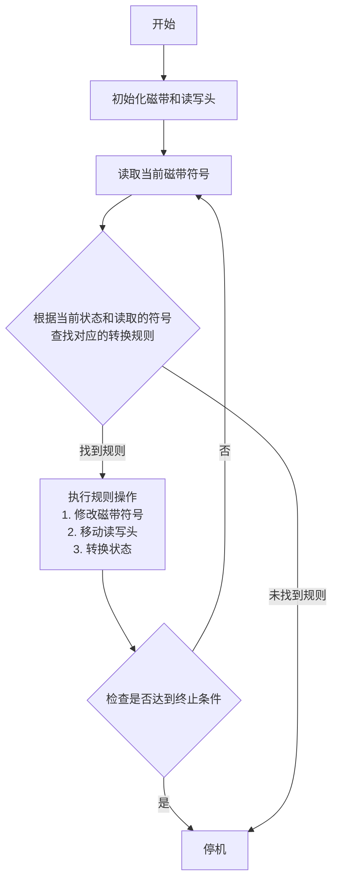

以下是根据您的要求撰写的技术博客文章正文部分：

# 计算：第四部分 计算的极限 第 13 章 自然哲学的计算原理 边界之外

作者：禅与计算机程序设计艺术 / Zen and the Art of Computer Programming

## 1. 背景介绍

### 1.1 问题的由来

在过去的几十年里，计算机科学取得了长足的进步,计算能力不断提高,算法不断优化,应用领域也在不断扩展。然而,随着计算能力的提升,人们也开始思考计算的极限和边界问题。我们是否能计算出一切?是否存在无法被计算的问题?计算是否有其固有的局限性?这些问题引发了人们对计算理论基础的反思和探索。

### 1.2 研究现状

目前,已有一些学者开始尝试从自然哲学的角度来探讨计算的本质和极限。他们试图将计算机科学与物理学、生物学、认知科学等其他自然科学领域相结合,寻求更深层次的理解。例如,一些研究人员探讨了量子计算的可能性,试图突破经典计算的局限;另一些学者则从信息论的角度分析了计算过程中的熵增加问题。

### 1.3 研究意义

探索计算的极限和自然哲学原理,不仅有助于我们更好地理解计算的本质,还可能为未来计算技术的发展指明方向。通过跨学科的研究,我们或许能发现全新的计算范式,突破当前的局限,开辟计算能力的新天地。

### 1.4 本文结构

本文将从自然哲学的视角出发,探讨计算的极限和边界问题。我们将首先介绍相关的核心概念,然后深入分析计算的数学模型和算法原理,并结合实际应用场景进行讨论。最后,我们将总结未来的发展趋势和面临的挑战。

## 2. 核心概念与联系

计算的极限和自然哲学原理涉及多个关键概念,包括:

1. **计算复杂性理论**: 研究问题的计算难度,分析算法的时间和空间复杂度,探讨可计算性和不可计算性问题。

2. **信息论**: 研究信息的测量、编码和传输,探讨熵增加定律对计算的影响。

3. **量子计算**: 利用量子力学原理进行计算,可能突破经典计算的局限。

4. **自然计算**: 模拟自然界中的计算过程,如DNA计算、细胞自动机等。

5. **计算物理学**: 将物理定律应用于计算过程,探索计算的物理极限。

6. **计算哲学**: 从哲学的角度思考计算的本质,探讨意识、自由意志等问题。

这些概念相互关联,共同构成了自然哲学视角下计算原理的理论基础。

## 3. 核心算法原理 & 具体操作步骤

### 3.1 算法原理概述

探索计算的极限和自然哲学原理,需要深入理解一些核心算法的工作原理。以下是几个关键算法:

1. **图灵机**: 图灵机是一种抽象计算模型,用于研究计算的极限和可计算性问题。它由一个无限长的磁带和一个读写头组成,可以模拟任何算法的执行过程。

2. **量子算法**: 量子算法利用量子力学原理进行计算,如量子傅里叶变换、量子相位估计等,可能实现比经典算法更快的计算速度。

3. **自然计算算法**: 模拟自然界中的计算过程,如DNA计算、细胞自动机、神经网络等,具有并行性、鲁棒性等特点。

4. **熵编码算法**: 基于信息论原理,通过无损压缩技术减少数据冗余,提高信息传输效率。

5. **计算物理学算法**: 将物理定律应用于计算过程,如格雷沃尔算法(Grover's algorithm)、量子蒙特卡洛算法等,探索计算的物理极限。

这些算法为我们探索计算的极限和自然哲学原理提供了强有力的工具。

### 3.2 算法步骤详解

以图灵机为例,我们来详细解释其工作原理和步骤:

1. **初始化**:准备一个无限长的磁带,磁带上写入输入数据,读写头指向磁带起始位置。
2. **读取**:读写头读取当前位置的磁带符号。
3. **转换规则查找**:根据当前状态和读取的符号,查找对应的转换规则。
4. **执行规则操作**:如果找到规则,执行规则操作,包括修改磁带符号、移动读写头、转换状态。
5. **检查终止条件**:检查是否达到终止条件,如果是,则停机;否则返回步骤2,继续执行。
6. **停机**:如果未找到对应规则或达到终止条件,则停止执行。

通过这一系列步骤,图灵机可以模拟任何算法的执行过程,为研究计算的极限奠定了理论基础。

### 3.3 算法优缺点

不同算法在探索计算极限时具有各自的优缺点:

1. **图灵机**:
   - 优点:简单、通用,可模拟任何算法
   - 缺点:无法解决一些不可计算问题
2. **量子算法**:
   - 优点:利用量子力学原理,可能实现指数级加速
   - 缺点:需要量子硬件支持,实现难度较大
3. **自然计算算法**:
   - 优点:具有并行性、鲁棒性等特点
   - 缺点:计算能力有限,难以解决复杂问题
4. **熵编码算法**:
   - 优点:提高信息传输效率,减少冗余
   - 缺点:只适用于特定场景,无法解决通用计算问题
5. **计算物理学算法**:
   - 优点:探索计算的物理极限,可能发现新的计算范式
   - 缺点:理论复杂,实现困难

因此,在实际应用中需要根据具体问题选择合适的算法,并权衡其优缺点。

### 3.4 算法应用领域

上述算法在多个领域都有广泛应用:

1. **图灵机**: 计算理论、形式语言、自动机等领域。
2. **量子算法**: 量子计算、密码学、模拟等领域。
3. **自然计算算法**: 生物计算、神经网络、模式识别等领域。
4. **熵编码算法**: 数据压缩、信息论、通信等领域。
5. **计算物理学算法**: 量子计算、模拟、优化等领域。

通过在这些领域的应用,我们可以不断推进计算能力的发展,探索计算的极限和自然哲学原理。

## 4. 数学模型和公式 & 详细讲解 & 举例说明

### 4.1 数学模型构建

为了更好地理解和分析计算的极限,我们需要构建合适的数学模型。以下是一些常用的数学模型:

1. **图灵机模型**:
   
   图灵机可以用一个7元组 $(Q, \Gamma, b, \Sigma, \delta, q_0, F)$ 来表示,其中:
   - $Q$ 是有限状态集合
   - $\Gamma$ 是磁带符号集合
   - $b \in \Gamma$ 是空白符号
   - $\Sigma \subseteq \Gamma$ 是输入符号集合
   - $\delta: Q \times \Gamma \rightarrow Q \times \Gamma \times \{L, R\}$ 是转换函数
   - $q_0 \in Q$ 是初始状态
   - $F \subseteq Q$ 是终止状态集合

2. **计算复杂性模型**:
   
   计算复杂性通常用时间复杂度 $T(n)$ 和空间复杂度 $S(n)$ 来衡量,其中 $n$ 是输入规模。常用的复杂度类别包括:
   - $\mathcal{P}$: 可以在多项式时间内解决的问题集合
   - $\mathcal{NP}$: 可以在多项式时间内验证解的问题集合
   - $\mathcal{NP}$-完全: $\mathcal{NP}$ 中最难的问题集合

3. **信息论模型**:
   
   信息论中的熵 $H(X)$ 可以用来衡量信息的不确定性,定义为:
   
   $$H(X) = -\sum_{x \in \mathcal{X}} P(x) \log_2 P(x)$$
   
   其中 $\mathcal{X}$ 是随机变量 $X$ 的取值集合,$ P(x)$ 是 $X=x$ 的概率。

这些数学模型为我们研究计算的极限提供了坚实的理论基础。

### 4.2 公式推导过程

接下来,我们将通过一个具体例子,推导出一个重要的公式,并解释其意义。

**例子**: 设计一个最优前缀编码,使得给定的符号集合 $\{a_1, a_2, \ldots, a_n\}$ 及其对应的概率分布 $\{p_1, p_2, \ldots, p_n\}$,平均编码长度最小。

**推导过程**:

1. 根据信息论原理,符号 $a_i$ 的最优编码长度应该是 $-\log_2 p_i$。
2. 因此,平均编码长度为:
   
   $$L = \sum_{i=1}^n p_i \cdot (-\log_2 p_i)$$
   
3. 利用信息熵的定义,我们可以将上式化简为:
   
   $$L = H(X)$$
   
   其中 $H(X)$ 是随机变量 $X$ 的信息熵。

**结论**:

对于给定的符号集合和概率分布,最优前缀编码的平均编码长度等于信息熵 $H(X)$。这个结论揭示了信息论与编码之间的内在联系,为设计高效编码算法提供了理论指导。

### 4.3 案例分析与讲解

为了更好地理解上述公式和原理,我们来分析一个具体案例。

**案例**:设计一个最优前缀编码,对于符号集合 $\{a, b, c, d\}$,其概率分布为 $\{0.4, 0.3, 0.2, 0.1\}$。

**分析步骤**:

1. 计算信息熵:
   
   $$\begin{aligned}
   H(X) &= -\sum_{x \in \mathcal{X}} P(x) \log_2 P(x) \\
        &= -(0.4 \log_2 0.4 + 0.3 \log_2 0.3 + 0.2 \log_2 0.2 + 0.1 \log_2 0.1) \\
        &\approx 1.846
   \end{aligned}$$
   
2. 根据公式 $L = H(X)$,最优前缀编码的平均编码长度应该是 $1.846$。
3. 我们可以设计一种编码方案,如:
   - $a \rightarrow 0$
   - $b \rightarrow 10$
   - $c \rightarrow 110$
   - $d \rightarrow 111$
4. 验证平均编码长度:
   
   $$\begin{aligned}
   L &= 0.4 \times 1 + 0.3 \times 2 + 0.2 \times 3 + 0.1 \times 3 \\
     &= 1.8
   \end{aligned}$$
   
   这个结果与理论值 $1.846$ 接近,说明我们的编码方案是近似最优的。

通过这个案例,我们可以更好地理解信息熵与编码之间的关系,并学会如何设计高效的编码算法。

### 4.4 常见问题解答

在研究计算的极限和自然哲学原理时,一些常见问题值得探讨:

1. **停机问题是否可计算?**