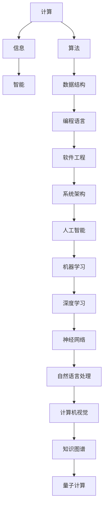
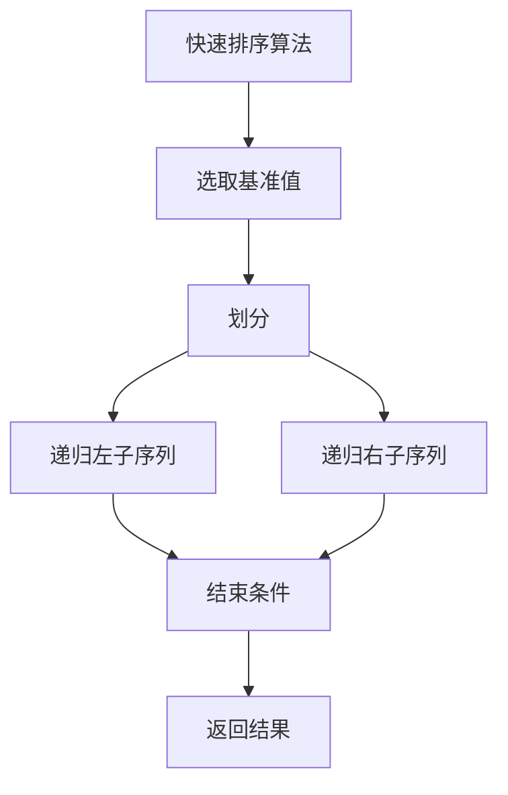

# 计算：附录 A 科研范式进化史纲要

## 1. 背景介绍

### 1.1 问题的由来

在计算机科学和信息技术领域的发展历程中,科研范式的演进一直是推动技术进步的重要驱动力。从最初的机器语言编程时代,到现代高级语言和人工智能的崛起,科研范式的变迁体现了人类对计算理论和实践的不断探索和追求。随着计算能力的指数级增长和新兴技术的涌现,科研范式也在不断地进化和重塑,以适应新的挑战和需求。

### 1.2 研究现状

当前,计算机科学和信息技术正处于一个前所未有的变革时期。人工智能、大数据、云计算、物联网等新兴技术正在重塑着我们对计算的理解和应用。同时,量子计算、脑机接口等前沿领域也为未来的计算范式带来了全新的可能性。在这种背景下,科研范式的演进也呈现出多元化和跨学科的趋势,需要我们从更宏观和系统的角度来审视和思考。

### 1.3 研究意义

探究科研范式的演进历程,不仅有助于我们深入理解计算机科学和信息技术的发展轨迹,还能为我们把握未来的科技发展方向提供重要的启示和借鉴。通过梳理和总结过去的经验教训,我们可以更好地预测和应对未来可能出现的挑战和机遇。同时,这也有助于我们培养创新思维,开拓新的研究视角和方法,推动科技创新和突破。

### 1.4 本文结构

本文将从宏观的角度出发,系统地梳理和总结计算机科学和信息技术领域科研范式的演进历程。我们将分别探讨不同时期的核心概念、算法原理、数学模型、实践应用等方面,并对未来的发展趋势和挑战进行展望和分析。文章的最后,我们还将提供一些有价值的学习资源和工具推荐,以供读者进一步学习和探索。

## 2. 核心概念与联系

计算机科学和信息技术领域的科研范式演进,可以概括为从"计算"到"信息"再到"智能"的发展历程。每一个阶段都有其核心概念和理论基础,这些概念相互关联、相互影响,推动着科研范式的不断演进。

上图展示了计算机科学和信息技术领域核心概念的演进关系。从最初的"计算"概念出发,我们逐步发展出算法、数据结构、编程语言等基础理论和工具。随着软件工程和系统架构的兴起,我们进入了"信息"时代,信息的获取、存储、处理和传递成为了重点关注的领域。

在"信息"时代的基础上,人工智能、机器学习等技术的出现,使我们进入了"智能"时代。深度学习、神经网络等概念和技术,为我们探索智能系统的奥秘提供了强大的工具。同时,自然语言处理、计算机视觉等领域的发展,也使得人机交互变得更加自然和智能化。

当前,知识图谱、量子计算等新兴概念和技术正在为科研范式的未来发展注入新的动力。我们有理由相信,未来的科研范式将会更加融合和跨学科,计算、信息和智能将会相互渗透和促进,推动科技的持续创新和进步。

## 3. 核心算法原理 & 具体操作步骤

### 3.1 算法原理概述

算法是计算机科学和信息技术领域的核心基础。在不同的科研范式中,算法的理论和实践都发挥着关键作用。从最初的排序算法、搜索算法,到现代的机器学习算法、深度学习算法,算法的发展历程反映了科研范式的演进轨迹。

算法的本质是一系列有限的、明确的规则和步骤,用于解决特定的计算问题。一个好的算法应该具备正确性、可读性、健壮性、高效性等特点。算法的设计和优化,需要综合考虑时间复杂度、空间复杂度、数据结构等多个方面的因素。

在不同的科研范式中,算法的作用和应用场景也有所不同。例如,在"计算"时代,算法主要用于解决数值计算、数据处理等基础问题;在"信息"时代,算法则更多地应用于信息检索、数据挖掘等领域;而在当前的"智能"时代,机器学习算法、深度学习算法成为了人工智能系统的核心驱动力。

### 3.2 算法步骤详解

为了更好地理解算法的原理和实现,我们以经典的快速排序算法(Quicksort)为例,详细解释其具体的操作步骤:

1. **选取基准值(Pivot)**:从待排序序列中选取一个元素作为基准值。
2. **划分(Partition)**:重新排列序列,使得所有比基准值小的元素排在基准值的左边,所有比基准值大的元素排在基准值的右边。
3. **递归(Recursion)**:对基准值左边的子序列和右边的子序列递归地重复步骤1和步骤2,直到每个子序列只有一个元素或为空为止。

上图使用 Mermaid 流程图展示了快速排序算法的核心步骤。可以看出,快速排序算法通过递归的方式,将一个大的排序问题不断划分为更小的子问题,最终实现整个序列的排序。

快速排序算法的时间复杂度在平均情况下为 $O(n \log n)$,在最坏情况下(输入序列已经排好序或完全反序)为 $O(n^2)$。但由于其原地(in-place)排序的特性,快速排序算法在实践中表现出色,是许多编程语言标准库中的默认排序算法。

### 3.3 算法优缺点

快速排序算法的优点包括:

- 时间复杂度在平均情况下较优 ($O(n \log n)$)
- 原地排序,空间复杂度为 $O(1)$
- 适用于各种数据类型的排序
- 代码实现简单,容易理解

但快速排序算法也存在一些缺点:

- 在最坏情况下(输入序列已经排好序或完全反序),时间复杂度将退化为 $O(n^2)$
- 对于小规模数据集,快速排序的常数开销可能会使其比简单排序算法(如插入排序)更慢
- 递归调用会导致额外的空间开销(虽然可以通过迭代实现来优化)

### 3.4 算法应用领域

作为一种高效且广泛使用的排序算法,快速排序算法在许多领域都有着重要的应用:

- **操作系统**:在操作系统中,快速排序算法常用于对进程、文件等进行排序和管理。
- **数据库**:在数据库系统中,快速排序算法可用于对查询结果进行排序,提高数据检索效率。
- **计算机图形学**:在计算机图形学中,快速排序算法可用于对顶点坐标、像素值等进行排序,以优化渲染性能。
- **科学计算**:在科学计算领域,快速排序算法可用于对大规模数据进行排序,为后续的数据分析和建模提供支持。

除了排序应用之外,快速排序算法的思想和技术也被广泛应用于其他算法的设计和优化中,如快速选择算法(Quickselect)、快速矩阵乘法算法等。

## 4. 数学模型和公式 & 详细讲解 & 举例说明

### 4.1 数学模型构建

在计算机科学和信息技术领域,数学模型和公式是描述和分析问题的重要工具。不同的科研范式往往需要构建不同的数学模型,以更好地捕捉和表达问题的本质特征。

以机器学习领域为例,我们常常需要构建数学模型来描述输入数据和目标输出之间的映射关系。一种常见的数学模型是线性回归模型,它假设输入特征和目标输出之间存在线性关系,可以用以下公式表示:

$$
y = w_0 + w_1x_1 + w_2x_2 + \cdots + w_nx_n
$$

其中,$ y $表示目标输出,$ x_1, x_2, \cdots, x_n $表示输入特征,$ w_0, w_1, \cdots, w_n $是需要学习的模型参数。

线性回归模型虽然简单,但在许多实际问题中效果并不理想。因此,我们需要构建更加复杂和灵活的非线性模型,如逻辑回归模型、决策树模型、神经网络模型等。这些模型通常需要更复杂的数学表达式和优化算法来进行参数学习和预测。

### 4.2 公式推导过程

在构建数学模型的过程中,我们通常需要进行一系列的数学推导和证明,以保证模型的合理性和有效性。以线性回归模型为例,我们可以使用最小二乘法来学习模型参数,其目标是最小化预测值和真实值之间的平方误差:

$$
\min_{w_0, w_1, \cdots, w_n} \sum_{i=1}^{m} (y_i - (w_0 + w_1x_{i1} + \cdots + w_nx_{in}))^2
$$

通过对上式求导并令导数等于零,我们可以得到一组线性方程组:

$$
\begin{cases}
\sum_{i=1}^{m} (y_i - (w_0 + w_1x_{i1} + \cdots + w_nx_{in})) = 0\\
\sum_{i=1}^{m} x_{i1}(y_i - (w_0 + w_1x_{i1} + \cdots + w_nx_{in})) = 0\\
\vdots\\
\sum_{i=1}^{m} x_{in}(y_i - (w_0 + w_1x_{i1} + \cdots + w_nx_{in})) = 0
\end{cases}
$$

上式可以用矩阵形式表示为:

$$
X^TXw = X^Ty
$$

其中,$ X $是输入特征矩阵,$ y $是目标输出向量,$ w $是需要求解的模型参数向量。通过求解上述方程组,我们就可以得到线性回归模型的最优参数。

### 4.3 案例分析与讲解

为了更好地理解数学模型和公式在实际问题中的应用,我们以房价预测为例进行案例分析和讲解。

假设我们有一个包含多个城市的房价数据集,其中每个样本包含以下特征:

- 房屋面积(平方米)
- 卧室数量
- 浴室数量
- 距市中心距离(公里)

我们的目标是构建一个模型,根据这些特征预测房屋的价格。

首先,我们可以将问题建模为线性回归问题,即假设房价和特征之间存在线性关系:

$$
\text{房价} = w_0 + w_1 \times \text{面积} + w_2 \times \text{卧室数} + w_3 \times \text{浴室数} + w_4 \times \text{距离}
$$

其中,$ w_0, w_1, w_2, w_3, w_4 $是需要学习的模型参数。

接下来,我们可以使用最小二乘法来学习这些参数。假设我们有 $ m $个训练样本,其中第 $ i $个样本的特征向量为 $ (x_{i1}, x_{i2}, x_{i3}, x_{i4}) $,对应的房价为 $ y_i $。我们需要最小