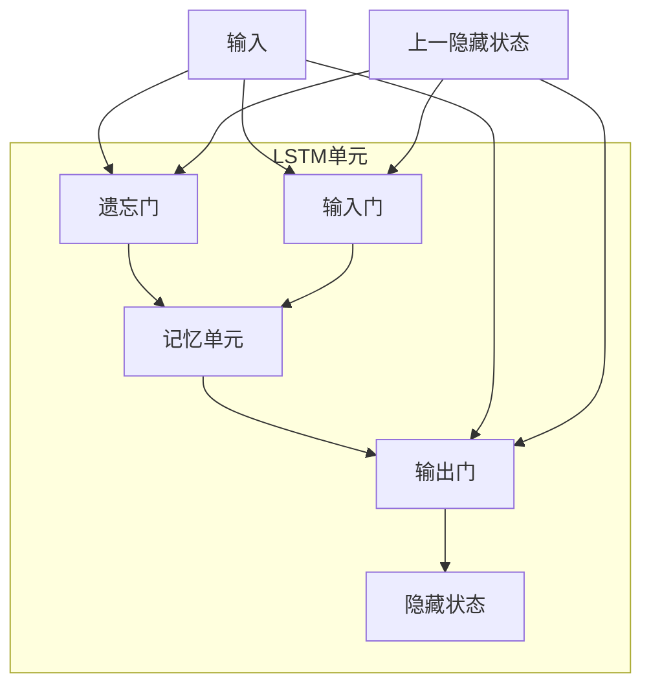

好的,我会严格按照您提供的要求和约束条件,以"长短期记忆网络 (Long Short-Term Memory, LSTM) 原理与代码实例讲解"为主题,撰写一篇专业的技术博客文章。

# 长短期记忆网络 (Long Short-Term Memory, LSTM) 原理与代码实例讲解

## 1. 背景介绍

### 1.1 问题的由来

在传统的神经网络模型中,例如前馈神经网络和卷积神经网络,都存在一个根本性的缺陷——它们无法很好地处理序列数据。这些模型在处理固定长度的向量数据时表现出色,但是对于序列数据(如自然语言、语音和时间序列等)则效果不佳。

序列数据具有两个关键特征:

1. **可变长度**: 与固定长度的向量数据不同,序列数据的长度是可变的,这给模型的设计带来了挑战。
2. **时间依赖性**: 序列数据中的每个元素都与其他元素存在一定的时间依赖关系,模型需要能够捕捉和利用这种依赖性。

传统的递归神经网络(Recurrent Neural Networks, RNNs)试图解决这个问题,但是它们在处理长序列时存在梯度消失或梯度爆炸的问题,这严重限制了它们的性能。

### 1.2 研究现状  

为了解决RNN的梯度问题,研究人员提出了长短期记忆网络(Long Short-Term Memory, LSTM)。LSTM是一种特殊的RNN,它通过精心设计的门控机制和记忆单元,使得网络能够更好地捕捉长期依赖关系,从而在处理序列数据时取得了突破性的进展。

自1997年由Hochreiter和Schmidhuber提出以来,LSTM已经在诸多领域取得了巨大成功,如自然语言处理、语音识别、机器翻译、图像描述生成等。许多知名公司和研究机构,如Google、Facebook、微软、OpenAI等,都在广泛使用LSTM及其变体模型。

### 1.3 研究意义

LSTM的出现为序列数据的建模提供了一种强大的工具。它能够有效地捕捉长期依赖关系,从而极大地提高了模型的表现力。同时,LSTM的门控机制和记忆单元的设计思想也为神经网络的发展提供了新的启发。

研究和掌握LSTM的原理和实现细节,对于以下几个方面具有重要意义:

1. **理解序列建模**: 通过学习LSTM,可以深入理解序列数据建模的核心挑战和解决方案,为进一步的研究和创新奠定基础。

2. **应用开发**: LSTM已被广泛应用于自然语言处理、语音识别、时间序列预测等领域。掌握LSTM有助于开发和优化这些应用。

3. **算法创新**: LSTM的设计思想启发了许多新的神经网络架构,如GRU、注意力机制等。研究LSTM有助于推动算法创新。

4. **理论探索**: LSTM的成功引发了对记忆机制、长期依赖等理论问题的深入探索,推动了神经网络理论的发展。

### 1.4 本文结构

本文将全面介绍LSTM的原理、实现细节和应用实践。主要内容包括:

1. LSTM的核心概念和与其他模型的联系。
2. LSTM的算法原理和具体操作步骤。
3. LSTM的数学模型推导和公式讲解。
4. 基于Python的LSTM代码实现和案例分析。
5. LSTM在实际应用中的场景介绍。
6. LSTM相关的工具、资源和发展趋势探讨。

通过本文的学习,读者将对LSTM有一个全面的理解,并能够将其应用于实际的序列建模任务中。

## 2. 核心概念与联系

LSTM是一种特殊的RNN,它通过引入门控机制和记忆单元,解决了传统RNN在处理长序列时存在的梯度消失和梯度爆炸问题。

### 2.1 RNN回顾

RNN是一种能够处理序列数据的神经网络模型。与前馈神经网络不同,RNN在隐藏层之间引入了循环连接,使得网络能够捕捉序列数据中的时间依赖关系。

然而,传统的RNN在处理长序列时存在梯度消失或梯度爆炸的问题,这严重限制了它们的性能。梯度消失导致网络无法捕捉长期依赖关系,而梯度爆炸则会导致权重更新过程不稳定。

### 2.2 LSTM的核心概念

为了解决RNN的梯度问题,LSTM引入了以下核心概念:

1. **门控机制(Gating Mechanism)**

   LSTM通过引入三个门(输入门、遗忘门和输出门)来控制信息的流动,决定何时让新信息进入记忆单元、何时遗忘旧信息,以及何时将记忆单元的值传递到下一时间步。这种门控机制使得LSTM能够更好地捕捉长期依赖关系。

2. **记忆单元(Memory Cell)**

   LSTM中的记忆单元充当了一种记忆载体的角色,它可以长期保存信息,并通过门控机制来决定何时读写记忆单元。这种设计使得LSTM能够有效地缓解梯度消失和梯度爆炸问题。

3. **可加性(Additive)**

   LSTM的更新过程是通过门控机制对记忆单元进行加法运算来实现的,而不是像传统RNN那样使用乘法运算。这种可加性使得LSTM在训练过程中更加稳定,减少了梯度爆炸的风险。

通过上述核心概念的引入,LSTM成功解决了传统RNN的梯度问题,从而在处理长序列数据时取得了卓越的表现。

### 2.3 LSTM与其他模型的联系

LSTM与其他序列建模模型存在一定的联系和区别:

1. **RNN**

   LSTM是RNN的一种变体,它保留了RNN的循环结构,但通过引入门控机制和记忆单元,解决了RNN的梯度问题。

2. **GRU(Gated Recurrent Unit)**

   GRU是另一种流行的RNN变体,它与LSTM有着相似的门控机制,但结构更加简单。GRU通常在计算效率和性能之间进行权衡。

3. **Transformer**

   Transformer是一种全新的序列建模架构,它基于自注意力机制而不依赖于循环结构。Transformer在某些任务上表现优于RNN和LSTM,但它们在不同场景下各有优缺点。

4. **CNN(Convolutional Neural Network)**

   CNN通常用于处理固定长度的向量数据,如图像。但是,一些变体模型(如时间卷积网络)也可以应用于序列数据建模。

5. **FeedForward Neural Network**

   前馈神经网络无法直接处理序列数据,但它们可以作为LSTM等模型的组成部分,用于特征提取或输出映射。

总的来说,LSTM是一种专门为序列数据建模而设计的强大模型,它与其他模型存在一定的联系和区别,在不同场景下可以根据需求进行选择和组合。

## 3. 核心算法原理与具体操作步骤

### 3.1 算法原理概述

LSTM的核心算法原理是通过引入门控机制和记忆单元,来解决传统RNN在处理长序列时存在的梯度消失和梯度爆炸问题。

具体来说,LSTM在每个时间步都包含以下几个关键操作:

1. **遗忘门(Forget Gate)**: 决定从上一时间步的记忆单元中遗忘哪些信息。
2. **输入门(Input Gate)**: 决定从当前输入和上一隐藏状态中获取哪些信息,并更新记忆单元。
3. **记忆单元(Memory Cell)**: 根据遗忘门和输入门的操作,对记忆单元进行更新。
4. **输出门(Output Gate)**: 决定从记忆单元中输出哪些信息,并与当前输入和上一隐藏状态组合,生成当前时间步的隐藏状态。

这些操作通过门控机制和可加性的设计,使得LSTM能够有效地捕捉长期依赖关系,并避免梯度消失和梯度爆炸问题。

下面是LSTM的计算过程示意图:

在上图中,LSTM单元包含遗忘门、输入门、记忆单元和输出门四个主要部分。输入 `x` 和上一隐藏状态 `h_prev` 将参与各个门的计算,并最终通过输出门得到当前时间步的隐藏状态 `h`。

### 3.2 算法步骤详解

LSTM的具体计算过程可以分为以下几个步骤:

1. **遗忘门计算**

   遗忘门决定从上一时间步的记忆单元中遗忘哪些信息。它的计算公式如下:

   $$f_t = \sigma(W_f \cdot [h_{t-1}, x_t] + b_f)$$

   其中,`f_t`是遗忘门的输出,`σ`是sigmoid激活函数,`W_f`和`b_f`是遗忘门的权重和偏置参数,`h_{t-1}`是上一时间步的隐藏状态,`x_t`是当前时间步的输入。

2. **输入门计算**

   输入门决定从当前输入和上一隐藏状态中获取哪些信息,并更新记忆单元。它包括两个部分:输入门控制信号和候选记忆单元值。

   输入门控制信号的计算公式如下:

   $$i_t = \sigma(W_i \cdot [h_{t-1}, x_t] + b_i)$$

   其中,`i_t`是输入门的控制信号,`W_i`和`b_i`是输入门的权重和偏置参数。

   候选记忆单元值的计算公式如下:

   $$\tilde{C}_t = \tanh(W_C \cdot [h_{t-1}, x_t] + b_C)$$

   其中,`C̃_t`是候选记忆单元值,`tanh`是双曲正切激活函数,`W_C`和`b_C`是候选记忆单元的权重和偏置参数。

3. **记忆单元更新**

   记忆单元根据遗忘门和输入门的操作进行更新,公式如下:

   $$C_t = f_t \odot C_{t-1} + i_t \odot \tilde{C}_t$$

   其中,`C_t`是当前时间步的记忆单元值,`C_{t-1}`是上一时间步的记忆单元值,`⊙`表示元素wise乘积运算。可以看出,记忆单元的更新是通过遗忘门控制保留上一时间步的记忆,并通过输入门控制加入新的候选记忆单元值。

4. **输出门计算**

   输出门决定从记忆单元中输出哪些信息,并与当前输入和上一隐藏状态组合,生成当前时间步的隐藏状态。它的计算公式如下:

   $$o_t = \sigma(W_o \cdot [h_{t-1}, x_t] + b_o)$$
   $$h_t = o_t \odot \tanh(C_t)$$

   其中,`o_t`是输出门的控制信号,`W_o`和`b_o`是输出门的权重和偏置参数。`h_t`是当前时间步的隐藏状态,它是通过输出门控制记忆单元的输出,并与当前输入和上一隐藏状态组合而得到的。

通过上述步骤,LSTM能够在每个时间步根据门控机制和记忆单元,有选择地保留和更新信息,从而捕捉长期依赖关系。

### 3.3 算法优缺点

LSTM算法具有以下优点:

1. **处理长序列能力强**:  LSTM通过门控机制和记忆单元,能够有效地捕捉长期依赖关系,从而在处理长序列数据时表现出色。

2. **梯度稳定性好**: LSTM的可加性设计使得梯度在反向传播过程中更加稳定,避