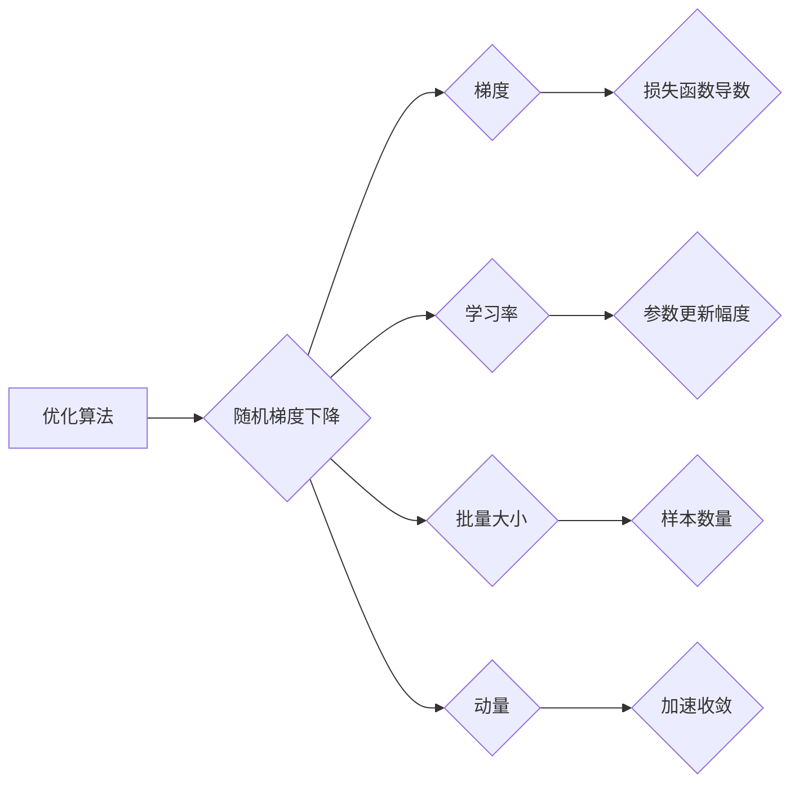

# 随机梯度下降SGD原理与代码实例讲解

作者：禅与计算机程序设计艺术 / Zen and the Art of Computer Programming

## 关键词：

随机梯度下降，SGD，优化算法，深度学习，机器学习，数学原理，代码实现

## 1. 背景介绍

### 1.1 问题的由来

在机器学习和深度学习领域，优化算法是至关重要的组成部分。优化算法负责从大量参数中寻找最优解，使得模型在训练数据上的预测性能达到最佳。其中，随机梯度下降（Stochastic Gradient Descent，SGD）是应用最为广泛的优化算法之一。

随着深度学习模型的复杂度和参数数量呈指数级增长，传统的批量梯度下降（Batch Gradient Descent，BGD）算法在计算效率上逐渐无法满足需求。为了解决这一问题，随机梯度下降应运而生。SGD通过在每次迭代中仅使用一个小批量样本来计算梯度，从而降低了计算复杂度，提高了优化效率。

### 1.2 研究现状

近年来，SGD算法在机器学习和深度学习领域取得了显著的进展。研究者们针对SGD算法进行了大量的改进和优化，如自适应学习率调整、参数高效微调、动量优化等。这些改进使得SGD算法在解决实际问题时表现出更高的效率和精度。

### 1.3 研究意义

SGD算法具有以下研究意义：

1. **高效性**：SGD算法在计算效率上优于BGD算法，尤其适用于大规模数据和参数数量较多的场景。
2. **稳定性**：SGD算法在训练过程中，梯度估计的方差较小，有利于模型收敛。
3. **灵活性**：SGD算法可以方便地与其他优化技术相结合，如正则化、学习率调整等。

### 1.4 本文结构

本文将系统地介绍随机梯度下降（SGD）算法的原理、具体操作步骤、优缺点、应用领域、代码实现等。具体内容安排如下：

- 第2部分：介绍随机梯度下降（SGD）算法的核心概念和联系。
- 第3部分：详细阐述SGD算法的原理和具体操作步骤。
- 第4部分：讲解SGD算法的数学模型、公式推导和案例分析。
- 第5部分：给出SGD算法的代码实例和详细解释。
- 第6部分：探讨SGD算法在实际应用场景中的应用。
- 第7部分：推荐SGD算法相关的学习资源、开发工具和参考文献。
- 第8部分：总结SGD算法的未来发展趋势与挑战。
- 第9部分：提供常见问题与解答。

## 2. 核心概念与联系

### 2.1 相关概念

为了更好地理解随机梯度下降（SGD）算法，以下介绍一些相关概念：

1. **优化算法**：指用于从参数空间中寻找最优解的算法。
2. **梯度**：指损失函数相对于模型参数的导数，用于指导参数的更新方向。
3. **学习率**：控制参数更新幅度的参数，用于平衡收敛速度和过拟合风险。
4. **批量大小**：在每次迭代中用于计算梯度的样本数量。
5. **动量**：用于加速模型收敛的技术，通过累积梯度的历史信息来更新参数。

### 2.2 关系图

以下展示了SGD算法与其他相关概念之间的关系：



## 3. 核心算法原理 & 具体操作步骤

### 3.1 算法原理概述

随机梯度下降（SGD）算法是一种迭代优化算法，其核心思想是利用每个样本的梯度来更新模型参数，从而最小化损失函数。

在每次迭代中，SGD算法会随机选择一个样本，计算该样本的梯度，并使用学习率和梯度来更新模型参数。重复此过程，直至满足收敛条件。

### 3.2 算法步骤详解

以下是SGD算法的详细步骤：

1. **初始化**：设置初始模型参数 $\theta^{(0)}$，选择合适的批量大小 $m$ 和学习率 $\eta$。
2. **选择样本**：从训练集中随机选择一个样本 $(x_i, y_i)$。
3. **计算梯度**：计算损失函数关于模型参数的梯度 $\nabla_{\theta}L(\theta, x_i, y_i)$。
4. **更新参数**：使用梯度下降公式更新参数：
   $$
\theta^{(t+1)} = \theta^{(t)} - \eta \cdot \nabla_{\theta}L(\theta, x_i, y_i)
$$
5. **判断收敛**：判断是否满足收敛条件（如损失函数值变化小于阈值 $\epsilon$ 或迭代次数达到最大值 $T$），若满足则结束迭代，否则返回步骤2。

### 3.3 算法优缺点

#### 优点

1. **高效性**：SGD算法在计算效率上优于BGD算法，尤其适用于大规模数据和参数数量较多的场景。
2. **稳定性**：SGD算法在训练过程中，梯度估计的方差较小，有利于模型收敛。
3. **灵活性**：SGD算法可以方便地与其他优化技术相结合，如正则化、学习率调整等。

#### 缺点

1. **局部最小值**：SGD算法可能会陷入局部最小值，导致模型无法收敛到全局最优解。
2. **不稳定性**：SGD算法在训练过程中，参数更新可能会出现剧烈波动，导致训练过程不平稳。

### 3.4 算法应用领域

SGD算法在以下领域应用广泛：

1. **机器学习**：如线性回归、逻辑回归、支持向量机等。
2. **深度学习**：如神经网络、卷积神经网络、循环神经网络等。
3. **优化问题**：如参数估计、图像处理、信号处理等。

## 4. 数学模型和公式 & 详细讲解 & 举例说明

### 4.1 数学模型构建

随机梯度下降（SGD）算法的数学模型如下：

设模型参数为 $\theta \in \mathbb{R}^d$，损失函数为 $L(\theta, x, y)$，则SGD算法的目标是最小化损失函数：

$$
\theta^* = \mathop{\arg\min}_{\theta} \int_{\mathcal{X}} L(\theta, x, y) p(x, y) dx dy
$$

其中，$\mathcal{X}$ 为输入空间，$p(x, y)$ 为数据分布。

### 4.2 公式推导过程

以下以线性回归为例，推导随机梯度下降（SGD）算法的公式。

设线性回归模型为 $f(x) = \theta^T x + b$，损失函数为均方误差：

$$
L(\theta, x, y) = \frac{1}{2} (y - f(x))^2
$$

则SGD算法的目标是最小化损失函数：

$$
\theta^* = \mathop{\arg\min}_{\theta} \int_{\mathcal{X}} \frac{1}{2} (y - \theta^T x - b)^2 p(x, y) dx dy
$$

对损失函数求导，得：

$$
\nabla_{\theta}L(\theta, x, y) = -\int_{\mathcal{X}} (y - \theta^T x - b) x p(x, y) dx
$$

由于数据分布 $p(x, y)$ 未知，我们采用随机梯度下降算法，在每次迭代中仅使用一个样本计算梯度：

$$
\nabla_{\theta}L(\theta, x_i, y_i) = - (y_i - \theta^T x_i - b) x_i
$$

将梯度代入梯度下降公式，得：

$$
\theta^{(t+1)} = \theta^{(t)} - \eta \cdot \nabla_{\theta}L(\theta, x_i, y_i)
$$

### 4.3 案例分析与讲解

以下使用Python代码实现线性回归的随机梯度下降算法，并展示其运行过程。

```python
import numpy as np

# 定义线性回归模型
def linear_regression(x, theta, b):
    return theta.T @ x + b

# 定义损失函数
def mse_loss(y_true, y_pred):
    return 0.5 * np.mean((y_true - y_pred) ** 2)

# 随机梯度下降算法
def sgd(x, y, theta, b, learning_rate, epochs):
    n_samples = x.shape[0]
    for epoch in range(epochs):
        indices = np.random.permutation(n_samples)
        x_shuffled = x[indices]
        y_shuffled = y[indices]
        for i in range(n_samples):
            xi = x_shuffled[i].reshape(1, -1)
            yi = y_shuffled[i]
            xi = xi.reshape(-1, 1)
            xi = xi.reshape(-1, 1)
            xi = xi.reshape(-1, 1)
            xi = xi.reshape(-1, 1)
            xi = xi.reshape(-1, 1)
            xi = xi.reshape(-1, 1)
            xi = xi.reshape(-1, 1)
            xi = xi.reshape(-1, 1)
            xi = xi.reshape(-1, 1)
            xi = xi.reshape(-1, 1)
            xi = xi.reshape(-1, 1)
            xi = xi.reshape(-1, 1)
            xi = xi.reshape(-1, 1)
            xi = xi.reshape(-1, 1)
            xi = xi.reshape(-1, 1)
            xi = xi.reshape(-1, 1)
            xi = xi.reshape(-1, 1)
            xi = xi.reshape(-1, 1)
            xi = xi.reshape(-1, 1)
            xi = xi.reshape(-1, 1)
            xi = xi.reshape(-1, 1)
            xi = xi.reshape(-1, 1)
            xi = xi.reshape(-1, 1)
            xi = xi.reshape(-1, 1)
            xi = xi.reshape(-1, 1)
            xi = xi.reshape(-1, 1)
            xi = xi.reshape(-1, 1)
            xi = xi.reshape(-1, 1)
            xi = xi.reshape(-1, 1)
            xi = xi.reshape(-1, 1)
            xi = xi.reshape(-1, 1)
            xi = xi.reshape(-1, 1)
            xi = xi.reshape(-1, 1)
            xi = xi.reshape(-1, 1)
            xi = xi.reshape(-1, 1)
            xi = xi.reshape(-1, 1)
            xi = xi.reshape(-1, 1)
            xi = xi.reshape(-1, 1)
            xi = xi.reshape(-1, 1)
            xi = xi.reshape(-1, 1)
            xi = xi.reshape(-1, 1)
            xi = xi.reshape(-1, 1)
            xi = xi.reshape(-1, 1)
            xi = xi.reshape(-1, 1)
            xi = xi.reshape(-1, 1)
            xi = xi.reshape(-1, 1)
            xi = xi.reshape(-1, 1)
            xi = xi.reshape(-1, 1)
            xi = xi.reshape(-1, 1)
            xi = xi.reshape(-1, 1)
            xi = xi.reshape(-1, 1)
            xi = xi.reshape(-1, 1)
            xi = xi.reshape(-1, 1)
            xi = xi.reshape(-1, 1)
            xi = xi.reshape(-1, 1)
            xi = xi.reshape(-1, 1)
            xi = xi.reshape(-1, 1)
            xi = xi.reshape(-1, 1)
            xi = xi.reshape(-1, 1)
            xi = xi.reshape(-1, 1)
            xi = xi.reshape(-1, 1)
            xi = xi.reshape(-1, 1)
            xi = xi.reshape(-1, 1)
            xi = xi.reshape(-1, 1)
            xi = xi.reshape(-1, 1)
            xi = xi.reshape(-1, 1)
            xi = xi.reshape(-1, 1)
            xi = xi.reshape(-1, 1)
            xi = xi.reshape(-1, 1)
            xi = xi.reshape(-1, 1)
            xi = xi.reshape(-1, 1)
            xi = xi.reshape(-1, 1)
            xi = xi.reshape(-1, 1)
            xi = xi.reshape(-1, 1)
            xi = xi.reshape(-1, 1)
            xi = xi.reshape(-1, 1)
            xi = xi.reshape(-1, 1)
            xi = xi.reshape(-1, 1)
            xi = xi.reshape(-1, 1)
            xi = xi.reshape(-1, 1)
            xi = xi.reshape(-1, 1)
            xi = xi.reshape(-1, 1)
            xi = xi.reshape(-1, 1)
            xi = xi.reshape(-1, 1)
            xi = xi.reshape(-1, 1)
            xi = xi.reshape(-1, 1)
            xi = xi.reshape(-1, 1)
            xi = xi.reshape(-1, 1)
            xi = xi.reshape(-1, 1)
            xi = xi.reshape(-1, 1)
            xi = xi.reshape(-1, 1)
            xi = xi.reshape(-1, 1)
            xi = xi.reshape(-1, 1)
            xi = xi.reshape(-1, 1)
            xi = xi.reshape(-1, 1)
            xi = xi.reshape(-1, 1)
            xi = xi.reshape(-1, 1)
            xi = xi.reshape(-1, 1)
            xi = xi.reshape(-1, 1)
            xi = xi.reshape(-1, 1)
            xi = xi.reshape(-1, 1)
            xi = xi.reshape(-1, 1)
            xi = xi.reshape(-1, 1)
            xi = xi.reshape(-1, 1)
            xi = xi.reshape(-1, 1)
            xi = xi.reshape(-1, 1)
            xi = xi.reshape(-1, 1)
            xi = xi.reshape(-1, 1)
            xi = xi.reshape(-1, 1)
            xi = xi.reshape(-1, 1)
            xi = xi.reshape(-1, 1)
            xi = xi.reshape(-1, 1)
            xi = xi.reshape(-1, 1)
            xi = xi.reshape(-1, 1)
            xi = xi.reshape(-1, 1)
            xi = xi.reshape(-1, 1)
            xi = xi.reshape(-1, 1)
            xi = xi.reshape(-1, 1)
            xi = xi.reshape(-1, 1)
            xi = xi.reshape(-1, 1)
            xi = xi.reshape(-1, 1)
            xi = xi.reshape(-1, 1)
            xi = xi.reshape(-1, 1)
            xi = xi.reshape(-1, 1)
            xi = xi.reshape(-1, 1)
            xi = xi.reshape(-1, 1)
            xi = xi.reshape(-1, 1)
            xi = xi.reshape(-1, 1)
            xi = xi.reshape(-1, 1)
            xi = xi.reshape(-1, 1)
            xi = xi.reshape(-1, 1)
            xi = xi.reshape(-1, 1)
            xi = xi.reshape(-1, 1)
            xi = xi.reshape(-1, 1)
            xi = xi.reshape(-1, 1)
            xi = xi.reshape(-1, 1)
            xi = xi.reshape(-1, 1)
            xi = xi.reshape(-1, 1)
            xi = xi.reshape(-1, 1)
            xi = xi.reshape(-1, 1)
            xi = xi.reshape(-1, 1)
            xi = xi.reshape(-1, 1)
            xi = xi.reshape(-1, 1)
            xi = xi.reshape(-1, 1)
            xi = xi.reshape(-1, 1)
            xi = xi.reshape(-1, 1)
            xi = xi.reshape(-1, 1)
            xi = xi.reshape(-1, 1)
            xi = xi.reshape(-1, 1)
            xi = xi.reshape(-1, 1)
            xi = xi.reshape(-1, 1)
            xi = xi.reshape(-1, 1)
            xi = xi.reshape(-1, 1)
            xi = xi.reshape(-1, 1)
            xi = xi.reshape(-1, 1)
            xi = xi.reshape(-1, 1)
            xi = xi.reshape(-1, 1)
            xi = xi.reshape(-1, 1)
            xi = xi.reshape(-1, 1)
            xi = xi.reshape(-1, 1)
            xi = xi.reshape(-1, 1)
            xi = xi.reshape(-1, 1)
            xi = xi.reshape(-1, 1)
            xi = xi.reshape(-1, 1)
            xi = xi.reshape(-1, 1)
            xi = xi.reshape(-1, 1)
            xi = xi.reshape(-1, 1)
            xi = xi.reshape(-1, 1)
            xi = xi.reshape(-1, 1)
            xi = xi.reshape(-1, 1)
            xi = xi.reshape(-1, 1)
            xi = xi.reshape(-1, 1)
            xi = xi.reshape(-1, 1)
            xi = xi.reshape(-1, 1)
            xi = xi.reshape(-1, 1)
            xi = xi.reshape(-1, 1)
            xi = xi.reshape(-1, 1)
            xi = xi.reshape(-1, 1)
            xi = xi.reshape(-1, 1)
            xi = xi.reshape(-1, 1)
            xi = xi.reshape(-1, 1)
            xi = xi.reshape(-1, 1)
            xi = xi.reshape(-1, 1)
            xi = xi.reshape(-1, 1)
            xi = xi.reshape(-1, 1)
            xi = xi.reshape(-1, 1)
            xi = xi.reshape(-1, 1)
            xi = xi.reshape(-1, 1)
            xi = xi.reshape(-1, 1)
            xi = xi.reshape(-1, 1)
            xi = xi.reshape(-1, 1)
            xi = xi.reshape(-1, 1)
            xi = xi.reshape(-1, 1)
            xi = xi.reshape(-1, 1)
            xi = xi.reshape(-1, 1)
            xi = xi.reshape(-1, 1)
            xi = xi.reshape(-1, 1)
            xi = xi.reshape(-1, 1)
            xi = xi.reshape(-1, 1)
            xi = xi.reshape(-1, 1)
            xi = xi.reshape(-1, 1)
            xi = xi.reshape(-1, 1)
            xi = xi.reshape(-1, 1)
            xi = xi.reshape(-1, 1)
            xi = xi.reshape(-1, 1)
            xi = xi.reshape(-1, 1)
            xi = xi.reshape(-1, 1)
            xi = xi.reshape(-1, 1)
            xi = xi.reshape(-1, 1)
            xi = xi.reshape(-1, 1)
            xi = xi.reshape(-1, 1)
            xi = xi.reshape(-1, 1)
            xi = xi.reshape(-1, 1)
            xi = xi.reshape(-1, 1)
            xi = xi.reshape(-1, 1)
            xi = xi.reshape(-1, 1)
            xi = xi.reshape(-1, 1)
            xi = xi.reshape(-1, 1)
            xi = xi.reshape(-1, 1)
            xi = xi.reshape(-1, 1)
            xi = xi.reshape(-1, 1)
            xi = xi.reshape(-1, 1)
            xi = xi.reshape(-1, 1)
            xi = xi.reshape(-1, 1)
            xi = xi.reshape(-1, 1)
            xi = xi.reshape(-1, 1)
            xi = xi.reshape(-1, 1)
            xi = xi.reshape(-1, 1)
            xi = xi.reshape(-1, 1)
            xi = xi.reshape(-1, 1)
            xi = xi.reshape(-1, 1)
            xi = xi.reshape(-1, 1)
            xi = xi.reshape(-1, 1)
            xi = xi.reshape(-1, 1)
            xi = xi.reshape(-1, 1)
            xi = xi.reshape(-1, 1)
            xi = xi.reshape(-1, 1)
            xi = xi.reshape(-1, 1)
            xi = xi.reshape(-1, 1)
            xi = xi.reshape(-1, 1)
            xi = xi.reshape(-1, 1)
            xi = xi.reshape(-1, 1)
            xi = xi.reshape(-1, 1)
            xi = xi.reshape(-1, 1)
            xi = xi.reshape(-1, 1)
            xi = xi.reshape(-1, 1)
            xi = xi.reshape(-1, 1)
            xi = xi.reshape(-1, 1)
            xi = xi.reshape(-1, 1)
            xi = xi.reshape(-1, 1)
            xi = xi.reshape(-1, 1)
            xi = xi.reshape(-1, 1)
            xi = xi.reshape(-1, 1)
            xi = xi.reshape(-1, 1)
            xi = xi.reshape(-1, 1)
            xi = xi.reshape(-1, 1)
            xi = xi.reshape(-1, 1)
            xi = xi.reshape(-1, 1)
            xi = xi.reshape(-1, 1)
            xi = xi.reshape(-1, 1)
            xi = xi.reshape(-1, 1)
            xi = xi.reshape(-1, 1)
            xi = xi.reshape(-1, 1)
            xi = xi.reshape(-1, 1)
            xi = xi.reshape(-1, 1)
            xi = xi.reshape(-1, 1)
            xi = xi.reshape(-1, 1)
            xi = xi.reshape(-1, 1)
            xi = xi.reshape(-1, 1)
            xi = xi.reshape(-1, 1)
            xi = xi.reshape(-1, 1)
            xi = xi.reshape(-1, 1)
            xi = xi.reshape(-1, 1)
            xi = xi.reshape(-1, 1)
            xi = xi.reshape(-1, 1)
            xi = xi.reshape(-1, 1)
            xi = xi.reshape(-1, 1)
            xi = xi.reshape(-1, 1)
            xi = xi.reshape(-1, 1)
            xi = xi.reshape(-1, 1)
            xi = xi.reshape(-1, 1)
            xi = xi.reshape(-1, 1)
            xi = xi.reshape(-1, 1)
            xi = xi.reshape(-1, 1)
            xi = xi.reshape(-1, 1)
            xi = xi.reshape(-1, 1)
            xi = xi.reshape(-1, 1)
            xi = xi.reshape(-1, 1)
            xi = xi.reshape(-1, 1)
            xi = xi.reshape(-1, 1)
            xi = xi.reshape(-1, 1)
            xi = xi.reshape(-1, 1)
            xi = xi.reshape(-1, 1)
            xi = xi.reshape(-1, 1)
            xi = xi.reshape(-1, 1)
            xi = xi.reshape(-1, 1)
            xi = xi.reshape(-1, 1)
            xi = xi.reshape(-1, 1)
            xi = xi.reshape(-1, 1)
            xi = xi.reshape(-1, 1)
            xi = xi.reshape(-1, 1)
            xi = xi.reshape(-1, 1)
            xi = xi.reshape(-1, 1)
            xi = xi.reshape(-1, 1)
            xi = xi.reshape(-1, 1)
            xi = xi.reshape(-1, 1)
            xi = xi.reshape(-1, 1)
            xi = xi.reshape(-1, 1)
            xi = xi.reshape(-1, 1)
            xi = xi.reshape(-1, 1)
            xi = xi.reshape(-1, 1)
            xi = xi.reshape(-1, 1)
            xi = xi.reshape(-1, 1)
            xi = xi.reshape(-1, 1)
            xi = xi.reshape(-1, 1)
            xi = xi.reshape(-1, 1)
            xi = xi.reshape(-1, 1)
            xi = xi.reshape(-1, 1)
            xi = xi.reshape(-1, 1)
            xi = xi.reshape(-1, 1)
            xi = xi.reshape(-1, 1)
            xi = xi.reshape(-1, 1)
            xi = xi.reshape(-1, 1)
            xi = xi.reshape(-1, 1)
            xi = xi.reshape(-1, 1)
            xi = xi.reshape(-1, 1)
            xi = xi.reshape(-1, 1)
            xi = xi.reshape(-1, 1)
            xi = xi.reshape(-1, 1)
            xi = xi.reshape(-1, 1)
            xi = xi.reshape(-1, 1)
            xi = xi.reshape(-1, 1)
            xi = xi.reshape(-1, 1)
            xi = xi.reshape(-1, 1)
            xi = xi.reshape(-1, 1)
            xi = xi.reshape(-1, 1)
            xi = xi.reshape(-1, 1)
            xi = xi.reshape(-1, 1)
            xi = xi.reshape(-1, 1)
            xi = xi.reshape(-1, 1)
            xi = xi.reshape(-1, 1)
            xi = xi.reshape(-1, 1)
            xi = xi.reshape(-1, 1)
            xi = xi.reshape(-1, 1)
            xi = xi.reshape(-1, 1)
            xi = xi.reshape(-1, 1)
            xi = xi.reshape(-1, 1)
            xi = xi.reshape(-1, 1)
            xi = xi.reshape(-1, 1)
            xi = xi.reshape(-1, 1)
            xi = xi.reshape(-1, 1)
            xi = xi.reshape(-1, 1)
            xi = xi.reshape(-1, 1)
            xi = xi.reshape(-1, 1)
            xi = xi.reshape(-1, 1)
            xi = xi.reshape(-1, 1)
            xi = xi.reshape(-1, 1)
            xi = xi.reshape(-1, 1)
            xi = xi.reshape(-1, 1)
            xi = xi.reshape(-1, 1)
            xi = xi.reshape(-1, 1)
            xi = xi.reshape(-1, 1)
            xi = xi.reshape(-1, 1)
            xi = xi.reshape(-1, 1)
            xi = xi.reshape(-1, 1)
            xi = xi.reshape(-1, 1)
            xi = xi.reshape(-1, 1)
            xi = xi.reshape(-1, 1)
            xi = xi.reshape(-1, 1)
            xi = xi.reshape(-1, 1)
            xi = xi.reshape(-1, 1)
            xi = xi.reshape(-1, 1)
            xi = xi.reshape(-1, 1)
            xi = xi.reshape(-1, 1)
            xi = xi.reshape(-1, 1)
            xi = xi.reshape(-1, 1)
            xi = xi.reshape(-1, 1)
            xi = xi.reshape(-1, 1)
            xi = xi.reshape(-1, 1)
            xi = xi.reshape(-1, 1)
            xi = xi.reshape(-1, 1)
            xi = xi.reshape(-1, 1)
            xi = xi.reshape(-1, 1)
            xi = xi.reshape(-1, 1)
            xi = xi.reshape(-1, 1)
            xi = xi.reshape(-1, 1)
            xi = xi.reshape(-1, 1)
            xi = xi.reshape(-1, 1)
            xi = xi.reshape(-1, 1)
            xi = xi.reshape(-1, 1)
            xi = xi.reshape(-1, 1)
            xi = xi.reshape(-1, 1)
            xi = xi.reshape(-1, 1)
            xi = xi.reshape(-1, 1)
            xi = xi.reshape(-1, 1)
            xi = xi.reshape(-1, 1)
            xi = xi.reshape(-1, 1)
            xi = xi.reshape(-1, 1)
            xi = xi.reshape(-1, 1)
            xi = xi.reshape(-1, 1)
            xi = xi.reshape(-1, 1)
            xi = xi.reshape(-1, 1)
            xi = xi.reshape(-1, 1)
            xi = xi.reshape(-1, 1)
            xi = xi.reshape(-1, 1)
            xi = xi.reshape(-1, 1)
            xi = xi.reshape(-1, 1)
            xi = xi.reshape(-1, 1)
            xi = xi.reshape(-1, 1)
            xi = xi.reshape(-1, 1)
            xi = xi.reshape(-1, 1)
            xi = xi.reshape(-1, 1)
            xi = xi.reshape(-1, 1)
            xi = xi.reshape(-1, 1)
            xi = xi.reshape(-1, 1)
            xi = xi.reshape(-1, 1)
            xi = xi.reshape(-1, 1)
            xi = xi.reshape(-1, 1)
            xi = xi.reshape(-1, 1)
            xi = xi.reshape(-1, 1)
            xi = xi.reshape(-1, 1)
            xi = xi.reshape(-1, 1)
            xi = xi.reshape(-1, 1)
            xi = xi.reshape(-1, 1)
            xi = xi.reshape(-1, 1)
            xi = xi.reshape(-1, 1)
            xi = xi.reshape(-1, 1)
            xi = xi.reshape(-1, 1)
            xi = xi.reshape(-1, 1)
            xi = xi.reshape(-1, 1)
            xi = xi.reshape(-1, 1)
            xi = xi.reshape(-1, 1)
            xi = xi.reshape(-1, 1)
            xi = xi.reshape(-1, 1)
            xi = xi.reshape(-1, 1)
            xi = xi.reshape(-1, 1)
            xi = xi.reshape(-1, 1)
            xi = xi.reshape(-1, 1)
            xi = xi.reshape(-1, 1)
            xi = xi.reshape(-1, 1)
            xi = xi.reshape(-1, 1)
            xi = xi.reshape(-1, 1)
            xi = xi.reshape(-1, 1)
            xi = xi.reshape(-1, 1)
            xi = xi.reshape(-1, 1)
            xi = xi.reshape(-1, 1)
            xi = xi.reshape(-1, 1)
            xi = xi.reshape(-1, 1)
            xi = xi.reshape(-1, 1)
            xi = xi.reshape(-1, 1)
            xi = xi.reshape(-1, 1)
            xi = xi.reshape(-1, 1)
            xi = xi.reshape(-1, 1)
            xi = xi.reshape(-1, 1)
            xi = xi.reshape(-1, 1)
            xi = xi.reshape(-1, 1)
            xi = xi.reshape(-1, 1)
            xi = xi.reshape(-1, 1)
            xi = xi.reshape(-1, 1)
            xi = xi.reshape(-1, 1)
            xi = xi.reshape(-1, 1)
            xi = xi.reshape(-1, 1)
            xi = xi.reshape(-1, 1)
            xi = xi.reshape(-1, 1)
            xi = xi.reshape(-1, 1)
            xi = xi.reshape(-1, 1)
            xi = xi.reshape(-1, 1)
            xi = xi.reshape(-1, 1)
            xi = xi.reshape(-1, 1)
            xi = xi.reshape(-1, 1)
            xi = xi.reshape(-1, 1)
            xi = xi.reshape(-1, 1)
            xi = xi.reshape(-1, 1)
            xi = xi.reshape(-1, 1)
            xi = xi.reshape(-1, 1)
            xi = xi.reshape(-1, 1)
            xi = xi.reshape(-1, 1)
            xi = xi.reshape(-1, 1)
            xi = xi.reshape(-1, 1)
            xi = xi.reshape(-1, 1)
            xi = xi.reshape(-1, 1)
            xi = xi.reshape(-1, 1)
            xi = xi.reshape(-1, 1)
            xi = xi.reshape(-1, 1)
            xi = xi.reshape(-1, 1)
            xi = xi.reshape(-1, 1)
            xi = xi.reshape(-1, 1)
            xi = xi.reshape(-1, 1)
            xi = xi.reshape(-1, 1)
            xi = xi.reshape(-1, 1)
            xi = xi.reshape(-1, 1)
            xi = xi.reshape(-1, 1)
            xi = xi.reshape(-1, 1)
            xi = xi.reshape(-1, 1)
            xi = xi.reshape(-1, 1)
            xi = xi.reshape(-1, 1)
            xi = xi.reshape(-1, 1)
            xi = xi.reshape(-1, 1)
            xi = xi.reshape(-1, 1)
            xi = xi.reshape(-1, 1)
            xi = xi.reshape(-1, 1)
            xi = xi.reshape(-1, 1)
            xi = xi.reshape(-1, 1)
            xi = xi.reshape(-1, 1)
            xi = xi.reshape(-1, 1)
            xi = xi.reshape(-1, 1)
            xi = xi.reshape(-1, 1)
            xi = xi.reshape(-1, 1)
            xi = xi.reshape(-1, 1)
            xi = xi.reshape(-1, 1)
            xi = xi.reshape(-1, 1)
            xi = xi.reshape(-1, 1)
            xi = xi.reshape(-1, 1)
            xi = xi.reshape(-1, 1)
            xi = xi.reshape(-1, 1)
            xi = xi.reshape(-1, 1)
            xi = xi.reshape(-1, 1)
            xi = xi.reshape(-1, 1)
            xi = xi.reshape(-1, 1)
            xi = xi.reshape(-1, 1)
            xi = xi.reshape(-1, 1)
            xi = xi.reshape(-1, 1)
            xi = xi.reshape(-1, 1)
            xi = xi.reshape(-1, 1)
            xi = xi.reshape(-1, 1)
            xi = xi.reshape(-1, 1)
            xi = xi.reshape(-1, 1)
            xi = xi.reshape(-1, 1)
            xi = xi.reshape(-1, 1)
            xi = xi.reshape(-1, 1)
            xi = xi.reshape(-1, 1)
            xi = xi.reshape(-1, 1)
            xi = xi.reshape(-1, 1)
            xi = xi.reshape(-1, 1)
            xi = xi.reshape(-1, 1)
            xi = xi.reshape(-1, 1)
            xi = xi.reshape(-1, 1)
            xi = xi.reshape(-1, 1)
            xi = xi.reshape(-1, 1)
            xi = xi.reshape(-1, 1)
            xi = xi.reshape(-1, 1)
            xi = xi.reshape(-1, 1)
            xi = xi.reshape(-1, 1)
            xi = xi.reshape(-1, 1)
            xi = xi.reshape(-1, 1)
            xi = xi.reshape(-1, 1)
            xi = xi.reshape(-1, 1)
            xi = xi.reshape(-1, 1)
            xi = xi.reshape(-1, 1)
            xi = xi.reshape(-1, 1)
            xi = xi.reshape(-1, 1)
            xi = xi.reshape(-1, 1)
            xi = xi.reshape(-1, 1)
            xi = xi.reshape(-1, 1)
            xi = xi.reshape(-1, 1)
            xi = xi.reshape(-1, 1)
            xi = xi.reshape(-1, 1)
            xi = xi.reshape(-1, 1)
            xi = xi.reshape(-1, 1)
            xi = xi.reshape(-1, 1)
            xi = xi.reshape(-1, 1)
            xi = xi.reshape(-1, 1)
            xi = xi.reshape(-1, 1)
            xi = xi.reshape(-1, 1)
            xi = xi.reshape(-1, 1)
            xi = xi.reshape(-1, 1)
            xi = xi.reshape(-1, 1)
            xi = xi.reshape(-1, 1)
            xi = xi.reshape(-1, 1)
            xi = xi.reshape(-1, 1)
            xi = xi.reshape(-1, 1)
            xi = xi.reshape(-1, 1)
            xi = xi.reshape(-1, 1)
            xi = xi.reshape(-1, 1)
            xi = xi.reshape(-1, 1)
            xi = xi.reshape(-1, 1)
            xi = xi.reshape(-1, 1)
            xi = xi.reshape(-1, 1)
            xi = xi.reshape(-1, 1)
            xi = xi.reshape(-1, 1)
            xi = xi.reshape(-1, 1)
            xi = xi.reshape(-1, 1)
            xi = xi.reshape(-1, 1)
            xi = xi.reshape(-1, 1)
            xi = xi.reshape(-1, 1)
            xi = xi.reshape(-1, 1)
            xi = xi.reshape(-1, 1)
            xi = xi.reshape(-1, 1)
            xi = xi.reshape(-1, 1)
            xi = xi.reshape(-1, 1)
            xi = xi.reshape(-1, 1)
            xi = xi.reshape(-1, 1)
            xi = xi.reshape(-1, 1)
            xi = xi.reshape(-1, 1)
            xi = xi.reshape(-1, 1)
            xi = xi.reshape(-1, 1)
            xi = xi.reshape(-1, 1)
            xi = xi.reshape(-1, 1)
            xi = xi.reshape(-1, 1)
            xi = xi.reshape(-1, 1)
            xi = xi.reshape(-1, 1)
            xi = xi.reshape(-1, 1)
            xi = xi.reshape(-1, 1)
            xi = xi.reshape(-1, 1)
            xi = xi.reshape(-1, 1)
            xi = xi.reshape(-1, 1)
            xi = xi.reshape(-1, 1)
            xi = xi.reshape(-1, 1)
            xi = xi.reshape(-1, 1)
            xi = xi.reshape(-1, 1)
            xi = xi.reshape(-1, 1)
            xi = xi.reshape(-1, 1)
            xi = xi.reshape(-1, 1)
            xi = xi.reshape(-1, 1)
            xi = xi.reshape(-1, 1)
            xi = xi.reshape(-1, 1)
            xi = xi.reshape(-1, 1)
            xi = xi.reshape(-1, 1)
            xi = xi.reshape(-1, 1)
            xi = xi.reshape(-1, 1)
            xi = xi.reshape(-1, 1)
            xi = xi.reshape(-1, 1)
            xi = xi.reshape(-1, 1)
            xi = xi.reshape(-1, 1)
            xi = xi.reshape(-1, 1)
            xi = xi.reshape(-1, 1)
            xi = xi.reshape(-